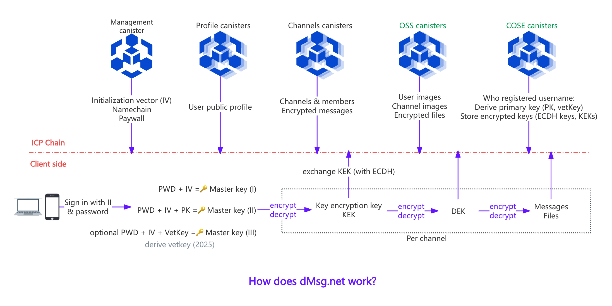
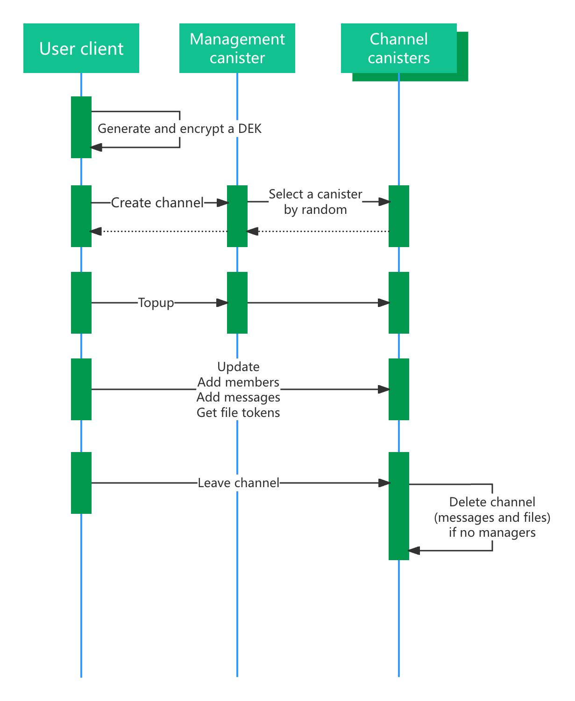

# dMsg (ICPanda Message) System Overview

## dMsg On-Chain Side

### Backend Smart Contracts

- Management canister:
  - Source code: [ic_message](../src/ic_message)
  - Description: The management canister that handles users management, canisters management, price management and channels management.
  - `ic_message` canister: [nscli-qiaaa-aaaaj-qa4pa-cai](https://dashboard.internetcomputer.org/canister/nscli-qiaaa-aaaaj-qa4pa-cai)
- User public profile canister:
  - Source code: [ic_message_profile](../src/ic_message_profile)
  - Description: The profile canister that handles user public profiles management. The number of profile canisters can be increased based on user scale.
  - `ic_message_profile` Canister: [ijyxz-wyaaa-aaaaj-qa4qa-cai](https://dashboard.internetcomputer.org/canister/ijyxz-wyaaa-aaaaj-qa4qa-cai)
- Channel canister:
  - Source code: [ic_message_channel](../src/ic_message_channel)
  - Description: The channel canister that handles channels management and messages management. The number of channel canisters can be increased based on user scale.
  - `ic_message_channel` canister: [nvdn4-5qaaa-aaaaj-qa4pq-cai](https://dashboard.internetcomputer.org/canister/nvdn4-5qaaa-aaaaj-qa4pq-cai)
  - `ic_message_channel_02` canister: [zof5a-5yaaa-aaaai-acr2q-cai](https://dashboard.internetcomputer.org/canister/zof5a-5yaaa-aaaai-acr2q-cai)
  - `ic_message_channel_03` canister: [4jxyd-pqaaa-aaaah-qdqtq-cai](https://dashboard.internetcomputer.org/canister/4jxyd-pqaaa-aaaah-qdqtq-cai)
- COSE canister:
  - Source code: [ic-cose](https://github.com/ldclabs/ic-cose)
  - Description: IC-COSE is a decentralized COnfiguration service with Signing and Encryption on the Internet Computer. Users who register a username gain a dedicated namespace on the COSE service for key derivation, key storage, and other confidential information. The number of COSE canisters can be increased based on user scale.
  - `ic_cose_canister` canister: [n3bau-gaaaa-aaaaj-qa4oq-cai](https://dashboard.internetcomputer.org/canister/n3bau-gaaaa-aaaaj-qa4oq-cai)
- OSS canister:
  - Source code: [ic-oss](https://github.com/ldclabs/ic-oss)
  - Description: IC-OSS is a decentralized Object Storage Service on the Internet Computer. Channels have a dedicated folder on the OSS service to store files. The number of IC-OSS bucket canisters can be increased based on user scale.
  - `ic_oss_cluster` canister: [5szpn-tiaaa-aaaaj-qncoq-cai](https://dashboard.internetcomputer.org/canister/5szpn-tiaaa-aaaaj-qncoq-cai)
  - `ic_oss_bucket` canister: [532er-faaaa-aaaaj-qncpa-cai](https://dashboard.internetcomputer.org/canister/532er-faaaa-aaaaj-qncpa-cai)
  - `ic_oss_bucket_02` canister: [sb6zj-3aaaa-aaaaj-qndla-cai](https://dashboard.internetcomputer.org/canister/sb6zj-3aaaa-aaaaj-qndla-cai)

### Channels Management and Access Control

- No public channels.
- After creating a channel, multiple managers and regular members can be invited.
- Managers can remove regular members but cannot remove other managers.
- Users can read channel info and all (encrypted) messages only after joining.
- After joining, users use ECDH to obtain the KEK from managers for encrypting and decrypting the DEK.
- Users encrypt and decrypt messages and files with the DEK on the client side.
- The channel and its data are deleted when the last manager leaves.
- Sending messages and uploading files consume Gas.

## dMsg Client Side

### Master Key Derivation

The client supports three types of master keys:
- **Free users**: The master key (I) is generated using an on-chain derived IV and the user’s password. `MK = HKDF-SHA-256(argon2id(password, ID), IV)`
- **Paid users**: The master key (II) is generated using an on-chain derived PK and the user’s password. `MK = HKDF-SHA-256(argon2id(password, ID), PK)`
- **Paid users (with vetkey)**: Once the vetkey feature is live, the master key (III) will be generated using an on-chain derived vetkey and an optional user password. `MK = HKDF-SHA-256(argon2id(password, ID), Vetkey)`

### Key Encryption Key (KEK) Exchanging

- The MK encrypts and decrypts the KEK.
- The KEK is used to encrypt and decrypt the DEK for message channels, with a 1:1 mapping.
- The encryption scheme follows AES-256-GCM as defined in RFC 9053 (COSE).
- The exchanging scheme follows ECDH-ES + X25519 as defined in RFC 9053 (COSE).