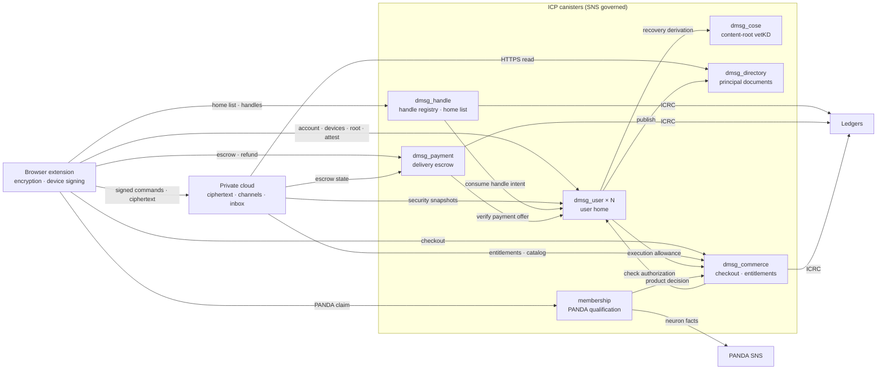
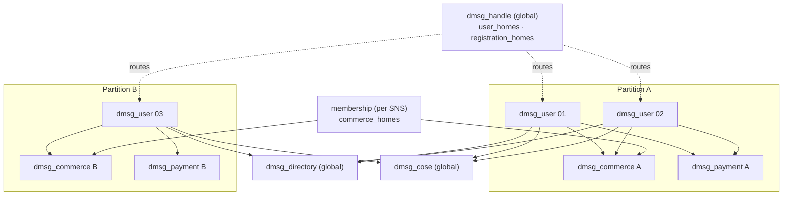

# dMsg Technical Architecture

English | [简体中文](dmsg_architecture_zh.md)

> Baseline: public repository `main` at commit `c707ade` (2026-10-08), with the user home's capacity, admission and binding parts updated for the 21-million-account change later that day. This document gives an overview of the public implementation: its architecture, capacity, scaling and multi-instance deployment. Figures come from the measurements and code constants recorded in each canister README. Each README and `.did` file remains authoritative for interfaces, state machines and validation details; where either disagrees with this document, the code wins. The companion cloud service is not public and is described here only through its public contracts. This document does not certify a production deployment, mainnet capacity or a security audit.

## 1. Design Principles

1. **Content off chain, authority on chain.** Plaintext and content keys stay on authorized extension endpoints. The cloud stores and delivers ciphertext and runs channel collaboration and the inbox. ICP holds only the authoritative state that must be publicly verifiable and consistent across services: accounts and devices, content-root commitments, handle ownership, formal attestation receipts, settled funds and commercial entitlements.
2. **Everyday work writes nothing on chain.** Messages, files, vault edits, channel control and profiles make no ICP update, vetKD derivation or threshold signature; the cloud only queries certified account security snapshots when it needs them.
3. **Upgrades are independent of scale.** Records and certification trees live in stable memory and the heap holds no business state. An upgrade only republishes the root hash, so `post_upgrade` instructions do not grow with the number of records.
4. **Scale out by user home.** Every account ID embeds the fingerprint of the user home that allocated it, and every service routes by that fingerprint, so adding a home never remaps existing accounts. Services that need global uniqueness (handles, PANDA neuron occupancy, the principal document domain) stay single-instance.
5. **Uniform governance, external maintenance.** Every administrative method accepts the controller and an SNS governance canister fixed at installation, and has a `validate_*` dry run taking the same arguments. Canisters do not rely on timers; external jobs drive cleanup, payouts and price publication through bounded entry points.

## 2. Trust Domains

| Trust domain | Responsibilities | Not decided here |
| --- | --- | --- |
| Browser extension ([dmsg_app](../src/dmsg_app/README.md)) | Generates and uses content roots, object and file keys; encrypts and decrypts; signs and approves with device keys; keeps local IndexedDB, outbox and sync state | Self-reported device, membership or payment state never replaces certified evidence |
| Private cloud | Stores and delivers ciphertext; runs channel control, contact rules, the inbox and resource quotas; verifies ICP certified evidence; signs paid-delivery quotes and admission receipts | Account root authorization, handle ownership, formal attestation, settled funds |
| ICP canisters (this repository) | The seven services of section 3 | Holds no channel membership, messages, files or profile bodies and stays off the everyday content path |

Content encryption does not hide operational metadata: the cloud and the canisters see routing, account and device identifiers, sizes, timing, and the membership and contact relations needed to enforce rules. The cloud can deny service, delay, or show different devices different views; clients detect the tampering and rollback they can through signatures, IC certificates and locally known versions. The controller (the SNS once handed over) can upgrade canisters, change their rules, and read a user home's `master_secret`. See the [encryption design](dmsg_encryption_zh.md) (Chinese) and the [cloud wire contract](protocol/cloud_zh.md) (Chinese).

## 3. Components

| Canister | Authoritative data | Instances | Main per-instance limit |
| --- | --- | --- | --- |
| [dmsg_user](../src/dmsg_user/README.md) | Login bindings, devices and capabilities, recovery requests, content-root commitments, attestation receipts, monthly execution ledger, device unlock secrets, Agent principal records | 1–64 per deployment (user homes) | `max_accounts` ≤ 21,000,000 |
| [dmsg_handle](../src/dmsg_handle/README.md) | Canonical handle → `AccountId`, registration charges, legacy claims and transfers; the deployment's home list | 1 globally | 10 million active handles |
| [dmsg_cose](../src/dmsg_cose/README.md) | Content-root vetKD public key, recovery-derivation deduplication and budgets | Usually 1, serving every home | 1 million accounts that have performed a recovery derivation |
| [dmsg_directory](../src/dmsg_directory/README.md) | Published Agent Delegation principal documents | 1 globally | Not measured at scale |
| [dmsg_payment](../src/dmsg_payment/README.md) | Paid-delivery escrows, deposits, funds decisions and payouts | 1 or more; each home is bound to one | 10 million escrows |
| [dmsg_commerce](../src/dmsg_commerce/README.md) | App and product registrations, catalog, cash orders, paying subjects and resource entitlements | 1 or more; each home belongs to one | 10 million paying subjects and 10 million lifetime orders |
| [membership](../src/membership/README.md) | Cross-product PANDA neuron occupancy and product decisions | 1 per SNS | 1 million complete records, 10 million lifetime operations |

Shared libraries: [dmsg_types](../src/dmsg_types/README.md) defines the public data contracts, [dmsg_protocol](../src/dmsg_protocol/README.md) provides deterministic encoding, approval digests and signature verification, and [dmsg_runtime](../src/dmsg_runtime/README.md) (Chinese) provides stable storage, certification trees, budgets, ledger adapters and bounded calls.

## 4. Main Flows

### 4.1 Registration and Account Lookup

1. At startup the client reads `dmsg_handle.get_handle_config()`: `user_homes` is the deployment's authoritative home list and `registration_homes` the subset currently accepting new accounts. The build configuration's `canisters.userHomes` lists homes trusted at build time (a production build needs at least one), and handle's list must contain them; any other home is taken from handle.
2. Registration calls `create_account` on a randomly chosen registration home; when that home has an admission key, the client first gets an admission ticket from the cloud bound to the home and the login Principal. The account, login route, daily quota and ID allocator commit in one message, and a retry returns the original account.
3. Login queries `my_account` on every home in parallel and connects to the home that answers. Any failed query makes the result unknown; the client never falls back to registration.

An account's `home_user` and `home_cose` are fixed for its lifetime.

### 4.2 Devices, Content Roots and Recovery

- Account changes go through `mutate_account` and require both the login Principal and an Ed25519 device approval. The approval binds the home, account, `security_epoch`, device sequence and an expiry of at most five minutes.
- A root rotation stores only commitments in the home: `ReserveRoot` reserves a generation; the client wraps the root with HPKE for every active device holding `VaultUnlock` and adds one IBE recovery envelope under the COSE content-root public key; the cloud stores the RootBundle; `CommitRoot` checks the recipients and digests. Registration, new devices and rotations make no chain-key calls.
- Recovery starts from a bound login identity and waits three days by default (configurable from one to seven); any valid device can cancel it. Afterwards the recovered device calls `derive_root` so that COSE performs one vetKD derivation, recovers the current root, and rotates.

### 4.3 Formal Attestation

`attest` / `attest_app_action` accept a device-signed COSE_Sign1 with its approval. In one message the user home verifies the signature, charges the monthly allowance, stores the artifact and writes a certified receipt; no inter-canister signing call is involved. The home refreshes its allowance lease from commerce only when the lease has expired, and rechecks at least hourly. Verifiers use the certified leaf from `get_execution_receipt` to prove that the account authorized the signature.

### 4.4 Certified Evidence for the Cloud

- Accounts: `security_snapshot_batch` takes 1–64 accounts per call with a certified response of at most 256 KiB. Verifiers check the IC certificate, canister ID, witness and a 60-second freshness window, then match `get_device_bundle` against the snapshot's `devices_root`.
- Entitlements: commerce's `get_entitlement_batch` returns an absence proof for accounts that never paid, which together with the certified catalog means Free. The cloud rereads its stored entitlement projections with a query at least hourly.
- The read volume grows with the number of distinct accounts that need checking. Reads are deduplicated per account, batched and cached until the certificate's deadline, so they do not multiply with online connections or channels.

### 4.5 Handles, Paid Delivery and Commerce

- **Handles**: the account first records an exact handle intent, valid for 60 seconds, in its home; on registration, claim or transfer, handle consumes the intent from that home and charges through ICRC-2 on the PANDA ledger.
- **Paid delivery**: the cloud signs a Quote from the recipient's signed payment offer. On `open_escrow`, payment verifies the offer with the recipient account's home, and the payer transfers to a subaccount unique to the escrow. Once the cloud admits the ciphertext it signs an admission receipt; `finalize_receipt` settles to the recipient and the platform, and escrows not settled by the admission deadline are refunded.
- **Cash purchases**: commerce quotes, opens the order, verifies deposits to its subaccount, and on delivery writes the contract, resource entitlement and receipt in one message.
- **PANDA waivers**: membership verifies the neuron's qualification and ensures that one neuron backs at most one entitlement across all products at a time, then calls back the product adapter. A PANDA-backed lease lasts at most one hour, and each active member causes roughly one SNS read per hour.

### 4.6 Agent Principals

Principal activation, controller registration and retirement commit in the account's home, which then pushes the state to `dmsg_directory`; if that fails, anyone can retry with `publish_principal`. Documents are served under a fixed custom domain as certified responses through the ICP HTTP gateway; see the [protocol](protocol/agent_zh.md) (Chinese).

## 5. On-Chain Load Profile

| Operation | Work on ICP |
| --- | --- |
| Messages, files, vault edits, channel control, profiles | No update; the cloud may query certified security snapshots |
| Login unlock | One `unlock_secret` query |
| Account creation, new devices, root rotation, recovery | Infrequent updates on the user home; rotations make no chain-key calls |
| Formal attestation | One update on the user home, plus one commerce call when the monthly lease has expired |
| Recovery after losing every device | One vetKD derivation from user through COSE; PocketIC measured a cost bound of about 68.26B cycles and an actual charge of about 26.15B |
| Handle registration and transfer | A handle update, a home check and a ledger charge |
| Paid delivery | Per escrow, about one authorization, one funding check, one settlement and two payouts |
| Cash purchase | Order opening, funding check and delivery on commerce, then lease renewals |
| PANDA membership | Per active member, about one SNS read and one renewal write per hour |

## 6. Storage and Upgrade Model

- **Address space**: every canister's `MemoryManager` uses 128-page (8 MiB) buckets; 32,768 buckets address 256 GiB. That is address space, not business capacity; the platform's stable-memory limit and the subnet's storage headroom apply separately.
- **Compact representation**: each canister's private `stable_codec.rs` stores records as CBOR maps with integer keys, without changing public Candid, signature digests or certified leaf encodings.
- **Certification trees**: user, payment, commerce, membership and directory use `dmsg_runtime::cert_map`, a crit-bit Merkle prefix tree in stable memory that stores only keys, certified value hashes and fixed 201-byte internal-node slots. Certified values are regenerated from records at query time and checked against the certified hashes, and a write recomputes a single path. With one million keys, one write takes 167 stable reads instead of the 4,394 of the earlier B-tree node layout. handle uses `name_tree`, which splits names by hash into 2^20 buckets and stores node hashes in a fixed array, so a write recomputes one bucket and one path.
- **Bounded collections**: each account holds at most 16 devices (5 active), 8 logins, 4 pending bindings, 16 operation receipts and 64 retained executions; a certified batch response is at most 256 KiB. Ordinary account operations do not read past execution payloads.
- **Upgrades**: the heap holds no business state; only payment's and commerce's `pre_upgrade` flush call counters (payment also flushes the day's order count). `post_upgrade` checks the schema and only publishes the root, and fails on any other schema. Development layouts are not migrated; once in production, any layout change needs an explicit migration.

Measured `post_upgrade` cost (PocketIC 16.0.0, release Wasm; large samples were built on the host with each canister's own storage code and uploaded as stable-memory images):

| Canister | Scale | `post_upgrade` instructions | Cycles per upgrade |
| --- | --- | ---: | ---: |
| dmsg_user | 10,000 / 1 million accounts | 1.38M / 1.40M | ~8.4B (stop, upgrade, start) |
| dmsg_handle | 1,000 → 10 million handles | 1.15M → 1.16M | ~4.04B |
| dmsg_payment | 100,000 / 1 million escrows | 1.54M / 1.62M | ~11.66B |
| dmsg_commerce | 100,000 / 1 million paying subjects | ~1.84M | ~19.44B |
| membership | 100,000 / 1 million claims | 1.28M / 1.31M | ~11.87B |

Upgrade cycles are dominated by installing the Wasm module and do not depend on data size.

## 7. Per-Instance Capacity

| Canister | Holds | Limit | Measured and estimated | First constraint |
| --- | --- | --- | --- | --- |
| dmsg_user | Accounts allocated by this home | `max_accounts` 1–21,000,000; new accounts per UTC day `daily_new_accounts` 1–100,000; both governable | 1.77 GiB stable at 1 million accounts (one in five active), with writes costing only 4%–16% more cycles than at 10,000; ~0.8 KB per new account and ~2.7–4.1 KB per active one, so 40–86 GB extrapolated for 21 million | Registration admission must be configured before open registration; 21 million accounts and mainnet throughput not measured |
| dmsg_handle | Active handles plus pending charges | 10 million | At 10 million handles: ~1.8 GB for the name table and tree alone, an estimated 6–7 GB with charge and event history; a transfer costs only ~13% more cycles than at 1,000 handles; a 64-handle certified response is ~81 KB | Larger scale needs new measurements or name sharding (not implemented) |
| dmsg_cose | Accounts that have performed a recovery derivation | 1 million across all homes | Records appear only on recovery after losing every device | Network-wide vetKD throughput of about 18 per second |
| dmsg_payment | Lifetime escrows, independent of registered users | 10 million | 3.25 GB at 1 million escrows, ~3.2 KB each; ~32 GB extrapolated for 10 million | Ledger call budget: ~100 escrows per minute when `ledger_writes_per_minute` is 200 |
| dmsg_commerce | Paying subjects and lifetime orders; Free accounts hold no state | 10 million each | 2.28 GB at 1 million subjects; ~1.3 KB per subject and ~9 KB per hot order with indexes | Price publication, per-order revenue collection and PANDA refreshes concentrate in one instance |
| membership | PANDA waiver claims, independent of account count | 1 million complete records, 10 million lifetime operations | 4.7 GB at 1 million `Active` claims, ~4.7 KB each | SNS reads: the default 200 per minute supports about 10,000 active members; the PANDA SNS caps neurons at 200,000 |
| dmsg_directory | Accounts with an enabled principal | No total constant; each document ≤ 64 KiB | Small samples only | Not measured at scale |

Only handle has been measured beyond one million records (to 10 million); user's 21 million and the other services' 10-million limits are extrapolated from per-record storage, with the growth trend checked by measurements at one million.

## 8. Multiple Instances and Sharding

### 8.1 Account IDs and Routing

An account ID is a 12-byte Xid: `timestamp_seconds[4] ‖ allocator_fingerprint[5] ‖ counter[3]`. The fingerprint is the first five bytes of `account_allocator_digest(environment, issuer_namespace, home)`, that is `digest("dmsg/account-id-generator/v1", ("dmsg", environment, issuer_namespace, home))`.

- handle, cose, directory, payment and commerce each keep an append-only `user_homes` (at most 64, with distinct fingerprints) and find an account's home from bytes 4–9 of its ID, with no routing table. Adding a home does not change the routing of existing accounts.
- Every home and service in one deployment must use the same `environment` and `issuer_namespace`. An account's issuer URI is `issuer_namespace` followed by the account ID and does not include the home, so the home does not affect the issuer of signed documents.
- No service can remove an existing home from its `user_homes`, because the accounts that home allocated still route to it.

### 8.2 Instance Strategy per Service

| Service | Instances | Relation to user homes | Reason |
| --- | --- | --- | --- |
| dmsg_user | 1–64 | — | Account state is partitioned by home; homes share no writes |
| dmsg_handle | 1 | `user_homes` lists every home and `registration_homes` selects those accepting new accounts | Canonical handles must be globally unique; it is also the authority clients read the home list from |
| dmsg_directory | 1 | `user_homes` lists every home; a published account's home is fixed | An ICP custom domain points to one canister, and a document's URL must equal its `id`, so it cannot redirect to shards |
| membership | 1 per SNS | `commerce_homes` maps each home to its commerce, at most 64 entries | Cross-product exclusive neuron occupancy only holds within one occupancy table |
| dmsg_cose | Usually 1 | Each home's `home_cose` is fixed; one COSE can serve every home | The content-root public key derives from the COSE canister ID, `key_1` and `environment`, and accounts' recovery envelopes are bound to it permanently |
| dmsg_payment | 1 or more | Each home's `payment_canister` is fixed; one payment serves at most 64 homes | Escrow IDs and subaccounts include the instance ID, and a quote's `home_payment` names one instance |
| dmsg_commerce | 1 or more | Each home is listed in exactly one commerce's `user_homes` | Each instance owns its registrations, settlement assets, prices, catalog, orders and certified leaves |

Under the current code limits a deployment has at most 64 user homes and therefore at most 64 × 21 million accounts; active handles are separately capped at 10 million by handle. Separate commerce and payment instances such as partition B are supported at the canister level only; see 8.5 for the client limitation.

### 8.3 Adding a User Home

Each administrative call below accepts the controller or the SNS governance and has a `validate_*` dry run with the same arguments for proposals.

1. **Choose a partition**: reuse the existing payment and commerce, or deploy new instances for the new home. A new commerce needs its own app, product and settlement-asset registrations through governance; the price authority must publish prices to it, and the merchant must collect revenue from it.
2. **Install the home**: the new `dmsg_user` uses the deployment's `environment`, `issuer_namespace` and `principal_origin`, and its `home_cose`, `handle_canister`, `payment_canister`, `commerce_canister`, `membership_canister` and `directory_canister` point to the chosen instances. Services cannot read the new home's configuration on chain, so proposers and voters check it with the home's `user_config`; `validate_admin_add_user_home` shows the new home's fingerprint to confirm it does not collide with an existing home.
3. **Register the home**: call `admin_add_user_home(home)` on handle, cose, directory, payment and the chosen commerce. Until then, those services answer the home's accounts with `NotFound` or `Forbidden`.
4. **Register the beneficiary authority**: append the home to `beneficiary_authorities` in the dMsg product registration on that commerce (`config_version + 1`). No new app registration is needed.
5. **Register the PANDA route**: in membership's `configure_panda_service`, append `{ user_home; commerce_canister }` to `commerce_homes` and keep the other fields unchanged.
6. **Register with the cloud**: the private cloud adds the home to the homes whose certified evidence it accepts and configures the home's commerce and payment.
7. **Open registration**: add the home to the registration entry with `admin_set_registration_homes`. An older home near its limit can leave the registration entry at the same time and keep serving its existing accounts. Clients read the home list from handle, so they discover the new home without a rebuild.

### 8.4 When to Scale

- **Monitoring**: `user_stats`, `cose_stats`, `payment_stats`, `commerce_stats`, `membership_stats` and `directory_stats` are public queries reporting record counts, configured limits, stable pages and cycle balances, and `user_stats` adds execution totals for the latest 12 charged months; handle's configuration and home list come from `get_handle_config`.
- **Raise budgets first**: when usage nears 60% of a configured limit, raise the governed limit within the code bound: `admin_set_account_limits` on user, `admin_set_limits` on payment and commerce, `configure_panda_service` on membership.
- **Then add instances**: when a home nears 21 million accounts, add a home and adjust the registration entry. When payment escrows, or commerce paying subjects or lifetime orders, near 10 million (or stable-memory headroom runs short), point new homes at new payment or commerce instances instead of raising the old instance's limit further.
- **Throughput**: one canister executes its messages sequentially; several canisters run in parallel but share their subnet's resources, so large deployments spread homes across subnets. Before raising per-minute budgets, check subnet throughput and cycles at the target load on a test network; cross-subnet placement, chain-key and ledger throughput need separate measurement.

### 8.5 Not Yet Supported

- **Account migration**: `home_user`, `home_cose` and the home recorded by directory cannot change; there is no handoff of accounts between homes.
- **Login uniqueness across homes**: one login Principal can create one account in each of several homes. The client looks the login up in every home before registering, but the services do not enforce uniqueness.
- **Client selection of commerce, payment and COSE**: the build configuration `dmsg.config.json` pins one commerce, one payment and one COSE (with `coseRootPublicKey`). Until the client selects these instances by the account's home, every home should point to the same set; partition B in the 8.2 diagram needs that client work first.
- **Handle sharding**: one handle instance holds at most 10 million active handles; sharding by name bucket is not implemented.
- **Order compaction**: payment escrows are never archived and count against the limit for life; commerce order IDs and block deduplication records are never reclaimed either.

## 9. Rate Limits and Abuse Resistance

| Service | Budgets | How to adjust |
| --- | --- | --- |
| dmsg_user | New accounts per UTC day; registration admission tickets (once an admission key is set); 4 pending bindings per account; 60 external approvals and 120 cross-canister calls per account per hour; at most 64 formal executions per account per day | `admin_set_account_limits` (account limit and daily new accounts), `admin_set_admission_key` (admission key); the rest are code constants or account policy |
| dmsg_cose | Global derivations and cycles per day; per account 100 derivations and 1.1T cycles per day (a defensive bound; the user-side daily execution limit binds first) | `admin_set_daily_budget` for the global budget; the per-account budget is a code constant |
| dmsg_handle | Global pending charges `max_pending` ≤ 10,000, one per account at a time | Installation argument |
| dmsg_payment | Global per-minute budgets and per-caller shares for authorizations, ledger reads and ledger payouts; daily orders; at most 16 undecided escrows per payer | `admin_set_limits` |
| dmsg_commerce | Per-minute budgets for funds and product calls, authorizations and PANDA refreshes; daily orders; per-caller shares | `admin_set_limits` |
| membership | Per-minute budgets for authorizations, activations, product calls and qualification reads; at most 10,000 new claims per hour; `max_claims` | `configure_panda_service` |

- user, cose, payment and directory use `canister_inspect_message` to reject, before execution, ingress the method would reject anyway, so the canister does not pay to receive it. It runs on a single replica and is not a security boundary; every method still checks its caller.
- Global budgets affect availability only, never funds or ownership. Many non-anonymous Principals can exhaust a global budget quickly; once a user home has an admission key, every new account needs a ticket the cloud issues under per-source rate limits, so mass registration cannot fill the daily quota or the account limit.
- Inter-canister calls use bounded waits (except COSE's vetKD derivation). After every `await` the code rereads the time and state; unknown outcomes are reconciled with the original request and never re-signed or re-sent under a new ID.

## 10. Governance and Operations

- **Governance**: administrative methods of all seven services accept the controller and the `governance` fixed at installation (the PANDA SNS governance in production). Each has a `validate_*` query with the same arguments that can be registered as the validator of an SNS generic function. Identity- and derivation-related fields such as `environment`, `issuer_namespace` and `governance` cannot change after installation, and upgrades do not read initialization arguments.
- **Recurring jobs**: canisters have no timers; operators or anyone run the following:

| Job | Entry point | Cadence |
| --- | --- | --- |
| user expiry cleanup | `prune_executions(after)`, `prune_external_approvals(after)` | Periodically, paging to the end; account writes also clean up lazily |
| COSE result cleanup | `prune_executions(after)`, or `src/dmsg_app/scripts/cose-prune.mjs` | Periodically, paging to the end |
| payment payout dispatch | `list_pending_transfers`, then `process_transfer` per leg | At least hourly, within 24 hours of each leg's creation |
| commerce price publication | `publish_settlement_price` | For every enabled asset before the previous price expires; validity is at most 30 minutes |
| commerce revenue collection and archiving | `collectable_checkouts`, `collect_checkout_revenue`, `sweep_checkout_history` | Collect after the service period ends; archive periodically until it returns 0 |
| commerce catalog certificate | `refresh_catalog` | Once after a new catalog takes effect |
| membership release and compaction | `sweep_panda_commitments` | Every five minutes is suggested, until it returns 0 |
| directory republication | `publish_principal` | When a home's publication failed |

- **Upgrades**: the schema must not change. Stop the canister and let in-flight inter-canister calls finish, snapshot canisters that hold funds or unrecoverable data, then upgrade with the empty Candid argument `()`, start, and read the logs. COSE derivations are unbounded waits, so COSE must be stopped before an upgrade; if it is not, executions whose callbacks are lost become `Unknown` and are never derived again.
- **Irreversible operations**: never reinstall payment, commerce or directory; a reinstall wipes escrows, accounting or documents that cannot be rebuilt. Never delete the COSE canister; deleting it makes every recovery envelope unopenable.
- **Cycles**: the user home pays for account creation and device approvals, COSE pays vetKD fees, and directory pays for publication and document storage. The deployment steps of user, cose, payment and directory set a 90-day freezing threshold; monitor balances through the `*_stats` queries.

## 11. Current Status

- Every service is in development with development stable layouts, and old experimental instances are not migrated.
- Local PocketIC regressions, protocol vectors and client unit tests cover the routing, limits and upgrade behaviour described here; there are PocketIC regressions for the registration entry of a second user home and for a second commerce instance.
- Not yet accepted: mainnet deployment with production `key_1`, real funds and wallet paths, real extension end-to-end flows, private cloud end-to-end, subnet throughput, scale beyond one million records except for handle, and an external security audit.

## 12. References

- [dmsg_canisters.md](dmsg_canisters.md): per-canister implementation increments and validation boundaries.
- [protocol/README.md](protocol/README.md): statements, signatures, execution approvals and Xid allocation.
- [protocol/account_root_zh.md](protocol/account_root_zh.md) and [dmsg_encryption_zh.md](dmsg_encryption_zh.md) (Chinese): account control, root wrapping and the encryption design.
- [protocol/cloud_zh.md](protocol/cloud_zh.md) (Chinese): the wire contract between the extension and the cloud.
- [protocol/commerce.md](protocol/commerce.md) and [protocol/agent_zh.md](protocol/agent_zh.md) (Chinese): the commerce and Agent Delegation contracts.
- The capacity, deployment and operations sections of each canister README (Chinese): measurement methods, reproduction commands and deployment arguments behind the figures above.
