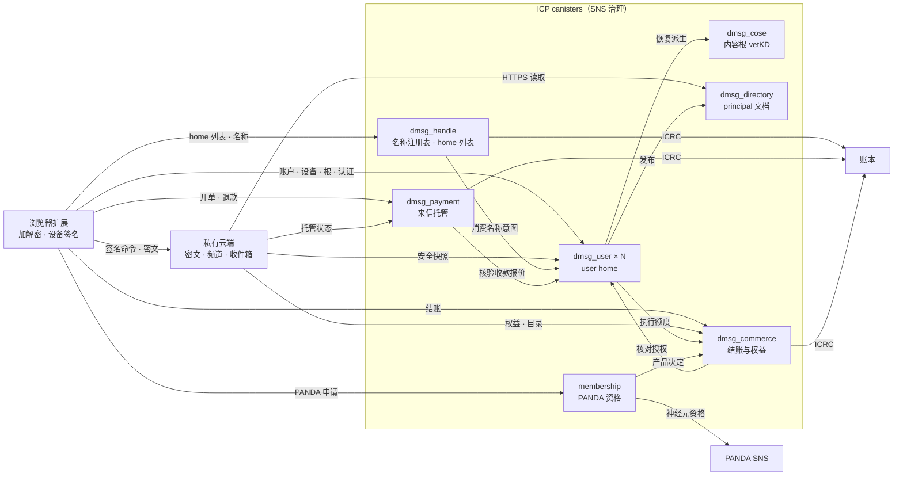
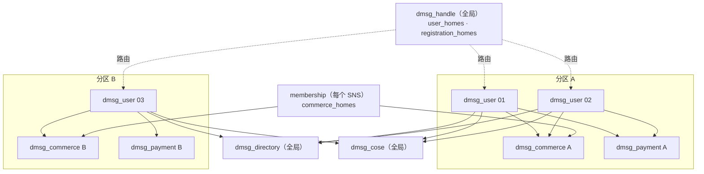

# dMsg 技术架构

[English](dmsg_architecture.md) | 简体中文

> 核对基线：公开仓库 `main` 提交 `c707ade`（2026-10-08），user home 的容量、准入与绑定部分已按其后同日的 2,100 万容量改动更新。本文概述公开实现的整体架构、容量、扩容与多实例部署。数字取自各 canister README 记录的实测和代码常量，接口、状态机与验证细节以各自的 README 和 `.did` 为准；两者与本文不一致时以代码为准。配套云端的实现不公开，本文只按其公开合同描述。本文不证明生产部署、主网容量或安全审计已经完成。

## 1. 设计原则

1. **内容离链，权威上链。** 明文和内容密钥只在已授权的扩展端点。云端保存并投递密文，承担频道协作和收件箱；ICP 只保存需要公开验证、跨服务一致的权威状态：账户与设备、内容根承诺、名称权属、正式认证回执、资金终态和商业权益。
2. **日常操作不写链。** 消息、文件、vault 编辑、频道控制和 profile 不产生 ICP update、vetKD 派生或阈值签名；云端只按需查询账户的认证安全快照。
3. **规模与升级解耦。** 业务记录和认证树都在 stable memory，heap 不保存业务状态，升级只重新发布根哈希，`post_upgrade` 的指令数不随记录数增长。
4. **按 user home 横向扩展。** 账户 ID 内嵌分配它的 user home 指纹，各服务据此路由，新增 home 不会重映射已有账户。需要全局唯一性的服务（名称、PANDA 神经元占用、principal 文档域名）保持单实例。
5. **治理统一，维护外置。** 管理方法都接受 controller 和初始化固定的 SNS governance，并提供同参数的 `validate_*` 预演；canister 不依赖定时器，清理、派发和价格发布由外部任务调用每次有界的入口完成。

## 2. 信任域

| 信任域 | 职责 | 不由它决定 |
| --- | --- | --- |
| 浏览器扩展（[dmsg_app](../src/dmsg_app/README.md)） | 生成和使用内容根、对象与文件密钥；加解密；设备签名与批准；本地 IndexedDB、outbox 与同步 | 客户端自报的设备、会员或付款状态不能代替认证证据 |
| 私有云端 | 保存与投递密文；频道控制、联系规则、收件箱和资源配额；验证 ICP 认证证据；签发付费来信的报价与受理收据 | 账户根授权、名称权属、正式认证和资金终态 |
| ICP canisters（本仓库） | 第 3 节的七类服务 | 不保存频道成员、消息、文件和 profile 正文，不在日常内容的热路径上 |

内容加密不隐藏运行元数据：云端和 canister 能看到路由、账户与设备标识、尺寸、时序，以及执行规则所需的成员和联系关系。云端可以拒绝服务、延迟或向不同设备呈现不同视图；客户端用签名、IC 证书和本地已知版本检测可检测的篡改与回滚。controller（交给 SNS 后为 SNS）可以升级 canister、改变规则，并能读出 user home 的 `master_secret`。加密设计见 [dmsg_encryption_zh.md](dmsg_encryption_zh.md)，云端 wire 合同见 [cloud_zh.md](protocol/cloud_zh.md)。

## 3. 组件

| Canister | 权威数据 | 部署数量 | 单实例主要上限 |
| --- | --- | --- | --- |
| [dmsg_user](../src/dmsg_user/README.md) | 登录绑定、设备与能力、恢复申请、内容根承诺、认证回执、执行月账、本机解锁秘密、Agent principal 记录 | 每部署 1–64 个（user home） | `max_accounts` ≤ 2,100 万 |
| [dmsg_handle](../src/dmsg_handle/README.md) | 规范化名称 → `AccountId`、注册收费、旧名认领与转移；部署的 home 列表 | 全局 1 个 | 1,000 万活跃名称 |
| [dmsg_cose](../src/dmsg_cose/README.md) | 内容根 vetKD 公钥、恢复派生的去重与预算 | 通常 1 个，服务全部 home | 100 万个做过恢复派生的账户 |
| [dmsg_directory](../src/dmsg_directory/README.md) | 已发布的 Agent Delegation principal 文档 | 全局 1 个 | 未在大规模下实测 |
| [dmsg_payment](../src/dmsg_payment/README.md) | 付费来信托管单、入金、资金决定与出金 | 1 个或多个，每个 home 绑定 1 个 | 1,000 万订单 |
| [dmsg_commerce](../src/dmsg_commerce/README.md) | 应用与产品注册、目录、现金订单、付费主体与资源权益 | 1 个或多个，每个 home 属于 1 个 | 付费主体、累计订单各 1,000 万 |
| [membership](../src/membership/README.md) | PANDA 神经元的跨产品占用与产品决定 | 每个 SNS 1 个 | 完整记录 100 万、累计操作 1,000 万 |

共享库：[dmsg_types](../src/dmsg_types/README_zh.md) 定义公开数据合同，[dmsg_protocol](../src/dmsg_protocol/README_zh.md) 提供确定性编码、批准摘要与验签，[dmsg_runtime](../src/dmsg_runtime/README.md) 提供稳定存储、认证树、预算、账本适配和有界调用。

## 4. 主要流程

### 4.1 注册与定位账户

1. 客户端启动时读取 `dmsg_handle.get_handle_config()`：`user_homes` 是部署的权威 home 列表，`registration_homes` 是当前接收新账户的子集。构建配置的 `canisters.userHomes` 是构建时固定信任的 home（生产构建至少一个），handle 返回的列表必须包含它们；其他 home 以 handle 为准。
2. 注册时随机选择一个注册 home 调用 `create_account`；该 home 配置了准入公钥时，先向云端取一张绑定 home 与登录 Principal 的准入票据。账户、登录路由、日配额和 ID 分配器在同一消息内提交，重试返回原账户。
3. 登录时对全部 home 并行调用 `my_account`，命中即连接该 home。任一查询失败视为结果未知，不会转去注册。

账户的 `home_user` 和 `home_cose` 永久固定。

### 4.2 设备、内容根与恢复

- 账户变更经 `mutate_account` 提交，同时要求登录 Principal 和设备 Ed25519 批准；批准绑定 home、账户、`security_epoch`、设备序号和期限（最长 5 分钟）。
- 换根时 home 只保存承诺：`ReserveRoot` 预留代次，客户端为每台持有 `VaultUnlock` 的活跃设备做 HPKE 封装，并用 COSE 的内容根公钥做一份 IBE 恢复信封，RootBundle 交给云端保存，`CommitRoot` 校验接收者与摘要。注册、新设备和换根都不调用链上密钥。
- 恢复由已绑定的登录身份发起，默认等待 3 天（可设 1–7 天），任一有效设备都可以取消。完成后恢复设备经 `derive_root` 让 COSE 做一次 vetKD 派生，取回当前根后换根。

### 4.3 正式认证

`attest` / `attest_app_action` 接收设备签名的 COSE_Sign1 和批准。user home 在一条消息内验签、扣减月度额度、保存产物并写入认证回执，没有跨 canister 的签名调用；月度额度租约过期时才向 commerce 刷新，至少每小时核对一次。验证方用 `get_execution_receipt` 的认证叶证明这次签名经过账户授权。

### 4.4 云端读取认证证据

- 账户：`security_snapshot_batch` 每次 1–64 个账户，认证响应不超过 256 KiB；验证方核对 IC 证书、canister ID、witness 和 60 秒新鲜度，再用快照中的 `devices_root` 核对 `get_device_bundle`。
- 权益：commerce 的 `get_entitlement_batch` 对从未付费的账户返回不存在证明，配合认证目录即为 Free；云端至少每小时用 query 重读已保存的权益投影。
- 读取量随需要校验的不同账户数增长，按账户去重、批量读取并缓存到证书截止，不随在线连接数或频道数成倍增加。

### 4.5 名称、付费来信与商业

- **名称**：账户先在 home 记录 60 秒有效的精确名称意图；handle 注册、认领或转移时向账户所在 home 消费意图，并通过 PANDA 账本的 ICRC-2 扣款。
- **付费来信**：云端按收件人签名的收款报价签发 Quote；付款方 `open_escrow` 时，payment 向收款账户的 home 核验报价，付款方向订单独有的子账户转账；云端受理密文后签发受理收据，`finalize_receipt` 结算给收件人和平台，受理期限过后未结算的订单退款。
- **现金购买**：commerce 报价、开单、核验子账户入金，交付时在一条消息内写入合同、资源权益和回执。
- **PANDA 抵扣**：membership 核验神经元资格，保证同一神经元在所有产品中同时只支撑一份权益，再回调产品 adapter；PANDA 支撑的租约不超过 1 小时，在用会员约每小时读取一次 SNS。

### 4.6 Agent principal

principal 的启用、controller 登记与退役在账户所在 home 提交，随后推送到 `dmsg_directory`；失败时任何人可用 `publish_principal` 补发。文档经 ICP HTTP 网关以认证响应发布在固定的自定义域下，协议见 [agent_zh.md](protocol/agent_zh.md)。

## 5. 链上负载画像

| 操作 | ICP 上的工作 |
| --- | --- |
| 消息、文件、vault 编辑、频道控制、profile | 没有 update；云端可能查询认证安全快照 |
| 登录解锁 | 一次 `unlock_secret` query |
| 账户创建、新设备、换根、恢复 | user home 的低频 update；换根不调用链上密钥 |
| 正式认证 | user home 一次 update；月度租约过期时另有一次 commerce 调用 |
| 全设备丢失恢复 | user → COSE 一次 vetKD 派生，PocketIC 测得成本上界约 68.26B cycles、实际扣费约 26.15B |
| 名称注册与转移 | handle update、home 核对与账本扣款 |
| 付费来信 | 每单约一次授权、一次查账、一次结算提交与两笔出金 |
| 现金购买 | commerce 开单、查账与交付，之后按租约续期 |
| PANDA 会员 | 每名在用会员约每小时一次 SNS 读取和一次续期写入 |

## 6. 存储与升级模型

- **地址空间**：各 canister 的 `MemoryManager` 使用 128 页（8 MiB）分配桶，32,768 个桶可寻址 256 GiB。这是地址容量，不是业务容量；平台的 stable memory 上限和子网存储余量另行约束。
- **紧凑表示**：每个 canister 用私有的 `stable_codec.rs` 以 CBOR 整数 key 保存记录，不影响公开 Candid、签名摘要和认证叶编码。
- **认证树**：user、payment、commerce、membership 和 directory 使用 `dmsg_runtime::cert_map`，一棵存在 stable memory 的 crit-bit Merkle 前缀树，只保存 key、认证值哈希和 201 字节定长的内部节点槽位。认证值在查询时由记录重新生成并与已认证的哈希核对，写入只重算一条路径。100 万个 key 时，一次写入的 stable 读从 B 树节点布局的 4,394 次降到 167 次。handle 使用按名称哈希分成 2^20 个桶的 `name_tree`，节点哈希存在定长数组中，写入只重算一个桶和一条路径。
- **有界集合**：每个账户最多 16 台设备（5 台活跃）、8 个登录、4 条待接受绑定、16 条操作回执和 64 条执行保留；认证批量响应不超过 256 KiB。普通账户操作不读取历史执行载荷。
- **升级**：heap 不保存业务状态，只有 payment 和 commerce 的 `pre_upgrade` 补写调用计数（payment 另含当日开单数）；`post_upgrade` 校验 schema 后只发布根，遇到其他 schema 直接失败。开发阶段不迁移旧布局，上线后的布局变化须编写显式迁移。

`post_upgrade` 实测（PocketIC 16.0.0、release Wasm；大规模样本由主机用各 canister 自己的存储代码构建 stable 镜像后上传）：

| Canister | 规模 | `post_upgrade` 指令数 | 一次升级的 cycles |
| --- | --- | ---: | ---: |
| dmsg_user | 1 万 / 100 万账户 | 138 万 / 140 万 | 约 8.4B（停止、升级、启动） |
| dmsg_handle | 1,000 → 1,000 万名称 | 115 万 → 116 万 | 约 4.04B |
| dmsg_payment | 10 万 / 100 万订单 | 154 万 / 162 万 | 约 11.66B |
| dmsg_commerce | 10 万 / 100 万付费主体 | 约 184 万 | 约 19.44B |
| membership | 10 万 / 100 万申请 | 128 万 / 131 万 | 约 11.87B |

升级 cycles 主要是安装 Wasm 模块，与数据规模无关。

## 7. 单实例容量

| Canister | 承载对象 | 上限 | 实测与估算 | 先遇到的约束 |
| --- | --- | --- | --- | --- |
| dmsg_user | 本 home 分配的账户 | `max_accounts` 1–2,100 万；每 UTC 日新账户 `daily_new_accounts` 1–10 万；两者可由治理调整 | 100 万账户（五分之一活跃）stable 1.77 GiB，写入 cycles 只比 1 万账户多 4%–16%；新账户约 0.8 KB、活跃账户约 2.7–4.1 KB，推算 2,100 万账户 40–86 GB | 开放注册前须配置注册准入；2,100 万规模与主网吞吐没有实测 |
| dmsg_handle | 活跃名称加未决扣款 | 1,000 万 | 1,000 万名称：仅名称表与认证树约 1.8 GB，计入收费操作和事件历史估算 6–7 GB；一次转移的 cycles 只比 1,000 名称时多约 13%；64 名称的认证响应约 81 KB | 更大规模须重新实测或按名称分片（未实现） |
| dmsg_cose | 做过恢复派生的账户 | 100 万，所有 home 合计 | 只在全设备丢失恢复时留下记录 | 全网 vetKD 吞吐约 18 次/秒 |
| dmsg_payment | 终身订单，与注册用户数无关 | 1,000 万 | 100 万单 3.25 GB，约 3.2 KB/单；推算 1,000 万单约 32 GB | 账本调用额度：`ledger_writes_per_minute` 为 200 时约 100 单/分钟 |
| dmsg_commerce | 付费主体与累计订单；Free 账户不占状态 | 各 1,000 万 | 100 万主体 2.28 GB；主体约 1.3 KB，热订单连同索引约 9 KB | 价格发布、逐单收入归集和 PANDA 刷新集中在一个实例 |
| membership | PANDA 抵扣申请，与账户数无关 | 完整记录 100 万，累计操作 1,000 万 | 100 万条 `Active` 申请 4.7 GB，每条约 4.7 KB | SNS 读取：默认每分钟 200 次约支撑 1 万名在用会员；PANDA SNS 神经元上限为 20 万 |
| dmsg_directory | 启用 principal 的账户 | 没有总数常量；单文档 ≤ 64 KiB | 只有小样本 | 大规模没有实测 |

超过 100 万的规模只有 handle 实测到 1,000 万；user 的 2,100 万和其他服务的 1,000 万上限按每单位存储推算，100 万档的实测验证了增长趋势。

## 8. 多实例与分片

### 8.1 账户 ID 与路由

账户 ID 是 12 字节 Xid：`秒级时间戳[4] ‖ 分配器指纹[5] ‖ 计数[3]`。指纹取 `account_allocator_digest(environment, issuer_namespace, home)` 的前 5 字节，即 `digest("dmsg/account-id-generator/v1", ("dmsg", environment, issuer_namespace, home))`。

- handle、cose、directory、payment 和 commerce 各自保存只能追加的 `user_homes`（最多 64 个，指纹互不相同），按账户 ID 第 4–9 字节找到账户所属的 home，不需要路由表。新增 home 不改变已有账户的路由。
- 同一部署的全部 home 和服务必须使用相同的 `environment` 与 `issuer_namespace`。账户的 issuer URI 是 `issuer_namespace` 加账户 ID，不含 home，所以账户位于哪个 home 不影响已签发文档的 issuer。
- 已有 home 不能从任何服务的 `user_homes` 中移除，它分配的账户仍要靠它路由。

### 8.2 各服务的实例策略

| 服务 | 实例数 | 与 user home 的关系 | 原因 |
| --- | --- | --- | --- |
| dmsg_user | 1–64 | — | 账户状态按 home 分区，home 之间没有共享写入 |
| dmsg_handle | 1 | `user_homes` 列出全部 home，`registration_homes` 选出接收新账户的 home | 规范化名称必须全局唯一；它同时是客户端读取 home 列表的权威 |
| dmsg_directory | 1 | `user_homes` 列出全部 home；已发布账户的 home 记录固定 | 一个 ICP 自定义域只能指向一个 canister，文档 URL 必须等于其 `id`，不能重定向到分片 |
| membership | 每个 SNS 1 个 | `commerce_homes` 把每个 home 映射到它的 commerce，最多 64 项 | 神经元的跨产品唯一占用只能在一张占用表里成立 |
| dmsg_cose | 通常 1 个 | 每个 home 的 `home_cose` 固定；一个 COSE 可服务全部 home | 内容根公钥由 COSE canister ID、`key_1` 和 `environment` 决定，账户的恢复信封永久绑定它 |
| dmsg_payment | 1 个或多个 | 每个 home 的 `payment_canister` 固定；一个 payment 最多服务 64 个 home | 订单 ID 和子账户含实例 ID，报价的 `home_payment` 只指向一个实例 |
| dmsg_commerce | 1 个或多个 | 每个 home 只列在一个 commerce 的 `user_homes` 中 | 每个实例独立持有注册、结算资产、价格、目录、订单和认证叶 |

按当前代码上限，一个部署最多 64 个 user home，账户总数上限为 64 × 2,100 万；活跃名称另受 handle 的 1,000 万上限约束。分区 B 这类独立的 commerce/payment 实例目前只在 canister 层支持，客户端限制见 8.5。

### 8.3 新增 user home

以下管理调用都接受 controller 或 SNS governance，并有同参数的 `validate_*` 供提案预演。

1. **选择分区**：沿用现有 payment 和 commerce，或为新 home 部署新实例。新 commerce 需要治理分别登记应用、产品和结算资产，价格权威也要向它发布价格，商户要在它上面归集收入。
2. **安装 home**：新 `dmsg_user` 的 `environment`、`issuer_namespace` 和 `principal_origin` 与部署一致，`home_cose`、`handle_canister`、`payment_canister`、`commerce_canister`、`membership_canister`、`directory_canister` 指向所选实例。各服务无法在链上读取新 home 的配置，提案人和投票者用它的 `user_config` 核对；`validate_admin_add_user_home` 显示新 home 的指纹，确认它与已有 home 不冲突。
3. **登记 home**：在 handle、cose、directory、payment 和该 commerce 上调用 `admin_add_user_home(home)`。登记之前，该 home 的账户在这些服务上返回 `NotFound` 或 `Forbidden`。
4. **登记受益权威**：把新 home 追加到该 commerce 中 dMsg 产品登记的 `beneficiary_authorities`（`config_version + 1`）。不需要新的应用登记。
5. **登记 PANDA 路由**：在 membership 的 `configure_panda_service` 中，向 `commerce_homes` 末尾追加 `{ user_home; commerce_canister }`，其他字段保持不变。
6. **登记云端**：私有云端把新 home 加入接受认证证据的 home 列表，并配置该 home 对应的 commerce 和 payment。
7. **开放注册**：用 `admin_set_registration_homes` 把新 home 加入注册入口。接近上限的旧 home 可以同时移出注册入口，继续服务已有账户。客户端从 handle 读取 home 列表，无需重新构建即可发现新 home。

### 8.4 何时扩容

- **监控**：`user_stats`、`cose_stats`、`payment_stats`、`commerce_stats`、`membership_stats` 和 `directory_stats` 都是公开 query，报告记录数、配置上限、stable 页数和 cycles 余额；handle 的配置与 home 列表用 `get_handle_config` 读取。
- **先调额度**：用量接近配置上限的 60% 时，先在代码上限以内提高治理额度：user 的 `admin_set_account_limits`，payment 和 commerce 的 `admin_set_limits`，membership 的 `configure_panda_service`。
- **再加实例**：home 的账户数接近 2,100 万时新增 home 并调整注册入口；payment 订单数或 commerce 的付费主体、累计订单接近 1,000 万（或 stable memory 余量不足）时，让新 home 指向新的 payment 或 commerce 实例，不继续提高旧实例的上限。
- **吞吐**：单个 canister 顺序执行消息；多个 canister 可以并行，但同一子网的 canister 共享子网资源，大规模时把 home 分布到不同子网。提高每分钟额度前，按目标负载在测试网核对子网吞吐和 cycles；跨子网部署、链上密钥和账本的吞吐需要单独测量。

### 8.5 尚未支持

- **账户迁移**：`home_user`、`home_cose` 和 directory 记录的 home 都不可更改，没有 home 之间的账户迁移（handoff）。
- **跨 home 的登录唯一性**：同一登录 Principal 可以在不同 home 各建一个账户。客户端先在全部 home 定位再注册，但服务端不强制。
- **客户端选择 commerce、payment 和 COSE**：构建配置 `dmsg.config.json` 只固定一个 commerce、一个 payment 和一个 COSE（含 `coseRootPublicKey`）。客户端按账户 home 选择这些实例之前，所有 home 应指向同一组实例；8.2 图中的分区 B 需要先完成这项客户端工作。
- **名称分片**：handle 单实例上限 1,000 万活跃名称，按名称桶分片没有实现。
- **订单压缩**：payment 订单不归档，终身计入上限；commerce 的订单 ID 和区块去重记录也永不回收。

## 9. 限流与防滥用

| 服务 | 额度 | 调整方式 |
| --- | --- | --- |
| dmsg_user | 每 UTC 日新账户；注册准入票据（配置准入公钥后）；每账户 4 条待接受绑定；每账户每小时 60 次外部批准、120 次跨 canister 调用；每账户每日正式执行 ≤ 64 次 | `admin_set_account_limits`（账户上限与每日新账户）、`admin_set_admission_key`（准入公钥），其余为代码常量或账户政策 |
| dmsg_cose | 全局每日派生次数与 cycles；单账户每日 100 次、1.1T cycles（防御性上界，user 侧的每日执行次数先到） | 全局用 `admin_set_daily_budget`，单账户为代码常量 |
| dmsg_handle | 全局未决扣款 `max_pending` ≤ 1 万，每个账户同时 1 笔 | 安装参数 |
| dmsg_payment | 授权、账本读取、账本出金的每分钟全局额度和每调用方份额；每日开单；每付款方未决订单 ≤ 16 | `admin_set_limits` |
| dmsg_commerce | 资金与产品调用、授权、PANDA 刷新的每分钟额度；每日订单；每调用方份额 | `admin_set_limits` |
| membership | 授权、激活、产品调用、资格读取的每分钟额度；每小时新申请 ≤ 1 万；`max_claims` | `configure_panda_service` |

- user、cose、payment 和 directory 用 `canister_inspect_message` 在执行前拒绝方法必定拒绝的 ingress，canister 不为这些消息支付接收费。它只在单个副本上运行，不是安全边界，方法内仍各自检查调用者。
- 全局额度只影响可用性，不影响资金或权属。大量非匿名 Principal 可以在短时间内耗尽全局额度；user home 配置准入公钥后，新账户须持有云端按来源限流签发的票据，批量建号无法占满每日新账户与账户上限。
- 跨 canister 调用使用有界等待（COSE 的 vetKD 派生除外）。每次 `await` 返回后重新读取时间和状态；结果未知时用原请求对账，不换新 ID 重签或重发资金调用。

## 10. 治理与运维

- **治理**：七类服务的管理方法都接受 controller 和初始化固定的 `governance`（生产为 PANDA SNS governance），每个管理方法都有同参数的 `validate_*` query，可登记为 SNS 通用函数的验证方法。`environment`、`issuer_namespace`、`governance` 等身份与派生相关的字段安装后不可修改；升级不读取初始化参数。
- **定期任务**：canister 没有定时器，下列任务由运维或任何人调用：

| 任务 | 入口 | 节奏 |
| --- | --- | --- |
| user 过期数据清理 | `prune_executions(after)`、`prune_external_approvals(after)` | 定期，分页直到结束；账户写入时也会惰性清理 |
| COSE 结果清理 | `prune_executions(after)`，或 `src/dmsg_app/scripts/cose-prune.mjs` | 定期，分页直到结束 |
| payment 出金派发 | `list_pending_transfers` 后逐条 `process_transfer` | 至少每小时，须在出金腿创建后 24 小时内 |
| commerce 价格发布 | `publish_settlement_price` | 每个启用资产在上一价格过期前，有效期最长 30 分钟 |
| commerce 收入归集与归档 | `collectable_checkouts`、`collect_checkout_revenue`、`sweep_checkout_history` | 服务期结束后归集；归档定期调用到返回 0 |
| commerce 目录证书 | `refresh_catalog` | 新目录生效后一次 |
| membership 释放与压缩 | `sweep_panda_commitments` | 建议每 5 分钟，调用到返回 0 |
| directory 补发 | `publish_principal` | home 发布失败时 |

- **升级**：要求 schema 不变。先停止 canister，等在途的跨 canister 调用完成，对持有资金或不可重建数据的 canister 创建快照，再以空 Candid 参数 `()` 升级、启动并查看日志。COSE 的派生是无界等待，升级前必须停止；未停止就升级时，丢失回调的执行按 `Unknown` 处理，不会重新派生。
- **不可逆操作**：不要重装 payment、commerce 或 directory，重装会清空订单、托管账务或无法重建的文档。不要删除 COSE canister，删除后所有恢复信封都无法打开。
- **cycles**：user home 为账户创建和设备批准付费，COSE 支付 vetKD 费用，directory 支付发布执行与文档存储。user、cose、payment 和 directory 的部署步骤把 freezing threshold 设为 90 天；运行中按 `*_stats` 监控余额。

## 11. 当前状态

- 全部服务处于开发阶段，使用开发期稳定布局，不迁移旧实验实例。
- 本地 PocketIC 回归、协议向量和客户端单元测试覆盖了文中的路由、限额和升级行为；第二个 user home 的注册入口与第二个 commerce 实例有 PocketIC 回归。
- 尚未验收：主网部署与生产 `key_1`、真实资金与钱包路径、真实扩展端到端流程、私有云端端到端、子网吞吐、除 handle 外超过 100 万的规模，以及外部安全审计。

## 12. 参考

- [dmsg_canisters_zh.md](dmsg_canisters_zh.md)：各 canister 的实现增量与验证边界。
- [protocol/README_zh.md](protocol/README_zh.md)：声明、签名、执行批准与 Xid 发号规则。
- [protocol/account_root_zh.md](protocol/account_root_zh.md)、[dmsg_encryption_zh.md](dmsg_encryption_zh.md)：账户控制、根封装与加密设计。
- [protocol/cloud_zh.md](protocol/cloud_zh.md)：扩展与云端的 wire 合同。
- [protocol/commerce_zh.md](protocol/commerce_zh.md)、[protocol/agent_zh.md](protocol/agent_zh.md)：商业与 Agent Delegation 合同。
- 各 canister README 的“容量”“部署流程”和“运维”章节：上文数字的测量方法、复现命令与部署参数。
