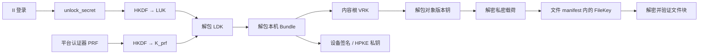

# dMsg 加密设计与实现边界

> 核对日期：2026-10-07。本文沿新版 canisters、`src/dmsg_app` 和配套云端的公开合同核对实际调用链，是本地源码快照的设计说明，不是生产部署证明或完整安全审计。内部设计文档按 [AGENTS.md](../AGENTS.md) 定位；本文只记录公开源码能够解释的加密机制及必要的云端接口边界。

## 1. 阅读方式

本文区分三种状态：**客户端已实现**指当前工作台可调用的本地流程；**服务/SDK 已实现**指已有服务入口或库代码，未必接入客户端；**待验收**指只在本地测试通过、尚未在真实环境验证的流程。

核心结论：

1. 登录认证、设备授权、内容解密、正式认证分开。名称和登录 Principal 都不是内容密钥。
2. 本地内容采用随机内容根 → 每个不可变版本的随机内容密钥。本机数据密钥不再由口令保护，而由账户服务按登录身份发放的解锁秘密（通用路径）或平台认证器的 PRF 输出（快速路径）保护。
3. 内容根按设备用 HPKE 封装、按代次用 vetKD IBE 封装恢复信封；日常注册、新设备、换根都不调用链上密钥服务，只有全设备丢失恢复做一次 vetKD 派生。
4. 没有口令、恢复码和离线导出。登录身份加链上等待期是最终恢复权；登录身份和全部设备都丢失则内容不可恢复。
5. 正式文档由设备密钥签名，user home 记录认证回执并计费；Agent controller key 保存在 vault 中并在本机签名。链上阈值签名已退出这两条路径。

## 2. 信任边界与数据位置

| 组件 | 当前职责 | 加密与权限边界 |
| --- | --- | --- |
| 工作台页面与 dedicated Crypto Worker | 解锁、加解密、根封装、显示明文 | Worker 持有解锁后的密钥；页面仍会收到需显示的明文。扩展包和运行环境属于可信端点 |
| IndexedDB | 密钥封装、密文对象/文件块、草稿、请求、outbox、运行元数据 | 私密载荷加密，不代表所有索引和状态都隐藏 |
| Extension Service Worker | 外部请求接收、待办和窗口调度 | 不持有常驻内容根；不能依靠后台常驻维持解锁 |
| `dmsg_user`（账户所在 home） | AccountId、认证绑定、设备、根承诺、恢复、认证回执、解锁秘密 | 保存公钥、承诺和一个 `master_secret`，不保存内容根明文或 RootBundle 正文 |
| `dmsg_cose` | 内容根 vetKD 公钥与恢复派生 | 只对已完成恢复的设备派生一次，返回传输加密结果；不是普通内容解密服务 |
| `dmsg_handle` / `dmsg_payment` | 名称权属 / 最小资金合同 | 不持有内容密钥；名称权属、支付成功不自动授予内容解密权 |
| cloud 对外服务 | 认证访问、密文保存/投递、频道与对象的在线控制 | 客户端须核验身份、权限和内容完整性；加密本身不证明服务返回的是最新、完整历史 |

正常私密内容路径中，明文和内容密钥留在客户端；服务可见路由、账户/设备标识、尺寸、时序，以及执行所需的成员、接收者、联系和授权关系。正式认证是另一条路径：文本 profile 的待签正文会提交给 canister，摘要 profile 提交摘要，不能把正式签署当作秘密计算。

AEAD 防止密文被无钥篡改，不能防止服务拒绝投递、隐藏记录或提供旧的合法副本。持钥终端、登录身份、扩展更新，以及控制服务的代码和治理，都属于不同的信任边界。当前不提供 MLS、Double Ratchet 或完整前向保密/失陷后自动恢复保证。

## 3. 身份与密钥角色

### 3.1 不混用的标识

| 标识 | 当前含义 |
| --- | --- |
| ICP Principal | 认证调用者；账户可有独立认证绑定 |
| 链上 `AccountId` | 12 字节 Xid，文本为规范 20 字符；由 `dmsg_user` 发号，字节 4..9 是分配它的 home 的指纹 |
| `WorkspaceMeta.subjectId` | 绑定前为随机 32 字节 hex，绑定账户时改为账户 Xid；此前不能有内容 |
| `deviceId` | 32 字节设备标识，与设备公钥不是同一字段 |
| handle | 可转移的名称；不作为任何密钥的派生根 |
| `account.issuer` | 明确命名空间下的账户 URI；正式声明的签署者标识 |

### 3.2 密钥清单

| 密钥 | 来源与持有者 | 用途 |
| --- | --- | --- |
| `unlock_secret` | user home：`HKDF(master_secret, account_id, device_id)`，只按登录 Principal 对未撤销设备发放 | 派生本机解锁钥 |
| 本地解锁钥 `LUK` | `HKDF(unlock_secret, ["dmsg/local-unlock/2", dbName])`；只在 Worker 内存 | 包装 LDK |
| PRF 解锁钥 `K_prf` | `HKDF(prf_output, ["dmsg/local-unlock-prf/1", dbName])`；只在 Worker 内存 | 包装 LDK 的第二份封装（可选） |
| 临时键 | 绑定账户前的随机 32 字节，明文保存在 IDB | 保护尚无内容的新设备密钥 |
| `LocalDataKey` / `LDK` | 客户端随机 32 字节 | 加密本机私钥包、文件任务、控制日志；派生草稿加密子钥 |
| 内容根 `VRK_g` | 管理员设备随机 32 字节 | 包装每个对象版本的内容密钥 |
| 对象版本钥 | 每次 `write()` 随机 32 字节 | 加密条目、profile、频道记录等载荷 |
| 文件版本钥 | 每次新文件导入随机 32 字节 | 同一文件版本的分块加密，放在加密 manifest 中 |
| 设备签名种子 | `Bundle.signing`，随机 32 字节 | Ed25519：账户批准、正式文档签名、根包签名、云端命令 |
| 设备 HPKE 种子 | `Bundle.hpke`，随机 32 字节 | X25519：接收根信封、频道 epoch 密钥、待审请求 |
| II 会话钥 | Worker 启动时随机，不落盘 | Internet Identity delegation 的会话密钥，解锁前即可用 |
| controller key | vault 条目中的随机 32 字节 | Agent Delegation 事件签名，随根同步 |
| vetKD 派生公钥 | COSE 固定 context 的公钥，客户端可 pin | IBE 加密恢复信封 |

本地保护链：



`unlock_secret` 与旧版 `myIV` 一样是 canister 持有的秘密：子网节点运营者能读到它，但还需要设备的 IDB 副本才有用。它只按登录 Principal 发放，不按设备签名发放，否则偷到 IDB 的人用里面的设备 key 就能自己去取。

## 4. 原语、编码与上下文

实现入口为 [primitives.ts](../src/dmsg_app/src/lib/crypto/primitives.ts) 和 [codec.ts](../src/dmsg_app/src/lib/protocol/codec.ts)。

| 用途 | 实际参数 |
| --- | --- |
| 随机数 | `crypto.getRandomValues`；密钥/本地对象 ID 默认 32 字节 |
| 对称加密 | AES-256-GCM，96 bit nonce，128 bit 认证标签；不带 CBOR tag 的 COSE_Encrypt0 |
| 通用本地派生 `D(K,C)` | HKDF-SHA-256，salt 为 32 个零字节，info=`CBOR(C)`，输出 32 字节 |
| HPKE | X25519 / HKDF-SHA-256 / AES-256-GCM，Base mode；context 同时作为 info 和 AAD |
| IBE | `@dfinity/vetkeys` BLS12-381 IBE；公钥为 COSE 派生公钥，身份为 `CBOR([AccountId, generation])` |
| 设备签名 | Ed25519；具体待签结构由用途决定 |
| 摘要 | SHA-256；Agent 事件为 SHA3-256 |
| 序列化 | 规范 CBOR；JSON 边界采用各字段规定的 hex、无填充 base64url 或 Xid 文本 |

令 `E(K,P,C)` 表示当前 `seal()`：

```text
protected = CBOR({1: 3})                          // alg = A256GCM
Enc_structure = CBOR(["Encrypt0", protected, CBOR(C)])
result = base64url(CBOR([
  protected, {5: nonce_12_bytes}, AES-GCM(K, nonce, P, Enc_structure)
]))
```

`open()` 核对头结构、算法、IV 长度和认证标签。普通封装随机生成 nonce；文件块采用第 7 节的确定性 nonce。业务上下文作为 external AAD 进入 Enc_structure。本地内容入口使用 `decodeCanonical()`，拒绝重复键、不定长、非规范编码、浮点及尾随字节，限制 24 层和 50,000 节点。

## 5. 本地初始化、解锁与存储

### 5.1 初始化与绑定

`CryptoEngine.initialize()` 生成设备 ID、临时主体 ID、设备签名/HPKE 种子和一个占位根；`install()` 生成 LDK 和临时键并保存：

```text
dbName        = "dmsg:" + environment + ":" + subjectId + ":" + deviceId
provisional   = random32                                  // 明文保存，绑定后删除
wrappedKey    = E(provisional, LDK, ["dmsg/local-key/2", dbName])
privateBundle = E(LDK, CBOR({root, signing, hpke}), ["dmsg/device-bundle/1", dbName])
```

绑定前写入被拒绝，因此临时键只保护尚未被任何账户承认的设备密钥。首次使用必须登录 Internet Identity：新账户在注册 home 创建（初始设备随之登记），已有账户则由管理员批准配对请求。之后客户端查询 `unlock_secret(account, device)`，`bindUnlockSecret` 用 LUK 重封同一把 LDK 并删除临时键，`unlock` 字段从 `provisional` 变为 `login`。

### 5.2 日常解锁

- 通用路径：II 登录（会话私钥由 Worker 持有，公钥通过 `authPublicKey` 取得，不依赖解锁）→ `unlock_secret` → LUK → LDK → Bundle，全部只在内存；锁定后重复。`loginUnlockedAt` 记录时间。
- 快速路径：启用后 WebAuthn PRF 以 `HKDF(0, ["dmsg/prf-salt/1", dbName])` 为 salt 取得 32 字节输出，`K_prf` 解开 `prfWrappedKey`。距上次登录解锁超过 7 天时拒绝，必须走通用路径；PRF 解锁后一旦联网就核对认证设备表，本机已撤销则清空数据。支持面取决于平台认证器；扩展 origin 下的真实 WebAuthn 调用尚待在 Chrome 上实测。

### 5.3 存储的明文边界

| 数据 | 落盘保护 |
| --- | --- |
| Bundle：VRK、设备签名/HPKE 种子、历史根索引 | LDK 加密 |
| 标题、标签、条目具体类型、正文、秘密、文件名/MIME、文件摘要、controller 私钥 | 对象版本钥加密 |
| 编辑器草稿 | `D(LDK,["dmsg/local-private/1"])` 加密，AAD 绑定草稿 ID 和 dbName |
| 文件导入计划、FileKey、根候选、控制操作日志 | LDK 加密 |
| 待审外部请求正文 | 加密给本机设备 HPKE 公钥 |
| outbox | 已序列化的密文对象和重试状态 |
| 临时键（绑定前）、PRF 凭据 ID、meta、对象外层及任务索引 | 明文 |

### 5.4 锁定

页面拥有 dedicated Worker；IndexedDB 原子租约与 fencing token 阻止旧 owner 继续写入，RPC generation 丢弃旧会话回包。默认 15 分钟无操作锁定；锁定先终止 Worker，再处理数据库租约，清除明文视图和 Blob URL。这是软件隔离，不是硬件 enclave。

依据：[engine.ts](../src/dmsg_app/src/lib/crypto/engine.ts)、[db.ts](../src/dmsg_app/src/lib/db.ts)、[client.ts](../src/dmsg_app/src/lib/crypto/client.ts)、[session.svelte.ts](../src/dmsg_app/src/lib/session.svelte.ts)、[prf.ts](../src/dmsg_app/src/lib/services/prf.ts)。

## 6. 对象版本、AAD 与本地消息

每次 `write()` 创建随机 `revision` 和新对象版本钥 `K_v`。编辑/删除生成新版本，旧版本保留；并发分支成为可见冲突，解决冲突也是一次新写入。

```text
ContentAAD = ["dmsg/content/1", environment, subjectId, generation,
              objectId, revision, deviceId, kind, parent, tombstone]
WrapAAD = ["dmsg/wrap/1", subjectId, objectId, generation, revision,
           "item-version"]

ciphertext  = E(K_v, CBOR(payload), ContentAAD)
keyEnvelope = E(VRK_generation, K_v, WrapAAD)
digest      = hex(SHA256(CBOR([ContentAAD, ciphertext, keyEnvelope])))
```

读取先核对摘要，再解包版本钥和解密内容。换根后旧代对象用历史根索引中的旧根打开，新写入使用当前根。公开可重算的摘要用于一致性检查，不能独立证明作者身份。频道、消息和文件的云端协议见 [cloud_zh.md](protocol/cloud_zh.md) 与 [channel_migration_zh.md](protocol/channel_migration_zh.md)。

## 7. 文件加密与完整性

上限 100 MiB，明文每块 1 MiB。每个新文件版本生成独立随机 FileKey、file ID 和 version。

```text
nonce_i = 0x644d7367 || uint64_be(i)
ChunkAAD_i = ["dmsg/file-chunk/1", fileId, version, i, chunkCount, plaintextLength_i]
chunk_i = E(FileKey, plaintext_i, ChunkAAD_i, nonce_i)
chunkDigest_i = SHA256(解码后的 COSE_Encrypt0 字节)
```

断点恢复要求文件名和大小一致，逐块核对已持久化部分的明文摘要并复用保存的密文。manifest 包含文件名、MIME、总长度、全文件 SHA-256、按序排列的块 ID/密文摘要/明文长度以及 FileKey，经普通 `write('vault', ...)` 的另一把随机对象版本钥加密。下载依次校验块 ID/顺序、密文摘要、AEAD、单块长度、总长度和全文件明文摘要。

## 8. 内容根、换根与恢复

### 8.1 RootBundle v2

每代根包封装给当前全部活跃设备和该代的 vetKD 恢复身份；精确字节见[账户与根合同](protocol/account_root_zh.md)：

```text
设备信封  = HPKE.Seal(device.hpke_pub, VRK_g, ["dmsg/device-root/1", environment, account, g, device_id])
恢复信封  = IBE.Encrypt(dpk, CBOR([AccountId, g]), VRK_g)
previous  = E(VRK_g, VRK_{g-1}, ["dmsg/previous-root/1", account, g, g-1, previous.digest])
commitment = SHA256(HKDF(VRK_g, ["dmsg/root-commitment/1"]))
```

链上 `ContentRootRef` 绑定 `recipients_digest`（活跃设备 ID 升序 + 代次）、`body_digest` 与 `bundle_digest`；`CommitRoot` 用当前设备集合重算，已撤销设备收不到新根，未批准设备不能被塞进根包。换根只是一次上传加一次 CAS，不调用链上密钥。

### 8.2 恢复范围

| 场景 | 当前可恢复范围 |
| --- | --- |
| 本机数据仍在，能登录绑定过的 II | `unlock_secret` 解锁本机内容与设备密钥 |
| 本机数据仍在，启用了 PRF | 7 天内可离线生物识别解锁；之后须登录 |
| 新设备，已有管理员设备在手 | 管理员批准配对并换根，新设备下载根包解开自己的信封 |
| 所有设备丢失，II 仍在 | 登录申请恢复 → 等待期（默认 3 天，任一旧设备可取消）→ 替换设备与绑定 → 一次 vetKD 派生解开恢复信封 → 换根 |
| II 和全部设备都丢失 | 不可恢复 |
| dMsg 服务不可用 | 没有服务外恢复路径 |

恢复派生只允许 `complete_recovery` 登记的设备对当前代次做一次；换根后权利消失。等待期是对 II 被盗的唯一缓解：延迟期内所有设备都没响应即内容泄露。

依据：[root.ts](../src/dmsg_app/src/lib/crypto/root.ts)、[account-root.ts](../src/dmsg_app/src/lib/services/account-root.ts)、[account.rs](../src/dmsg_user/src/account.rs)、[recovery.rs](../src/dmsg_user/src/recovery.rs)、[COSE](../src/dmsg_cose/README.md)。

## 9. 链上权限

`dmsg_user` 核对实际 caller 的认证绑定，以及设备签名、设备状态、序号、security epoch、期限、角色和具体 capability（`ContentSign`、`VaultUnlock`、`RootManage`、`FormalApprove`、`PaymentOffer`）。`changed()` 递增 security_epoch、清除候选根；有已提交根时置 `RekeyRequired`，触发不限于撤销设备，也包括新增设备和认证绑定变化。链上状态变化本身不会重加密客户端历史。

账户安全证据以认证值为准：`SecuritySnapshot` schema 4，认证叶路径为单段原始 AccountId；`devices_root` 是完整设备 map 的 `digest("dmsg/devices/v1", devices)`；另含 `recovery_delay_ms`、`pending_recovery_digest`、根代次与摘要、`vault_write_state`、`principal_updated_at`。使用设备公钥前须把设备记录与该承诺匹配。证书时间不在未来且当前时刻小于证书时间 +60 秒。

## 10. 设备签名、正式认证与外部请求

正式文档由设备 Ed25519 密钥签 COSE Sig_structure（kid = 设备公钥的 RFC 9679 指纹），再由设备批准 `dmsg/attest/v1` 的 `(statement, origin, signature)`，user home 的 `attest` / `attest_app_action` 验签、扣减当月额度、写入 schema 2 认证回执。签名产物是标准 tagged COSE_Sign1 和 public-only COSE_Key。没有回执的签名只证明数学有效，不证明 dMsg 授权。

```text
RequestContext = ["dmsg/external-request/1", subjectId, deviceId, requestId]
```

扩展从浏览器 sender 信息核对真实 origin、顶层文档和请求绑定，待审正文用设备 HPKE 公钥加密保存，解锁后再读。II delegation 限制目标 canisters、TTL 15 分钟，公开 delegation 仅放页面内存。签名只能证明某设备批准了确定数据，不能密码学证明真人阅读了页面。

## 11. 尚需闭合的验证边界

| 事项 | 本次源码结论 | 不能据此宣称 |
| --- | --- | --- |
| 无口令解锁 | `unlock_secret`、临时键与绑定流程有单测；PocketIC 覆盖 query 权限 | 正式 II origin 下的连续性已验收 |
| PRF 快速解锁 | Worker 侧用固定 PRF 输出测试；页面侧 WebAuthn 调用未在扩展 origin 实测 | Chrome 扩展页可作为 WebAuthn RP |
| 根包 v2 | 构造/解析/篡改、HPKE 信封与摘要向量有单测；IBE 往返由 PocketIC 覆盖 | 真实 vetKD 主网费用已核对 |
| 登录恢复 | PocketIC 覆盖申请、争议取消、延迟后完成与派生 | 真实用户恢复已验收 |
| 多 home 路由 | 客户端按 handle 注册表定位 home 并并行查询 `my_account` | 跨 home 的 Principal 唯一性（按决策不实现） |
| 生产能力 | 本地源码与测试证据 | 已部署、完成真实账户/云端联调或安全审计 |

## 12. 验证记录与源码导航

本次运行 `pnpm --dir src/dmsg_app test`：27 个测试文件、166 项测试通过；`pnpm --dir src/dmsg_app check` 0 错误。PocketIC `control_plane` 与 `directory` 套件在 PocketIC 16.0.0 release Wasm 上通过。未运行真实扩展 E2E、私有云端测试或部署。

| 主题 | 主要证据 |
| --- | --- |
| 原语 / 字节编码 | [primitives.ts](../src/dmsg_app/src/lib/crypto/primitives.ts)、[codec.ts](../src/dmsg_app/src/lib/protocol/codec.ts) |
| 本地密钥、内容、文件、根 | [engine.ts](../src/dmsg_app/src/lib/crypto/engine.ts)、[root.ts](../src/dmsg_app/src/lib/crypto/root.ts)、[models.ts](../src/dmsg_app/src/lib/models.ts) |
| 落盘和锁定 | [db.ts](../src/dmsg_app/src/lib/db.ts)、[client.ts](../src/dmsg_app/src/lib/crypto/client.ts)、[session.svelte.ts](../src/dmsg_app/src/lib/session.svelte.ts) |
| 账户、设备、恢复与根提交 | [user 类型](../src/dmsg_types/src/user.rs)、[account.rs](../src/dmsg_user/src/account.rs)、[recovery.rs](../src/dmsg_user/src/recovery.rs)、[account-root.ts](../src/dmsg_app/src/lib/services/account-root.ts) |
| 恢复派生与认证 | [COSE 类型](../src/dmsg_types/src/cose.rs)、[COSE API](../src/dmsg_cose/src/api.rs)、[cose.ts](../src/dmsg_app/src/lib/services/cose.ts)、[公开协议](protocol/README_zh.md) |
| 测试 | [workspace](../src/dmsg_app/tests/workspace.test.ts)、[account](../src/dmsg_app/tests/account.test.ts)、[cose](../src/dmsg_app/tests/cose.test.ts)、[recovery-retry](../src/dmsg_app/tests/recovery-retry.test.ts)、[receipts](../src/dmsg_app/tests/receipts.test.ts) |
