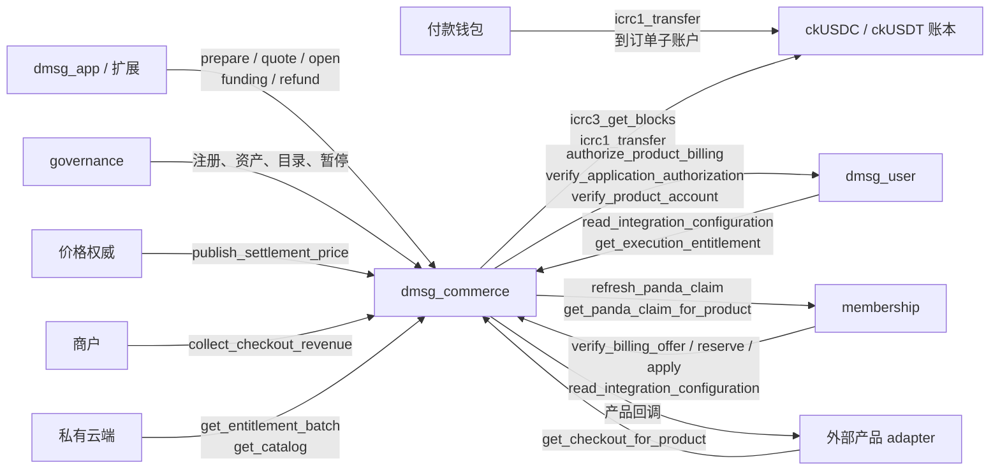

# dmsg_commerce

dMsg 的商业服务 canister，承担三项职责：

1. **集成注册表**：保存治理登记的应用（`AppRegistration`）和产品（`ProductRegistration`），并发布认证配置。`dmsg_user`、`membership` 和客户端都从这里读取。
2. **通用现金结算**：为任何已登记产品收取 ckUSDC / ckUSDT。每个订单有独立的收款子账户，按账本分别记账，负责入金核验、原路退款和商户收入归集。结算部分不写死 dMsg 的收款方。
3. **dMsg 账户产品**：作为产品 `dmsg` 的报价权威与适配器，提供年度套餐、现金升级和存储包，接受 `membership` 的 PANDA 全额抵扣决定，并把合同投影成认证资源权益，以及 `dmsg_user` 使用的 UTC 月执行额度。

完整接口见 [dmsg_commerce.did](dmsg_commerce.did)。公开合同见 [commerce v2](../../docs/protocol/commerce.md) 与 [integration](../../docs/protocol/integration.md)；类型见 [integration_billing](../dmsg_types/src/integration_billing.rs)、[billing](../dmsg_types/src/billing.rs)；纯规则见 [commerce_v2](../dmsg_protocol/src/commerce_v2.rs) 与 [product_book](../dmsg_protocol/src/product_book.rs)。

## 架构设计

### 组件关系



| 组件                  | 与 commerce 的关系                                                                                                                                                                                    |
| --------------------- | ----------------------------------------------------------------------------------------------------------------------------------------------------------------------------------------------------- |
| `dmsg_user`           | dMsg 账户的受益权威：核验设备批准（`verify_application_authorization`）、个人账户的产品授权（`authorize_product_billing`）和账户状态（`verify_product_account`）；读取注册配置，为账户拉取月执行额度 |
| `membership`          | PANDA 资格、神经元全局占用和全额抵扣决定；以结算服务身份调用本 canister 的 dMsg 产品回调                                                                                                              |
| ckUSDC / ckUSDT 账本  | `Local` 之外只接受这两个主网账本，要求 6 位小数、支持 ICRC-1 与 ICRC-3；入金只认 `1xfer`/`2xfer` 区块                                                                                                 |
| 外部产品（TokenList） | 自己实现产品回调和受益权限，commerce 只做现金结算，参见 [account product 示例](../../examples/dmsg-account-product/README.md)                                                                         |
| governance            | 初始化时固定的管理主体，与 controller 一起可调用全部治理方法                                                                                                                                          |
| 价格权威              | governance 指定的 principal，定期发布资产的美元参考价                                                                                                                                                 |
| 商户                  | 产品注册中 `merchant` 账户的 owner，归集已赚取的收入                                                                                                                                                  |
| 私有云端              | 读取认证目录和资源权益，不参与资金或交付决定                                                                                                                                                          |

### 接口与调用者

“订单读者”指付款账户 owner、商户 owner、产品 adapter 和 governance。

| 类别          | 方法                                                                                                                                                                                                | 调用者                                         |
| ------------- | --------------------------------------------------------------------------------------------------------------------------------------------------------------------------------------------------- | ---------------------------------------------- |
| 治理          | `register_integration_app`、`register_integration_product`、`register_settlement_asset`、`verify_settlement_asset`、`set_settlement_price_authority`、`schedule_policy`、`set_admission_pause`、`admin_add_user_home`、`admin_set_limits` | controller 或 `governance`                     |
| 价格          | `publish_settlement_price`                                                                                                                                                                          | controller、`governance` 或价格权威            |
| 提案预演      | 以上每个方法的 `validate_*`，参数相同                                                                                                                                                               | 任何人（query）                                |
| dMsg 报价     | `prepare_account_subscription`                                                                                                                                                                      | 任何人                                         |
| 结账          | `quote_checkout`、`check_checkout_funding`、`reconcile_checkout`                                                                                                                                    | 任何人                                         |
|               | `open_checkout`、`cancel_checkout`                                                                                                                                                                  | 付款人（即账户批准的 actor）                   |
| 出金          | `claim_checkout_refund`                                                                                                                                                                             | 入金来源 owner 或付款人                        |
|               | `collect_checkout_revenue`                                                                                                                                                                          | 商户 owner                                     |
|               | `collectable_checkouts`                                                                                                                                                                             | 商户 owner（query，按服务终点分页未归集完的订单） |
|               | `claim_checkout_fee_reserve`                                                                                                                                                                        | 任何人（收款方固定为付款人）                   |
|               | `process_checkout_transfer`、`reconcile_checkout_transfer`                                                                                                                                          | 任何人                                         |
|               | `revise_checkout_transfer_fee`                                                                                                                                                                      | 该笔出金的收款 owner                           |
| 订单查询      | `get_checkout`、`checkout_deposits`                                                                                                                                                                 | 订单读者                                       |
|               | `get_checkout_transfer`                                                                                                                                                                             | 收款 owner 或订单读者                          |
|               | `checkout_operations`、`checkout_transfers`                                                                                                                                                         | 非匿名 caller，只返回自己可读的记录            |
| 公开查询      | `checkout_progress`、`settlement_assets`、`integration_configuration_certificate`、`get_catalog`、`list_catalogs`、`get_entitlement_batch`、`get_commerce_limits`、`commerce_stats`                 | 任何人                                         |
| 权益          | `refresh_entitlement`、`refresh_catalog`                                                                                                                                                            | 任何人；`refresh_entitlement` 只刷新已有主体   |
|               | `get_execution_entitlement`                                                                                                                                                                         | 受益主体所属的 user home                       |
| 跨服务读取    | `read_integration_configuration`                                                                                                                                                                    | 任何人（复制调用，供 user 和 membership 使用） |
|               | `get_checkout_for_product`                                                                                                                                                                          | 该订单的产品 adapter                           |
| dMsg 产品回调 | `verify_billing_offer`、`get_product_decision`                                                                                                                                                      | 本 canister 或 membership                      |
|               | `reserve_product_billing`、`release_product_billing`、`apply_product_decision`                                                                                                                      | 结算服务：现金为本 canister，PANDA 为 membership |
|               | `cancel_cash_contract`、`get_cash_cancellation`                                                                                                                                                     | 本 canister                                    |
| 维护          | `sweep_checkout_history`                                                                                                                                                                            | 任何人                                         |

### 现金结账

1. **报价**：dMsg 产品由 `prepare_account_subscription(app_id, beneficiary, sku, operation_id)` 生成 `BillingOffer`，15 分钟内有效。`quote_checkout(offer, ledger, payer)` 回调产品 `quote_authority` 的 `verify_billing_offer` 确认报价，再用价格权威发布的价格换算金额：`amount_atomic = ceil(amount_usd_micros × 10^6 / price_usd_micros)`。费用准备 `fee_reserve = 2 × max_network_fee`，付款期限 30 分钟，激活期限 24 小时，两者都不超过服务终点。报价不写状态。
2. **批准**：账户设备在 `dmsg_user` 批准 `ApplicationApproval`，其中 `action_digest = checkout_quote_hash(quote)`，`actor` 为付款人。
3. **开单**：付款人调用 `open_checkout`。commerce 重建并比对报价，要求报价引用的价格快照确实由价格权威发布且仍有效；同时向受益主体自己的权威（必须列在产品注册的 `beneficiary_authorities` 中）和 user home 核验授权，回调后重读配置和价格。之后保存 `Reserving` 订单，请产品 adapter 预留服务区间，成功后进入 `AwaitingFunding`。
4. **付款**：钱包向报价中的 `deposit`（owner 为 commerce，子账户为订单 ID）转入 `amount + fee_reserve`。只认 `icrc1_transfer` 或 `icrc2_transfer_from` 产生的转账区块。
5. **核验入金**：任何人可调用 `check_checkout_funding(order_id, block)`。commerce 从账本读取区块（必要时沿账本返回的归档回调），以 `(ledger, block)` 去重。合格入金须满足：来自报价账本和付款人、金额足额、区块时间在 `[quoted_at, funding_deadline)` 内，并在激活期限前完成核验。满足时，同一消息内写入资金分类和不可变的 Apply 决定，随后调用 adapter。错账本、错来源、不足、多付、重复和迟到的入金，全部记为来源方的可退余额。
6. **交付**：adapter 返回 `Applied` 回执，订单即为 `Applied`；返回拒绝回执，订单转为 `RefundCommitted`，价格和费用准备转为该笔入金的可退余额。调用结果未知时订单保持 `Applying`，`reconcile_checkout` 先查原决定的回执再重放；超过激活期限的 Apply 由 adapter 确定拒绝。

| 状态              | 含义                       | 推进                                                         |
| ----------------- | -------------------------- | ------------------------------------------------------------ |
| `Reserving`       | 订单已保存，产品预留未确定 | `reconcile_checkout` 重试；付款人可取消                      |
| `AwaitingFunding` | 已预留，等待入金           | 合格入金进入 `Applying`；超过激活期限或被取消进入 `RefundCommitted` |
| `Applying`        | Apply 决定已冻结           | `reconcile_checkout` 查回执或重放                            |
| `Applied`         | 已交付                     | 收入按服务期线性赚取；服务尚未开始时可取消                   |
| `RefundCommitted` | 确定不交付或已取消         | 来源方领取退款                                               |
| `Rejected`        | 产品拒绝预留               | 释放预留；已有入金可退                                       |

`cancel_checkout` 只能由付款人调用：`Reserving` 和 `AwaitingFunding` 直接转为 `RefundCommitted` 并释放预留；`Applied` 只在服务开始前（例如尚未开始的续期）可以取消，adapter 确认未发放过权益后，全部付款转为可退余额。已开始的服务没有退款接口。未付款的订单在激活期限（开单后 24 小时）前一直占用主体的产品区间，用户放弃购买时，客户端应调用 `cancel_checkout` 释放。

### 资金与出金

每个订单按账本分别记账，任何时刻都满足 `incoming = refundable + service + fees + outgoing`。每次保存都会检查，不守恒直接 trap。

| 出金       | 入口                                                         | 金额                                                                                          |
| ---------- | ------------------------------------------------------------ | --------------------------------------------------------------------------------------------- |
| 退款       | `claim_checkout_refund(order, ledger, blocks, operation_id)` | 同一账本、同一来源的 1–32 笔入金的可退余额之和，扣除一次网络费后转回来源账户                  |
| 商户收入   | `collect_checkout_revenue(order)`                            | 已赚取额减已归集额。从实际交付与服务开始两者较晚者起，到服务结束线性赚取；网络费优先用费用准备补贴 |
| 准备金退回 | `claim_checkout_fee_reserve(order)`                          | 收入全部归集后剩余的费用准备，转回付款人；任何人都可以触发                                    |

完成全部已赚收入的那次归集会一并带走无法单独退回（不超过一笔账本 fee）的费用准备余额，更大的余额留待退回付款人，所以结清的订单余额都能归零。

这三个入口只在本地分配一条 `Pending` 出金腿，不发起转账。每条腿冻结源子账户、收款账户、金额、fee、memo（等于腿 ID）和 `created_at_time`，需要另外调用 `process_checkout_transfer(id)` 派发：

| 状态         | 含义                         | 后续                                                                                                                         |
| ------------ | ---------------------------- | ---------------------------------------------------------------------------------------------------------------------------- |
| `Pending`    | 已分配，未派发               | `process_checkout_transfer`                                                                                                  |
| `InFlight`   | 已派发，或回调被升级打断     | 用原参数重试，账本在 24 小时窗口内去重；或用 `reconcile_checkout_transfer(id, block)` 提交实际区块                           |
| `Unknown`    | 结果未知                     | 同上；此后的明确拒绝不能证明转账未执行                                                                                       |
| `Rejected`   | 账本明确拒绝，此前没有未知结果 | 临时故障可直接重试；`TooOld` 或 `BadFee` 由收款人调用 `revise_checkout_transfer_fee`，以新时间戳、原 fee 或账本期望的 fee（不超过原上限）重发 |
| `Succeeded`  | 已确认区块                   | —                                                                                                                            |
| `Superseded` | 已被修订后的新腿替代         | —                                                                                                                            |

`created_at_time` 在分配时就已固定，所以出金腿必须在 24 小时内派发；`InFlight` 和 `Unknown` 也要在这个窗口内用原参数重试，才能靠账本去重得到确定结果，超出窗口后只能凭实际区块对账。同一条腿的派发、对账和修订由内存 guard 互斥；升级只丢弃 guard，冻结参数仍保留。

### dMsg 账户产品

| SKU                         | 内容             | 支付方式    | 区间与价格                                                                                       |
| --------------------------- | ---------------- | ----------- | ------------------------------------------------------------------------------------------------ |
| `plus` / `pro` / `max`      | 年度基础套餐     | 现金或 PANDA | 没有有效合同时从当前时间开始；已有合同时只能在到期前 30 天内续期，从原到期日起算一年。价格为目录年费 |
| `upgrade-<plus\|pro\|max>`  | 升级当前现金套餐 | 仅现金      | 从当前时间到现合同到期，按原年度起点折算差价；交付时终止旧合同                                   |
| 64 位十六进制存储产品 ID    | 存储包           | 仅现金      | 需要当前有效且资格正常的基础合同，期限到该合同到期为止，按其年度折算                             |

- 每个主体有一个基础 `ProductBook`，每个存储包各有一个。所有 book 以主体的 `business_revision` 做 CAS；每个 book 同时只有一个未提交预留，最多两个有效合同（当前期和下一期）。
- 交付在一条消息内写入合同、资源和回执。PANDA 交付前先读取 membership 的认领视图，核对报价、承诺期和资格；交付时还会向 `dmsg_user` 核对账户仍为 Active。只有调用账户或 membership 失败时结果才保持未知，其余交付失败都写入确定的拒绝回执，结算方据此退款。
- 尚未开始的现金续期可以取消（见上）。PANDA 合同不可取消，在到期前也不能退出。

### 资源权益与执行额度

- 受益主体（`Beneficiary`，其 authority 必须在 `user_homes` 中）保存当月及以后的合同、存储包、最后一次服务结束时间和最近一次视图。主体只在首次购买时创建，之后不会删除，数量受 `max_subjects` 限制，因此只与付费过的账户数成正比。
- 从未购买的账户没有主体，也没有认证叶：`get_entitlement_batch` 返回不存在证明，配合认证目录即为 Free。`get_execution_entitlement` 对这类账户按目录和 user home 提供的账户创建时间直接计算，不写状态，租约版本为 0；已保存主体的第一次投影是版本 1。
- `EntitlementView` 是合同的投影：当前基础档（没有有效合同时为 Free）加上有效的存储包。租约长度取决于权益能否被收回：已开始的现金服务没有退款，未开始的续期在下一个边界之后，所以现金、已到期和 Free 租约最长 30 天；PANDA 资格可能丢失，由 PANDA 支撑的租约不超过 1 小时，也不超过 membership 的资格租约。所有租约都在下一个合同或存储包边界、下一个目录生效时间截止。资格不可核验时，视图截止时间等于签发时间，不会退化为可复用的 Free 租约。视图以 `entitlement_key(beneficiary)` 写入认证树。
- `refresh_entitlement` 在视图剩余不足 10 分钟、业务版本变化或目录切换时重新投影，否则返回原视图，所以消费者提前几分钟续期就能拿到更晚的租约。当前合同来自 PANDA 时，先调用 membership 的 `refresh_panda_claim`，它在同一个 10 分钟窗口内重新核验合格的认领：membership 返回 `Pending`、`QuotaExceeded`，或调用本身没有完成（membership 停止、`Unavailable`、`ExecutionUnknown`），都表示没有读取 SNS，原租约继续有效（PANDA 租约本来不超过 1 小时）；只有明确的否定答案把合同标为不可核验。两种情况都在 1 分钟内不再重试。
- `get_execution_entitlement(beneficiary, month, account_created_at_ms)` 只接受该主体的 user home，返回视图和当月的 `MonthEntitlement`。当月按合同、资格暂停和实际生效的目录切分为最多 64 个片段；资格暂停期间按 Free 计算，从账户创建时间开始积分，最后向下取整。user home 最多缓存 1 小时，与资源租约长度无关。

### 目录

- 目录固定 4 个套餐（Free 价格为 0），最多 16 个存储产品；同一目录内所有套餐的执行权重相同。
- `schedule_policy` 只能安排至少 30 天后生效、版本和生效时间都递增的新目录；执行权重只能在 UTC 月初变化。最多保留 256 个目录。
- 到达生效时间后，新目录自动用于报价和投影；认证叶 `get_catalog` 需要在生效后由任何人调用一次 `refresh_catalog` 更新，升级时也会刷新。
- dMsg 报价的条款摘要取产品注册的 `terms_hash`，条款随注册更新生效，与目录排期无关；目录的 `terms_digest` 只描述该目录版本。

### 限流与容量

准入上限由治理用 `admin_set_limits` 设定，`get_commerce_limits` 查询当前值；只拒绝新的主体、订单和外部调用，已接受操作的恢复不受影响。

| `CommerceLimits` 字段       | 含义                                                       | 上界       |
| --------------------------- | ---------------------------------------------------------- | ---------: |
| `max_subjects`              | 受益主体数，只有付费过的账户才有                           | 10,000,000 |
| `max_hot_orders`            | 热订单数，包含所有有效订阅；不大于 `max_orders`            | 10,000,000 |
| `max_orders`                | 累计订单身份（热与冷）                                     | 10,000,000 |
| `daily_orders`              | 每 UTC 日的新订单                                          |  1,000,000 |
| `calls_per_minute`          | 资金、产品与出金调用（查账、预留、Apply、取消、派发、对账） |    100,000 |
| `calls_per_caller`          | 上一项中单个 caller 每分钟可用的份额；派发出金的运维 principal 需要比终端用户多 | `calls_per_minute` |
| `authorizations_per_minute` | 授权（`quote_checkout`、`open_checkout`）                  |    100,000 |
| `refreshes_per_minute`      | PANDA 资格刷新                                             |    100,000 |

资金类调用每个 caller 的额度由 `calls_per_caller` 设定；授权每 caller 固定 10 次、资格刷新每 caller 固定 20 次；user home 为其账户刷新时可用全部全局额度。每类预算保存当分钟的累计数和每个 caller 的计数，判定不随 caller 数量变慢。其他固定上限：

| 项目                   | 限制                   |
| ---------------------- | ---------------------- |
| 同时进行的受保护调用   | 128                    |
| 应用 / 产品注册        | 64 / 256               |
| 结算资产               | 2 个，每种资产最多一个 |
| 每个账本的有效价格快照 | 256                    |
| 每个主体的有效存储包   | 64                     |

只有实际发出的外部调用才计入额度；本地退款分配、重复请求和被 guard 拦下的并发调用不计。计数按分钟保存在 heap，升级时由 `pre_upgrade` 写入稳定内存。全局额度只影响可用性：大量不同的 principal 可以在一分钟内耗尽它，但不会影响资金。

### 历史归档

`sweep_checkout_history` 每次最多归档 32 个订单和 32 条出金腿：

- 订单须没有可退余额、服务准备、费用准备和未完成出金，并已有确定的产品结果；在最后一次资金变动与服务终点（或激活期限）两者较晚值之后 30 天归档。
- 出金腿在 `Succeeded` 或 `Superseded` 之后 30 天归档。`Unknown`、未完成的出金和未结清的资金不会归档。
- 冷订单删除重复的授权与决定正文，保留输入摘要、完整报价、最终回执、入金引用和账本余额。直接读取和读者索引照常可用。迟到的入金会把原订单恢复为热记录，并原路退款。区块去重记录和订单 ID 永不回收。

`Applied` 订单要等商户归集全部收入、费用准备清零后才能归档。最后一次归集带走无法单独退回的余额；更大的余额由任何人调用 `claim_checkout_fee_reserve` 退回付款人，归集任务可以顺带处理，避免订单长期占用热订单上限。

### 存储

稳定布局为开发 schema 8。私有 `stable_codec.rs` 用 CBOR 整数 key 保存记录，读到其他 schema 直接 trap，不迁移旧布局。`MemoryManager` 使用 128 页（8 MiB）的分配桶，可寻址 256 GiB。

| Memory | 内容                                                       |
| -----: | ---------------------------------------------------------- |
|      0 | 配置 `StableCell`：初始化参数、准入上限、暂停状态、每日订单与每分钟调用计数 |
|      1 | `SUBJECTS`：主体 → 合同、存储包与当前视图                  |
|      6 | `CATALOGS`：版本 → 目录                                    |
|   8、9 | 应用、产品注册                                             |
|     10 | 结算资产，含验证标记与当前观测到的 fee                     |
| 11、24 | 热订单、冷订单                                             |
|     12 | 入金：`(订单, 区块)` → `CheckoutDeposit`                   |
| 13、25 | 热出金腿、冷出金腿                                         |
|     14 | 区块去重：`(ledger, block)` → 订单                         |
|     15 | 价格权威                                                   |
|     16 | 产品 book                                                  |
|     17 | 已交付决定（按合同 ID）                                    |
|     18 | 产品回执（按决定 ID）                                      |
|     19 | 现金取消回执                                               |
|     20 | 已释放的产品操作                                           |
|     21 | 价格历史：`(ledger, policy_version)` → 资产快照            |
| 22、23 | 订单、出金腿的读者索引                                     |
| 26、27 | 订单、出金腿的归档到期索引                                 |
|     30 | 商户归集索引：`(商户 owner, 服务终点, 订单)` → 未归集完的 `Applied` 订单 |
| 28、29 | 认证 map 的叶子（key → 认证值哈希）与按 id 定址的内部节点  |

heap 只保存配置缓存（含调用计数）、目录缓存和调用 guard。认证树用 `dmsg_runtime::cert_map` 存放在 stable memory，只保存 key 与哈希；注册、目录和付费主体视图的认证值在查询时从记录重新生成，并与已认证哈希核对。订单、出金腿和资产没有认证叶。`post_upgrade` 加载目录缓存，按当前时间刷新目录叶后发布根，不扫描订单或主体，并在日志中记录 `commerce_upgrade subjects=… instructions=…`。

## 部署流程

### 初始化参数

| `CommerceInit` 字段   | 要求                                                                                                                                                                                                             |
| --------------------- | ---------------------------------------------------------------------------------------------------------------------------------------------------------------------------------------------------------------- |
| `environment`         | `Production`、`Staging` 或 `Local`。非 `Local` 只接受主网 ckUSDC（`xevnm-gaaaa-aaaar-qafnq-cai`）和 ckUSDT（`cngnf-vqaaa-aaaar-qag4q-cai`），验证资产时必须提供真实转账区块；`Production` 的产品注册也只能列出这两个账本 |
| `governance`          | 与 controller 一起可调用全部治理方法，初始化后不可修改。每个治理方法都有同参数的 `validate_*` query，按当前状态执行相同检查并渲染提案说明，可登记为 SNS 通用函数的验证方法                                      |
| `membership_canister` | 共享 `membership` 的 ID，初始化后不可修改                                                                                                                                                                        |
| `user_homes`          | 1–64 个 `dmsg_user` ID，不得重复；之后只能用 `admin_add_user_home` 追加。新 home 还需加入应用登记的 `user_homes` 和产品登记的 `beneficiary_authorities`                                                       |
| `catalog`             | 初始目录：`schema = 1`，`version > 0`，`effective_at_ms` 不晚于安装时间；4 个套餐的 `catalog_version` 等于目录版本，Free 价格为 0，执行权重一致                                                                 |
| `limits`              | 初始 `CommerceLimits`，见“限流与容量”；之后由 `admin_set_limits` 调整。`max_subjects` 只计付费过的账户                                                                                                           |

`governance` 和 `membership_canister` 不能是匿名 principal 或管理 canister，参数不合法时安装失败。

### 依赖关系

`dmsg_user` 的 `UserInit` 需要 `commerce_canister` 和 `membership_canister`；commerce 需要 `membership_canister` 和 `user_homes`；membership 安装后，由它的 governance 调用 `configure_panda_service`，其 `commerce_homes` 把每个 user home 映射到服务它的 commerce。因此要先创建全部 canister ID，再分别安装。

### 多实例

commerce 按 user home 分区：一个 `dmsg_user` 只能列在一个 commerce 的 `user_homes` 里，它的 `UserInit.commerce_canister` 指向该实例，账户的订单、主体和认证叶都只在该实例。每个实例独立持有注册表、结算资产、价格、目录和订单，因此治理要在每个实例分别登记产品、应用与资产，价格权威要向每个实例发布，商户也要在每个实例归集。共享的只有 `membership`：它的 `PandaServiceConfig.commerce_homes` 列出每个 user home 的 commerce，按申请所在的 home 读取注册并回调该实例的产品 adapter，神经元占用仍是全局唯一。

私有云端把 `COMMERCE_CANISTER` 配置为按 user home 的映射（单实例仍可填一个 ID），目录和权益证明都按账户 home 的 commerce 验证。客户端目前只连接一个 user home，因而也只连接该 home 的 commerce；按账户指纹选择 home 的客户端路由完成后，commerce 随 home 一起选择。

何时加实例：`commerce_stats` 中 `subjects`、`hot_orders + archived_orders` 接近 `max_subjects`、`max_orders` 的 60%，或冷订单累计接近 1,000 万（订单 ID 和区块去重记录永不回收，`MAX_ORDERS` 是终身上限）时，新的 user home 应指向新的 commerce 实例，而不是继续提高旧实例的上限。

### 步骤

以下命令在仓库根目录执行，以 `--network ic` 为例，本地开发时去掉该参数。

1. 在待部署的提交上完成验证，工作区不能有未提交的改动：

   ```sh
   POCKET_IC_BIN=/path/to/pocket-ic make test-dmsg
   ```

2. 创建 canister ID：

   ```sh
   dfx canister create dmsg_commerce --network ic
   dfx canister create membership --network ic
   dfx canister create dmsg_user --network ic
   ```

3. 把初始化参数保存为 `commerce-init.did`，然后安装 commerce。下例使用默认目录的价格与额度，实际取值以治理批准的为准；`blob` 中每个字节写成 `\xx`：

   ```candid
   (record {
     environment = variant { Production };
     governance = principal "<governance>";
     membership_canister = principal "<membership ID>";
     user_homes = vec { principal "<dmsg_user ID>" };
     limits = record {
       max_subjects = 1_000_000 : nat64; max_hot_orders = 1_000_000 : nat64; max_orders = 10_000_000 : nat64;
       daily_orders = 10_000 : nat32; calls_per_minute = 400 : nat32; calls_per_caller = 40 : nat32;
       authorizations_per_minute = 200 : nat32; refreshes_per_minute = 200 : nat32;
     };
     catalog = record {
       schema = 1 : nat16;
       version = 1 : nat64;
       effective_at_ms = <不晚于安装时间的 Unix 毫秒> : nat64;
       terms_digest = blob "<32 字节条款摘要>";
       storage_products = vec {};
       plans = vec {
         record { plan_id = variant { Free }; catalog_version = 1 : nat64; terms_version = 1 : nat64; price_cents = 0 : nat64;
           limits = record { storage_bytes = 104_857_600 : nat64; active_channels = 2 : nat64; monthly_execution_units = 3 : nat64 };
           weights = record { version = 1 : nat64; ed25519 = 1 : nat64; ecdsa_secp256k1 = 1 : nat64 } };
         record { plan_id = variant { Plus }; catalog_version = 1 : nat64; terms_version = 1 : nat64; price_cents = 1_000 : nat64;
           limits = record { storage_bytes = 1_073_741_824 : nat64; active_channels = 10 : nat64; monthly_execution_units = 10 : nat64 };
           weights = record { version = 1 : nat64; ed25519 = 1 : nat64; ecdsa_secp256k1 = 1 : nat64 } };
         record { plan_id = variant { Pro }; catalog_version = 1 : nat64; terms_version = 1 : nat64; price_cents = 5_000 : nat64;
           limits = record { storage_bytes = 10_737_418_240 : nat64; active_channels = 50 : nat64; monthly_execution_units = 50 : nat64 };
           weights = record { version = 1 : nat64; ed25519 = 1 : nat64; ecdsa_secp256k1 = 1 : nat64 } };
         record { plan_id = variant { Max }; catalog_version = 1 : nat64; terms_version = 1 : nat64; price_cents = 20_000 : nat64;
           limits = record { storage_bytes = 107_374_182_400 : nat64; active_channels = 200 : nat64; monthly_execution_units = 200 : nat64 };
           weights = record { version = 1 : nat64; ed25519 = 1 : nat64; ecdsa_secp256k1 = 1 : nat64 } };
       };
     };
   })
   ```

   ```sh
   dfx deploy dmsg_commerce --network ic --argument-file commerce-init.did
   dfx canister info dmsg_commerce --network ic
   ```

   `dfx deploy` 按 dfx.json 以 `optimize: cycles` 和 gzip 构建。用 `dfx canister info` 记录实际的模块哈希和 controllers。

4. 安装 `dmsg_user`，其中 `commerce_canister`、`membership_canister` 指向上面的 ID，其他字段见 [dmsg_user](../dmsg_user/README.md)。然后安装 `membership`，并由它的 governance 调用 `configure_panda_service`，其中 `commerce_homes` 列出 `{ user_home = <dmsg_user ID>; commerce_canister = <本 canister> }`，`qualifications_per_minute` 按活跃 PANDA 会员数设置（每会员每小时约一次 SNS 读取），见 [membership](../membership/README.md)。

5. 用 governance 身份按顺序完成配置。产品必须先于引用它的应用登记：

   1. 登记 dMsg 产品。`quote_authority` 和 `adapter` 为 commerce，`beneficiary_authorities` 列出全部 user home，`terms_hash` 是条款摘要，报价使用它；`ledgers` 可以先只列出首发资产，以后再更新注册加入另一个：

      ```sh
      dfx canister call --network ic dmsg_commerce register_integration_product '(record {
        version = 2 : nat16; environment = variant { Production };
        product_id = "dmsg"; config_version = 1 : nat64;
        quote_authority = principal "<commerce ID>"; adapter = principal "<commerce ID>";
        beneficiary_authorities = vec { principal "<dmsg_user ID>" };
        subject_schema = "dmsg-account-v1"; subject_size = 12 : nat16;
        merchant = record { owner = principal "<商户 owner>"; subaccount = null };
        ledgers = vec { principal "xevnm-gaaaa-aaaar-qafnq-cai" };
        terms_hash = blob "<32 字节条款摘要>"; paused = false })'
      ```

   2. 登记 dMsg 应用。客户端以 `app_id = "dmsg"` 购买，要求应用具备 `Checkout` 能力，并且注册的 `user_homes`、`cose_homes` 和环境与客户端配置一致；`origins` 填扩展和网页的精确 origin：

      ```sh
      dfx canister call --network ic dmsg_commerce register_integration_app '(record {
        version = 1 : nat16; environment = variant { Production };
        app_id = "dmsg"; config_version = 1 : nat64;
        origins = vec { "chrome-extension://<扩展 ID>" };
        user_homes = vec { principal "<dmsg_user ID>" };
        cose_homes = vec { principal "<dmsg_cose ID>" };
        product_ids = vec { "dmsg" };
        capabilities = vec { variant { Checkout } }; profiles = vec {};
        authentication_receiver = principal "<dmsg_user ID>";
        action_authority = principal "<dmsg_user ID>"; paused = false })'
      ```

   3. 登记结算资产。`network_fee_atomic` 取账本当前的 `icrc1_fee`，`max_network_fee_atomic` 不低于它且不超过 10,000,000；价格观测窗口最长 30 分钟：

      ```sh
      dfx canister call --network ic xevnm-gaaaa-aaaar-qafnq-cai icrc1_fee --query
      dfx canister call --network ic dmsg_commerce register_settlement_asset '(record {
        version = 2 : nat16; policy_version = 1 : nat64; environment = variant { Production };
        ledger = principal "xevnm-gaaaa-aaaar-qafnq-cai"; asset = variant { CkUsdc };
        decimals = 6 : nat16; price_usd_micros = 1_000_000 : nat;
        price_observed_at_ms = <当前 Unix 毫秒> : nat64; price_valid_until_ms = <+30 分钟以内> : nat64;
        network_fee_atomic = <icrc1_fee> : nat; max_network_fee_atomic = <上限> : nat; enabled = true })'
      ```

   4. 验证账本。`sample_transfer` 为该账本上任意一笔普通转账的区块号；commerce 会核对小数位、fee、ICRC-1/ICRC-3 支持，并读取这个区块：

      ```sh
      dfx canister call --network ic dmsg_commerce verify_settlement_asset \
        '(principal "xevnm-gaaaa-aaaar-qafnq-cai", opt (<区块号> : nat))'
      ```

   5. 指定价格权威：`set_settlement_price_authority(principal "<价格权威>")`，再启动价格发布任务（见“运维”）。

6. 在 `src/dmsg_app/dmsg.config.json` 填写 `canisters.commerce`、`canisters.membership`，重新构建客户端（见 [dmsg_app](../dmsg_app/README.md)）；同步更新私有云端信任的 commerce canister ID。

7. 部署后检查：

   - `settlement_assets` 显示 `ledger_verified = true`，价格在有效期内。
   - `integration_configuration_certificate("dmsg", opt "dmsg")`、`get_catalog` 的证书能通过客户端验证，`get_commerce_limits` 与安装参数一致，`commerce_stats` 显示 `certified_leaves = 3`（产品、应用、目录）和 `cycles`。
   - 用小额真实资金完成一次完整流程：报价、开单、付款、`check_checkout_funding` 后订单为 `Applied`，`get_entitlement_batch` 显示对应套餐；再向订单子账户多转一笔，完成 `claim_checkout_refund` 和 `process_checkout_transfer`；`collectable_checkouts` 列出该订单，服务期结束后 `collect_checkout_revenue` 归集并派发，`claim_checkout_fee_reserve` 退回准备金。
   - 为 canister 设置冻结阈值和 cycles 余额告警，并把 `dfx canister status` 的 controllers 记录到部署记录。

### 运维

commerce 没有定时器，下列任务都需要外部调用：

| 任务         | 方法                                                                                        | 调用方                 | 频率与要求                                                                                       |
| ------------ | ------------------------------------------------------------------------------------------- | ---------------------- | ------------------------------------------------------------------------------------------------ |
| 发布价格     | `publish_settlement_price(ledger, price_usd_micros, valid_for_ms)`                          | 价格权威               | 每个启用资产都要在上一价格过期前发布，`valid_for_ms` 最长 30 分钟。没有有效价格时，现金报价和开单全部返回 `PolicyStale` |
| 派发出金     | `process_checkout_transfer`                                                                 | 任何人（商户或运维）   | 腿创建后尽快派发，必须在 24 小时内；`InFlight`/`Unknown` 也要在窗口内重试                        |
| 归集收入     | `collectable_checkouts` 找到服务期已结束的订单，逐单 `collect_checkout_revenue`，再派发      | 商户 owner             | 每单在服务期结束后归集一次，然后 `claim_checkout_fee_reserve` 退回剩余准备金。费用准备只够两条出金腿；更频繁地分期归集会留下小于一次网络费、无法转出的服务余额，订单因此不能归档 |
| 监控         | `commerce_stats`                                                                            | 任何人（query）        | 主体、热/冷订单、出金腿、待归集订单、认证叶、稳定内存页和 cycles；与 `get_commerce_limits` 对照，接近上限 60% 时扩容或加实例 |
| 推进订单     | `reconcile_checkout`                                                                        | 任何人                 | 处理停在 `Reserving`、`Applying` 或待释放预留的订单                                              |
| 归档历史     | `sweep_checkout_history`                                                                    | 任何人                 | 定期调用，直到返回 0                                                                             |
| 刷新目录证书 | `refresh_catalog`                                                                           | 任何人                 | 新目录生效后调用一次                                                                             |

价格发布是现金结账的单点依赖：价格过期后所有报价和开单返回 `PolicyStale`，价格权威必须有失败告警和备用 principal（governance 也可以发布）。价格偏离 1 USD 超过 1% 时仍可发布，但新报价和使用旧报价的开单都会被拒绝，可用于脱锚保护。商户 owner 可以用 `checkout_operations`、`checkout_transfers` 分页查看自己的全部订单和出金腿；两者按订单 ID 排序，找待归集订单请用按服务终点排序的 `collectable_checkouts`。

派发出金的 principal 受 `calls_per_caller` 限制（初始 40 次/分钟，约 57,600 条腿/天）；年订单超过数百万时提高该值或使用多个派发 principal。

`collect_checkout_revenue` 只接受商户 owner 调用，而且需要逐单归集。因此 `merchant.owner` 必须是能运行归集任务的 principal，例如运维账户或转发 canister，再由它把收入转入金库；如果直接使用 SNS governance 作为 owner，每笔归集都需要一个提案。

### 治理变更

- **目录**：用 `schedule_policy` 提前至少 30 天安排，生效时间到后自动使用。条款变化通过更新产品注册的 `terms_hash` 立即生效，不需要与目录同步。
- **注册**：每次更新须 `config_version + 1`。应用的 `app_id`、`environment`、`authentication_receiver`、`action_authority`，以及产品的 `product_id`、`environment`、`quote_authority`、`adapter`、`subject_schema`、`subject_size` 不可修改，`beneficiary_authorities` 只能在末尾追加。现金报价包含完整的产品注册，注册变化后尚未开单的报价不能再开单，需要重新报价。商户账户在报价时冻结，修改只影响新订单。
- **暂停**：`set_admission_pause(true)` 只停止新的现金报价和开单；对账、退款、出金、PANDA 和权益刷新照常进行。在注册中把应用或产品的 `paused` 设为 true，会同时停止现金和 PANDA 的新报价与批准。
- **新增 user home**：依次调用 `admin_add_user_home`，把该 home 追加到应用登记的 `user_homes` 和 dMsg 产品登记的 `beneficiary_authorities`（各自 `config_version + 1`），并在 membership 的 `configure_panda_service` 里追加 `{ user_home; commerce_canister }`。该 home 的账户随后即可购买。
- **准入上限**：`admin_set_limits` 一次替换全部上限，`validate_admin_set_limits` 会显示当前值；`max_hot_orders` 不能大于 `max_orders`，`calls_per_caller` 不能大于 `calls_per_minute`。热订单约等于最近 13 个月的订单数（归集完成并过 30 天才归档），`max_hot_orders` 按年订单量的 1.2 倍预留。
- **资产**：已登记资产的更新只替换非价格条款（fee、fee 上限、启用状态）：commerce 沿用最新发布的价格，并在执行时分配下一个 `policy_version`，提案中的价格字段和版本不生效，价格发布不会使提案过期。账本 fee 变化后，出金遇到 `BadFee` 会记录账本给出的 fee，新报价随之停止，直到 governance 登记新的 `network_fee_atomic` 并重新验证；已被拒绝的出金腿由收款人修订后重发。

### 升级

升级要求 schema 不变。先停止 canister，等在途的账本与产品回调完成，创建快照，再升级、启动：

```sh
dfx canister stop dmsg_commerce --network ic
dfx canister snapshot create dmsg_commerce --network ic
dfx deploy dmsg_commerce --network ic --argument-type raw --argument 4449444c0000
dfx canister start dmsg_commerce --network ic
```

Candid 服务声明了 `CommerceInit` 初始化参数，dfx 升级时不带参数会报错；`post_upgrade` 不读取参数，传空 Candid 参数 `()`（hex `4449444c0000`）即可，配置不会因此改变。`pre_upgrade` 保存调用计数，不能跳过。升级打断的出金腿停在 `InFlight`，用 `process_checkout_transfer` 以原参数重试；停在 `Reserving` 或 `Applying` 的订单用 `reconcile_checkout` 恢复。

升级不重建认证树，成本不随订单和主体数量增长，见“容量与成本”。

## 容量与成本

2026-10-07 的 `commerce_capacity_profile`：主机用 commerce 自己的存储代码构建 stable memory 镜像（每个主体一份 Plus 现金合同，另有热订单），压缩上传到 PocketIC 后升级并测量。cycles 只统计 commerce，升级 cycles 包含安装 Wasm 模块；原有 B 树节点布局与改进后的定址节点用同一组镜像对比：

| 主体 / 热订单 | 节点布局 | 稳定内存 | 升级指令 | 续期重投影 | 付费账户取执行额度 | Free 账户取执行额度 | 64 个主体的认证响应 |
| ------------: | -------- | -------: | -------: | ---------: | -----------------: | ------------------: | ------------------: |
| 100k / 10k    | B 树     |   277 MB | 1,977,466 | 12,658,146 cycles | 9,449,873 cycles | 8,979,877 cycles | 146,993 B |
| 100k / 10k    | 定址     |   277 MB | 1,848,618 | 10,208,768 cycles | 9,449,596 cycles | 8,979,740 cycles | 146,993 B |
| 1M / 100k     | B 树     | 2,290 MB | 1,999,577 | 14,230,840 cycles | 9,785,077 cycles | 9,179,082 cycles | 154,897 B |
| 1M / 100k     | 定址     | 2,282 MB | 1,841,924 | 10,666,404 cycles | 9,784,710 cycles | 9,178,924 cycles | 154,897 B |

- 升级只发布根，指令数与规模无关（约 1.84M）。升级 cycles 在两种规模下都约为 19.44B，主要是安装模块。
- 续期是一次真实写入（重投影主体并更新认证路径）。定址节点使 100 万主体时的续期减少 25%，从 10 万到 100 万只增加 4.5%（B 树为 12.4%）。
- 有效租约内的执行额度读取不写状态，Free 账户不建记录；两者都只比基本消息费用略高。
- 原生计数（release，100 万个 key）：一次认证写的 stable 读从 4,394 次降到 167 次，写从 439 次降到 57 次；单个 key 的 witness 读取从 2,216 次降到 156 次；每个 key 的内部节点占 201 字节（B 树为 208 字节）。主机构建 100 万主体的时间从 135 秒降到 62 秒。
- 每个付费主体约 1.3 KB（主体记录约 980 B，叶子 140 B，内部节点 201 B），另有 ProductBook、决定和回执；由两份镜像的差值反推，热订单连同索引约 9 KB/单。`MAX_SUBJECTS` 与 `MAX_ORDERS` 取 1,000 万，按此估算的数据量远低于 256 GiB 的寻址上限。超过 100 万主体的规模没有实测。
- 从未购买的账户不占 commerce 状态，所以注册用户数不受限；上限只与付费主体数和累计订单数有关。dmsg_user 只在正式执行且月缓存过期时调用 `get_execution_entitlement`，云端每小时用 query 重读，两者都不随账户数线性占用 update 吞吐。
- 活跃 PANDA 会员每小时约一次 SNS 读取，受 commerce 的 `refreshes_per_minute` 和 membership 的 `qualifications_per_minute` 共同限制（初始各 200/分钟，约 1 万活跃会员）；提高前须实测 SNS `get_neuron` 的 query 吞吐。

2026-10-03 的较早样本（schema 5，认证树驻留 heap）：10,000 条热记录重建认证树耗时 6,526 ms；32 个订单时，PocketIC 测得稳定内存从基线 `8082df5` 的 83,951,616 B 降到 14,745,600 B，无关读者查询从 16,086,227 cycles 降到 8,927,600 cycles。认证树移入 stable memory 后不再有重建成本。

## 当前限制

- `governance` 本身不能修改。
- 只识别 `1xfer`/`2xfer` 入金。铸造到订单子账户等其他区块无法入账，也没有清扫接口。
- 已开始的现金服务没有退款接口；PANDA 合同不能提前退出。
- 单个实例仍集中其全部 user home 的付费写入、逐单收入归集和 PANDA 刷新；PANDA 会员的 SNS 读取额度见“容量与成本”。
- 客户端只连接一个 user home，多实例对客户端表现为该 home 的 commerce；跨 home 的客户端路由尚未实现。
- 服务余额小于一次网络费时无法转出（见“运维”的归集节奏）。
- 超过 100 万主体的容量、真实资金、正式钱包和私有云端端到端都未验收。

## 实现

| 文件                    | 内容                                                                            |
| ----------------------- | ------------------------------------------------------------------------------- |
| `src/api.rs`            | 初始化与升级、目录治理、权益刷新、执行额度                                      |
| `src/model.rs`          | 主体、资格暂停、存储包、权益投影与月额度片段                                    |
| `src/product.rs`        | dMsg 产品：SKU 与报价、ProductBook 预留/交付/取消、PANDA 资格观察               |
| `src/checkout.rs`       | 资产治理、报价、开单、入金、交付、取消、退款、收入、出金派发与对账               |
| `src/checkout_model.rs` | 订单余额与状态转换、出金腿与账本回复分类（纯逻辑）                              |
| `src/checkout_store.rs` | 订单、入金、出金、价格历史、读者与归集索引、归档、统计                           |
| `src/registrations.rs`  | 应用与产品注册、配置读取与认证                                                  |
| `src/store.rs`          | 配置、调用额度、主体与目录存储、认证树写入                                      |
| `src/calls.rs`          | 内存调用 guard                                                                  |
| `src/stable_codec.rs`   | 主体、配置、资产、订单、出金腿的紧凑 CBOR 表示                                  |
| `src/capacity.rs`       | 测试用：主机构建容量 profile 的 stable memory 镜像                              |

## 验证

```sh
cargo test --locked -p dmsg_commerce
POCKET_IC_BIN=/path/to/pocket-ic make test-dmsg
POCKET_IC_BIN=/path/to/pocket-ic DMSG_WASM_DIR=target/wasm32-unknown-unknown/release \
  cargo test --locked -p dmsg_integration --features pocketic-tests --test control_plane commerce -- --test-threads=1
```

[commerce.rs](../../tests/dmsg_integration/tests/control_plane/commerce.rs) 与 [commerce_review.rs](../../tests/dmsg_integration/tests/control_plane/commerce_review.rs) 使用实际 Wasm 覆盖：两个账本与同号区块隔离、退款与收入归集、最后一次归集结清费用准备及由第三方退回准备金、跨升级的未知出金恢复、fee 上限内的修订、未开始续期的取消、PANDA 冷却与交付、membership 合并请求或调用失败时保留 PANDA 租约、新增 user home 的账户购买、第二个 commerce 实例服务自己的 user home（PANDA 与现金各一单）、商户按服务终点分页待归集订单与 `commerce_stats` 计数、现金租约 30 天与 10 分钟续期窗口、Free 账户不建记录、独立产品 adapter 的 ACK 丢失、伪造价格、价格发布与升级前后的旧报价、目录生效边界、商户读权限、每 caller 额度、冷历史与迟到退款、入金分页。[governance.rs](../../tests/dmsg_integration/tests/control_plane/governance.rs) 覆盖全部治理方法与 `validate_*`，包括价格发布之后执行的资产更新提案、`admin_set_limits` 与 membership 的 `commerce_homes` 校验。测试账本支持故障注入和公开 mint，测试 SNS 可以延迟神经元读取，二者都只用于测试。

容量 profile 分两步运行：先在主机构建镜像，再加载到 PocketIC 测量。`capacity_image` 依次写出 10 万和 100 万主体的镜像（后者约 2.3 GB）：

```sh
DMSG_COMMERCE_IMAGE_DIR=/tmp/commerce-images \
  cargo test --locked --release -p dmsg_commerce capacity_image -- --ignored --nocapture
DMSG_COMMERCE_IMAGE_DIR=/tmp/commerce-images POCKET_IC_BIN=/path/to/pocket-ic \
  DMSG_WASM_DIR=target/wasm32-unknown-unknown/release \
  cargo test --locked --release -p dmsg_integration --features pocketic-tests --test control_plane \
  commerce::commerce_review::commerce_capacity_profile -- --ignored --exact --nocapture
```

其他样本：`cargo test --locked -p dmsg_commerce checkout_history_profile -- --ignored --nocapture` 是原生历史与索引样本；`commerce::commerce_review::commerce_cost_profile` 对比基线与当前构建的 Wasm 成本，基线目录用 `DMSG_WASM_DIR` 指定，并只对旧构建设置 `DMSG_COMMERCE_BASELINE=1`。

2026-10-07 在当前代码上完整运行 `scripts/test-dmsg.sh` 通过：Rust 单元与文档测试、Clippy `-D warnings`、Wasm/Candid 比对、跨语言协议向量、114 项 PocketIC 回归（`control_plane` 110 项、`directory` 4 项）和 26 项 SDK 测试；`dmsg_app` 的类型检查与 172 项单元测试也通过。容量 profile 按上文运行了 10 万与 100 万主体两种规模，其余默认忽略的 profile 本轮未运行。私有云端相关的 commerce、配额与会员测试通过；主网部署、真实资金和私有云端端到端未运行。
