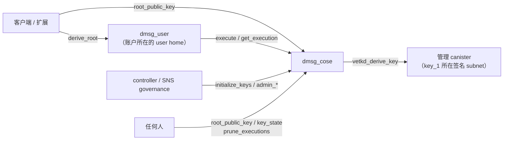

# dmsg_cose

dMsg 的内容根 vetKD 服务。它只做一件事：为 user home 已经授权的恢复派生，按固定 context 派生账户某一代内容根的 vetKey，加密给客户端的传输公钥。正式文档签名改由设备密钥完成并在 user home 认证回执，Agent controller key 由客户端自持，两者都不再经过本 canister。它不提供任意 signHash、任意派生路径、namespace 权限或 TSA 接口。

完整接口见 [dmsg_cose.did](dmsg_cose.did)，公开类型见 [dmsg_types::cose](../dmsg_types/src/cose.rs)，派生 context 与 pin 见 [dmsg_protocol](../dmsg_protocol/README_zh.md)。

## 架构设计

### 组件关系



| 组件          | 职责                                                                                                                         |
| ------------- | ---------------------------------------------------------------------------------------------------------------------------- |
| `dmsg_user`   | 校验设备批准、恢复状态和执行序号，提交 `ExecutionGrant` 后调用 COSE，记录结果并对账；见 [dmsg_user](../dmsg_user/README.md) |
| `dmsg_cose`   | 固定的派生 context、执行前独立校验、按请求去重、单账户与全局预算、短期结果                                                   |
| 管理 canister | 用 `key_1` 派生 vetKey；费用由 COSE 的 cycles 余额支付                                                                       |

客户端用 `root_public_key` 取得的公钥给每一代内容根做 IBE 恢复信封（见[账户与根合同](../../docs/protocol/account_root_zh.md)）；注册、新设备、换根都不调用本 canister，只有全设备丢失恢复做一次派生。

### 接口与调用者

| 类别 | 方法                                                                  | 调用者                                    |
| ---- | --------------------------------------------------------------------- | ----------------------------------------- |
| 执行 | `execute(grant)`                                                      | 账户所属的 user home                      |
| 结果 | `get_execution(account_id, request_id)`                               | 账户所属的 user home（query）             |
| 公钥 | `root_public_key(account_id, generation)`                             | 任何人（query），不证明账户存在           |
| 状态 | `key_state`、`cose_stats`                                             | 任何人（query）                           |
| 维护 | `prune_executions(after)`                                             | 任何人                                    |
| 管理 | `initialize_keys`、`admin_add_user_home`、`admin_set_daily_budget`    | controller 或 `governance`                |
| 预演 | 与每个管理方法同参数的 `validate_*`                                   | 任何人（query），供 SNS 通用提案验证      |

`validate_*` 按当前状态执行与对应方法相同的检查，通过时返回给投票者看的说明，与当前状态相同时末尾标注 “no change”；失败时返回方法将给出的错误。

`canister_inspect_message` 在执行前拒绝两类 ingress：调用者不是已登记 user home 的 `execute`，以及调用者不是 controller 或 governance 的 `initialize_keys`、`admin_*`。它只在单个副本上运行，不是安全边界：跨 canister 调用不经过这一步，所有调用仍由方法本身检查并返回 `Forbidden`。`cose_stats` 返回账户数与上限、保留结果数、在途与 Unknown 执行数、当日全局预算用量、stable 页数和 cycles 余额。

### 信任边界

COSE 不验证设备签名，设备批准、账户状态和恢复资格由 user home 负责。COSE 的安全性等于“已登记 user home 的正确性 + COSE 自己的独立检查”。`execute` 在调用管理 canister 前独立核对：

- caller 在 `user_homes` 中，账户 ID 第 4–9 字节是该 home 的分配器指纹（`account_allocator_digest(environment, issuer_namespace, home)` 的前 5 字节），且 caller 等于 `grant.home_user`、`grant.home_cose` 是本 canister。
- `request_id` 由账户、`security_epoch`、`device_id`、`device_sequence` 推出；`approved_at ≤ now`，授权期限不超过 5 分钟。
- `generation` 为正；`transport_key` 是合法的 BLS12-381 G1 点。
- 预留成本不超过 `grant.max_cycles`。

### 密钥派生

```text
context = canonical(("dmsg/content-root/v2", environment, derivation_version))
input   = canonical((account_id, generation))
```

ICP 的阈值密钥还按调用者 canister ID 派生，所以内容根公钥由 **COSE canister ID**、master key（`key_1`）、`environment`、`derivation_version` 决定，对所有账户相同；账户与代次只进入 IBE 身份 `input`。user home 不参与派生，同一 COSE 新增 home 不改变公钥。

由此得到三条部署约束：

- 账户的恢复信封永久绑定它的 COSE。账户不能迁到另一个 COSE，换 COSE 就是换密钥。
- COSE 的 canister ID 不能丢。删除 canister 会使所有已封装的恢复信封无法打开；因 cycles 耗尽被卸载时，只要 ID 仍在，在同一 ID 上重装即可恢复派生，但去重状态和结果会丢失。
- `environment` 参与派生。Staging 与 Production 的密钥互不相同。

`initialize_keys` 取得上述 context 的 vetKD 公钥，要求其 SHA-256 等于配置的 `master.expected_fingerprint`，之后 `root_public_key` 只返回缓存值并填入请求的账户和代次，不调用管理 canister。升级重新校验指纹。

### 执行流程

`execute(grant)` 在一个同步消息段内完成校验和提交，只在管理调用处等待：

1. 认证 caller 与 grant 绑定，读取账户状态（首次执行时新建，受账户上限约束）。
2. 同一 `request_id` 已存在：摘要（`dmsg/cose-execution/v4`，覆盖完整 grant）相同则返回原结果，否则返回 `IdempotencyConflict`。重试不会再次派生。
3. 新请求：序号必须大于连续关闭高水位 `closed_sequence`，与它的差不超过 64；保留记录少于 64 条。
4. 已过期的请求直接记为 `Failed(Expired)`；其余请求做上面的独立检查，失败记为 `Failed`。两者都关闭序号、不占预算。
5. 按成本上界预留单账户与全局预算，把结果写为 `Executing`，在内存中登记为在途，再发起管理调用（unbounded wait）。
6. 回调重新读取账户状态，写入 `Completed(EncryptedRootKey)`、`Failed` 或 `Unknown`，把预算结算为实际扣费，推进 `closed_sequence`。并发执行互不覆盖。

| 情况                                       | 返回                 | 序号         | 预算                               |
| ------------------------------------------ | -------------------- | ------------ | ---------------------------------- |
| 同参数重放                                 | 原结果               | —            | —                                  |
| 未就绪、caller 不符                        | `Err`                | 不消耗       | 不占                               |
| 序号已关闭                                 | `Err(ResultExpired)` | —            | —                                  |
| 超出窗口、保留条数或预算                   | `Err(QuotaExceeded)` | 不消耗       | 不占                               |
| 已过期，或执行前检查失败                   | `Failed`             | 关闭         | 不占                               |
| 管理调用未发出（如 cycles 不足）           | `Failed`，扣费 0     | 关闭         | 退回次数与 cycles                  |
| 管理调用被明确拒绝                         | `Failed`，按退款扣费 | 关闭         | 退回次数，cycles 结算为扣费        |
| 管理调用返回                               | `Completed` 或 `Failed` | 关闭      | 保留次数，cycles 结算为扣费        |
| 管理调用结果未知，或升级丢失了回调         | `Unknown`            | 不阻塞高水位 | 保留完整预留，结果永久保留         |

返回 `Err` 时 user home 保留原授权，可用原请求重试或 `reconcile_execution`；COSE 记录的 `Failed` 是终态，重派生需要新的设备批准。结果带两个成本字段：`cycles_cost_upper_bound` 是成本上界；`cycles_charged` 是返回的管理调用实际消耗的附带 cycles，只在 `Completed` 与 `Failed` 上非零。两侧预算都结算到 `cycles_charged`。

升级未先停止 canister 时，在途调用的回调随旧模块丢失：`get_execution` 立即按 `Unknown(ExecutionUnknown)` 返回，该账户下一次 `execute` 或清理页把它写为 `Unknown`、推进高水位并计入 `cose_stats.unknown`。它不重派生，也不退回预算。

### 预算

| 范围       | 上限                                       | 调整                                    |
| ---------- | ------------------------------------------ | --------------------------------------- |
| 单账户     | 每 UTC 日 100 次、1.1T cycles              | [model.rs](src/model.rs) 中的代码常量   |
| 全局       | `daily_executions` 次、`daily_cycles` cycles | `admin_set_daily_budget`，保留当天已用量 |

单账户上限是 COSE 自己的防御性上界，不与 user 共用常量。实际的派生次数先受 user 侧约束：每个账户每天的执行次数由政策 `daily_executions` 决定（默认 20，最多 64），认证与派生共用；只有恢复完成所登记的设备能派生，换根后即失去派生权。

在途期间按完整成本上界预留；调用返回后把预留结算为 `cycles_charged`，未执行的调用同时退回次数。PocketIC 中一次 vetKD 派生的上界约 68.26B cycles，实际扣费 26,153,846,153 cycles。派生只发生在全设备丢失恢复时，所以预算远不会成为日常瓶颈。

### 存储

| memory | 内容                                                                                                   |
| -----: | ------------------------------------------------------------------------------------------------------ |
|      0 | 页 `[0,127)`：配置 StableCell（`CoseInit`、初始化状态、派生公钥）；页 127：全局预算与 Unknown 计数     |
|      1 | `account_id → Home`：`closed_sequence`、单账户预算、最多 64 条执行元数据                              |
|      2 | `account_id ‖ sequence(BE) → ExecutionResult`，保存已编码的 CBOR，只有读取目标结果时才解码              |

稳定布局为 schema 10，私有的 [stable_codec.rs](src/stable_codec.rs) 使用 CBOR 整数 map key，不影响公开 Candid 与签名摘要。没有 `pre_upgrade`；`post_upgrade` 校验 schema、重新校验配置与公钥指纹，不遍历账户或结果，把中断的 `Initializing` 恢复为 `Uninitialized`。升级不读取参数，不修改配置。开发阶段使用新实例，不迁移 schema 9 的签名执行记录。

### 结果清理

结果在 `Terminal`、序号不超过 `closed_sequence`、且当前时间超过 `expires_at + 1 天` 后可以删除。账户记录本身、高水位和预算永久保留，已清理的序号再次提交返回 `ResultExpired`。`InFlight` 阻止高水位越过，`Unknown` 不阻止但自身永久保留。

清理有两条路径：同账户下一次执行时惰性清理；任何人调用 `prune_executions(after)`，每页最多检查 64 个账户、删除 4,096 条结果，把返回的 `next_after` 传给下一次调用，直到返回 `None`。一页用掉 20B 指令后在账户之间提前结束。`src/dmsg_app/scripts/cose-prune.mjs` 匿名执行一轮清理。

### 多 user home

`dmsg_user` 按实例分片，多个 home 可以共用一个 COSE。`user_homes` 只能追加，最多 64 个，分配器指纹不能重复。新 home 须以本 canister 为 `home_cose`，并使用相同的 `environment` 和 `issuer_namespace`。COSE 不逐账户记录 home：账户所属 home 由账户 ID 决定。

共用一个 COSE 的 home 共享账户上限、全局预算和 cycles 余额。

### 容量与扩展

| 项目                 | 上限                                         | 位置                                   |
| -------------------- | -------------------------------------------- | -------------------------------------- |
| 账户                 | 1,000,000 个做过恢复派生的账户，所有 home 合计 | [store.rs](src/store.rs) `MAX_HOMES`   |
| user home            | 64                                           | `dmsg_protocol::agent::MAX_USER_HOMES` |
| 每账户保留执行       | 64                                           | `dmsg_runtime`                         |
| 授权期限             | 5 分钟                                       | [model.rs](src/model.rs)               |

只有做过恢复派生的账户才在 COSE 留下记录，因此单实例远低于上限；一个 COSE 可以服务全部 home。阈值派生的吞吐受 ICP 全网 vetKD 能力约束（按 2026-02-25 生效的提案约 18 次/秒），恢复是低频操作，不构成瓶颈。

## 部署流程

### 初始化参数

| `CoseInit` 字段                     | 要求                                                                                                                                                       |
| ----------------------------------- | ---------------------------------------------------------------------------------------------------------------------------------------------------------- |
| `environment`                       | 与各 user home 相同，生产为 `Production`。参与密钥派生，初始化后不可修改                                                                                   |
| `issuer_namespace`                  | 与各 user home 相同，以 `/` 或 `:` 结尾，不含 query 或 fragment。初始化后不可修改                                                                          |
| `executing_canister`                | 本 canister 的 ID                                                                                                                                          |
| `user_homes`                        | 至少一个 `dmsg_user` canister ID；之后只能用 `admin_add_user_home` 追加                                                                                    |
| `derivation_version`                | `2`                                                                                                                                                        |
| `master`                            | `{ key_name, expected_fingerprint }`。生产 `key_name` 必须是 `key_1`，`expected_fingerprint` 非零；非生产可用 `key_1`、`test_key_1`、`dfx_test_key` 和全零 pin |
| `daily_executions` / `daily_cycles` | 大于 0，之后用 `admin_set_daily_budget` 调整                                                                                                               |
| `governance`                        | SNS governance，生产为 `dwv6s-6aaaa-aaaaq-aacta-cai`（[sns_canister_ids.json](../../sns_canister_ids.json)）；本地可填部署者 principal。初始化后不可修改     |

### 生产 pin

`expected_fingerprint` 是本 canister 实际取得的内容根派生公钥的 SHA-256，依赖 canister ID，须在创建 canister 之后、安装之前离线计算。`dmsg_protocol` 的 `cose-pins` feature 提供 `cose_pins::master_key_pin`，并附带打印 `master` 字段的工具：

```sh
cargo run -p dmsg_protocol --features cose-pins --example cose_pins -- <COSE canister ID> Production
```

第三个参数选 `mainnet`（默认）或 `pocketic`（本地 dfx 与 PocketIC），第四个参数是 key 名，默认 `key_1`。它从 DFINITY 密钥库内置的 master 公钥离线派生 `ic_vetkeys::MasterPublicKey::for_mainnet_key(key_1)` 依次 `derive_canister_key(cose_id)`、`derive_sub_key(context)` 后的 96 字节公钥，与管理 canister 的结果一致。客户端可把同一公钥的 base64url 填入构建配置 `coseRootPublicKey` 作为 pin。

PocketIC 回归 `cose_offline_pin_matches_the_initialized_production_key` 用 `pocketic` 来源计算的 pin 以 `Production` 安装 COSE，核对 `initialize_keys` 成功且指纹一致，篡改 pin 则返回 `IntegrityFailed`。

### 步骤

以下命令在仓库根目录执行，以 `--network ic` 为例；本地开发去掉该参数，`environment` 改为 `Local`，pin 填全零。

1. 在待部署的提交上完成验证：

   ```sh
   POCKET_IC_BIN=/path/to/pocket-ic make test-dmsg
   ```

2. 与 user home 一起创建 canister ID（两者互相引用），见 [dmsg_user](../dmsg_user/README.md) 的部署步骤。用上节的工具按 COSE 的 canister ID 计算 pin。

3. 用打 tag 后 [release.yml](../../.github/workflows/release.yml) 发布的 `dmsg_cose.wasm.gz` 安装。release 与本地构建都使用 [rust-toolchain.toml](../../rust-toolchain.toml) 固定的 Rust 版本，投票者可以复现同一模块哈希：

   ```sh
   sha256sum dmsg_cose.wasm.gz
   dfx canister install dmsg_cose --network ic --wasm dmsg_cose.wasm.gz --argument "(record {
     environment = variant { Production };
     issuer_namespace = \"<与 dmsg_user 相同>\";
     executing_canister = principal \"$(dfx canister id dmsg_cose --network ic)\";
     user_homes = vec { principal \"$(dfx canister id dmsg_user --network ic)\" };
     derivation_version = 2 : nat16;
     master = record { key_name = \"key_1\"; expected_fingerprint = blob \"<pin>\" };
     daily_executions = <次数> : nat32;
     daily_cycles = <cycles> : nat;
     governance = principal \"dwv6s-6aaaa-aaaaq-aacta-cai\";
   })"
   dfx canister info dmsg_cose --network ic
   ```

4. 初始化公钥，确认 `Ready` 且 `fingerprint` 与 pin 一致。未就绪时 `execute` 和 `root_public_key` 返回 `Unavailable`：

   ```sh
   dfx canister call dmsg_cose initialize_keys --network ic
   dfx canister call dmsg_cose key_state --network ic
   ```

5. 以 `home_cose = <COSE ID>` 安装 user home。

6. 设置 cycles 与冻结阈值。COSE 用自己的余额支付全部派生费用，冻结阈值建议不少于 90 天：

   ```sh
   dfx canister update-settings dmsg_cose --network ic --freezing-threshold 7776000
   ```

7. 主网验收：用测试账户完成一次登录恢复与根派生；用离线派生核对 `root_public_key`；记录实际余额差与 `cycles_cost_upper_bound`。

8. 安排每天一轮清理：`node src/dmsg_app/scripts/cose-prune.mjs --canister <COSE canister ID>`。

### 交给 SNS

1. 把 SNS root（`d7wvo-iiaaa-aaaaq-aacsq-cai`）加为 controller，提交 `RegisterDappCanisters` 提案登记 COSE。流程与模板同 [dmsg_handle](../dmsg_handle/README.md#交给-sns)。
2. 提交 `AddGenericNervousSystemFunction` 提案登记通用函数：

   | 目标方法                 | 验证方法                          | 主题                                 |
   | ------------------------ | --------------------------------- | ------------------------------------ |
   | `admin_add_user_home`    | `validate_admin_add_user_home`    | `CriticalDappOperations`             |
   | `admin_set_daily_budget` | `validate_admin_set_daily_budget` | `ApplicationBusinessLogic`           |
   | `initialize_keys`        | `validate_initialize_keys`        | `CriticalDappOperations`，交接前未初始化时 |

3. 升级用 `UpgradeSnsControlledCanister` 提案，`canister_upgrade_arg` 留空；SNS 先停止 canister 再升级。

### 运维与升级

- **升级前必须停止 canister。** 派生是 unbounded wait 调用，停止会等待在途调用全部返回。升级要求 schema 不变：

  ```sh
  dfx canister metadata dmsg_cose candid:service --network ic > deployed.did
  didc check dmsg_cose.did deployed.did
  dfx canister stop dmsg_cose --network ic
  dfx canister install dmsg_cose --network ic --mode upgrade --wasm dmsg_cose.wasm.gz --argument-type raw --argument 4449444c0000 --yes
  dfx canister start dmsg_cose --network ic
  ```

- **新增 user home**：先以相同的 `environment`、`issuer_namespace` 和本 COSE 安装新 `dmsg_user`，再调用 `admin_add_user_home(home)`。
- **预算**：`admin_set_daily_budget(executions, cycles)` 只改上限，保留当天已用量。
- **监控**：定期读取 `cose_stats`，关注 cycles 余额、`unknown` 的增长和清理后仍然偏高的 `results`。
- **不能删除 canister**，原因见“密钥派生”。

## 当前限制

- 未在主网用生产 `key_1` 完成初始化、派生和客户端 IBE 解密的验收；没有外部安全审计。
- 结果未知的执行永久保留并各占一个窗口位置，没有人工处置入口。
- 账户不能迁到其他 user home 或 COSE。

## 实现

| 文件                  | 内容                                                                     |
| --------------------- | ------------------------------------------------------------------------ |
| `src/api.rs`          | Candid 入口、初始化与升级、派生准备、管理调用与结果封装、治理与 `validate_*` |
| `src/model.rs`        | 执行窗口、重放判断、单账户与全局预算、结果保留规则、派生 context         |
| `src/store.rs`        | 稳定表与内存布局、配置与全局单元、在途集合、账户上限、分页清理、运行指标 |
| `src/stable_codec.rs` | 配置、全局单元和账户状态的紧凑 CBOR 表示                                 |

`ic_cose_chain_key` 负责管理调用、公钥派生和成本计算。

## 验证

```sh
cargo test -p dmsg_cose
cargo test -p dmsg_protocol --features cose-pins cose_pins
node --test src/dmsg_app/scripts/cose-prune.test.mjs
POCKET_IC_BIN=/path/to/pocket-ic bash scripts/test-dmsg.sh
```

COSE 的 PocketIC 回归覆盖并发回调与 pending 重放、home 认证与 ingress 拒绝、未发出调用、返回的未知结果跨升级、不停机升级丢失的回调、按实际扣费结算与 `cose_stats`、离线 pin 与生产初始化、保留期与空闲清理、小预算下的根派生、预算调整与升级恢复，以及 `root_public_key` 查询与 IBE 往返：

```sh
cargo test --locked -p dmsg_integration --features pocketic-tests --test control_plane cose_ -- --test-threads=1
```

2026-10-07 按 vetKD-only 重写本 canister 时，`cargo test -p dmsg_cose` 与上述 PocketIC 回归在 PocketIC 16.0.0 release Wasm 上通过。成本样本沿用“预算”一节的 PocketIC 实测，主网须核对。
