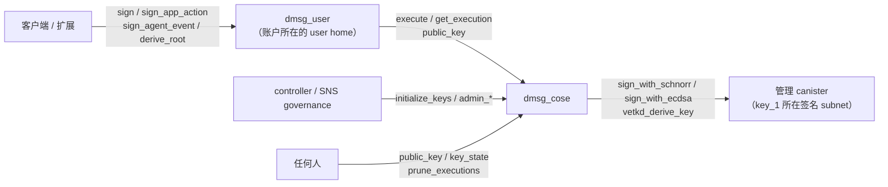

# dmsg_cose

dMsg 的受限阈值签名与 vetKD 服务。它只执行 user home 已经授权的操作：正式签名输出可独立验证的 RFC 9052 COSE_Sign1，托管的 Agent Delegation 事件得到 Ed25519 签名，内容根以 vetKD 派生并加密给客户端的传输公钥。它不提供任意 signHash、任意派生路径、namespace 权限或 TSA 接口。

完整接口见 [dmsg_cose.did](dmsg_cose.did)，公开类型见 [dmsg_types::cose](../dmsg_types/src/cose.rs)，签名结构与校验见 [dmsg_protocol](../dmsg_protocol/README_zh.md)。

## 架构设计

### 组件关系



| 组件          | 职责                                                                                                                         |
| ------------- | ---------------------------------------------------------------------------------------------------------------------------- |
| `dmsg_user`   | 校验设备批准、敏感政策、商业预留和执行序号，提交 `ExecutionGrant` 后调用 COSE，记录结果并对账；见 [dmsg_user](../dmsg_user/README.md) |
| `dmsg_cose`   | 固定的密钥派生域、执行前独立校验、按请求去重、单账户与全局预算、短期结果                                                     |
| 管理 canister | 用 `key_1` 阈值签名或派生 vetKey；费用由 COSE 的 cycles 余额支付                                                             |

### 接口与调用者

| 类别 | 方法                                                                  | 调用者                                    |
| ---- | --------------------------------------------------------------------- | ----------------------------------------- |
| 执行 | `execute(grant)`                                                      | 账户所属的 user home                      |
| 结果 | `get_execution(account_id, request_id)`                               | 账户所属的 user home（query）             |
| 公钥 | `public_key(account_id, selector)`                                    | 任何人（query），离线派生，不证明账户存在 |
| 状态 | `key_state`、`cose_stats`                                             | 任何人（query）                           |
| 维护 | `prune_executions(after)`                                             | 任何人                                    |
| 管理 | `initialize_keys`、`admin_add_user_home`、`admin_set_daily_budget`    | controller 或 `governance`                |
| 预演 | 与每个管理方法同参数的 `validate_*`                                   | 任何人（query），供 SNS 通用提案验证      |

`validate_*` 按当前状态执行与对应方法相同的检查，通过时返回给投票者看的说明，与当前状态相同时末尾标注 “no change”；失败时返回方法将给出的错误。

`canister_inspect_message` 在执行前拒绝两类 ingress：调用者不是已登记 user home 的 `execute`，以及调用者不是 controller 或 governance 的 `initialize_keys`、`admin_*`。被拒的消息不进入区块，也不执行方法，减少公开 update 被滥用时消耗的 cycles。它只在单个副本上运行，不是安全边界：跨 canister 调用不经过这一步，所有调用仍由方法本身检查并返回 `Forbidden`。`cose_stats` 返回账户数与上限、保留结果数、在途与 Unknown 执行数、当日全局预算用量、stable 页数和 cycles 余额，供运维监控。

### 信任边界

COSE 不验证设备签名，设备批准、账户状态、敏感政策和商业资格由 user home 负责。COSE 的安全性因此等于“已登记 user home 的正确性 + COSE 自己的独立检查”。`execute` 在调用管理 canister 前独立核对：

- caller 在 `user_homes` 中，账户 ID 第 4–9 字节是该 home 的分配器指纹（`account_allocator_digest(environment, issuer_namespace, home)` 的前 5 字节），且 caller 等于 `grant.home_user`、`grant.home_cose` 是本 canister。
- `request_id` 由账户、`security_epoch`、`device_id`、`device_sequence` 推出；`approved_at ≤ now`，授权期限不超过 5 分钟。
- 签名：`to_be_signed` 是规范的 COSE `Sig_structure`（不超过 65,536 字节），算法、用途与 key 一致，issuer 等于账户的固定 issuer，kid 与 RFC 9679 指纹等于本 canister 派生的公钥；origin 符合环境。
- Agent 事件：key 用途是 `AgentController`，事件的 actor 是该 key、principal 与授权一致；签名返回后再验签。
- 根派生：传输公钥是合法的 BLS12-381 G1 点。
- 正式签名必须带形状正确、有效期覆盖授权期限的商业预留；根派生不能带预留。
- 预留成本不超过 `grant.max_cycles`。

### 密钥派生

签名 key 的派生路径固定为：

```text
["dmsg/formal/v2", canonical(environment), account_id, canonical(purpose), generation(u64 BE)]
```

vetKD 使用 `context = canonical(("dmsg/content-root/v2", environment, derivation_version))`、`input = canonical((account_id, generation))`。ICP 的阈值密钥本身还按调用者 canister ID 派生，所以一个账户的全部公钥由以下各项共同决定：**COSE canister ID**、master key（`key_1`）、`environment`、`derivation_version`、账户 ID、用途和代次。user home 不参与派生，同一 COSE 新增 home 不改变已有公钥。

由此得到三条部署约束：

- 账户的签名身份和内容根永久绑定它的 COSE。账户不能迁到另一个 COSE，换 COSE 就是换密钥。
- COSE 的 canister ID 不能丢。删除 canister 会使它派生的全部内容根无法再取得；因 cycles 耗尽被卸载时，只要 ID 仍在，在同一 ID 上重装即可恢复派生，但去重状态和结果会丢失。
- `environment` 参与派生。Staging 与 Production 的密钥互不相同，测试账户不能转为生产账户。

`initialize_keys` 依次取得各 master 公钥（签名算法为空路径的 canister 根公钥，vetKD 为上述 context 的公钥），要求其 SHA-256 等于配置的 `expected_fingerprint`，再缓存签名前缀 `["dmsg/formal/v2", environment]` 的派生结果。之后的 `public_key` 和执行准备只在 heap 中派生账户、用途、代次三级后缀，不再调用管理 canister；管理签名调用仍发送完整路径。升级时从已核对的根公钥重建前缀缓存。

### 执行流程

`execute(grant)` 在一个同步消息段内完成校验和提交，只在管理调用处等待：

1. 认证 caller 与 grant 绑定，读取账户状态（首次执行时新建，受账户上限约束）。
2. 同一 `request_id` 已存在：摘要（`dmsg/cose-execution/v3`，覆盖完整 grant）相同则返回原结果，否则返回 `IdempotencyConflict`。重试不会再次签名。
3. 新请求：序号必须大于连续关闭高水位 `closed_sequence`，与它的差不超过 64；保留记录少于 64 条，正式签名少于 56 条。
4. 已过期的请求直接记为 `Failed(Expired)`，不解析载荷；其余请求做上面的独立检查，失败记为 `Failed`。两者都关闭序号、不占预算。
5. 按成本上界预留单账户与全局预算，把结果写为 `Executing`，在内存中登记为在途，再发起管理调用（unbounded wait）。
6. 回调重新读取账户状态，写入 `Completed`、`Failed` 或 `Unknown`，把预算结算为实际扣费，推进 `closed_sequence`。并发执行互不覆盖。

| 情况                                       | 返回                 | 序号         | 预算                               |
| ------------------------------------------ | -------------------- | ------------ | ---------------------------------- |
| 同参数重放                                 | 原结果               | —            | —                                  |
| 未就绪、caller 不符                        | `Err`                | 不消耗       | 不占                               |
| 序号已关闭                                 | `Err(ResultExpired)` | —            | —                                  |
| 超出窗口、保留条数或预算                   | `Err(QuotaExceeded)` | 不消耗       | 不占                               |
| 已过期，或执行前检查失败                   | `Failed`             | 关闭         | 不占                               |
| 管理调用未发出（如 cycles 不足）           | `Failed`，扣费 0     | 关闭         | 退回次数与 cycles                  |
| 管理调用被明确拒绝（如签名队列满）         | `Failed`，按退款扣费 | 关闭         | 退回次数，cycles 结算为扣费（通常 0） |
| 管理调用返回（含响应无法封装的 `Failed`）  | `Completed` 或 `Failed` | 关闭      | 保留次数，cycles 结算为扣费        |
| 管理调用结果未知，或升级丢失了回调         | `Unknown`            | 不阻塞高水位 | 保留完整预留，结果永久保留         |

返回 `Err` 时 user home 保留原授权，可用原请求重试或 `reconcile_execution`；COSE 记录的 `Failed` 是终态，重签需要新的设备批准。结果带两个成本字段：`cycles_cost_upper_bound` 等于管理请求费减去退回的附带 cycles，再加 `cost_call` 的完整预留（含最大响应与回调成本），是成本上界；`cycles_charged` 是返回的管理调用实际消耗的附带 cycles（请求费减退款），只在 `Completed` 与 `Failed` 上非零，不含 COSE 自身的消息费用。两侧预算都结算到 `cycles_charged`。

签名调用是 unbounded wait，停止 canister 会等待它们返回。若未停止就升级，在途调用的回调随旧模块丢失。新模块的内存在途集合为空，于是不在其中的 `InFlight` 记录被识别为丢失：`get_execution` 立即按 `Unknown(ExecutionUnknown)` 返回，该账户下一次 `execute` 或清理页把它写为 `Unknown`、推进高水位并计入 `cose_stats.unknown`。它不重签，也不退回预算。

### 预算

| 范围       | 上限                                                                                | 调整                                    |
| ---------- | ----------------------------------------------------------------------------------- | --------------------------------------- |
| 单账户     | 每 UTC 日 125 次、1.1T cycles；正式签名（文档签名与 Agent 事件）最多 100 次、880B    | 代码常量，与 user 侧上限共用 `dmsg_runtime` 常量并由单测核对 |
| 全局       | `daily_executions` 次、`daily_cycles` cycles；正式签名为上限减去向上取整的 20%       | `admin_set_daily_budget`，保留当天已用量 |

在途期间按完整成本上界预留，防止并发执行超支；调用返回后把预留结算为 `cycles_charged`，未执行的调用同时退回次数（见上表）。结算只改预留所在的那个 UTC 日，跨日返回的调用不影响新一天的计数。结果未知时保留完整预留。

PocketIC 中一次 Ed25519 签名或 vetKD 派生的上界约 68.26B cycles，实际扣费 26,153,846,153 cycles。按结算后的扣费计算，单账户每天最多约 32 次正式签名（880B，最后一次仍需容纳 68.26B 的预留），全局 `daily_cycles` 也按实际扣费累计。单账户上限按 user 可授权的正式签名（100 次、800B）与根派生（20 次、300B）设置；user 侧按批准的 `max_cycles` 预留，同样在结果返回后结算到 `cycles_charged`，见 [dmsg_user](../dmsg_user/README.md)。

### 存储

| memory | 内容                                                                                                   |
| -----: | ------------------------------------------------------------------------------------------------------ |
|      0 | 页 `[0,127)`：配置 StableCell（`CoseInit`、初始化状态、master 公钥）；页 127：全局预算与 Unknown 计数  |
|      1 | `account_id → Home`：`closed_sequence`、单账户预算、最多 64 条执行元数据（request_id、grant 摘要、期限、状态、是否正式签名） |
|      2 | `account_id ‖ sequence(BE) → ExecutionResult`，保存已编码的 CBOR，只有读取目标结果时才解码              |

稳定布局为 schema 9，私有的 [stable_codec.rs](src/stable_codec.rs) 使用 CBOR 整数 map key，不影响公开 Candid 与签名摘要。heap 只保存签名前缀缓存和在途调用集合。没有 `pre_upgrade`；`post_upgrade` 校验 schema、重新校验配置与公钥指纹、重建前缀缓存，不遍历账户或结果，把中断的 `Initializing` 恢复为 `Uninitialized`。升级不读取参数，不修改配置，不能换根。

schema 9 是生产候选布局。首个生产实例部署后，布局变化必须能在 `post_upgrade` 中读取上一版数据：新字段使用新的整数 key 并带默认值（如结果的 `cycles_charged` 为 key 4，全局单元的 Unknown 计数为 key 3，旧数据照常解码），已有 key 不改义、不复用；做不到时提升 schema 并在同一版本写好迁移。生产实例不得重装，否则会丢失去重高水位、预算和结果。

### 结果清理

结果在 `Terminal`、序号不超过 `closed_sequence`、且当前时间超过 `expires_at + 1 天` 后可以删除。账户记录本身、高水位和预算永久保留，已清理的序号再次提交返回 `ResultExpired`。`InFlight` 阻止高水位越过，`Unknown` 不阻止但自身永久保留。

清理有两条路径：同账户下一次执行时惰性清理；任何人调用 `prune_executions(after)`，每页检查 64 个账户、最多删除 4,096 条结果，把返回的 `next_after` 传给下一次调用，直到返回 `None`。游标跨升级有效。最坏的一页（64 个账户各 64 条结果）在 PocketIC 中约 0.62B cycles，远低于单条消息的指令上限；100 万账户一轮约 1.6 万页。清理页同时把升级遗留的在途记录写为 `Unknown`。删除让空间可复用，不承诺 stable memory 缩小。

### 多 user home

`dmsg_user` 按实例分片，多个 home 可以共用一个 COSE。`user_homes` 只能追加，最多 64 个，分配器指纹不能重复，重复添加同一 home 不报错。新 home 须以本 canister 为 `home_cose`，并使用相同的 `environment` 和 `issuer_namespace`。COSE 不逐账户记录 home：账户所属 home 由账户 ID 决定，账户也不能迁到其他 home。

共用一个 COSE 的 home 共享账户上限、全局预算和 cycles 余额，彼此没有配额隔离。`validate_admin_add_user_home` 的说明列出当前账户数与上限，`cose_stats` 也报告这两个值。

### 容量与扩展

| 项目                 | 上限                                         | 位置                                   |
| -------------------- | -------------------------------------------- | -------------------------------------- |
| 账户                 | 1,000,000，所有 home 合计，账户记录不删除    | [store.rs](src/store.rs) `MAX_HOMES`   |
| user home            | 64                                           | `dmsg_protocol::agent::MAX_USER_HOMES` |
| 每账户保留执行       | 64，其中正式签名 56                          | `dmsg_runtime`                          |
| 签名输入             | 65,536 字节                                  | `dmsg_protocol::MAX_PAYLOAD`           |
| 授权期限             | 5 分钟                                       | [model.rs](src/model.rs)               |

**存储不是瓶颈。** 2026-10-07 在宿主机（release、Rust 1.98.1）按顺序账户 ID 写入同一 StableBTreeMap 实测：100 万个账户记录占 memory 1 约 208 MB（每账户约 208 字节，含 0 或 1 条执行元数据相同，64 条元数据的编码小于 6 KiB）；100 万条根派生结果占 memory 2 约 624 MB。签名结果另含最多 64 KiB 的载荷。按此估算，1,000 万账户的账户表约 2 GB，远低于 500 GiB 的 stable memory 上限。

**吞吐受 ICP 全网的阈值签名能力约束。** `key_1` 位于 fiduciary 签名 subnet，由所有 ICP 应用共享。按 2026-02-25 生效的 140289 号提案，预期上限约为 Ed25519 6.5 次/秒、ECDSA 3.5 次/秒、vetKD 18 次/秒，即全网每天约 56 万次 Ed25519 签名、155 万次 vetKD 派生；队列自 2026-03-16 起按预签名动态扩到最多 100 个请求（[来源](https://forum.dfinity.org/t/chain-key-signing-performance-improvements/64672)）。队列满时请求被明确拒绝，COSE 记为 `Failed` 并退回预算，用户须重新批准。增加 COSE 实例不能提高这个上限。COSE 自身每次执行的消息费用为数千万 cycles（见“实测”），也不是瓶颈；一次签名的总成本约 26.19B cycles，其中阈值费用 26.15B（PocketIC 实测，主网须核对）。

由此：

- **单实例是百万级**：代码上限 100 万个执行过的账户。启用内容根就要执行一次 vetKD 派生，活跃账户基本都会占用一条记录，所以这就是单实例可服务的账户数。
- **多实例水平扩展**：每个 user home 在初始化时固定一个 `home_cose`，扩容即新增 `(dmsg_user, dmsg_cose)` 分片。推荐一一对应；多个 home 共用一个 COSE 时，各 home 的 `max_accounts` 之和不得超过 1,000,000，否则后加入的账户连根派生都无法完成，又不能改到其他 COSE。千万级用户需要至少 10 组分片，亿级需要 100 组以上。
- **活跃度的上限在网络侧**：无论多少实例，dMsg 能用到的正式签名和 vetKD 派生量都受上述全网吞吐约束。正式签名必须保持低频，大规模注册（每个账户一次 vetKD 派生）也要按网络容量排期。

## 部署流程

### 初始化参数

| `CoseInit` 字段                     | 要求                                                                                                                                                       |
| ----------------------------------- | ---------------------------------------------------------------------------------------------------------------------------------------------------------- |
| `environment`                       | 与各 user home 相同，生产为 `Production`。参与密钥派生，初始化后不可修改                                                                                   |
| `issuer_namespace`                  | 与各 user home 相同，以 `/` 或 `:` 结尾，不含 query 或 fragment。初始化后不可修改                                                                          |
| `executing_canister`                | 本 canister 的 ID                                                                                                                                          |
| `user_homes`                        | 至少一个 `dmsg_user` canister ID；之后只能用 `admin_add_user_home` 追加                                                                                    |
| `derivation_version`                | `2`                                                                                                                                                        |
| `masters`                           | 1–3 个不同算法。生产 `key_name` 必须是 `key_1`，`expected_fingerprint` 非零；非生产可用 `key_1`、`test_key_1`、`dfx_test_key` 和全零 pin。初始化后不可增删 |
| `daily_executions` / `daily_cycles` | 大于 0，之后用 `admin_set_daily_budget` 调整                                                                                                               |
| `governance`                        | SNS governance，生产为 `dwv6s-6aaaa-aaaaq-aacta-cai`（[sns_canister_ids.json](../../sns_canister_ids.json)）；本地可填部署者 principal。初始化后不可修改     |

`masters` 不能后加，生产应一次配置全部会用到的算法：`VetKdBls12381`（内容根，必需）和 `Ed25519`（文档签名与 Agent 事件，必需）；客户端还支持 ES256K，需要时一并配置 `EcdsaSecp256k1`，未配置的算法返回 `UnsupportedProtocol`。

### 生产 pin

`expected_fingerprint` 是本 canister 实际取得的 master 公钥字节的 SHA-256，依赖 canister ID，须在创建 canister 之后、安装之前离线计算。`dmsg_protocol` 的 `cose-pins` feature 提供 `cose_pins::master_key_pins`，并附带打印 `masters` 字段的工具：

```sh
cargo run -p dmsg_protocol --features cose-pins --example cose_pins -- <COSE canister ID> Production
```

第三个参数选 `mainnet`（默认）或 `pocketic`（本地 dfx 与 PocketIC），第四个参数是 key 名，默认 `key_1`。工具对三种算法都输出一条记录，只保留实际配置的算法。它从 DFINITY 密钥库内置的 master 公钥离线派生，与管理 canister 的结果一致：

| 算法             | 公钥字节                                                                                                                              |
| ---------------- | ------------------------------------------------------------------------------------------------------------------------------------- |
| `Ed25519`        | `ic_ed25519::PublicKey::derive_mainnet_key(MasterPublicKeyId::Key1, &cose_id, &[])` 的 32 字节原始公钥                               |
| `EcdsaSecp256k1` | `ic_secp256k1::PublicKey::derive_mainnet_key(MasterPublicKeyId::EcdsaKey1, &cose_id, &[])` 的 33 字节压缩 SEC1 公钥                 |
| `VetKdBls12381`  | `ic_vetkeys::MasterPublicKey::for_mainnet_key(key_1)` 依次 `derive_canister_key(cose_id)`、`derive_sub_key(context)` 后的 96 字节，`context` 见“密钥派生” |

PocketIC 回归 `cose_offline_pins_match_initialized_production_keys` 用 `pocketic` 来源计算的 pin 以 `Production` 安装 COSE，核对 `initialize_keys` 成功且 `fingerprints` 一致，篡改任一 pin 则返回 `IntegrityFailed`。主网 pin 使用同一派生代码和库内置的主网 master 公钥。

### 步骤

以下命令在仓库根目录执行，以 `--network ic` 为例；本地开发去掉该参数，`environment` 改为 `Local`，pin 填全零。

1. 在待部署的提交上完成验证：

   ```sh
   POCKET_IC_BIN=/path/to/pocket-ic make test-dmsg
   ```

2. 与 user home 一起创建 canister ID（两者互相引用），见 [dmsg_user](../dmsg_user/README.md) 的部署步骤。COSE 建议与它的 user home 在同一 subnet。用上节的工具按 COSE 的 canister ID 计算 pin。

3. 用打 tag 后 [release.yml](../../.github/workflows/release.yml) 发布的 `dmsg_cose.wasm.gz` 安装（未压缩的 Wasm 约 2.5 MB，超过单条 ingress 2 MiB 的上限；gzip 后约 0.75 MB）。release 与本地构建都使用 [rust-toolchain.toml](../../rust-toolchain.toml) 固定的 Rust 1.98.1，投票者可以复现同一模块哈希：

   ```sh
   sha256sum dmsg_cose.wasm.gz
   dfx canister install dmsg_cose --network ic --wasm dmsg_cose.wasm.gz --argument "(record {
     environment = variant { Production };
     issuer_namespace = \"<与 dmsg_user 相同>\";
     executing_canister = principal \"$(dfx canister id dmsg_cose --network ic)\";
     user_homes = vec { principal \"$(dfx canister id dmsg_user --network ic)\" };
     derivation_version = 2 : nat16;
     masters = vec {
       record { algorithm = variant { Ed25519 }; key_name = \"key_1\"; expected_fingerprint = blob \"<pin>\" };
       record { algorithm = variant { VetKdBls12381 }; key_name = \"key_1\"; expected_fingerprint = blob \"<pin>\" };
     };
     daily_executions = <次数> : nat32;
     daily_cycles = <cycles> : nat;
     governance = principal \"dwv6s-6aaaa-aaaaq-aacta-cai\";
   })"
   dfx canister info dmsg_cose --network ic
   ```

   记录模块哈希、controllers 和本次安装参数。

4. 初始化公钥，确认 `Ready` 且 `fingerprints` 与 pin 一致。未就绪时 `execute` 和 `public_key` 返回 `Unavailable`，不会降级到测试 key：

   ```sh
   dfx canister call dmsg_cose initialize_keys --network ic
   dfx canister call dmsg_cose key_state --network ic
   ```

5. 以 `home_cose = <COSE ID>` 安装 user home。

6. 设置 cycles 与冻结阈值。COSE 用自己的余额支付全部阈值费用，余额应覆盖若干天的 `daily_cycles`，冻结阈值建议不少于 90 天：

   ```sh
   dfx canister update-settings dmsg_cose --network ic --freezing-threshold 7776000
   ```

   `daily_cycles` 按预期执行量乘以单次实际扣费（约 26.15B）设置，再留出在途预留：同时在途的执行各按约 68.3B 的上界占用额度，见“预算”。

7. 主网验收：按 [dmsg_user](../dmsg_user/README.md) 的部署步骤用测试账户完成一次根派生和一次文档签名；用离线派生核对 `public_key` 的结果；用 `dmsg_protocol` 或 SDK 独立验证 COSE_Sign1；记录实际余额差与 `cycles_cost_upper_bound`。

8. 安排每天一轮清理。仓库提供匿名调用的脚本，按 `next_after` 翻页到结束；中途失败时按提示用 `--after` 续跑，重复执行无害：

   ```sh
   pnpm --dir src/dmsg_app install --frozen-lockfile
   node src/dmsg_app/scripts/cose-prune.mjs --canister <COSE canister ID>
   ```

### 交给 SNS

1. 把 SNS root（`d7wvo-iiaaa-aaaaq-aacsq-cai`）加为 controller，提交 `RegisterDappCanisters` 提案登记 COSE，通过后核对 SNS root 是唯一 controller。流程与模板同 [dmsg_handle](../dmsg_handle/README.md#交给-sns)。
2. 提交 `AddGenericNervousSystemFunction` 提案登记通用函数，目标与验证方法都在 COSE 上：

   | 目标方法                 | 验证方法                          | 主题                                 |
   | ------------------------ | --------------------------------- | ------------------------------------ |
   | `admin_add_user_home`    | `validate_admin_add_user_home`    | `CriticalDappOperations`（关键主题） |
   | `admin_set_daily_budget` | `validate_admin_set_daily_budget` | `ApplicationBusinessLogic`           |
   | `initialize_keys`        | `validate_initialize_keys`        | `CriticalDappOperations`，交接前未初始化时 |

3. 升级用 `UpgradeSnsControlledCanister` 提案，`canister_upgrade_arg` 留空；SNS 先停止 canister 再升级。

### 运维与升级

- **升级前必须停止 canister。** 签名与派生是 unbounded wait 调用，停止会等待在途调用全部返回。不停止直接升级时，在途调用的回调随旧代码丢失，该请求永久停在 `Executing`，`closed_sequence` 不再前进，后续结果也不再被清理。2026-10-07 的 PocketIC 实测中，这样的账户推进 3 天后仍只能执行到序号 64，之后永久返回 `QuotaExceeded`，目前没有恢复入口。升级要求 schema 不变：

  ```sh
  dfx canister metadata dmsg_cose candid:service --network ic > deployed.did
  didc check dmsg_cose.did deployed.did
  dfx canister stop dmsg_cose --network ic
  dfx canister install dmsg_cose --network ic --mode upgrade --wasm dmsg_cose.wasm.gz --argument-type raw --argument 4449444c0000 --yes
  dfx canister start dmsg_cose --network ic
  ```

  漏掉停止时，丢失回调的执行按“执行流程”所述记为 `Unknown`，账户窗口照常前进，但这些请求的结果无法确定，`cose_stats.unknown` 会增加。

  Candid 服务声明了 `CoseInit`，dfx 升级时要求参数；`post_upgrade` 不读取参数，传空 Candid 参数 `()` 即可。schema 不一致时 `post_upgrade` 失败、升级回滚；改为重装会保留密钥（canister ID 不变），但清空去重高水位、预算和结果。

- **新增 user home**：先以相同的 `environment`、`issuer_namespace` 和本 COSE 安装新 `dmsg_user`，再调用 `admin_add_user_home(home)`；`validate_admin_add_user_home` 显示它的分配器指纹。登记前，该 home 的执行返回 `Forbidden`。核对共用本 COSE 的各 home 的 `max_accounts` 之和不超过 1,000,000。
- **预算**：`admin_set_daily_budget(executions, cycles)` 只改上限，保留当天已用量。
- **cycles**：余额不足时管理调用未发出，执行记为 `Failed`、扣费 0 并退回预算，但序号已关闭，用户须重新批准。监控余额并及时充值。
- **监控**：定期读取 `cose_stats`，关注 cycles 余额、`cycles_today` 与 `daily_cycles` 的比例、`accounts` 与 `max_accounts` 的比例、`unknown` 的增长和清理后仍然偏高的 `results`。
- **不能删除 canister**，原因见“密钥派生”。

## 当前限制

以下事项完成前，不应作为生产实例接收真实用户：

- 未在主网用生产 `key_1` 完成初始化、签名、vetKD 派生和独立验签的验收，主网费用与签名队列满时的行为未核对；没有外部安全审计。
- 结果未知的执行永久保留并各占一个窗口位置，没有人工处置入口。

其余限制：账户不能迁到其他 user home 或 COSE；没有 TSA 客户端和 `anchor_snapshot` 入口，非保护头 270 只透传不透明的 CTT token。

## 实现

| 文件                  | 内容                                                                     |
| --------------------- | ------------------------------------------------------------------------ |
| `src/api.rs`          | Candid 入口、初始化与升级、执行准备、管理调用与结果封装、治理与 `validate_*` |
| `src/model.rs`        | 执行窗口、重放判断、单账户与全局预算、结果保留规则、派生路径              |
| `src/store.rs`        | 稳定表与内存布局、配置与全局单元、前缀缓存、在途集合、账户上限、分页清理、运行指标 |
| `src/stable_codec.rs` | 配置、全局单元和账户状态的紧凑 CBOR 表示                                 |

密码实现：`cose2` 负责 RFC 9052 待签结构与封装，`ic_cose_chain_key` 负责管理调用、公钥派生和成本计算。Ed25519 签 `Sig_structure` 原字节，ES256K 签其 SHA-256 摘要；签名 kid 是 RFC 9679 SHA-256 指纹。

## 实测

2026-10-07，PocketIC 16.0.0、Rust 1.98.1、release 配置（LTO、`opt-level=s`），以本次修改的 Wasm 运行 `cose_cycles_profile`、`cose_query_and_cleanup_cycles_profile`、`cose_cleanup_page_profile` 和 `cose_settles_budgets_to_the_charged_fee`。数字是 COSE 的实际余额差，包含管理调用费用，不包含 user canister；它们不代表主网吞吐或并发峰值。

| 操作                                              |          cycles |
| ------------------------------------------------- | --------------: |
| 新签名，4 KiB 正文，无历史                        |  26,189,782,691 |
| 其中 `cycles_charged`（签名与 vetKD 派生相同）    |  26,153,846,153 |
| 新签名的 `cycles_cost_upper_bound`                |  68,260,698,153 |
| 同请求重试（历史 0–8 条）                         |  19.96M–20.21M  |
| 过期请求（历史 0–8 条）                           |  19.98M–20.51M  |
| Ed25519 / ES256K 公钥（复制查询）                 |  12.03M / 13.55M |
| ContentRoot 公钥（复制查询）                      |  7.75M          |
| 清理 0 / 4 / 8 条签名结果                         |  6.79M / 7.40M / 8.10M |
| 清理一页 64 个账户、共 4,096 条结果               |  621,491,764    |

新实例稳定内存分配为 25,231,360 字节（三个 8 MiB 分配桶加 1 页 memory manager 头）。本次 release Wasm（未 shrink）为 2,498,874 字节，`gzip -n` 后 749,877 字节。逐次优化的对比数据见 Git 历史。

## 验证

```sh
cargo test -p dmsg_cose
cargo test -p dmsg_protocol --features cose-pins cose_pins
node --test src/dmsg_app/scripts/cose-prune.test.mjs
POCKET_IC_BIN=/path/to/pocket-ic bash scripts/test-dmsg.sh
```

COSE 的 PocketIC 回归覆盖并发回调与 pending 重放、home 认证与 ingress 拒绝、未发出调用、返回的未知结果跨升级、不停机升级丢失的回调、按实际扣费结算与 `cose_stats`、离线 pin 与生产初始化、保留期与空闲清理、小预算下的根派生、预算调整与升级恢复；名称中含 `cose_` 的 user 与治理回归一并运行：

```sh
cargo test --locked -p dmsg_integration --features pocketic-tests --test control_plane cose_ -- --test-threads=1
```

成本与清理样本须显式运行，`DMSG_WASM_DIR` 指向待测 Wasm 目录：

```sh
DMSG_WASM_DIR=/path/to/wasm cargo test --locked -p dmsg_integration --features pocketic-tests --test control_plane cose_cycles_profile -- --ignored --nocapture
DMSG_WASM_DIR=/path/to/wasm cargo test --locked -p dmsg_integration --features pocketic-tests --test control_plane cose_query_and_cleanup_cycles_profile -- --ignored --nocapture
DMSG_WASM_DIR=/path/to/wasm cargo test --locked -p dmsg_integration --features pocketic-tests --test control_plane cose_cleanup_page_profile -- --ignored --nocapture
```

选择依据参考 ICP 官方的 [Stable structures](https://docs.internetcomputer.org/languages/rust/stable-structures/)、[重试与幂等](https://docs.internetcomputer.org/guides/canister-calls/idempotency/)、[资源上限](https://docs.internetcomputer.org/references/resource-limits/)和[性能优化](https://docs.internetcomputer.org/guides/canister-management/optimization/)。
