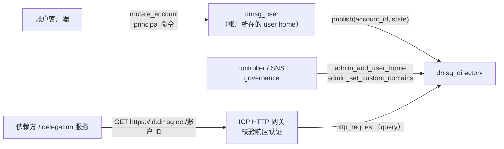

# dmsg_directory

dMsg 的 Agent Delegation principal 文档发布服务。启用 principal 的账户在 `principal_origin/<account_id>`（生产计划为 `https://id.dmsg.net/<account_id>`）有一份 principal 文档，本 canister 以 ICP 认证 HTTP 返回它。所有 user home 共用这一个 canister 和自定义域：一个 ICP 自定义域只能指向一个 canister，而协议要求最终 URL 等于文档 `id`，不能重定向到分片。

user home 是 controller 变更的权威；directory 只保存并发布 home 推送的状态，不参与授权判断。

完整接口见 [dmsg_directory.did](dmsg_directory.did)，公开类型见 [dmsg_types::agent](../dmsg_types/src/agent.rs)，文档渲染与配置校验见 [dmsg_protocol::agent](../dmsg_protocol/src/agent.rs)，公开合同见 [agent_zh.md](../../docs/protocol/agent_zh.md)。

## 架构设计

### 组件关系



| 组件 | 在发布流程中的职责 |
| --- | --- |
| `dmsg_directory` | 按账户保存已渲染的文档和发布版本，维护 HTTP 认证树，返回文档、404 和 `/.well-known/ic-domains` |
| `dmsg_user` | 可有多个分片（user home）。账户的 principal 变更（启用、登记、退役、泄露标记、改名）在所属 home 提交，提交后立即推送；失败时任何人可用 `publish_principal` 重试，`get_principal` 的 `published_version` 显示已发布到哪个版本 |
| delegation 服务 | 文档 `delegation_service` 指向的源。接收事件时现取文档，并用 home 认证快照中的 `principal_updated_at` 判断文档是否滞后 |
| ICP HTTP 网关 | 终止自定义域的 TLS，校验 canister 响应的认证后再交给客户端 |

### 接口与调用者

| 类别 | 方法 | 调用者 |
| --- | --- | --- |
| 发布 | `publish` | 账户所属的 user home，跨 canister 调用 |
| 查询 | `get_publication`、`directory_config`、`directory_stats` | 任何人 |
| HTTP | `http_request`（Candid 中隐藏） | HTTP 网关 |
| 管理 | `admin_add_user_home`、`admin_set_custom_domains` | controller 或 SNS governance |
| 预演 | `validate_admin_add_user_home`、`validate_admin_set_custom_domains` | 任何人，只读 query |

`canister_inspect_message` 只接受两类 ingress：已登记 home 的 `publish`，以及 controller 或 governance 的调用。home 发布和 SNS 执行提案都走跨 canister 调用，查询走 query，所以其他 ingress 在执行前被拒绝，本 canister 不为它们付费。它只在单个副本上运行，不是安全边界，每个方法仍各自检查调用者。

### 权威与信任边界

- **授权**：directory 只检查调用者是账户所属的 home、版本单调、状态自身合法（`validate_principal_state`）以及渲染结果通过 SDK 校验。相邻版本之间的约束（key、`valid_from` 和权限上限不变，退役记录不删除）由 home 保证，directory 不与旧状态比对。
- **治理**：controller 和 governance 只能追加 home、替换自定义域。它们不能修改或删除已发布的文档，也不能把已发布的账户交给另一个 home：记录中的 `home_user` 固定，新 home 的分配器指纹不能与已有 home 相同。能升级代码的 controller（交给 SNS 后是 SNS root）则掌握全部文档的发布权，应与其他 dMsg canister 同级管控。
- **HTTP 认证**：每个响应都带 v2 证书，网关验证失败就不返回内容，所以单个副本或节点无法伪造文档。验证在网关完成，最终客户端信任网关的结果。`<canister>.raw.icp0.io` 不做验证，不能用于解析 principal；经 `<canister>.icp0.io` 取到的文档，其 URL 不等于文档 `id`，依赖方应按协议拒绝。
- **发布滞后**：发布晚于 home 提交。新 controller 在发布前不被 delegation 服务接受；退役在 home 提交后即生效；服务发现认证快照的 `principal_updated_at` 大于文档的 `updated_at` 时视为滞后，不按旧文档接收事件，见 [agent_zh.md](../../docs/protocol/agent_zh.md#安全快照)。文档响应允许缓存 30 秒。

### 发布规则

`publish(account_id, state)` 在一条消息内完成，没有跨 canister 调用。依次检查：

1. **调用者**：账户已发布时必须是记录的 `home_user`；首次发布时必须在 `user_homes` 中，且账户 ID 第 4..9 字节等于该 home 的分配器指纹，即 `account_allocator_digest(environment, issuer_namespace, home)` 的前 5 字节。否则返回 `Forbidden`。
2. **旧版本**：`state.version` 小于已发布版本时直接返回当前 `Publication`，不校验传入的状态，乱序或重复的重试因此无害。
3. **同版本**：`digest("dmsg/principal-state/v1", state)` 必须等于记录中的摘要，相同时返回当前 `Publication`，不同时返回 `IdempotencyConflict`。
4. **新版本**：`updated_at` 必须大于已发布的值，否则返回 `IntegrityFailed`。然后渲染文档：状态或配置不合法返回 `InvalidInput`，超出数量或字节上限返回 `QuotaExceeded`。版本可以跳号，home 只需推送最新状态。
5. **提交**：写入记录、更新认证树并设置新的根哈希，返回 `Publication`。

任何一步失败都不改变已发布的文档。`Publication` 包含 `principal_id`、`home_user`、`version`、`updated_at` 和正文的 SHA-256 `document_digest`。

### 文档渲染

[`render_principal_document`](../dmsg_protocol/src/agent.rs) 生成 JCS JSON：`id` 为 `principal_origin/<account_id>`；`type` 为小写类型名；当前与已退役的 controller 分列在 `controllers` 和 `retired_controllers`，`source` 为 `controller_source`；`delegation_service` 为配置的服务源；另有一条指向 `profile_url_prefix + account_id` 的 `rel: "profile"` 链接。输出先经 `agent-protocols` SDK 的 `validate_principal_document` 校验。

- directory 保存渲染后的确切字节，查询时不再渲染。渲染逻辑或 SDK 版本的变化只影响之后的发布，已有文档保持原样，直到 home 推送新版本。
- directory 不保存 `PrincipalState`，不能自行重新渲染，所以写进文档的配置字段在安装后不可修改（见“初始化参数”）。
- 上限：当前 controller 不超过 8 个，含退役在内的记录不超过 32 条，文档不超过 64 KiB。home 与 directory 共用一个保守的字节预算，计入配置 URL 的最大长度、最大名称以及每个 controller 将来的退役和泄露字段。超预算的登记在 home 提交前被拒绝，之后的退役和泄露标记总能发布。字节预算可能在 32 条之前先用完。

### HTTP 与认证

| 路径 | 状态与正文 | `content-type` | `cache-control` |
| --- | --- | --- | --- |
| `/<account_id>`（规范 Xid 文本） | 200，文档 | `application/json` | `public, max-age=30` |
| `/.well-known/ic-domains` | 200，每行一个域名 | `text/plain` | `public, max-age=300` |
| 其他路径，包括未发布的账户 | 404，`{"error":{"code":"not_found",…}}` | `application/json` | `no-store` |

所有响应另带 `access-control-allow-origin: *`、`x-content-type-options: nosniff` 和 `ic-certificateexpression`。不做内容协商，也不重定向。

- **认证方式**：HTTP 认证 v2，response-only，认证全部响应头；请求方法和 query 不参与认证。
- **路由**：与认证库的路径规则一致：先做百分号解码，忽略连续斜线产生的空段，尾斜线是不同的路径，忽略 query。`//<id>`、百分号编码等等价写法返回同一个认证响应；非规范的账户文本、`/<id>/` 和 `/<id>/x` 返回 404。principal 解析仍只认文档 `id` 那个规范 URL。
- **认证树**：`http_expr` 下每个表达式路径的第一段是 [`dmsg_runtime::cert_map`](../dmsg_runtime/src/cert_map.rs) 中的一个 key，值为该段子树的哈希：每个账户一个 key（账户 ID 文本），`.well-known` 对应域名列表，`<*>` 对应兜底 404。树只存哈希，位于 stable memory，一次写入只重算一条路径。文档的子树哈希由记录中保存的正文 SHA-256 计算，查询时不重新哈希正文。
- **证明**：200 响应的证明只披露该账户的段；404 证明还披露请求路径的第一段和各级更具体通配路径的第一段，以满足网关“精确路径和更具体的通配路径都不存在”的检查。
- **响应格式固定**：查询时用当前代码重新构造响应，并与已认证的哈希核对，不一致就 trap。升级只重新认证 404 和域名列表，不访问文档；修改文档响应的头部或认证表达式时，必须同时重新认证所有文档（目前没有实现），否则所有文档请求都会失败。单元测试 `document_response_certification_is_pinned` 固定了文档响应的认证哈希，这类改动（包括升级 `ic-http-certification`）会先让它失败。

### 存储

| memory | 内容 |
| --- | --- |
| 0 | `StableCell`：`schema = 6` 与 `DirectoryInit`，包括追加的 home 和当前域名 |
| 1 | `StableBTreeMap`：账户 ID（12 字节）→ `{home_user, version, updated_at, state_digest, document_digest, document}`，紧凑 CBOR |
| 2 | 认证树的叶：第一段 → 子树哈希 |
| 3 | 认证树的内部节点，201 字节定长槽位 |

`post_upgrade` 要求 schema 等于 6，重新认证 404 和域名列表并设置根哈希。它不读参数、不改配置，也不访问文档。更早的开发期 schema 直接拒绝，没有迁移代码。

### 配置与治理

- 安装后不可修改：`environment`、`issuer_namespace`、`principal_origin`、`controller_source`、`delegation_service`、`profile_url_prefix` 和 `governance`。
- `admin_add_user_home(home)`：只能追加，最多 64 个，分配器指纹互不相同；已列出的 home 返回 `Ok`，不做改动。directory 读不到新 home 的配置，提交前用新 home 的 `user_config` 核对它的 `environment`、`issuer_namespace`、`principal_origin` 和 `directory_canister`。
- `admin_set_custom_domains(domains)`：整体替换，最多 8 个小写 DNS 名称，立即重新认证；与当前列表相同时不做改动。列表必须包含 `principal_origin` 的主机名，否则返回 `InvalidInput`；安装时同样检查。
- 每个管理方法都有同参数的 `validate_*` query：按当前状态执行相同的检查，通过时返回给投票者看的说明（新 home 的分配器指纹，或当前与新的域名），失败时返回错误名。它们可以登记为 SNS 通用函数的验证方法。

### 容量与成本

- 每个账户占一条记录（文档正文加约百字节的固定字段）、一个认证叶和一个 201 字节的节点槽位。一次发布只改这条记录并重算一条路径；升级成本不随账户数增长；key 分布均匀时证明约嵌套 log₂(n)+2 层。
- home 通过跨 canister 调用发布，消息的字节费由 home 承担，directory 支付执行和存储。HTTP 网关以非复制 query 调用 `http_request`。
- ingress 由 `canister_inspect_message` 预过滤，其他人发送的 ingress 不产生接收费。
- `directory_stats` 返回已发布账户数、stable 页数和 cycles 余额。

2026-10-09 在 agent-protocols 0.11.3（文档以 `delegation_service` 代替查询 URL，controller 不再列 `supersedes`）的 release Wasm 上，用 PocketIC 16.0.0 运行 `directory_cost_and_rebuild_profile`。PocketIC 的 update 调用按 ingress 计费，下表数字包含 ingress 接收费（profile 以 controller 和已登记 home 的身份调用，能通过 ingress 过滤）：

| 测量（cycles） | 283 字节文档，0 个 controller | 28,407 字节文档，16 个 controller |
| --- | ---: | ---: |
| `get_publication` 以 update 调用 | 7,088,215 | 7,218,402 |
| `http_request` 以 update 调用 | 8,058,231 | 9,749,997 |
| 旧版本 `publish`（以 home 身份发送 ingress） | 7,859,411 | 60,613,634 |

28 KiB 旧版本 `publish` 的成本主要是按字节计的 ingress 接收费；生产中 home 以跨 canister 调用发布，这部分不由 directory 承担。130 条记录时升级消耗 3,126,997,395 cycles，升级后 Wasm 线性内存从 2,228,224 降到 1,441,792 字节。这些是本地小样本，不代表网关吞吐或最大容量。

## 部署流程

### 依赖关系

每个 `dmsg_user` 的 `UserInit.directory_canister` 指向本 canister，本 canister 的 `user_homes` 又要列出这些 home，所以先创建全部 canister ID（见 [dmsg_user](../dmsg_user/README.md#部署流程)），再分别安装。安装时没有跨 canister 调用，安装顺序不限；双方都配置好之前发布返回 `Forbidden`，home 会在下一次变更或 `publish_principal` 重试时补发。

### 初始化参数

| `DirectoryInit` 字段 | 要求 |
| --- | --- |
| `environment` | 生产为 `Production`，与所有 `dmsg_user` 相同。它参与分配器指纹，不一致时没有账户能发布 |
| `issuer_namespace` | 与所有 `dmsg_user` 的同名字段相同 |
| `user_homes` | 至少一个 `dmsg_user` canister ID；之后只能追加，最多 64 个，分配器指纹互不相同 |
| `principal_origin` | principal ID 的 HTTPS origin，不含路径，最多 512 字节；计划值 `https://id.dmsg.net`。须等于每个 home 的 `UserInit.principal_origin` 和客户端的 `principalOrigin`；它的主机名须列入 `custom_domains`，并按下文指向本 canister |
| `controller_source` | controller 的 `source` origin，最多 512 字节；计划值 `https://dmsg.net` |
| `delegation_service` | 权威 delegation 服务的 HTTPS origin，不含路径，最多 512 字节；计划值 `https://agents.dmsg.net`。须与该服务对外的 origin 逐字一致，客户端经该 origin 的发现文档定位查询与读取端点 |
| `profile_url_prefix` | profile 链接前缀：HTTPS，以 `/` 结尾，最多 2 KiB；计划值 `https://dmsg.net/u/` |
| `custom_domains` | `/.well-known/ic-domains` 列出的域名，必须包含 `principal_origin` 的主机名，生产为 `["id.dmsg.net"]`；之后用 `admin_set_custom_domains` 替换 |
| `governance` | 生产为 SNS governance `dwv6s-6aaaa-aaaaq-aacta-cai`（[sns_canister_ids.json](../../sns_canister_ids.json) 的 `governance_canister_id`）；本地可填部署者 principal |

URL 字段不能含原始控制字符、双引号和反斜线，需要时用百分号编码。参数不合法时安装失败。

`principal_origin` 写进每个 principal ID，另外三个 URL 字段写进每份文档。它们安装后无法修改，也不能靠换一个 directory 补救：home 的 `directory_canister` 同样不可修改，home 也不会重发已标记为已发布的版本。安装前须与 delegation 服务、客户端配置和网站路由逐项核对。

### 步骤

以下命令在仓库根目录执行，以 `--network ic` 为例；本地开发去掉该参数，`environment` 改为 `Local`。

1. 在待部署的提交上完成验证，工作区应没有未提交的改动：

   ```sh
   POCKET_IC_BIN=/path/to/pocket-ic make test-dmsg
   ```

2. 与 user home 一起创建 canister ID。dfx 把 ID 写入 [canister_ids.json](../../canister_ids.json)，随部署记录提交：

   ```sh
   dfx canister create dmsg_directory --network ic
   ```

3. 使用打 tag 后 [release.yml](../../.github/workflows/release.yml) 发布的 `dmsg_directory.wasm.gz` 安装，不用本地 `dfx deploy` 构建：交给 SNS 后，投票者要按 release 产物核验模块哈希（同 [dmsg_handle](../dmsg_handle/README.md#步骤)）。

   ```sh
   sha256sum dmsg_directory.wasm.gz
   dfx canister install dmsg_directory --network ic --wasm dmsg_directory.wasm.gz --argument "(record {
     environment = variant { Production };
     issuer_namespace = \"<与 dmsg_user 相同的 issuer_namespace>\";
     user_homes = vec { principal \"$(dfx canister id dmsg_user --network ic)\" };
     principal_origin = \"https://id.dmsg.net\";
     controller_source = \"https://dmsg.net\";
     delegation_service = \"https://agents.dmsg.net\";
     profile_url_prefix = \"https://dmsg.net/u/\";
     custom_domains = vec { \"id.dmsg.net\" };
     governance = principal \"dwv6s-6aaaa-aaaaq-aacta-cai\";
   })"
   dfx canister info dmsg_directory --network ic
   ```

   `sha256sum` 须与同一 release 的 `dmsg_directory.wasm.gz.<sha256>.txt` 一致，`dfx canister info` 显示的模块哈希也是这个值。记录模块哈希、controllers 和安装参数。

4. 设置备用 controller 和不少于 90 天的 freezing threshold：

   ```sh
   dfx canister update-settings dmsg_directory --network ic \
     --add-controller <备用 controller> \
     --freezing-threshold 7776000
   ```

5. 通过 canister 的默认域名核对。`icp0.io` 网关会验证认证，`raw.icp0.io` 不会：

   ```sh
   ID=$(dfx canister id dmsg_directory --network ic)
   dfx canister call --network ic dmsg_directory directory_config --query
   dfx canister call --network ic dmsg_directory directory_stats --query
   curl -sS "https://$ID.icp0.io/.well-known/ic-domains"
   curl -sSI "https://$ID.icp0.io/not-found"
   ```

   `directory_config` 应与安装参数一致，`directory_stats` 的 `publications` 为 0，域名列表为 `id.dmsg.net`，最后一条返回 404 和 `cache-control: no-store`。

6. 登记自定义域，见下节。

7. 用每个 `dmsg_user` 的 `user_config` 确认 `directory_canister` 是本 canister，`environment`、`issuer_namespace` 和 `principal_origin` 与本 canister 相同（见 [dmsg_user](../dmsg_user/README.md#初始化参数)）；客户端 `dmsg.config.json` 已填写 `principalOrigin` 和 `agentOrigin`。

   ```sh
   dfx canister call --network ic dmsg_user user_config --query
   ```

8. 主网验收：用测试账户在客户端启用 principal 并登记一个 controller，确认 home 的 `get_principal` 中 `published_version` 等于 `state.version`。然后核对 directory：

   ```sh
   ACCOUNT=<账户 ID 文本>
   BLOB=$(python3 -c 'import base64,sys; print("".join("\\%02x" % b for b in base64.b32hexdecode(sys.argv[1].upper() + "====")))' "$ACCOUNT")
   dfx canister call --network ic dmsg_directory get_publication "(blob \"$BLOB\")" --query
   curl -sS "https://id.dmsg.net/$ACCOUNT" | tee principal.json | sha256sum
   ```

   账户 ID 文本是 12 字节的小写 base32hex（无填充），第二行把它转成 Candid blob。`document_digest` 应等于正文的 SHA-256，`version` 和 `updated_at` 与 home 一致，文档 `id` 等于请求的 URL。再用这个 controller 签发一个 grant，确认 delegation 服务接受、经 `delegation_service` 能查到；退役该 controller 后确认文档随之更新。

9. 交给 SNS，见“交给 SNS”。

### 自定义域

`principal_origin` 的主机名（生产为 `id.dmsg.net`）必须由 ICP HTTP 网关以本 canister 提供。以下按 [ICP 自定义域文档](https://docs.internetcomputer.org/building-apps/frontends/custom-domains/using-custom-domains)（2026-10-08 查阅），执行前再核对一次：

1. 确认 `custom_domains` 已包含该域名（步骤 5 的 `ic-domains` 输出）。
2. 添加 DNS 记录：

   | 类型 | 主机 | 值 |
   | --- | --- | --- |
   | CNAME | `id.dmsg.net` | `id.dmsg.net.icp1.io` |
   | TXT | `_canister-id.id.dmsg.net` | directory 的 canister ID |
   | CNAME | `_acme-challenge.id.dmsg.net` | `_acme-challenge.id.dmsg.net.icp2.io` |

   这些记录必须直接解析，不经过 CDN 或反向代理：代理会让第三方终止 TLS 并进入信任链，也会干扰网关签发证书（Cloudflare 还需关闭 Universal SSL，见上述文档）。父域有 CAA 记录时，确认它不阻止网关签发证书。

3. 预检、登记，再查询状态直到登记完成：

   ```sh
   curl -sL -X GET "https://icp.net/custom-domains/v1/id.dmsg.net/validate"
   curl -sL -X POST "https://icp.net/custom-domains/v1/id.dmsg.net"
   curl -sL -X GET "https://icp.net/custom-domains/v1/id.dmsg.net"
   ```

4. 核对：`curl -sSI https://id.dmsg.net/.well-known/ic-domains` 返回 200 且 TLS 证书有效，`curl -sSI https://id.dmsg.net/not-found` 返回 404。

需要增加其他域名时，先用 `admin_set_custom_domains` 加入新域名，再登记。`principal_origin` 永久不变，它的主机名不能从列表或 DNS 中移除，否则所有 principal 都无法解析。

### 交给 SNS

主网验收完成后，按 [dmsg_handle](../dmsg_handle/README.md#交给-sns) 的流程交给 SNS：

1. 把 SNS root（`d7wvo-iiaaa-aaaaq-aacsq-cai`，[sns_canister_ids.json](../../sns_canister_ids.json) 的 `root_canister_id`）加为 controller，再提交 `RegisterDappCanisters` 提案登记 directory，模板见 [proposal-467.sh](../../proposals/proposal-467.sh)。通过后用 `dfx canister info` 确认 SNS root 是唯一的 controller，团队 controller 若仍在，用 `dfx canister update-settings dmsg_directory --network ic --remove-controller <principal>` 移除。
2. 提交 `AddGenericNervousSystemFunction` 提案登记通用函数，目标和验证方法都在 directory 上。需要填写 `topic`，quill 不支持，用 `dfx canister call` 调用 governance 的 `manage_neuron`，模板见 [proposal-452.sh](../../proposals/proposal-452.sh)。两个方法分别决定谁能发布和文档在哪里可解析，建议都用关键主题：

   | 目标方法 | 验证方法 | 主题 |
   | --- | --- | --- |
   | `admin_add_user_home` | `validate_admin_add_user_home` | `CriticalDappOperations` |
   | `admin_set_custom_domains` | `validate_admin_set_custom_domains` | `CriticalDappOperations` |

3. 之后用 `ExecuteGenericNervousSystemFunction` 提案执行，载荷是目标方法的 Candid 参数，可用 `didc encode -d src/dmsg_directory/dmsg_directory.did -m <method> '<参数>'` 生成。SNS 只判断调用是否得到回复，不解析返回的 `Result`，执行后用 `directory_config` 确认结果。
4. 升级改用 `UpgradeSnsControlledCanister` 提案，Wasm 用 release 产物，`canister_upgrade_arg` 留空（`post_upgrade` 不读参数）。

### 运维与升级

- **新增 user home**：先以相同的 `environment`、`issuer_namespace`、`principal_origin` 和指向本 canister 的 `directory_canister` 安装新 home，用 `dfx canister call --network ic <home> user_config --query` 核对，再由 controller 或 governance 调用 `admin_add_user_home(home)`；`validate_admin_add_user_home` 显示新 home 的分配器指纹。handle、cose、payment 和 commerce 也要登记，见 [dmsg_canisters](../../docs/dmsg_canisters_zh.md)。登记前，该 home 的账户发布返回 `Forbidden`，登记后用 `publish_principal` 补发。已有 home 不能移除。
- **cycles**：发布的执行和文档存储由本 canister 付费。用 `directory_stats` 监控已发布账户数、stable 页数和余额，交给 SNS 后也可以看 SNS root 的汇总。
- **升级**：要求 schema 不变。用 release 产物升级；交给 SNS 之前，每次升级前留一个快照：

  ```sh
  dfx canister metadata dmsg_directory candid:service --network ic > deployed.did
  didc check dmsg_directory.did deployed.did
  dfx canister stop dmsg_directory --network ic
  dfx canister snapshot create dmsg_directory --network ic
  dfx canister install dmsg_directory --network ic --mode upgrade --wasm dmsg_directory.wasm.gz --argument-type raw --argument 4449444c0000 --yes
  dfx canister start dmsg_directory --network ic
  ```

  `dmsg_directory.did` 取自同一 release，`didc check` 确认新接口兼容已部署的接口，之后用 `--yes` 跳过 dfx 自带的检查（原因见 [dmsg_handle](../dmsg_handle/README.md#运维与升级)）。Candid 服务声明了 `DirectoryInit` 初始化参数，dfx 升级时须带参数；`post_upgrade` 不读参数，传空 Candid 参数 `()`（hex `4449444c0000`），重新提供 `DirectoryInit` 也不会改变配置。directory 没有跨 canister 调用，停止会立即完成。升级后重复步骤 5，并查询一份已发布的文档；出现问题时，停止 canister 后用 `dfx canister snapshot load` 回到升级前的状态。

- **不要重装**：`reinstall` 会清空全部文档。directory 不保存 `PrincipalState`，home 也不会重发已标记为已发布的版本，文档无法恢复。修改文档响应头、认证表达式或稳定布局的版本，须先实现全部文档的重新认证或迁移。

## 当前限制

- 不支持账户迁移 home（`handoff`），也没有外部 key 预留（`reserve_external_key`）。
- 不能撤回发布：账户启用 principal 后文档一直公开；可以退役全部 controller，但不能删除文档。
- 文档响应的格式固定在已认证的哈希中，没有重新认证全部文档的流程。
- `admin_add_user_home` 不读取新 home 的配置，须由提案人和投票者用 `user_config` 核对。
- 最大容量没有在大规模数据上实测；主网部署、自定义域登记和 SNS 提案流程尚未执行。

## 实现

| 文件 | 内容 |
| --- | --- |
| `src/api.rs` | Candid 入口：初始化与升级、发布规则、查询、管理方法与 `validate_*` 预演 |
| `src/http.rs` | HTTP 路由、响应构造、认证树与证明 |
| `src/store.rs` | 稳定内存布局、配置与记录读写；写入记录时同步认证 |
| `src/stable_codec.rs` | 配置与记录的紧凑 CBOR 表示 |

文档渲染、配置校验和 home 路由在 [dmsg_protocol::agent](../dmsg_protocol/src/agent.rs)，认证树在 [dmsg_runtime::cert_map](../dmsg_runtime/src/cert_map.rs)，管理权限与预演格式在 [dmsg_runtime::admin](../dmsg_runtime/src/admin.rs)。

## 验证

```sh
cargo test --locked -p dmsg_directory -p dmsg_protocol -p dmsg_runtime --lib
cargo build --locked --release --target wasm32-unknown-unknown -p dmsg_directory
POCKET_IC_BIN=/path/to/pocket-ic cargo test --locked -p dmsg_integration --features pocketic-tests --test directory
POCKET_IC_BIN=/path/to/pocket-ic cargo test --locked -p dmsg_integration --features pocketic-tests \
  --test directory directory_cost_and_rebuild_profile -- --ignored --exact --nocapture
```

`DMSG_WASM_DIR` 可以指向另一份构建，用同样的输入比较 profile。

- 单元测试：路由与认证库的路径规则一致；404 证明表明请求路径和更具体的通配路径都不存在；用保存的正文摘要计算的认证与直接哈希正文相同；文档响应的认证哈希固定不变；配置与记录的稳定编码往返。`dmsg_protocol::agent` 覆盖渲染、状态不变量、配置校验和 home 路由，`dmsg_runtime::cert_map` 覆盖存在与不存在证明以及树形。
- [directory.rs](../../tests/dmsg_integration/tests/directory.rs)（PocketIC，只安装 directory）：调用者校验、幂等与版本规则、失败不改变已发布的文档、字节上限与安全变更、等价路径与 404、篡改正文被 `ic-response-verification` 拒绝、匿名者、未登记 home 与访客的 ingress 在执行前被拒绝、governance 追加 home 和替换域名及其预演（缺少 `principal_origin` 主机名的列表被拒绝）、升级后配置、文档与 `directory_stats` 一致。
- [control_plane/agent.rs](../../tests/dmsg_integration/tests/control_plane/agent.rs) 的 `self_held_principal_publishes_certified_documents_and_its_grants_are_accepted`：真实 user home 发布到 directory，认证响应通过验证，grant 被 SDK 接受。[user_homes.rs](../../tests/dmsg_integration/tests/control_plane/user_homes.rs) 用 `user_config` 核对新 home 后再在各服务登记。二者需要 `scripts/test-dmsg.sh` 构建的全部 Wasm。

2026-10-08 加入 ingress 过滤、域名检查、`directory_stats` 与 user `user_config` 后，完整的 `scripts/test-dmsg.sh` 在 PocketIC 16.0.0 上通过：Rust 单元与文档测试、Clippy `-D warnings`、Wasm 与 Candid 一致性、跨语言协议向量、PocketIC `control_plane` 113 项与 `directory` 4 项、SDK 26 项；profile 单独运行通过。此前（提交 `9d2bcd9`）部署命令在隔离的 dfx 0.32.0 本地副本上运行过：按 release.yml 加入 Candid 元数据、shrink 并 `gzip -n`（未运行 wasm-opt）后安装，模块哈希等于 gzip 产物的 SHA-256；`directory_config`；本地网关返回域名列表与 404；两个 `validate_*` 预演和管理方法；停止、快照、空参数升级和启动后配置与域名不变。`get_publication` 的验收命令、主网部署、自定义域登记和 SNS 提案没有运行。
