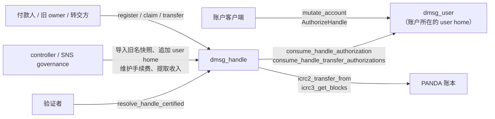

# dmsg_handle

dMsg 的名称注册表，是“规范化名称 → 稳定 `AccountId`”映射的唯一写入方。它负责新名称的 PANDA 收费注册、旧 `ic_message` 冻结名称的导入与免费认领、双方批准的转移，以及权属的认证查询。名称只是指向账户的可变入口：转移名称不会移动账户、内容、签名身份或外部应用权限，账户也不需要名称。

完整接口见 [dmsg_handle.did](dmsg_handle.did)，公开类型见 [dmsg_types::handle](../dmsg_types/src/handle.rs)，规范化与定价见 [dmsg_protocol::handle](../dmsg_protocol/src/handle.rs)。

## 架构设计

### 组件关系



| 组件                             | 在名称流程中的职责                                                                                                                 |
| -------------------------------- | ---------------------------------------------------------------------------------------------------------------------------------- |
| `dmsg_handle`                    | 名称表、旧名预留、注册收费操作与锁、权属事件、认证树                                                                               |
| `dmsg_user`                      | 可有多个分片（user home）。校验账户的认证 caller 与管理员设备，保存短期的精确名称意图；handle 只消费这些意图，不读取账户的其他状态 |
| PANDA 账本                       | ICRC-2 扣款；ICRC-3 区块用于对账                                                                                                   |
| `ic_message`、`ic_name_identity` | 冻结后提供带证书的名称与角色快照，只在迁移时使用                                                                                   |

handle 是全局唯一的名称注册表，所有 user home 共用。它不保存设备、密钥、资料或旧名称区块，注册也不创建旧 Profile 或 COSE namespace。

### 接口与调用者

| 类别 | 方法                                                                                                                                        | 调用者                       |
| ---- | ------------------------------------------------------------------------------------------------------------------------------------------- | ---------------------------- |
| 注册 | `register_handle`、`commit_handle`                                                                                                          | 付款人                       |
| 对账 | `reconcile_handle_charge`                                                                                                                   | 任何人，以账本区块为证据     |
| 认领 | `claim_legacy_handle`                                                                                                                       | 冻结 owner 或冻结管理员      |
| 转移 | `transfer_handle`                                                                                                                           | 任何人，需携带双方批准       |
| 查询 | `resolve_handle_certified`、`get_handle_event`、`get_handle_operation`、`get_legacy_reservation`、`snapshot_progress`、`get_handle_config`  | 任何人                       |
| 管理 | `begin_legacy_snapshot`、`import_legacy_handles`、`seal_legacy_snapshot`、`update_ledger_fee`、`admin_collect_token`、`admin_add_user_home` | controller 或 SNS governance |
| 预演 | 与每个管理方法同参数的 `validate_*`，如 `validate_import_legacy_handles`                                                                    | 任何人，只读 query           |

管理方法接受本 canister 的 controller 或初始化固定的 `governance`。`validate_*` 按当前状态执行与对应方法相同的校验，通过时返回给提案投票者看的说明文字，失败时返回错误名；它不修改状态，可用于 SNS 通用提案的验证方法，也可供 controller 提交前预演。

### 授权模型

账户发起的名称操作分两步授权：

1. 账户在 `dmsg_user` 调用 `mutate_account`，命令为 `AuthorizeHandle { intent }`。user 要求 caller 是该账户的认证绑定、账户处于 Active，并由具有 `RootManage` 能力的管理员设备签名整条命令；`intent.account_id` 必须是该账户，`intent.handle_canister` 必须是配置的 handle。批准最长有效 60 秒，每个账户最多同时保留 32 条。
2. handle 处理业务调用时，向账户所在的 user home 调用 `consume_handle_authorization`。转移双方在同一 home 时改用 `consume_handle_transfer_authorizations` 一次核对双方，在不同 home 时分别核对。user 只接受配置的 handle 作为调用者，要求同一 `op_id` 下存有完全相同且未过期的意图。这一步只读，不再检查设备撤销或账户状态；重复执行由 handle 按 `(account_id, op_id)` 去重。

账户所在的 home 由账户 ID 决定：user home 分配的每个 ID 在第 4–9 字节带有它的分配器指纹，即 `account_allocator_digest(environment, issuer_namespace, home)` 的前 5 字节（与 `dmsg_directory` 的路由相同）。handle 在 `user_homes` 中按指纹查找，找不到返回 `NotFound`。`user_homes` 只能追加：新增分片时由 controller 或 governance 调用 `admin_add_user_home`，各 home 的指纹必须互不相同，最多 64 个。cose、payment、directory 和 commerce 用同名方法登记同一 home，见 [dmsg_canisters](../../docs/dmsg_canisters_zh.md)。

`HandleIntent` 固定 handle canister、动作、账户、目标账户、预期版本、`op_id` 和 `terms_digest`，`terms_digest` 再固定各动作的具体条款：

| 动作                          | `terms_digest` 绑定的内容                                  | handle 对 caller 的要求                      |
| ----------------------------- | ---------------------------------------------------------- | -------------------------------------------- |
| `Register`                    | 账本、付款账户、金额、手续费（`charge_terms_digest`）      | 必须是 `payer.owner`                         |
| `ClaimLegacy`                 | 快照 ID、完整冻结记录、目标账户                            | 冻结 owner；名称由名称账户持有时为冻结管理员 |
| `Transfer` / `AcceptTransfer` | handle canister、名称、原 owner、接收方、预期版本、`op_id` | 不限                                         |

因此 handle 不检查 caller 与 `account_id` 的绑定：账户归属在批准时由 user 校验，handle 检查的是该动作需要的另一方。付款人可以不是账户的认证身份，客户端用单独连接的钱包付款；由他人代付时，也必须由账户批准一个写明该付款人的意图。

### 注册与收费

名称为 1–19 字节的 ASCII 字母、数字或下划线，不能以下划线开头，统一转为小写；上限比 `AccountId` 的 20 字符 Xid 文本少一个字节，名称不会与账户 ID 重合。价格只取决于字节长度：

| 长度  |         1 |       2 |    3–4 |    5–6 | 7–19 |
| ----- | --------: | ------: | -----: | -----: | ---: |
| PANDA | 1,000,000 | 200,000 | 50,000 | 20,000 |  100 |

与旧 `ic_message` 经 SNS 调整后的现行价格一致。

付款人共支付名称价格：其中 `price − ledger_fee` 转入 handle canister 的默认账户，`ledger_fee` 是账本手续费。付款人须预先给 handle canister 不低于价格的 ICRC-2 allowance。

`register_handle(Registration)` 在一次调用内完成授权、加锁和扣款：

1. 校验意图、caller 与付款人、手续费和 `terms_digest`，并检查名称不在活跃名称、旧名预留或扣款锁中，全局 `max_pending` 未满，该账户没有未决扣款。旧快照封存前返回 `LegacyWriteDisabled`。
2. 向账户所在的 user home 核对授权。
3. 回调后先查重放，再重读配置、锁和容量并重新校验，不复用等待前的快照。
4. 在发出扣款前，同一消息内持久化名称锁、账户锁、`Charging` 操作和未决计数。
5. 以固定的付款账户、金额、手续费、memo（`digest("dmsg/handle-memo/v1", (canister, op key))`）和 `created_at_time` 调用 `icrc2_transfer_from`，在回调中提交结果。

| 阶段                  | 含义与后续                                                                                      |
| --------------------- | ----------------------------------------------------------------------------------------------- |
| `Charging`            | 扣款已发出，或回调因升级丢失。锁保留，`commit_handle` 用原参数重试                              |
| `ChargeUnknown`       | 扣款结果未知。锁保留，`commit_handle` 用原参数重试，或用 `reconcile_handle_charge` 提交真实区块 |
| `Committed`           | 权属、事件、操作终态和锁释放在同一回调中提交                                                    |
| `Rejected { reason }` | 首次扣款被账本明确拒绝或确定未执行。立即释放锁，该 `op_id` 作废，重放返回同一终态               |

- 重试使用完全相同的账本参数，账本去重窗口内返回 `Duplicate` 即视为已付款。DFINITY ICRC 账本的窗口默认为 24 小时，从 `created_at_time` 起算；结果未知时应在窗口内用 `commit_handle` 重试。窗口过后重试只会被拒绝，操作保持 `ChargeUnknown`，只能用实际区块对账；若扣款从未执行，名称锁和账户锁不会释放。系统不会刷新时间戳，也不会因本地超时释放名称。
- 出现过未知结果后，后续拒绝不能证明之前没有扣款，操作保持 `ChargeUnknown`。
- `commit_handle` 只接受付款人。`reconcile_handle_charge` 任何人可调用，但只在区块的付款账户、收款账户、金额、memo、`created_at_time` 和 spender 全部匹配时提交。
- 内存中的调用 guard 使同一操作的扣款、重试与对账互斥，执行中返回 `Pending`。升级会清空 guard，遗留的 `Charging` 按结果未知处理。
- `get_handle_operation(account_id, op_id)` 返回操作的当前状态，客户端据此恢复原流程。

### 旧名认领

旧名称以 `LegacyReservation` 永久预留，不能被新注册。`claim_legacy_handle(intent, snapshot_id)` 要求快照已封存且 ID 一致、记录未隔离（否则返回 `Locked`），并按冻结记录检查 caller：

- 普通名称：caller 必须是冻结的 `legacy_owner`。
- 由名称账户持有的名称（`legacy_name_principal == legacy_owner`）：caller 必须是冻结管理员之一，名称账户本身不能认领。没有冻结管理员的这类名称由导入计划标为隔离。

认领不收费，提交版本 1，事件的 `from` 为空。由于还需要目标账户批准，旧 owner 只能把名称认领到同意接收的账户。

### 转移

`transfer_handle(from, accept)` 需要原 owner 的 `Transfer` 意图和接收方的 `AcceptTransfer` 意图：两者的名称、预期版本、`op_id` 和 `terms_digest` 相同，账户互为对方的目标。handle 先核对当前 owner 和版本，再到双方所在的 user home 核对授权（同一 home 时一次调用），回调后要求记录未变，然后提交版本 +1。

认领和转移按 `(account_id, op_id)` 保存请求摘要与原始权属回执：原请求重放返回原结果，即使名称后来又被转移；同一 ID 换了参数返回 `IdempotencyConflict`。

### 认证查询与事件

认证树只证明名称：叶是 `HandleRecord` 的规范 CBOR，包含当前 owner、版本和产生该权属的事件摘要 `event_tip`。名称按 `handle_bucket(name)`（`digest("dmsg/handle-bucket/v1", name)` 的前 20 位）分进 2^20 个桶，树分两层：

- 上层是按桶号位组成的二叉标签树：下面没有名称的节点是 `Empty`，否则是 `fork(labeled([0], 左), labeled([1], 右))`。
- 每个桶是其名称按字节序组成的平衡 `fork` 树，叶为 `labeled(name, leaf(record))`。

名称的证明路径因此是 20 个 `[0]`/`[1]` 标签（桶号从高位到低位）加名称字节。每个节点的哈希存放在 stable memory 的定长数组（64 MiB），写入时只重算所在桶和它上方的 20 个节点；升级不遍历名称，只重新发布根哈希。初始化时即发布空树的根，名称尚不存在时也能给出不存在证明。

`resolve_handle_certified` 每次查询 1–64 个名称，返回包含或不存在证明；同一批中落在同一桶的名称只读一次桶。验证者须核对信任根、canister ID、证书时间、witness，并按上述路径查找叶字节。旧名预留和快照进度不进入认证树。

每次权属变化追加一条 `HandleEvent`（`StableLog`，序号即追加时的日志长度），事件以 `previous` 串成全局摘要链，摘要为 `digest("dmsg/handle-event/v1", event)`，并记录所属快照 ID。`get_handle_event(sequence)` 是普通 query，`HandleRecord.event_tip` 可用来核对读到的事件。

`get_legacy_reservation`、`snapshot_progress`、`get_handle_operation`、`get_handle_config` 也是普通 query。认领会在链上重新核对完整冻结记录，伪造的预留查询结果只会让认领失败。

### 存储

稳定布局为 schema 9。相对 schema 8：配置用 `environment`、`issuer_namespace`、`user_homes` 取代单个 `home_user`；名称表的键加上桶号前缀；认证树从 heap 移到 memory 9；分配桶从 1 MiB 改为 8 MiB。`post_upgrade` 遇到其他 schema 直接失败，布局变化须编写显式迁移。`MemoryManager` 使用 128 页（8 MiB）分配桶，32,768 个桶可寻址 256 GiB。

| Memory | 内容                                                                                                 |
| -----: | ---------------------------------------------------------------------------------------------------- |
|      0 | 配置 `StableCell`：`HandleInit`（含 `governance` 和 `user_homes`）、快照进度、事件链 tip、未决扣款数 |
|      1 | `NAMES`：桶号（4 字节大端）+ 名称 → `HandleRecord`，同一桶的名称连续存放                             |
|      2 | `LEGACY`：名称 → `LegacyReservation`                                                                 |
|      3 | `OPS`：op key → 注册收费操作                                                                         |
|      4 | `LOCKS`：名称 → 持锁操作的 op key                                                                    |
|   5、8 | `EVENTS`：`StableLog` 的索引与数据                                                                   |
|      6 | `ACTIVE_ACCOUNTS`：有未决扣款的账户                                                                  |
|      7 | `OWNERSHIP`：op key → 认领或转移回执                                                                 |
|      9 | 认证树：2^21 个节点哈希的定长数组，`Empty` 节点存为全零                                              |

op key 为 `digest("dmsg/handle-operation/v1", (account_id, op_id))`。私有的 `stable_codec.rs` 用 CBOR 整数 map key 保存记录，不影响公开 Candid、摘要和认证叶编码。heap 只保存已解码的配置（每次变更同步写入 stable cell）和调用 guard。没有 `pre_upgrade`；`post_upgrade` 只校验 schema 并重新发布根哈希，成本与名称数无关。操作、回执和事件只增不删，以保持幂等语义。

### 容量与成本

- 活跃名称与未决扣款合计不超过 10,000,000（`MAX_ACTIVE_NAMES`）。新注册和认领在授权前后都检查，为已发出的扣款保留提交位置；达到上限返回 `QuotaExceeded`，转移、重放、重试和对账不受影响。
- 全局未决扣款不超过 `max_pending`（1–10,000），每个账户同时最多一笔。
- 旧名快照不超过 1,000,000 条，每批导入 1–256 条，每条最多 16 个冻结管理员。

升级不遍历名称：节点哈希留在 stable memory，`post_upgrade` 只重新发布根哈希。名称数影响的是 stable 存储、名称表 B 树的深度和证明大小。以下为 2026-10-06 在 schema 9、Rust 1.98.1、PocketIC 16.0.0、release 配置下的 `handle_active_name_capacity_profile` 实测，名称均为 20 字节（当时的上限，现为 19 字节，测试已改用 19 字节名称）；每个样本另有 1 条未认领旧名，未模拟同规模的收费操作、事件或回执历史：

| 活跃名称数 | 升级指令数 |   升级 cycles | 一次转移 cycles | heap 字节 |   stable 字节 | 64 名称响应字节 |
| ---------: | ---------: | ------------: | --------------: | --------: | ------------: | --------------: |
|      1,000 |  1,151,712 | 4,041,721,588 |      17,229,870 | 1,441,792 |   117,506,048 |          72,604 |
|    100,000 |  1,151,745 | 4,041,721,767 |      17,738,292 | 1,441,792 |   125,894,656 |          72,718 |
|  1,000,000 |  1,153,461 | 4,041,723,551 |      17,999,669 | 1,441,792 |   276,889,600 |          74,618 |
| 10,000,000 |  1,160,622 | 4,041,730,783 |      19,516,817 | 1,441,792 | 1,812,004,864 |          80,622 |

指令数取自 `post_upgrade` 的 `performance_counter(0)` 差值；升级 cycles 主要是安装 Wasm 的费用。stable 的起点约 112 MiB：认证树 64 MiB 的定长数组，加上各虚拟内存至少占用的一个 8 MiB 分配桶；名称表每个名称约 170 字节。生产环境另有每次注册约 300 字节的收费操作，以及每次权属变化约 150 字节的事件和回执，按每个名称 0.6–0.7 KB 估算，1,000 万名称约 6–7 GB，远低于 256 GiB 的地址空间。一次转移重算一个桶和 20 个路径节点，名称从 1,000 增加到 1,000 万只多约 13% cycles。响应字节包含证书和成功 Result 封装；单次 64 名称查询的 host 耗时 11–25 ms，含 PocketIC 开销，不代表主网延迟或吞吐。1,000 万名称样本还验证了满容量时注册、认领的本地拒绝和双方授权转移。上限取已实测规模，提高前须重新测量存储和写入成本。

2026-10-02 `handle_cycles_profile` 用同一 host 程序及 user、ledger Wasm，对比 schema 6 与 schema 7 的 handle（256 条旧名，逐步注册到 17 个活跃名称）：

| 项目                            |            schema 6 |            schema 7 |
| ------------------------------- | ------------------: | ------------------: |
| 首次注册 cycles                 |          22,700,188 |          22,689,030 |
| 已有 8 次注册后的新注册 cycles  |          22,803,734 |          22,761,180 |
| 已有 16 次注册后的新注册 cycles |          22,919,303 |          22,859,037 |
| 同一请求重放 cycles             | 8,358,503–8,429,106 | 8,355,829–8,428,322 |
| 17 个活跃名称的升级 cycles      |       3,308,105,352 |       3,371,517,203 |
| Wasm 字节                       |           1,611,468 |           1,642,673 |

注册 cycles 下降 0.05%–0.26%，重放基本持平；新增的恢复保护、回执和容量检查使 Wasm 增加 31,205 字节，小规模升级费用增加约 1.9%。cycles 只统计 handle，升级费用包含 Wasm 安装成本，不能代替 hook 指令数。`handle_scale_profile` 另以公开接口完成 `1,000 旧名 + 17 活跃`、`10,000 旧名 + 17 活跃`、`1,000 旧名 + 1,017 活跃` 三组写入、转移和重复升级；最后一组注册约 24.5M cycles、转移约 16.3M cycles。2026-09-25 的 schema 6 规模样本见 Git 历史。

## 部署流程

### 初始化参数

| `HandleInit` 字段  | 要求                                                                                                                                                                                                                             |
| ------------------ | -------------------------------------------------------------------------------------------------------------------------------------------------------------------------------------------------------------------------------- |
| `environment`      | 与各 `dmsg_user` 的 `UserInit.environment` 相同，生产为 `Production`。初始化后不可修改                                                                                                                                           |
| `issuer_namespace` | 与各 `dmsg_user` 的 `UserInit.issuer_namespace` 相同。初始化后不可修改                                                                                                                                                           |
| `user_homes`       | 至少一个 `dmsg_user` canister ID；之后只能用 `admin_add_user_home` 追加，最多 64 个，分配器指纹不能相同                                                                                                                          |
| `ledger`           | PANDA 账本，须为支持 ICRC-2 与 ICRC-3 `icrc3_get_blocks` 的 DFINITY ICRC 账本；生产为 `druyg-tyaaa-aaaaq-aactq-cai`（[sns_canister_ids.json](../../sns_canister_ids.json) 的 `ledger_canister_id`）。初始化后不可修改            |
| `ledger_fee`       | 账本当前的 `icrc1_fee`（2026-10-06 主网 PANDA 账本为 10,000），必须小于 100 PANDA；之后用 `update_ledger_fee` 维护                                                                                                               |
| `max_pending`      | 全局未决扣款上限，1–10,000                                                                                                                                                                                                       |
| `governance`       | 除 controller 外可以执行管理方法的 SNS governance canister；生产为 `dwv6s-6aaaa-aaaaq-aacta-cai`（[sns_canister_ids.json](../../sns_canister_ids.json) 的 `governance_canister_id`），本地可填部署者 principal。初始化后不可修改 |

`user_homes`、`ledger` 和 `governance` 不能是匿名或管理 canister principal，`issuer_namespace` 须通过与 `dmsg_user` 相同的格式校验，参数不合法时安装失败。每个 `dmsg_user` 的 `UserInit.handle_canister` 都必须指向本 canister。两者互相引用，所以先创建 canister ID，再分别安装。

### 步骤

以下命令在仓库根目录执行，以 `--network ic` 为例；本地开发去掉该参数。

1. 在待部署的提交上完成验证。脚本会构建 release Wasm，并核对 Candid、协议向量和 PocketIC 回归；工作区应没有未提交的改动：

   ```sh
   POCKET_IC_BIN=/path/to/pocket-ic make test-dmsg
   ```

2. 创建 `dmsg_user`、`dmsg_handle`，以及 `UserInit` 引用的其他 canister ID：

   ```sh
   dfx canister create dmsg_user --network ic
   dfx canister create dmsg_handle --network ic
   ```

3. 以 `handle_canister = $(dfx canister id dmsg_handle --network ic)` 安装 `dmsg_user`，其他字段见 [dmsg_user](../dmsg_user/README.md)。

4. 生产安装使用打 tag 后 [release.yml](../../.github/workflows/release.yml) 发布的 `dmsg_handle.wasm.gz`，不用本地 `dfx deploy` 构建：两者的优化工具不同，模块哈希不一致，而交给 SNS 后投票者要按 release 产物核验升级。核对产物、查询账本手续费，然后安装：

   ```sh
   sha256sum dmsg_handle.wasm.gz
   dfx canister call --network ic druyg-tyaaa-aaaaq-aactq-cai icrc1_fee --query
   dfx canister install dmsg_handle --network ic --wasm dmsg_handle.wasm.gz --argument "(record {
     environment = variant { Production };
     issuer_namespace = \"<与 dmsg_user 相同的 issuer_namespace>\";
     user_homes = vec { principal \"$(dfx canister id dmsg_user --network ic)\" };
     ledger = principal \"druyg-tyaaa-aaaaq-aactq-cai\";
     ledger_fee = <icrc1_fee> : nat;
     max_pending = 1000 : nat32;
     governance = principal \"dwv6s-6aaaa-aaaaq-aacta-cai\";
   })"
   dfx canister info dmsg_handle --network ic
   ```

   `sha256sum` 须与同一 release 的 `dmsg_handle.wasm.gz.<sha256>.txt` 一致；安装 gzip 产物后，`dfx canister info` 显示的模块哈希也是这个值。release 用 `gzip -n` 打包，同一 Wasm 重复打包得到相同哈希。记录模块哈希和 controllers。本地开发可继续用 `dfx deploy dmsg_handle --argument …`。

5. 由 controller 导入并封存旧名快照，步骤见下文“迁移流程”，在交给 SNS 之前完成。封存前注册返回 `LegacyWriteDisabled`、认领返回 `VersionConflict`。没有旧名的本地或测试部署也要封存一个空快照：

   ```sh
   ZERO=$(printf '\\00%.0s' $(seq 32))
   ID=$(printf '\\01%.0s' $(seq 32))
   dfx canister call dmsg_handle begin_legacy_snapshot "(record {
     source_canister = principal \"$(dfx identity get-principal)\";
     snapshot_id = blob \"$ID\";
     freeze_version = 0 : nat64;
     event_tip = blob \"$ZERO\";
     count = 0 : nat64;
     entries_digest = blob \"$ZERO\";
   })"
   dfx canister call dmsg_handle seal_legacy_snapshot
   ```

   空快照的 `entries_digest` 必须是 32 个零字节；`snapshot_id` 任意非零，`source_canister` 可以是任意非匿名、非管理 canister 的 principal。

6. 在 `src/dmsg_app/dmsg.config.json` 填写 `canisters.user` 与 `canisters.handle`，重新构建客户端，见 [dmsg_app](../dmsg_app/README.md)。

7. 部署后检查：`get_handle_config` 与安装参数一致；`snapshot_progress` 显示已封存且 `imported` 等于快照 `count`；`resolve_handle_certified` 的证书能通过客户端验证。

8. 封存后立即由官方账户注册容易被用来冒充的通用名称，例如 `admin`、`support`、`official`、`system`、`help`、`security`（2026-10-06 查询时旧系统均未注册）。走正常注册流程，费用进入 handle 账户，之后随收入一起提取。

9. 主网验收：用测试账户通过客户端注册一个 7 字节以上的名称，核对账本区块和 `get_handle_operation`，并在客户端验证 `resolve_handle_certified`；完成一次真实的旧名认领和一次测试账户之间的转移；controller 用小额 `admin_collect_token` 转到国库，见“运维与升级”。

### 交给 SNS

迁移封存和主网验收完成后再交给 SNS。旧名约 200 条，一批即可导入，在交接前由 controller 完成，可以免去必须依次执行的提案。

1. 把 SNS root（`d7wvo-iiaaa-aaaaq-aacsq-cai`，[sns_canister_ids.json](../../sns_canister_ids.json) 的 `root_canister_id`）加为 controller，再提交 `RegisterDappCanisters` 提案登记 handle，模板见 [proposal-467.sh](../../proposals/proposal-467.sh)。通过后用 `dfx canister info` 核对 controllers：SNS root 应是唯一的 controller；团队 controller 若仍在，用 `dfx canister update-settings dmsg_handle --network ic --remove-controller <principal>` 移除。
2. 提交 `AddGenericNervousSystemFunction` 提案登记通用函数，目标和验证方法都在 handle canister 上。登记时须填写 `topic`；quill 不支持该字段，用 `dfx canister call` 调用 governance 的 `manage_neuron` 提交，模板见 [proposal-452.sh](../../proposals/proposal-452.sh)。建议的主题：

   | 目标方法                | 验证方法                         | 主题                                                   |
   | ----------------------- | -------------------------------- | ------------------------------------------------------ |
   | `update_ledger_fee`     | `validate_update_ledger_fee`     | `ApplicationBusinessLogic`                             |
   | `admin_collect_token`   | `validate_admin_collect_token`   | `TreasuryAssetManagement`（关键主题）                  |
   | `admin_add_user_home`   | `validate_admin_add_user_home`   | `CriticalDappOperations`（关键主题）                   |
   | `begin_legacy_snapshot` | `validate_begin_legacy_snapshot` | `CriticalDappOperations`（关键主题，交接后仍需迁移时） |
   | `import_legacy_handles` | `validate_import_legacy_handles` | 同上                                                   |
   | `seal_legacy_snapshot`  | `validate_seal_legacy_snapshot`  | 同上                                                   |

3. 之后用 `ExecuteGenericNervousSystemFunction` 提案执行，载荷是目标方法的 Candid 参数，可用 `didc encode -d src/dmsg_handle/dmsg_handle.did -m <method> '<参数>'` 生成；迁移计划中的 `candid_hex` 可直接作为载荷。
4. 升级改用 `UpgradeSnsControlledCanister` 提案，Wasm 用 release 产物，`canister_upgrade_arg` 留空（`post_upgrade` 不读参数）；SNS 默认先停止 canister 再升级。

- 提交提案时 SNS 调用验证方法，按当前状态预演；有先后依赖的提案（导入批次、封存）要等前一个执行后再提交。导入批次带有快照位置，提前提交的后续批次在验证时即返回 `VersionConflict`。SNS 通用函数的载荷上限为 70,000 字节，导入批次提交前须确认 `candid_hex` 解码后不超过该大小。
- 执行时 SNS 只判断调用是否得到回复，不解析返回的 `Result`。执行后用 `snapshot_progress`、`get_handle_config` 或账本记录确认结果。

### 运维与升级

- 新增 `dmsg_user` 分片时，先以相同的 `environment`、`issuer_namespace` 和 `handle_canister` 安装新 home，再由 controller 或 governance 调用 `admin_add_user_home(home)`；`validate_admin_add_user_home` 可预演并显示新 home 的分配器指纹。加入前，该 home 的账户注册、认领或转移名称返回 `NotFound`。已有 home 不能移除，它分配的账户仍要靠它路由。
- 账本手续费变化时，由 controller 或 governance 调用 `update_ledger_fee(fee)`，新值仍须小于 100 PANDA。它只影响新订单：已有操作保留原金额、fee、memo 和账本时间，客户端按新配置重新准备报价。
- 注册收入留在 handle canister 的默认账户，由 controller 或 governance 调用 `admin_collect_token(to, amount)` 提取：转给 `to` 的金额为 `amount`，账本手续费另从 handle 账户扣除，成功时返回账本区块号。该转账不带 `created_at_time`，账本不会去重；返回 `ExecutionUnknown` 时先在账本核对，再决定是否重新提交。

  PANDA 应转入 SNS 国库：owner 为 governance，子账户为 `f6cc24dd368235dbdf2b3c792e399ac10f00a0003373de6d0960ae55ca873ebb`（由 governance principal 与 `token-distribution` 派生，与 luckypool 的 `admin_collect_tokens` 相同）。不要转到 governance 的默认账户（`subaccount = null`），转入那里的 PANDA 可能无法再转出。

  ```sh
  TREASURY='\f6\cc\24\dd\36\82\35\db\df\2b\3c\79\2e\39\9a\c1\0f\00\a0\00\33\73\de\6d\09\60\ae\55\ca\87\3e\bb'
  dfx canister call --network ic dmsg_handle admin_collect_token \
    "(record { owner = principal \"dwv6s-6aaaa-aaaaq-aacta-cai\"; subaccount = opt blob \"$TREASURY\" }, <amount> : nat)"
  ```

- 交给 SNS 前，由 controller 升级。升级要求 schema 不变。先停止 canister，让在途的账本回调完成，再用 release 产物升级、启动并查看日志：

  ```sh
  dfx canister metadata dmsg_handle candid:service --network ic > deployed.did
  didc check dmsg_handle.did deployed.did
  dfx canister stop dmsg_handle --network ic
  dfx canister install dmsg_handle --network ic --mode upgrade --wasm dmsg_handle.wasm.gz --argument-type raw --argument 4449444c0000 --yes
  dfx canister start dmsg_handle --network ic
  dfx canister logs dmsg_handle --network ic
  ```

  `dmsg_handle.did` 取自同一 release，`didc check` 确认新接口兼容已部署的接口。dfx 自带的兼容检查依赖本地 `dfx build` 生成的文件，直接安装 release 产物时找不到这些文件，会停下来要求确认，所以先用 `didc check` 核对，再加 `--yes` 跳过这一步。Candid 服务声明了 `HandleInit` 初始化参数，dfx 升级时不带参数会报错；`post_upgrade` 不读取参数，传空 Candid 参数 `()`（hex `4449444c0000`）即可。不要在升级时重新提供 `HandleInit`，它不会修改配置。日志中的 `handle_upgrade names=… instructions=…` 记录本次重建的名称数和指令数。若升级打断了扣款，操作停在 `Charging` 或 `ChargeUnknown`，由付款人 `commit_handle` 或任何人 `reconcile_handle_charge` 恢复。

- 升级成本与名称数无关，实测约 4B cycles（主要是安装 Wasm），升级前确认余额。

## 迁移流程

旧名称来自两个冻结后的旧 canister（ID 见 [canister_ids.json](../../canister_ids.json)，以盘点结果为准）：

| 来源               | 快照范围      | 每行内容                                                                                            |
| ------------------ | ------------- | --------------------------------------------------------------------------------------------------- |
| `ic_message`       | `Names`       | `(名称, owner, 名称账户 principal)`；页上下文为旧名称区块的 `(next_block_height, next_block_phash)` |
| `ic_name_identity` | `Authorities` | `(名称, 名称账户 principal, [(principal, role)])`，在 seal 时固定                                   |

角色表中 `role = 1`（名称账户 owner）的 principal 成为 `frozen_admins`；`role = 0` 的普通成员和 `role = -1` 的停用者不能认领。冻结与快照的服务端合同见 [legacy_freeze_zh.md](../../docs/protocol/legacy_freeze_zh.md)。

### 步骤

1. **盘点**：用 [legacy-inventory.mjs](../dmsg_app/scripts/legacy-inventory.mjs) 确认两个来源的 canister ID、模块哈希、controllers 和名称数量，见 [旧部署只读盘点](../../docs/legacy_inventory_zh.md)。

2. **冻结来源**：用 [legacy-freeze-plan.mjs](../dmsg_app/scripts/legacy-freeze-plan.mjs) 生成分阶段、绑定模块哈希的 controller 调用。按顺序：`admin_legacy_acknowledge_baseline` 确认基线 → `admin_legacy_drain(cutover_id)` 停止新写 → 用 `admin_legacy_pending`、`admin_legacy_resolve` 收敛在途写入 → `admin_legacy_seal(cutover_id)` 进入 ReadOnly。名称注册与转移随之停止，`ic_name_identity` 在 seal 时固定角色表。两个来源使用同一个 cutover ID。

3. **采集快照证明**：用非匿名身份分页调用两个来源的 `legacy_snapshot`（update，每页最多 64 条），保留每页 ingress 的 `request_status` 证书。[@dmsg/legacy](../dmsg_legacy/src/snapshot.ts) 的 `collectSnapshot(agent, canister, scope, [canister])` 负责分页、验证证书和滚动摘要。把两组 proofs 写成 `{ "names": [...], "authorities": [...] }`，其中 `args`、`nonce`、`requestId`、`certificate`、`reply` 编码为小写 hex。仓库没有独立的采集命令，完整的采集和编码示例见 [legacy-probe.ts](../dmsg_app/e2e/legacy-probe.ts)。

4. **生成导入计划**（离线执行，不联网、不签名）：

   ```sh
   node src/dmsg_app/scripts/legacy-name-plan.mjs \
     --input name-proofs.json \
     --root-key-hex <IC 根公钥 DER 的 hex> \
     --source <ic_message ID> \
     --identity <ic_name_identity ID> \
     --count <盘点得到的名称数> \
     --cutover-hex <cutover ID 的 hex> \
     --output name-plan.json
   ```

   [legacy-name-plan.mjs](../dmsg_app/scripts/legacy-name-plan.mjs) 逐页核对证书、调用者、范围、游标、ReadOnly 状态和 cutover，要求页数据闭合、名称数等于 `--count`（不接受空快照），角色表中的每个名称都能对应到名称快照。然后生成：

   - 按名称排序的 `LegacyReservation`；owner 是名称账户且没有冻结管理员的条目标为隔离。
   - `entries_digest`：从 32 个零字节开始，逐条计算 `digest("dmsg/legacy-entry/v1", (前值, entry))`。
   - `snapshot_id`：由来源与身份服务 ID、两边的冻结 epoch、cutover ID、旧名称区块 tip 和 `entries_digest` 派生；`event_tip` 为旧名称区块 tip，`freeze_version` 为名称来源的冻结 epoch。

   输出格式为 `dmsg-legacy-name-plan/1`，包含一次 `begin_legacy_snapshot`、每 256 条一次 `import_legacy_handles(snapshot_id, offset, entries)` 和一次 `seal_legacy_snapshot`，参数均为 Candid hex，`offset` 是该批第一条在快照中的位置。输出文件不覆盖已有文件，权限为 0600。

5. **审核计划**：核对 `count`、`quarantined` 名单、`snapshot`（快照 ID）和调用顺序，与盘点及冻结记录一致后再提交。隔离名称会永久保留，须确认团队和品牌名称（如 `panda`、`dmsg`、`icpanda`、`anda`）不在 `quarantined` 名单中。封存前发现问题可以重装 handle 后重新导入，封存后无法补救。

6. **提交**：按计划顺序逐条提交，每步后查询 `snapshot_progress`。controller 可直接调用，提交前可用对应的 `validate_*` 预演；由 SNS 管理时，每条调用作为一个通用函数提案，等前一条执行后再提交下一条（见“交给 SNS”）。

   ```sh
   dfx canister call --network ic --type raw dmsg_handle <method> <candid_hex>
   ```

   三个入口都可安全重试：同一快照重复 `begin` 返回成功；导入批次中位于已导入位置的条目必须与已存条目完全相同，作为重放跳过，新条目必须从当前位置开始并按名称递增；`offset` 超过当前进度的批次返回 `VersionConflict`，不会留下缺口；一批中任何条目校验失败则整批不写入；重复封存返回当前进度。一个实例只接受一个快照，已开始后提交不同快照返回 `IdempotencyConflict`，封存后不能再导入。

7. **封存后核对**：`snapshot_progress` 显示 `sealed`，`imported` 等于 `count`，`rolling_digest` 等于 `entries_digest`。此后开放新注册和认领。

### 用户认领

用户在客户端的名称设置中连接冻结记录里的旧身份。客户端先用 `snapshot_progress`、`get_legacy_reservation` 预检，再构造 `ClaimLegacy` 意图，由新账户批准后以旧身份调用 `claim_legacy_handle`；结果为版本 1 的 `HandleRecord`。传输失败或结果未知时重试原请求，被明确拒绝后才重新准备。实现见 [services/handle.ts](../dmsg_app/src/lib/services/handle.ts)。

### 不迁移的内容

- 不续写旧名称区块链。新事件链从零摘要开始，每条事件记录快照 ID，快照保存旧区块 tip 作为来源上下文。
- 旧 `ic_message` 的 PANDA 余额、在途扣款和 allowance 不会转移，handle 也不使用对旧服务的 allowance；新注册需要对 handle 重新 approve。
- 未认领的旧名没有期限，永久预留。

## 当前限制

- 隔离名称（`quarantined`）没有解除或处置接口。这类名称在旧系统中由名称账户自己持有，冻结角色表里又没有 role 1 的管理员，没有人能证明控制权；认领返回 `Locked`，名称永久保留。
- 每个实例只能导入一个旧快照；更换快照需要新实例。
- 单实例最多 10,000,000 个活跃名称；更大规模须重新实测存储和写入成本，或按名称分片（尚未实现）。
- 生产部署和真实 PANDA 账本都未验收。

## 实现

| 文件                  | 内容                                                                                      |
| --------------------- | ----------------------------------------------------------------------------------------- |
| `src/api.rs`          | Candid 入口、注册扣款状态机、认领、转移、快照导入、治理入口与 `validate_*` 预演、收入提取 |
| `src/store.rs`        | 稳定表、配置缓存、回执与 op key、容量常量                                                 |
| `src/calls.rs`        | 扣款调用 guard                                                                            |
| `src/stable_codec.rs` | 配置、名称、导入、操作、事件和回执的紧凑 CBOR 表示                                        |

选择依据参考 ICP 官方的 [Stable structures](https://docs.internetcomputer.org/languages/rust/stable-structures/)、[消息执行原子性](https://docs.internetcomputer.org/references/message-execution-properties/)和[性能测量建议](https://docs.internetcomputer.org/guides/canister-management/optimization/)。

## 验证

```sh
cargo test -p dmsg_handle
POCKET_IC_BIN=/path/to/pocket-ic bash scripts/test-dmsg.sh
POCKET_IC_BIN=/path/to/pocket-ic \
  cargo test --locked --release -p dmsg_integration --features pocketic-tests \
  --test control_plane handle_active_name_capacity_profile -- --ignored --nocapture
```

容量 profile 须用 release 模式：1,000 万档在宿主机构建名称表和认证树约需 2.5 分钟，并向 PocketIC 上传约 1.7 GiB 的 stable memory。`handle_scale_profile`、`handle_cycles_profile` 用同样方式显式运行。`cargo test -p dmsg_runtime` 覆盖认证树的存在证明、桶内前后与中间的不存在证明、空桶与空子树，以及重算后根哈希不变。[handle.rs](../../tests/dmsg_integration/tests/control_plane/handle.rs) 与相关 PocketIC 回归覆盖：

- allowance 不足、临时失败和明确拒绝后立即释放名称、账户和全局额度，作废操作 ID 的重放，手续费更新只影响新订单。
- 并发注册只扣一次，额度提前拒绝，锁、事件日志和认证树的升级恢复，未知扣款跨时间和升级不释放名称。
- 成功或拒绝的扣款回复到达前升级，执行中的重试与对账互斥，账本去重窗口过期后的并发对账，付款账户、收款账户、金额、memo、时间戳或 spender 不符的对账证据被拒绝。
- 快照批量导入失败不部分写入、重叠导入重试、跳过前一批的导入被拒绝、冻结管理员与隔离名称、匿名管理员拒绝。
- 认领回执跨转移和升级重放，双方授权过期与并发转移，名称包含与不存在证明（含尚无名称时的空树证明，旧名预留不进入认证树）及查询批量上限。
- 账户按 ID 指纹路由到所属 user home：未登记 home 的账户返回 `NotFound`，追加 home 后同一操作成功，跨 home 转移在两边分别核对授权；`admin_add_user_home` 的权限、幂等与预演。
- governance 执行快照导入、封存、手续费更新和收入提取，非管理者被拒绝；`validate_*` 按当前状态预演且不改状态，提前提交的后续导入批次在验证和执行时都被拒绝；提取后账本余额准确变化，超额提取被账本拒绝。

测试账本只模拟 allowance 校验与扣减、固定参数去重和 sender 时间窗口；`approve_test` 只用于测试设置，不模拟真实 approve 的手续费和事件。名称导入工具由 [legacy-snapshot.spec.ts](../dmsg_app/e2e/legacy-snapshot.spec.ts) 覆盖，需要 `DMSG_LEGACY_RELEASES` 指向已核对的旧发布工件。

2026-10-06 在 schema 9（stable 认证树与多 user home）上完整运行 `scripts/test-dmsg.sh` 通过，包括 Rust 单元与文档测试、Clippy `-D warnings`、Wasm/Candid 比对、跨语言协议向量、106 项 PocketIC 回归（`control_plane` 102 项、`directory` 4 项）和 26 项 SDK 测试；`dmsg_app` 的类型检查与 172 项单元测试也通过，其中名称分桶与 Rust 的固定向量一致。`handle_active_name_capacity_profile` 以 release 模式单独运行通过（1,000–1,000 万名称）；`handle_scale_profile`、`handle_cycles_profile` 未在 schema 9 上运行。部署流程的命令已在隔离的 dfx 0.32.0 本地副本上实测：按 release.yml 的步骤（Candid 元数据、shrink、wasm-opt、gzip）打包后以新参数安装，模块哈希等于 gzip 产物的 SHA-256；空快照封存；`validate_admin_add_user_home` 预演与 `admin_add_user_home`；证书查询；国库子账户的收入提取命令（本地没有账本，返回 `Unavailable`）；`didc check` 后以 `--yes` 升级并输出 `post_upgrade` 日志。转账行为由 PocketIC 回归覆盖。主网部署、SNS 提案流程和名称导入工具的 e2e 未运行。
