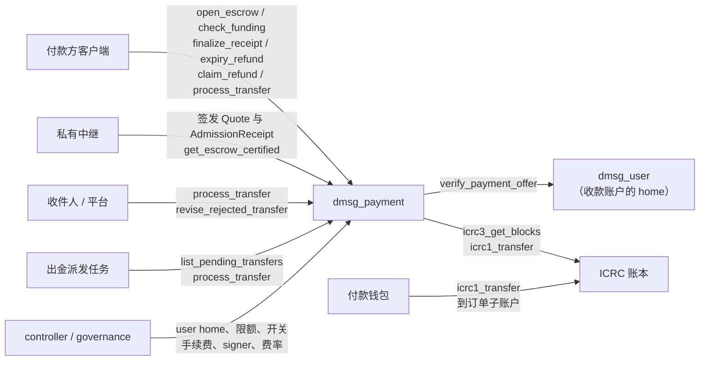

# dmsg_payment

dMsg 付费来信的资金托管 canister，实现公开的 delivery profile 2。付款方按私有中继签发的固定报价开单，向订单独有的子账户付款；中继受理密文后签发受理收据，本 canister 据此把资金结算给收件人和平台；受理期限过后没有结算的订单，退还付款方。

它只管资金。收件箱、联系规则、屏蔽名单和报价草稿都不在这里，它也不是通用结算器，不接受任意服务收据或任意代币。会员和资源包的付款由 [dmsg_commerce](../dmsg_commerce/README.md) 处理。

完整接口见 [dmsg_payment.did](dmsg_payment.did)。公开类型见 [payment](../dmsg_types/src/payment.rs) 与 [profiles::delivery](../dmsg_types/src/profiles/delivery.rs)，费率规则见 [billing](../dmsg_protocol/src/billing.rs)，账本适配器见 [dmsg_runtime::ledger](../dmsg_runtime/src/ledger.rs)。

> 状态：开发中，稳定布局 schema 12，未审计，未在主网用真实资产验收。容量与多实例见[容量与扩展](#容量与扩展)。

## 架构设计

### 组件关系



| 组件           | 与 payment 的关系                                                                                                                                                                   |
| -------------- | ----------------------------------------------------------------------------------------------------------------------------------------------------------------------------------- |
| 付款方客户端   | 用付款 Principal 开单，查账，提交中继返回的收据，随后立即派发收件人和平台出金；也可以触发到期退款和退款领取。扩展里的恢复面板（`PaymentRecovery`）提供入金、退款和出金的手动操作 |
| `dmsg_user`    | 收款账户所属的 home。`verify_payment_offer` 核验收件设备对 `PaymentOffer` 的签名、`payment_offer` 能力和账户安全版本，只接受自己 `UserInit.payment_canister` 的调用                  |
| ICRC 账本      | 所有金额只使用一个账本。入金只认 DFINITY ICRC 账本的 ICRC-3 `1xfer`/`2xfer` 区块，会跟随账本返回的归档回调读取                                                                       |
| 私有中继       | 持有收据 signer 私钥：按收件人的 `PaymentOffer` 生成并签名 `Quote`，受理密文后签名 `AdmissionReceipt`，用认证查询核对资金决定后才把消息标为可见。它不能改变已签条款中的收款人和金额 |
| 收件人 / 平台  | 结算出金的受益人，可以派发出金，也可以修订被账本明确拒绝的出金                                                                                                                       |
| 出金派发任务   | 运维 principal 或私有中继按 `list_pending_transfers` 在 24 小时内派发所有未完成的出金，兜底客户端没有发出的出金                                                                       |
| governance     | 初始化时固定的管理主体（生产为 SNS governance），与 controller 一起调用管理方法                                                                                                     |

### 接口与调用者

| 类别     | 方法                                                                                                                                                                                                 | 调用者                                       |
| -------- | ---------------------------------------------------------------------------------------------------------------------------------------------------------------------------------------------------- | -------------------------------------------- |
| 管理     | `admin_add_user_home`、`admin_set_limits`、`set_orders_enabled`、`set_ledger_fee`、`rotate_receipt_signer`、`revoke_receipt_signer`、`schedule_fee_policy`                                          | controller 或 `governance`                   |
| 提案预演 | 以上每个方法的 `validate_*`，参数相同                                                                                                                                                                | 任何人（query）                              |
| 开单     | `open_escrow`                                                                                                                                                                                        | 付款 Principal，须为 `quote.payer.owner`     |
| 入金     | `check_funding`                                                                                                                                                                                      | 任何人，计入调用方的账本读取额度             |
| 资金决定 | `finalize_receipt`                                                                                                                                                                                   | 任何人，提交有效收据                         |
|          | `expiry_refund`                                                                                                                                                                                      | 任何人，`accept_by` 之后                     |
| 退款     | `quote_refund`（query）                                                                                                                                                                              | 任何人                                       |
|          | `claim_refund`                                                                                                                                                                                       | 付款 Principal 或被退款账户的 owner；收款方固定为原出资账户或报价付款账户 |
| 出金     | `process_transfer`、`reconcile_transfer`                                                                                                                                                             | 任何人，计入调用方的出金或读取额度           |
|          | `revise_rejected_transfer`                                                                                                                                                                           | 付款 Principal 或该笔出金的收款 owner        |
| 查询     | `get_escrow`、`get_escrow_by_operation`、`get_escrow_certified`、`get_transfer`、`list_transfers`、`get_deposit`、`list_deposits`、`get_receipt_signer`、`get_fee_policy`、`get_configuration_certified` | 任何人                                       |
|          | `list_my_escrows`                                                                                                                                                                                    | 付款 Principal（非匿名），每页 32 条         |
| 运维     | `payment_config`、`payment_stats`、`list_pending_transfers`                                                                                                                                          | 任何人（query）                              |

`canister_inspect_message` 在执行前拒绝两类 ingress：非 controller、非 governance 调用管理方法，以及匿名调用 `open_escrow`、`claim_refund`、`revise_rejected_transfer`。被拒绝的消息不由本 canister 付接收费。governance 的提案执行是跨 canister 调用，不经过这一步。

### 订单生命周期

报价固定三个时间：创建时间 `created_at`、付款截止 `fund_by = created_at + 15 分钟`、受理截止 `accept_by = fund_by + 30 分钟`。查账晚了也不会延长期限。

1. **开单** `open_escrow(OpenEscrow)`：订单 ID 为 `digest(本 canister, 调用方, op_id)`。同参数重复调用返回原订单，条款不同返回 `IdempotencyConflict`；每个 `quote_id` 只能开一单。先做本地检查，再调用外部：
   - 订单开关、付款方未结订单数、总订单容量、当日开单额度。计算付款方未结订单时，已过 `accept_by` 仍未决定的订单先写入退款决定，与任何人调用 `expiry_refund` 的效果相同，所以放弃付款的订单不会一直占用名额；
   - 报价：签名属于未撤销且在有效区间内的 signer epoch，`home_payment` 是本 canister，账本、平台账户与配置一致，费率版本是当前生效版本且服务费按它计算，`max_network_fee == max_fee`，预留在允许区间内，金额拆分正确，期限符合上述固定值，`max_bytes ≤ 8192`，保留期 1–365 天；
   - offer 与报价的收款人、净额、范围和摘要一致；按收款账户 ID 内嵌的分配器指纹找到它的 home（不在 `user_homes` 中返回 `NotFound`，不消耗授权额度），再调用该 home 的 `verify_payment_offer`。

   调用返回后，用新读取的时间和配置重新检查付款方未结订单数、开关、期限、signer 撤销、费率版本和容量，并要求 home 返回的观察时间与本地时间相差不超过 60 秒，然后才写入订单。
2. **付款**：付款方从 `quote.payer` 账户向 `(本 canister, escrow.subaccount)` 转账，子账户为 `digest(本 canister, escrow_id)`。
3. **入金** `check_funding(escrow_id, block)`：从账本读取该区块，核对收款方是订单子账户，每个区块只能被认领一次。同时满足以下条件的第一笔入金成为主入金（`funding_ref`）：订单还没有资金决定、账本提交时间早于 `fund_by`、来源恰好是 `quote.payer`、金额不少于 `quote.amount`。主入金超出 `quote.amount` 的部分可以退回。少付、迟到、来源不同和重复的入金全额归实际出资账户。
4. **结算** `finalize_receipt(SignedReceipt)`：要求订单已有主入金、还没有资金决定、`now < accept_by`。先做本地字段检查再验签：收据须绑定本订单、本 canister、报价摘要、密文摘要、signer epoch 和两个期限，`0 < size ≤ max_bytes`，`retain_until ≥ stored_at + retain_ms`，`stored_at` 落在 signer 有效区间内。成功后资金决定变为 `SettlementCommitted`，同时准备收件人和平台两条出金腿；服务费为 0 时只有收件人一条。结算不再查账，资金已由 `check_funding` 确认。
5. **到期退款** `expiry_refund`：`now ≥ accept_by` 且还没有资金决定时，任何人都可以把决定改为 `RefundCommitted`，不需要中继同意。期限是半开区间，结算和退款不会同时有效。
6. **出金**：见[出金腿](#出金腿)。

| `FundsDecision`       | 含义                                                     |
| --------------------- | -------------------------------------------------------- |
| `Pending`             | 尚未决定                                                 |
| `SettlementCommitted` | 已接受收据，主入金归收件人和平台；不代表出金已到账       |
| `RefundCommitted`     | 已到期退款，主入金归付款方；之后到达的收据无效           |

资金决定一旦写入，该订单就不再占用付款方的未结名额。

### 金额与守恒

所有金额都是账本最小单位，`quote.amount = recipient_net + service_fee + fee_reserve`：

- `service_fee = max(ceil(recipient_net × rate_bps / 10000), minimum_atomic)`，按报价创建时生效的费率版本计算。已开的订单保留当时的绝对金额。
- `fee_reserve` 至少为“结算腿数 × `max_fee`”，最多 `3 × max_fee`。结算时按当前 `ledger_fee` 扣除各腿网络费，剩余部分仍归付款方；即使两条腿都涨到 `max_fee`，结算也能完成。

每个订单任何时刻都满足 `confirmed_in = liabilities + transferred + network_fees`，每次保存都检查，不守恒直接 trap。

| 资金                           | 归属与领取                                                                                           |
| ------------------------------ | ---------------------------------------------------------------------------------------------------- |
| 主入金中的 `quote.amount`      | 结算：收件人净额、平台服务费和结算出金的网络费；剩余预留在全部结算腿成功后退给 `quote.payer`。退款：全部退给 `quote.payer` |
| 主入金多付的部分、其他入金     | 实际出资账户（含 subaccount），随时可以领取，不必等资金决定                                          |

`claim_refund(escrow_id, blocks, include_reserve)` 只接受付款 Principal 或被退款账户的 owner 调用，由他们决定何时合并，其他人不能把可合并的余额拆成多笔退款。一次最多合并同一出资账户的 32 笔入金；`include_reserve = true` 时再加上主入金已释放的部分，收款方是 `quote.payer`。合并后只扣一次网络费。`quote_refund` 用同样的规则预览：`available > 0` 而 `amount == 0` 表示余额暂时不够一笔网络费，它仍归原账户，可以和以后的同源入金合并，不算平台收入。领取只在本地清零所选分配、生成一条 `Pending` 退款腿，还要用 `process_transfer` 执行；重复领取返回 `FeeBlocked`。

### 出金腿

每条腿在生成时就冻结来源子账户、收款账户、金额、fee、memo（`digest(escrow_id, leg_id)`）和 `created_at_time`，以后每次重发都用原参数，由账本去重。

| 状态                     | 含义                                                         | 后续                                                                                                                                  |
| ------------------------ | ------------------------------------------------------------ | ------------------------------------------------------------------------------------------------------------------------------------- |
| `Pending`                | 已生成，未发送                                               | `process_transfer`                                                                                                                    |
| `InFlight`               | 已发送，或回调被升级、trap 打断                              | 在账本去重窗口内用 `process_transfer` 原参数重发（账本返回 `Duplicate` 即视为成功），或用 `reconcile_transfer(escrow, leg, block)` 提交实际区块 |
| `Unknown`                | 结果未知                                                     | 同上；之后的明确拒绝也不能证明它没有执行                                                                                              |
| `Rejected`、`FeeBlocked` | 账本明确拒绝，此前没有未知结果；`FeeBlocked` 是 `BadFee`，记录了账本期望的 fee | 临时故障可以直接重发；`TooOld`、`BadFee` 等由付款 Principal 或收款 owner 调用 `revise_rejected_transfer` 生成新腿                    |
| `Succeeded`              | 已确认区块                                                   | —                                                                                                                                     |
| `Superseded`             | 已被修订后的新腿取代                                         | 再派发返回 `VersionConflict`                                                                                                          |

修订时，`BadFee` 只能改成账本给出的 fee，其他拒绝只刷新时间戳并保持原 fee，fee 都不能超过 `max_network_fee`。结算腿的金额不变，多出的 fee 从剩余预留中扣；退款腿则相应减少金额。每条修订链最多保留 8 个版本，更早的 `Superseded` 腿会被删除。`last_failure` 只记录有界的拒绝类别，不保存账本返回的文本。

`created_at_time` 在生成时固定，所以出金腿必须在账本去重窗口内派发（DFINITY ICRC 账本为 24 小时）。`InFlight` 和 `Unknown` 也要在窗口内重试，才能靠账本去重得到确定结果，超出窗口后只能凭实际区块对账。

本 canister 没有定时器。付款方客户端在 `finalize_receipt` 成功后立即派发收件人和平台出金，失败不影响受理结果。客户端没有发出或结果未知的出金，由派发任务兜底：`list_pending_transfers(after)` 按 `created_at_time` 从旧到新列出所有尚未成功或被取代的出金腿，每页 32 条，游标是上一页最后一条的 `(created_at_time, escrow_id, leg_id)`。列表也包含派发任务完成不了的腿：`FeeBlocked` 和因 `TooOld` 被拒绝的腿要等付款 Principal 或收款 owner 修订，超出窗口仍是 `InFlight` 或 `Unknown` 的腿只能凭实际区块对账。它们排在最前，修订或对账之前一直留在列表中。见[运维](#运维)。

### 并发与外部调用

- 有外部调用的方法用内存占用键互斥：同一付款方或同一报价的开单、同一入金区块的查账、同一出金腿的派发或对账，同时只能有一个，其余返回 `Pending`，完成后可以重试。全局最多 128 个占用键，每次开单占两个，超出返回 `QuotaExceeded`。占用键在失败、正常结束和回调 trap 时都会释放，升级时丢弃；它不代替出金腿的持久状态。
- 每次 `await` 返回后都重新读取订单、出金腿和配置再写入，不复用等待前的快照。
- 外部调用都使用有界等待。只有干净拒绝才视为未执行，超时、回复解码失败等都按未知处理。
- 外部调用按类别、按 UTC 分钟限流，额度来自 `PaymentLimits`，由 `admin_set_limits` 调整：

| 额度     | 方法                                      | 全局 / 分钟                 | 每个调用方 / 分钟         |
| -------- | ----------------------------------------- | --------------------------- | ------------------------- |
| 授权     | `open_escrow` 调用 `verify_payment_offer` | `authorizations_per_minute` | 10                        |
| 账本读取 | `check_funding`、`reconcile_transfer`     | `ledger_reads_per_minute`   | `ledger_calls_per_caller` |
| 账本出金 | `process_transfer`                        | `ledger_writes_per_minute`  | `ledger_calls_per_caller` |

每类额度保存当分钟的总数和每个调用方的计数，判定不随调用方数量变慢。只有实际发出的外部调用才计数；本地校验失败和被占用键拦下的调用不计。失败的授权不消耗当日开单额度。匿名调用共用匿名主体的份额。计数保存在 heap，`pre_upgrade` 写入稳定内存，升级后保留。全局额度只影响可用性：大量 Principal 可以在一分钟内耗尽它，但不能影响资金归属。出金派发任务需要比终端用户多的份额，按它的派发量设定 `ledger_calls_per_caller`。

### 认证查询

认证树用 [dmsg_runtime::cert_map](../dmsg_runtime/src/cert_map.rs) 存在 stable memory，只保存 key 和哈希。认证值在查询时由对应记录重新生成，并与已认证的哈希核对：

| key                    | 值                                                                                                                         | 查询                                                       |
| ---------------------- | -------------------------------------------------------------------------------------------------------------------------- | ---------------------------------------------------------- |
| `escrow_id`（32 字节） | `EscrowInfo` 的规范 CBOR                                                                                                   | `get_escrow_certified(ids)`                                |
| `configuration`        | `PaymentConfiguration`（schema 2：`user_homes`、`ledger`、`platform`、`ledger_fee`、`max_fee`、`signer_epoch`、`enabled`、`max_escrows`） | `get_configuration_certified(signer_epoch?, fee_version?)` |
| `signer/<epoch>`       | `ReceiptSigner`                                                                                                            | 同上，默认取当前 epoch                                     |
| `fee/<version>`        | `DeliveryFeePolicy`                                                                                                        | 同上，默认按当前时间取生效版本                             |

`EscrowInfo` 只在资金决定、入金或实际出金变化时更新；领取预留和修订出金腿不重算认证叶。入金和出金腿没有认证叶，用普通查询读取。

### 存储

稳定布局为开发 schema 12，`post_upgrade` 读到其他 schema 直接 trap，不迁移旧布局。私有 `stable_codec.rs` 用 CBOR 整数 key 保存配置和订单；入金、出金腿、signer 和费率使用 `dmsg_runtime` 的紧凑表示。`MemoryManager` 使用 128 页（8 MiB）的分配桶，可寻址约 256 GiB，这是地址容量，不是业务容量。

| Memory | 内容                                                                                            |
| -----: | ----------------------------------------------------------------------------------------------- |
|      0 | 配置 `StableCell`：`PaymentInit`（含追加的 user home、限额、开关、当前 signer、`ledger_fee`）、当日开单数和每分钟调用计数 |
|      1 | 订单：`escrow_id` → `Escrow`                                                                    |
|      2 | 已使用的 `quote_id`                                                                             |
|      3 | 入金区块 → `escrow_id`，每个区块只认领一次                                                      |
|      4 | 入金：`(escrow_id, block)` → `Deposit`                                                          |
|      5 | 出金腿：`(escrow_id, leg_id)` → `TransferLeg`                                                   |
|      6 | 收据 signer：epoch → `ReceiptSigner`                                                            |
|      7 | 未结订单：`digest(payer) ‖ escrow_id`，资金决定写入时删除                                        |
|      8 | 出金区块 → `(escrow_id, leg_id)`                                                                |
|      9 | 付款方索引：`digest(payer) ‖ escrow_id`                                                         |
|     10 | 费率政策：version → `DeliveryFeePolicy`，最多 256 个                                            |
| 11、12 | 认证 map 的叶子（key → 哈希）与按 id 定址的内部节点                                              |
|     13 | 待派发出金：`created_at_time ‖ escrow_id ‖ leg_id`，成功或被取代时删除                          |

heap 只保存配置缓存（含调用计数）和占用键。订单、入金和出金腿都直接写稳定表。管理方法修改配置后立即写入 memory 0；`pre_upgrade` 只补写当分钟的调用计数和当日开单数，即使应急升级跳过它，也只丢失这两项。`post_upgrade` 只重新认证配置叶并发布根哈希，不扫描订单，并在日志中记录 `payment_upgrade escrows=… instructions=…`。

## 容量与扩展

### 承载的是订单，不是用户

payment 不保存账户。每个付款方只有未结订单和付款方索引的键，收件人在本 canister 不留记录。所以容量取决于付费来信的订单数，与注册用户数无关。

### 上限

`PaymentLimits` 由 governance 用 `admin_set_limits` 整体替换，`payment_config` 查询当前值。订单限额只拒绝新订单；账本额度用尽时，已有订单的查账、对账和出金也返回 `QuotaExceeded`，下一分钟可以重试。资金决定、退款领取、查询和资金归属不受限额影响。

| `PaymentLimits` 字段        | 含义                                                         | 取值范围        |
| --------------------------- | ------------------------------------------------------------ | --------------: |
| `max_escrows`               | 终身订单数，含已结束和从未付款的订单；订单不归档、不删除     | 1–10,000,000    |
| `daily_orders`              | 每 UTC 日成功开单数                                          | 1–1,000,000     |
| `max_open_per_payer`        | 每个付款方还没有资金决定的订单数                             | 1–16            |
| `authorizations_per_minute` | `open_escrow` 调用 home 核验 offer 的次数，每个调用方 10 次  | 1–100,000       |
| `ledger_reads_per_minute`   | `check_funding`、`reconcile_transfer` 的账本读取             | 1–100,000       |
| `ledger_writes_per_minute`  | `process_transfer` 的账本转账                                | 1–100,000       |
| `ledger_calls_per_caller`   | 单个调用方在每类账本额度中可用的份额                         | 1–100,000       |

其他固定上限：

| 项目               | 限制                         |
| ------------------ | ---------------------------- |
| 占用键             | 128，同时进行的外部工作      |
| `user_homes`       | 64，分配器指纹互不相同，只能追加 |
| 单次退款、入金分页 | 32 笔                        |
| 出金修订链         | 8 个版本                     |
| 费率政策           | 256 个                       |

### 测量

2026-10-08 的 `payment_capacity_profile`：主机用 payment 自己的存储代码构建 stable 镜像，每单都走完开单、入金、结算、两笔出金和剩余预留退款，每 1,000 单留一单未决定并带一笔迟到入金；镜像压缩上传到 PocketIC 16.0.0 后升级并测量。cycles 只统计 payment，升级 cycles 包含安装 Wasm 模块：

| 订单数    | stable memory | 升级指令  | 升级 cycles | `expiry_refund` | `claim_refund` | 32 单认证查询 | 升级后 heap |
| --------: | ------------: | --------: | ----------: | --------------: | -------------: | ------------: | ----------: |
| 100,000   | 386 MB        | 1,542,576 | 11.66B      | 10.56M          | 10.57M         | 84 KB         | 1.4 MB      |
| 1,000,000 | 3.25 GB       | 1,623,233 | 11.66B      | 10.72M          | 10.05M         | 88 KB         | 1.4 MB      |

升级只重新认证配置叶并发布根，成本不随订单数增长；写入路径的成本同样基本不变。每个完成的订单约占 3.2 KB stable memory，由此推算 1,000 万单约 32 GB，这也是 `MAX_PAYMENT_ESCROWS` 定为 1,000 万的依据。1 亿单约 320 GB，接近 stable memory 上限（500 GiB）和子网存储余量，应分到多个实例，或先实现终态订单压缩。1,000 万单没有实测。

2026-10-02 在 PocketIC 中通过真实入口测得的 payment 侧每方法 cycles 中位数（百万）：开单 21.4、查账 16.0、结算提交 13.6、每笔出金 16.3、准备退款 9.0、执行退款 16.4。一笔正常结算的订单约 84M cycles，不含 user 与账本的执行费，也不含账本网络费。

吞吐受外部调用额度约束：每单要一次授权、一次查账、两笔出金。例如 `ledger_writes_per_minute = 200` 时约 100 单/分钟（每天约 14 万单），单个派发 principal 每分钟最多发 `ledger_calls_per_caller` 笔出金。提高额度前，按目标负载在测试网核对子网吞吐和 cycles。

### 多实例

可以部署多个实例，它们互相独立：订单 ID 和子账户都包含本 canister ID，报价的 `home_payment` 只指向一个实例，同一报价不能在两个实例重复开单。私有中继可以同时登记多个实例和各自的条款。

限制在 user home 一侧。`dmsg_user` 的 `UserInit.payment_canister` 在安装时固定，`verify_payment_offer` 只接受它的调用，所以一个 home 的全部账户只能用一个 payment 实例，而一个 payment 实例最多服务 64 个 home。新实例只能随新的 user home 加入，已有 home 不能换到新实例。客户端目前也只配置一个 payment（`src/dmsg_app/dmsg.config.json` 的 `canisters.payment`）。

`payment_stats` 的 `escrows` 接近 `max_escrows` 的 60% 时，先在 `MAX_PAYMENT_ESCROWS` 以内提高上限；接近 1,000 万或 stable memory 余量不足时，新的 user home 应指向新的 payment 实例。

## 部署流程

### 依赖关系

每个 `dmsg_user` 的 `UserInit.payment_canister` 指向本 canister，本 canister 的 `user_homes` 又要列出这些 home，所以先创建全部 canister ID（见 [dmsg_user](../dmsg_user/README.md#部署流程)），再分别安装。安装时没有跨 canister 调用，安装顺序不限；第一次开单时才调用 home。

安装前还要准备：

- **账本**：支持 `icrc3_get_blocks` 的 DFINITY ICRC 账本，例如 ckUSDC（`xevnm-gaaaa-aaaar-qafnq-cai`）。其他区块格式的账本需要另行审查适配器。
- **收据 signer**：由私有中继生成并保管的 Ed25519 密钥。本 canister 只保存 32 字节公钥、epoch（从 1 开始）和有效区间 `[valid_from, valid_until)`，单位为 Unix 毫秒。
- **平台账户**：收取服务费的 ICRC 账户。平台出金被账本拒绝（例如超过 24 小时才派发返回 `TooOld`）时，只有付款方或该账户的 owner 能修订，所以 owner 应是能运行运维任务的 principal，例如运维账户或转发 canister。直接用 SNS governance 作为 owner 时，每次修订都需要一个提案。
- **费率政策**：初始 `DeliveryFeePolicy` 的 `effective_at_ms` 不能晚于安装时间。私有中继的报价必须使用相同的费率、账本、平台账户和 `max_fee`，否则开单返回 `IntegrityFailed` 或 `PolicyStale`。

### 初始化参数

| `PaymentInit` 字段   | 要求                                                                                                                         |
| -------------------- | ---------------------------------------------------------------------------------------------------------------------------- |
| `environment`        | 与所有 user home 相同，生产为 `Production`；它参与分配器指纹                                                                  |
| `issuer_namespace`   | 与所有 user home 的同名字段相同                                                                                              |
| `user_homes`         | 1–64 个 `dmsg_user`，分配器指纹互不相同；之后只能用 `admin_add_user_home` 追加                                                |
| `ledger`             | 见上；安装后不可修改                                                                                                         |
| `platform`           | 服务费收款账户；安装后不可修改                                                                                               |
| `governance`         | 生产为 SNS governance `dwv6s-6aaaa-aaaaq-aacta-cai`（[sns_canister_ids.json](../../sns_canister_ids.json) 的 `governance_canister_id`），本地可填部署者 principal；安装后不可修改 |
| `fee_policy`         | `version > 0`，`rate_bps ≤ 10000`，`effective_at_ms` 不晚于安装时间                                                          |
| `ledger_fee`         | 账本 `icrc1_fee` 的当前值，不超过 `max_fee`；之后用 `set_ledger_fee` 维护                                                    |
| `max_fee`            | 报价的 `max_network_fee` 必须等于它，不超过 10^9，决定预留大小；安装后不可修改                                               |
| `signer`             | 32 字节非零公钥，`valid_from < valid_until`，`revoked = false`                                                               |
| `limits`             | 初始 `PaymentLimits`，取值范围见[上限](#上限)；之后用 `admin_set_limits` 整体替换                                             |
| `enabled`            | 建议先填 `false`，主网验收后再打开                                                                                           |

`ledger`、`platform.owner` 和 `governance` 不能是匿名 principal 或管理 canister，参数不合法时安装失败。安装后可以修改的只有 user home（只能追加）、限额、订单开关、`ledger_fee`、收据 signer 和费率政策，都通过管理方法；`post_upgrade` 不读参数。

### 步骤

以下命令在仓库根目录执行，以 `--network ic` 为例；本地开发去掉该参数，`environment` 改为 `Local`。

1. 在待部署的提交上完成验证。脚本会构建 release Wasm，核对 Candid、协议向量和 PocketIC 回归；工作区应没有未提交的改动：

   ```sh
   POCKET_IC_BIN=/path/to/pocket-ic make test-dmsg
   ```

2. 核对账本，记录当前手续费，并确认支持的标准中有 ICRC-3：

   ```sh
   LEDGER=xevnm-gaaaa-aaaar-qafnq-cai
   dfx canister call --network ic $LEDGER icrc1_fee --query
   dfx canister call --network ic $LEDGER icrc1_supported_standards --query
   ```

3. 与 `dmsg_user` 一起创建 canister ID（见 [dmsg_user](../dmsg_user/README.md#步骤) 步骤 3）。

4. 生产安装使用打 tag 后 [release.yml](../../.github/workflows/release.yml) 发布的 `dmsg_payment.wasm.gz`，不要用本地 `dfx deploy` 构建，原因见 [dmsg_handle](../dmsg_handle/README.md#步骤)。核对产物哈希后安装，先保持订单关闭：

   ```sh
   sha256sum dmsg_payment.wasm.gz
   dfx canister install dmsg_payment --network ic --wasm dmsg_payment.wasm.gz --argument "(record {
     environment = variant { Production };
     issuer_namespace = \"<与 dmsg_user 相同的 issuer_namespace>\";
     user_homes = vec { principal \"$(dfx canister id dmsg_user --network ic)\" };
     ledger = principal \"$LEDGER\";
     platform = record { owner = principal \"<平台收款 owner>\"; subaccount = null };
     governance = principal \"dwv6s-6aaaa-aaaaq-aacta-cai\";
     fee_policy = record { version = 1 : nat64; effective_at_ms = <不晚于安装时间的 Unix 毫秒> : nat64; rate_bps = <基点> : nat16; minimum_atomic = <最低服务费> : nat };
     ledger_fee = <icrc1_fee> : nat;
     max_fee = <网络费上限> : nat;
     signer = record { epoch = 1 : nat64; public_key = blob \"<32 字节 Ed25519 公钥>\"; valid_from = <Unix 毫秒> : nat64; valid_until = <Unix 毫秒> : nat64; revoked = false };
     limits = record {
       max_escrows = <终身订单上限> : nat64;
       daily_orders = <每日开单上限> : nat32;
       max_open_per_payer = 4 : nat32;
       authorizations_per_minute = 200 : nat32;
       ledger_reads_per_minute = 200 : nat32;
       ledger_writes_per_minute = 200 : nat32;
       ledger_calls_per_caller = 40 : nat32;
     };
     enabled = false;
   })"
   dfx canister info dmsg_payment --network ic
   ```

   `sha256sum` 须与同一 release 的 `dmsg_payment.wasm.gz.<sha256>.txt` 一致，`dfx canister info` 显示的模块哈希也应是这个值。记录模块哈希、controllers 和本次安装参数。本地开发可以用 `dfx deploy dmsg_payment --argument …`。

5. 确认每个 user home 都以 `payment_canister = $(dfx canister id dmsg_payment --network ic)` 安装（见 [dmsg_user](../dmsg_user/README.md#步骤) 步骤 4）。然后核对配置：

   ```sh
   dfx canister call --network ic dmsg_payment get_fee_policy --query
   dfx canister call --network ic dmsg_payment get_receipt_signer '(1 : nat64)' --query
   dfx canister call --network ic dmsg_payment validate_admin_add_user_home "(principal \"$(dfx canister id dmsg_user --network ic)\")" --query
   ```

   最后一条应提示该 home 已登记（`Already listed`）。`payment_config` 返回当前完整配置，可与安装参数逐项比对；客户端和私有中继应使用 `get_configuration_certified` 的证书核对。

6. 配置私有中继：登记本 canister ID、账本、平台账户、`max_fee`、费率政策和 signer epoch，与安装参数逐项一致。在 `src/dmsg_app/dmsg.config.json` 的 `canisters.payment` 填写本 canister ID，重新构建客户端（见 [dmsg_app](../dmsg_app/README.md)）。

7. 设置备用 controller 和不少于 90 天的冻结阈值，并为 cycles 余额配置告警：

   ```sh
   dfx canister update-settings dmsg_payment --network ic \
     --add-controller <备用 controller> \
     --freezing-threshold 7776000
   ```

8. 用小额真实资产在主网走完以下流程，每一步都用 `get_escrow_certified` 核对资金视图：
   1. 开单 → 付款 → `check_funding` → 中继受理 → `finalize_receipt` → 两条结算腿 `process_transfer`，核对收件人和平台到账，再用 `claim_refund(escrow, [], true)` 和 `process_transfer` 退回剩余预留。
   2. 向同一订单子账户多转一笔，用 `quote_refund` 预览、`claim_refund` 合并退回。
   3. 另开一单付款但不受理，`accept_by` 后调用 `expiry_refund`，退回主入金。
   4. 对一笔已成功的出金调用 `reconcile_transfer`，确认返回原结果。

9. 由 controller 或 governance 打开订单：

   ```sh
   dfx canister call --network ic dmsg_payment set_orders_enabled '(true)'
   ```

### 交给 SNS

主网验收完成后，按 [dmsg_handle](../dmsg_handle/README.md#交给-sns) 的流程把 SNS root 设为唯一 controller，并用 `AddGenericNervousSystemFunction` 提案登记通用函数，目标方法和验证方法都在本 canister 上。建议的主题：

| 目标方法                | 验证方法                         | 主题                                         |
| ----------------------- | -------------------------------- | -------------------------------------------- |
| `admin_add_user_home`   | `validate_admin_add_user_home`   | `CriticalDappOperations`（关键主题）         |
| `admin_set_limits`      | `validate_admin_set_limits`      | `ApplicationBusinessLogic`                   |
| `rotate_receipt_signer` | `validate_rotate_receipt_signer` | `CriticalDappOperations`（关键主题）         |
| `revoke_receipt_signer` | `validate_revoke_receipt_signer` | `ApplicationBusinessLogic`（应急，需尽快通过） |
| `set_orders_enabled`    | `validate_set_orders_enabled`    | `ApplicationBusinessLogic`                   |
| `set_ledger_fee`        | `validate_set_ledger_fee`        | `ApplicationBusinessLogic`                   |
| `schedule_fee_policy`   | `validate_schedule_fee_policy`   | `ApplicationBusinessLogic`                   |

交接后，应急关闭订单和撤销 signer 也需要提案，要提前准备好提案模板和可快速投票的神经元。SNS 执行时只判断调用是否得到回复，不解析返回的 `Result`，执行后用 `get_configuration_certified`、`get_receipt_signer` 或 `get_fee_policy` 确认结果。升级改用 `UpgradeSnsControlledCanister` 提案，`canister_upgrade_arg` 留空。

### 运维

payment 没有定时器，以下任务都需要外部调用：

| 任务           | 方法                                                     | 调用方                         | 要求                                                                                                   |
| -------------- | -------------------------------------------------------- | ------------------------------ | ------------------------------------------------------------------------------------------------------ |
| 派发出金       | `list_pending_transfers` 分页，逐条 `process_transfer`   | 运维 principal 或中继          | 至少每小时运行一次，在 `created_at_time` 之后 24 小时内派发 `Pending`、`InFlight`、`Unknown` 和临时拒绝的腿。`FeeBlocked`、因 `TooOld` 被拒绝和超出窗口的腿重发不会成功，还会消耗出金额度，应跳过并单独告警。客户端在结算后会先派发一次。派发 principal 每分钟最多发 `ledger_calls_per_caller` 笔，按订单量调整 |
| 修订被拒的出金 | `revise_rejected_transfer` 后 `process_transfer`         | 付款 Principal 或收款 owner    | 超过 24 小时未派发的腿会返回 `TooOld`，须修订                                                          |
| 到期退款       | `expiry_refund`                                          | 任何人                         | `accept_by` 之后；同时释放付款方的未结订单名额                                                         |
| 领取退款       | `claim_refund`，再 `process_transfer`                    | 付款方或出资账户 owner         | 到期退款、多付或其他入金之后；一次合并同一出资账户的余额。`process_transfer` 任何人都可以派发          |
| 网络费变化     | `set_ledger_fee(fee)`                                    | controller 或 governance       | 不超过 `max_fee`；只影响之后生成的出金腿，已准备的腿保留原 fee，遇到 `BadFee` 时修订                    |
| signer 轮换    | `rotate_receipt_signer(signer)`                          | controller 或 governance       | 在当前 signer 的 `valid_until` 之前，epoch 须递增；旧 epoch 继续用于其有效区间内的报价，中继同步切换     |
| 费率调整       | `schedule_fee_policy(policy)`                            | controller 或 governance       | 至少提前 30 天，版本和生效时间都递增；生效时刻中继改用新版本，跨越生效时刻的报价开单返回 `PolicyStale` |
| 新增 user home | `admin_add_user_home(home)`                              | controller 或 governance       | 新 home 须以本 canister 为 `payment_canister`，并与本 canister 使用相同的 `environment` 和 `issuer_namespace`；本 canister 无法在链上核对这些。已有 home 不能移除 |
| 调整限额       | `admin_set_limits(limits)`                               | controller 或 governance       | 一次替换全部限额，`validate_admin_set_limits` 显示当前值；只影响新订单和新的外部调用                    |
| 监控           | `payment_stats`、`list_pending_transfers`                | 任何人（query）                | 订单数接近 `max_escrows` 的 60% 时扩容或让新的 user home 指向新实例；窗口内可派发的腿持续增长，或其中最旧一条接近 24 小时，说明派发跟不上；派发任务跳过的腿要通知付款方或收款方修订，或凭区块对账；另看 cycles 和 stable 页数 |

**signer 泄露**：先调用 `revoke_receipt_signer(epoch)`，它同时关闭新订单；再轮换到新 epoch，中继改用新密钥后调用 `set_orders_enabled(true)`。用已撤销 epoch 签的未决订单不能再结算，到期后退款。入金、退款、出金和查询不受影响。

### 升级

升级要求 schema 不变。先停止 canister，等在途的账本和 user 调用完成，创建快照，再升级、启动：

```sh
dfx canister metadata dmsg_payment candid:service --network ic > deployed.did
didc check dmsg_payment.did deployed.did
dfx canister stop dmsg_payment --network ic
dfx canister snapshot create dmsg_payment --network ic
dfx canister install dmsg_payment --network ic --mode upgrade --wasm dmsg_payment.wasm.gz --argument-type raw --argument 4449444c0000 --yes
dfx canister start dmsg_payment --network ic
```

`dmsg_payment.did` 取自同一 release，`didc check` 确认新接口与已部署的接口兼容，之后用 `--yes` 跳过 dfx 自带的检查。Candid 服务声明了 `PaymentInit`，dfx 升级时须带参数；`post_upgrade` 不读参数，传空 Candid 参数 `()`（hex `4449444c0000`）即可。`pre_upgrade` 只保存当分钟的调用计数和当日开单数，管理配置在修改时已经写入稳定内存。升级打断的出金腿停在 `InFlight`，由派发任务在 24 小时内用原参数重发。升级成本不随订单数增长，见[测量](#测量)。不要 `reinstall`：它会清空全部订单和托管账务，而资金仍留在各订单子账户中。

## 当前限制

- 订单不归档或压缩，每个订单都终身计入 `max_escrows` 并占用 stable memory。
- 一个 user home 只能绑定一个 payment 实例，见[多实例](#多实例)。
- payment 没有定时器，出金依赖客户端和外部派发任务在 24 小时内调用；超出账本去重窗口仍是 `Unknown` 的出金只能凭实际区块对账。
- `admin_add_user_home` 无法在链上核对新 home 的 `payment_canister`、`environment` 和 `issuer_namespace`。
- 没有主网真实资产验收和安全审计。

## 实现

| 文件                  | 内容                                                                     |
| --------------------- | ------------------------------------------------------------------------ |
| `src/api.rs`          | Candid 入口：ingress 预过滤、初始化与升级、管理方法与 `validate_*`、开单、查账、结算、退款、出金、查询与统计 |
| `src/model.rs`        | 纯规则：报价与收据校验、入金分配、结算与退款准备、出金结果解释与修订、守恒检查 |
| `src/state.rs`        | 内部订单记录 `Escrow` 与公开视图 `EscrowInfo` 的转换                      |
| `src/store.rs`        | 稳定内存布局、配置缓存与持久化、限额与调用额度、未结订单和待派发出金索引、认证叶 |
| `src/calls.rs`        | 外部工作的内存占用键                                                     |
| `src/stable_codec.rs` | 配置与订单的紧凑 CBOR 表示                                               |
| `src/capacity.rs`     | 测试专用：用 canister 自己的存储代码在主机上构建容量测量用的 stable 镜像  |

home 路由与配置校验在 [dmsg_protocol::agent](../dmsg_protocol/src/agent.rs)，管理权限与预演格式在 [dmsg_runtime::admin](../dmsg_runtime/src/admin.rs)，调用失败分类在 [dmsg_runtime::calls](../dmsg_runtime/src/calls.rs)。

## 验证

单元测试覆盖报价、收据和 signer 区间的逐项拒绝，入金归属、生成式的入金/退款序列守恒、退款领取者限制、费用修订与全部 ICRC 拒绝类别，以及稳定编码：

```sh
cargo test --locked -p dmsg_payment
```

真实 Wasm 的 PocketIC 回归在 [tests/dmsg_integration/tests/control_plane](../../tests/dmsg_integration/tests/control_plane)：`payment_regressions.rs`、`payment_optimization.rs`、`payment_review.rs`、`payment_operations.rs`，另有 `control_plane.rs`、`review_regressions.rs` 与 `governance.rs` 中的支付用例。它们覆盖并发开单、查账与对账的去重，升级打断的出金只发一次，费率边界与证书，手续费维护，各类额度的隔离与升级保留，同源合并退款与分页，最后一个容量名额的并发竞争，治理限额及跳过 `pre_upgrade` 的升级后配置仍在，核验 offer 期间调低的付款方名额仍然生效，过期订单释放付款方名额，待派发出金分页，以及 ingress 预过滤：

```sh
cargo build --locked --release --target wasm32-unknown-unknown -p dmsg_user -p dmsg_handle -p dmsg_cose -p dmsg_directory -p dmsg_payment -p membership -p dmsg_commerce -p dmsg_test_ledger -p dmsg_test_sns -p dmsg_account_product
POCKET_IC_BIN=/path/to/pocket-ic DMSG_WASM_DIR=target/wasm32-unknown-unknown/release \
  cargo test --locked -p dmsg_integration --features pocketic-tests --test control_plane -- \
  payment_ escrow_settlement_duplicate_callbacks_fee_repair_and_direct_refunds \
  bounded_failed_history_keeps_the_latest_transfer_recoverable \
  clean_transport_rejection_preserves_earlier_unknown_payouts \
  cose_and_payment_governance_run_validated_admin_operations --test-threads=1
```

容量测量分两步：先在主机上用 canister 自己的存储代码生成 10 万和 100 万单的 stable 镜像，再载入 PocketIC 升级并测量。镜像约 0.4 GB 和 3.3 GB：

```sh
DMSG_PAYMENT_IMAGE_DIR=/path/to/images cargo test --release --locked -p dmsg_payment \
  capacity_image -- --ignored --nocapture
POCKET_IC_BIN=/path/to/pocket-ic DMSG_WASM_DIR=target/wasm32-unknown-unknown/release \
  DMSG_PAYMENT_IMAGE_DIR=/path/to/images cargo test --release --locked -p dmsg_integration \
  --features pocketic-tests --test control_plane payment_capacity_profile -- --ignored --nocapture
```

`payment_scale_profile`（通过真实入口建立 1,000 和 10,000 单完整历史）、`payment_cycles_profile` 与 `payment_dense_open_cycles_profile` 也是 `#[ignore]` 的长测，单独运行。
