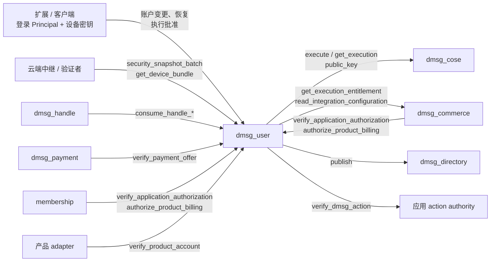

# dmsg_user

dMsg 的账户控制服务（user home）。它为每个账户保存以下状态，并通过 ICP certified data 对外证明：登录 Principal 绑定、设备公钥与能力、离线恢复公钥、当前内容根承诺、敏感执行政策和执行授权。这些状态只由本 canister 写入。账户以 12 字节 `AccountId`（Xid）标识，与名称、登录 Principal 都没有绑定关系。

以下数据不在本 canister：名称权属在 `dmsg_handle`；正式签名与 vetKD 派生由 `dmsg_cose` 执行；频道、profile、联系人、消息和文件正文由云服务保存。

完整接口见 [dmsg_user.did](dmsg_user.did)，公开类型见 [dmsg_types::user](../dmsg_types/src/user.rs)，签名摘要与校验函数见 [dmsg_protocol](../dmsg_protocol/README_zh.md)，认证叶和字节规则见[公开协议](../../docs/protocol/README_zh.md)。

## 架构设计

### 组件关系



| 组件             | 与 user 的关系                                                                                                |
| ---------------- | ------------------------------------------------------------------------------------------------------------- |
| `dmsg_cose`      | 只接受账户所属 user home 提交的 `ExecutionGrant`，执行签名或 vetKD 派生并按请求去重；user 只记录它的结果     |
| `dmsg_commerce`  | 提供正式执行的月度权益租约、应用与产品配置；以 `user_homes` 登记本 canister                                   |
| `dmsg_directory` | 发布账户的 Agent Delegation principal 文档；只接受 `user_homes` 中的 home                                     |
| `dmsg_handle`    | 消费账户在 user 预先批准的名称意图                                                                            |
| `dmsg_payment`   | 按账户 ID 的分配器指纹，向收款账户所在的 home 校验设备签署的报价                                              |
| `membership`     | PANDA 订阅场景下核对账户的应用批准                                                                            |

### 接口与调用者

| 类别     | 方法                                                                                                                                                                                   | 调用者                                                                         |
| -------- | -------------------------------------------------------------------------------------------------------------------------------------------------------------------------------------- | ------------------------------------------------------------------------------ |
| 账户     | `create_account`、`begin_auth_binding`                                                                                                                                                 | 待创建或待绑定的新登录 Principal                                               |
| 账户     | `mutate_account`、`register_controller`                                                                                                                                                | 账户的登录 Principal，附设备批准                                               |
| 恢复     | `request_recovery`、`complete_recovery`                                                                                                                                                | 恢复请求中的 `new_auth`                                                        |
| 恢复     | `reconfirm_recovery`                                                                                                                                                                   | 任何人，须带恢复密钥签名                                                       |
| 执行     | `sign`、`sign_app_action`、`sign_agent_event`、`derive_root`、`reconcile_execution`、`inspect_app_action`、`refresh_execution_entitlement`                                             | 账户的登录 Principal（签名类附设备批准）                                       |
| 外部批准 | `approve_authentication`、`approve_application`                                                                                                                                        | 账户的登录 Principal，附设备批准                                               |
| 服务回调 | `consume_handle_authorization`、`consume_handle_transfer_authorizations`、`verify_payment_offer`、`verify_application_authorization`、`authorize_product_billing`、`verify_product_account` | 初始化固定的 handle、payment、commerce 或 membership；`verify_product_account` 为已登记产品的 adapter |
| 发布     | `publish_principal`                                                                                                                                                                    | 任何人，幂等                                                                   |
| 维护     | `prune_auth_bindings`、`prune_executions`、`prune_external_approvals`                                                                                                                  | 任何人，每次有界                                                               |
| 公开查询 | `security_snapshot_batch`、`get_device_bundle`、`get_principal`、`my_account`                                                                                                          | 任何人                                                                         |
| 本人查询 | `get_account`、`get_operation`、`get_root_ref`、`get_execution`、`get_execution_receipt`、`get_execution_usage`、`get_execution_usage_certified`、`authentication_certificate`、`get_recovery_request` | 账户的登录 Principal；`get_recovery_request` 也允许待恢复的 `new_auth`          |

唯一的管理入口是 `admin_set_account_limits(max_accounts, daily_new_accounts)`，接受 controller 和初始化固定的 `governance`，并有同参数的 `validate_admin_set_account_limits` 供 SNS 通用提案预演。controller 还负责安装和升级，升级可以替换全部授权逻辑，因此 controller 等同于全部账户的最终权限。

### 授权模型

敏感写入同时要求两层授权：

1. **登录 Principal**：caller 必须在账户的 `auth_bindings` 中（最多 8 个）。登录只能证明 caller 是谁，本身不授予设备权限。
2. **设备批准**：设备用 Ed25519 签名 `Approval`。被签名的摘要覆盖 user home、账户、操作域、命令摘要、设备、`security_epoch`、设备序号、`request_id` 和期限，期限最长 5 分钟。签名的设备必须未撤销，并具备该操作要求的能力。设备序号必须等于 `next_sequence`，成功后加 1。`security_epoch` 增加后，所有未提交的批准都会失效。

| 能力                              | 用途                                                                                   |
| --------------------------------- | -------------------------------------------------------------------------------------- |
| `RootManage`（角色须为管理员）    | 除 `DisputeRecovery` 外的全部账户变更、根预留与提交、候选根派生                        |
| `VaultUnlock`                     | 派生当前代内容根                                                                       |
| `FormalApprove`                   | 正式签名、AppAction、Agent 事件、第三方认证与应用批准                                  |
| `PaymentOffer`                    | 签署收款报价                                                                           |
| `ContentSign`                     | user 不检查此能力，由云端用于验证内容签名                                              |

账户变更统一经 `mutate_account(AccountMutation)` 提交。`expected_version` 必须等于当前 `account_version`。每次成功都会把批准设备的序号加 1、`account_version` 加 1，并把回执写入最近 64 条的操作窗口。用同一 `request_id`、同一参数重放，返回原回执；同 ID 换参数返回 `IdempotencyConflict`；回执移出窗口后，重放会因设备序号已前进而返回 `ResultExpired`。

| 命令                                                                            | 作用与约束                                                                                                 | `security_epoch` | 已有内容根时        |
| ------------------------------------------------------------------------------- | ---------------------------------------------------------------------------------------------------------- | :--------------: | ------------------- |
| `AddDevice`                                                                     | 新设备对 `dmsg/add-device/v1` 自签 PoP；活跃设备最多 5 台，含已撤销最多 16 台，满时淘汰最早撤销的一台      |        +1        | 置 `RekeyRequired`  |
| `RevokeDevice`                                                                  | 至少保留一台具备 `RootManage` 的管理员设备                                                                 |        +1        | 置 `RekeyRequired`  |
| `SetDeviceCapabilities`                                                         | 只替换能力集，不改角色和密钥；同样须保留一台管理员                                                         |        +1        | 置 `RekeyRequired`  |
| `BindAuth`                                                                      | 新 Principal 须先用 `begin_auth_binding` 登记同一 nonce                                                    |        +1        | 置 `RekeyRequired`  |
| `RemoveAuth`                                                                    | 不能移除最后一个登录；被移除者的路由同时删除                                                               |        +1        | 置 `RekeyRequired`  |
| `SetRecovery`                                                                   | 恢复代次 +1，延迟 1–7 天，恢复签名密钥自签 PoP；存在未过期的恢复请求时拒绝；需重新 `ConfirmRecovery`      |        +1        | 置 `RekeyRequired`  |
| `ConfirmRecovery`                                                               | 恢复签名密钥证明持有，置 `recovery_checked`                                                                |       不变       | 不变                |
| `SetPolicy`                                                                     | 设置正式执行政策：允许的用途、每日次数与 cycles、`frozen`                                                  | +1，并清除候选根槽 | 不变              |
| `ReserveRoot`、`CommitRoot`                                                     | 内容根 CAS，见下文                                                                                         |       不变       | `CommitRoot` 置 `Ready` |
| `AuthorizeHandle`                                                               | 保存精确的名称意图，批准期限不超过 60 秒，每账户最多 32 条                                                 |       不变       | 不变                |
| `DisputeRecovery`                                                               | 任意未撤销设备可提交，账户进入 `RecoveryDisputed`                                                          |       不变       | 不变                |
| `EnablePrincipal`、`RetireController`、`MarkControllerCompromised`、`RenameController` | 修改 Agent principal 记录                                                                           |       不变       | 不变                |
| `RegisterController`                                                            | 只能经 `register_controller` 提交                                                                          |       不变       | 不变                |

账户状态不是 `Active` 时，只接受 `DisputeRecovery`。`SensitivePolicy.frozen` 冻结正式执行、外部批准和付款报价，不影响账户变更，管理员可以用 `SetPolicy` 解冻。

### 账户创建与登录绑定

`create_account(CreateAccount)` 由新 Principal 调用：

- caller 已有路由时直接返回原账户，所以重试是安全的。
- 受全局 `max_accounts` 和每 UTC 日 `daily_new_accounts` 限制。
- 初始设备必须是具备 `RootManage` 的管理员，并对 `dmsg/create-account/v1`（home、caller、设备、`op_id`、期限）签名，期限最长 5 分钟。
- `AccountId` 由持久化的 `XidGenerator` 分配，格式为 `秒级时间戳[4] ‖ 分配器指纹[5] ‖ 计数[3]`。指纹由 `(environment, issuer_namespace, 本 canister)` 派生；同一秒内或时钟回退时继续递增计数，计数耗尽时明确失败。
- 账户、登录路由、日配额和分配器在同一消息内提交。

`AUTH` 表把每个 Principal 映射到至多一个账户。为已有账户增加登录分两步：

1. 新 Principal 调用 `begin_auth_binding(account_id, nonce, expires_at)`，登记一个最长 5 分钟的待绑定项。全局最多 1024 条，表满时先回收已过期的条目。
2. 账户管理员批准 `BindAuth { principal, nonce }`，nonce 与待绑定项一致才能生效。

`RemoveAuth` 和恢复完成会删除被移除 Principal 的路由，这些 Principal 之后可以创建或绑定其他账户。

### 恢复

恢复码 R 由用户离线保管，客户端从 R 分域派生恢复用的 Ed25519 与 X25519 密钥，canister 只保存公钥（`RecoveryPolicy`）。

1. **登记**：`SetRecovery` 登记恢复公钥和延迟，`ConfirmRecovery` 证明持有恢复私钥。在 `recovery_checked` 之前，正式签名、`ReserveRoot`、`EnablePrincipal` 和 `RegisterController` 都会被拒绝。
2. **发起**：`request_recovery(account_id, request, signature, device_proof)` 只能由 `request.new_auth` 调用。恢复密钥签名覆盖 home、账户、`recovery_nonce` 和请求；新设备另附 PoP，且必须是具备 `RootManage` 的管理员。请求期限必须晚于 `now + delay`，最长 14 天。重复提交同一请求沿用已存的期限；要提交另一请求，须等前一请求过期。
3. **争议**：账户的任意未撤销设备都可以提交 `DisputeRecovery`，之后除争议外的所有操作都被锁定。
4. **再确认**：恢复密钥对争议摘要签名后调用 `reconfirm_recovery`，等待期从此刻重新计算一次。此后的争议不再延长等待期。
5. **完成**：等待期结束后，`new_auth` 调用 `complete_recovery(account_id, request_id)`：全部设备替换为请求中的新设备，全部登录替换为 `new_auth` 并删除旧路由，`recovery_nonce` +1，状态回到 `Active`，解除 `frozen`，`security_epoch` +1，已有根时置 `RekeyRequired`。账户保留最近一次完成回执，原 caller 用同一请求重试返回成功，不会重复执行。

等待期只限制链上接管。持有 R 和备份密文的人可以随时离线解密内容。

### 内容根

账户保存当前根承诺 `current_root`（代次、bundle 摘要、`home_cose`、`derivation_version = 2`、套件 `dmsg-root-v1`、恢复代次）和 `vault_write_state`（`Uninitialized`、`Ready`、`RekeyRequired`）。换根顺序：

1. `ReserveRoot(expected_generation, op_id)` 预留 15 分钟的候选槽。代次来自单调计数器，过期的槽会留下代次间隙；未过期的槽会阻止新的预留。
2. 管理员设备以 `derive_root`（`root_op_id = Some(op_id)`）派生候选根的 vetKD 密钥。
3. 客户端生成并上传不可变 RootBundle。
4. `CommitRoot` 核对槽、代次、`security_epoch`、期限和根描述后提交，置 `Ready`。

其他设备打开当前根时，用 `derive_root`（`root_op_id = None`，需要 `VaultUnlock`）派生同一代的密钥，每台设备每代一次。user 不根据 `vault_write_state` 拒绝请求，由云端和客户端在写入前检查。RootBundle 格式与客户端流程见[账户与根合同](../../docs/protocol/account_root_zh.md)。

### 正式执行

| 执行类型        | 入口                              | 设备能力                                      | 产出                                  |
| --------------- | --------------------------------- | --------------------------------------------- | ------------------------------------- |
| `Sign`          | `sign`、`sign_app_action`         | `FormalApprove`                               | COSE_Sign1 与 COSE_Key                |
| `AgentEvent`    | `sign_agent_event`                | `FormalApprove`                               | 托管 controller 对事件哈希的 Ed25519 签名 |
| `Derive`        | `derive_root`                     | 候选根 `RootManage`；当前根 `VaultUnlock`     | 加密的 vetKD 根密钥                   |

`authorize_and_execute` 的步骤：

1. 计算请求指纹。同一 `request_id` 已有记录时，参数一致则返回或继续原执行，不一致则返回 `IdempotencyConflict`。
2. 只读预检：账户 `Active` 且未冻结；`request_id` 等于 `execution_request_id(account, epoch, device, sequence)`；设备批准（域 `dmsg/execute/v3`）与能力；正式类型还要求 `recovery_checked`、用途在政策内、origin 合法，且 issuer 或 principal ID 属于本账户；`max_cycles` 为 1–100B；保留窗口和每日预算有余量。
3. 正式类型如果没有有效的当月租约，先向 commerce 刷新权益；AppAction 还要核对应用配置并调用应用的 `verify_dmsg_action`。每次 await 返回后，都重新读取时间、账户、执行记录和 Agent nonce，重新预检。
4. 同步提交：预算、执行序号、设备序号、操作回执、月度预留、保留索引、执行记录、回执认证叶和 Agent nonce 在同一消息内写入。这是撤销与执行之间的线性化点：撤销先提交，执行被拒；执行先提交，可在批准期限内完成。
5. 调用 COSE `execute`，校验输出后记录结果。

| 结果                     | 含义                                                         | 客户端处理                                             |
| ------------------------ | ------------------------------------------------------------ | ------------------------------------------------------ |
| `Authorized`             | 已授权，COSE 尚未记录（调用未发出、COSE 业务拒绝或回调丢失） | 用原请求重试，或 `reconcile_execution`；不能换 ID 重签 |
| `Executing`、`Unknown`   | 在途，或管理 canister 调用结果未知                           | `reconcile_execution`                                  |
| `Completed`              | 输出已与请求、公钥指纹和 key 描述比对                        | 终态                                                   |
| `Failed`                 | COSE 记录的失败                                              | 终态，释放商业预留                                     |
| `ResultExpired`          | COSE 已清理该结果                                            | 终态，仍计入原月份的已用额度                           |

`reconcile_execution` 先查询 COSE。COSE 没有记录时重新发送原授权；查询本身的传输失败直接返回错误，不改写记录。

每个账户最多保留 64 条执行，其中新的正式签名只能用到 56 条，剩下 8 条留给根派生。未终结的执行一直占位；终态结果保留到批准期限后 1 天，之后在下次授权时清理，也可以调用 `prune_executions(account_id)` 清理。

两类执行使用独立的每日预算，都按批准的 `max_cycles` 预留，结果未知时不退回：

| 预算     | 适用           | 默认                         | 上限                     |
| -------- | -------------- | ---------------------------- | ------------------------ |
| 正式执行 | Sign、AgentEvent | `SetPolicy` 可调，默认 20 次 / 800B cycles | 100 次 / 800B cycles |
| 根派生   | Derive         | 固定                         | 20 次 / 300B cycles      |

`get_execution_receipt` 返回 Sign 执行的认证回执叶，绑定 issuer、设备、批准上下文、待签字节摘要、公钥指纹和签名摘要；结果清理后返回可验证的不存在证明。

### 商业月账

每个账户每个 UTC 月份有一条月账，记录允许、预留和已扣的单位数、算法权重、各项 revision，以及租约期限。租约期限取 commerce 资源租约截止与 60 分钟后两者较早者：现金和 Free 的资源租约最长 30 天，月账仍至少每小时重新核对一次，升级套餐后无需手动刷新。

- 从未购买的账户在 commerce 没有记录，commerce 按目录和本 canister 提供的账户创建时间计算 Free 额度，租约版本为 0。版本 0 不做同版本摘要比对；购买后的主体从版本 1 开始，单调检查照常成立。
- 正式执行在同步提交时按算法权重预留单位，授权期限截到租约期限为止。
- 执行到达终态时结算：`Failed` 释放预留，其他终态计入已扣。
- `refresh_execution_entitlement` 无论缓存是否有效都重新获取权益，保留当月的预留和已扣。
- 根派生和恢复不消耗商业单位。
- `get_execution_usage` 和 `get_execution_usage_certified` 只允许账户本人调用。

月账不删除，以便处理跨月结算。字节与验证规则见 [commerce 合同](../../docs/protocol/commerce_zh.md)。

### 名称、付款与第三方批准

- **名称**：`AuthorizeHandle` 保存精确的 `HandleIntent`；handle 调用 `consume_handle_*` 只读核对意图，不再检查设备与账户状态。完整流程见 [dmsg_handle](../dmsg_handle/README.md)。
- **付款报价**：`verify_payment_offer` 只接受配置的 payment canister，核对设备的 `PaymentOffer` 能力、账户状态、`security_epoch`、期限和签名。重复使用同一报价由 payment 去重。
- **第三方认证**：`approve_authentication` 签发认证叶，最长 5 分钟；本人通过 `authentication_certificate` 取证书。
- **应用批准**：`approve_application` 记录精确批准。commerce 或 membership 用 `verify_application_authorization` 和 `authorize_product_billing` 复核，产品 adapter 用 `verify_product_account` 确认账户可用。
- **配额**：每个账户最多 32 条未过期的外部批准，每 UTC 小时最多成功批准 60 次。拒绝请求和重取同一批准不占额度。
- **前提**：应用由 commerce 治理登记，登记中的 `user_homes` 和 `cose_homes` 必须包含本 canister 和账户的 `home_cose`。精确字节见 [integration](../../docs/protocol/integration.md)。

### Agent Delegation principal

- **启用**：`EnablePrincipal` 创建账户的 principal 记录，`principal_id = principal_origin + "/" + AccountId`。
- **注册 controller**：`register_controller` 先向 COSE 查询该代 `AgentController` 公钥，与批准中的公钥一致才提交。
- **修改**：controller 的退役、标记泄露和改名都会推进记录版本，但不改变 `security_epoch`。
- **发布**：提交后立即向 directory 发布。发布失败不影响已提交的变更，任何人都可以用 `publish_principal` 重试，`published_version` 只增不减。
- **签名**：`sign_agent_event` 在提交执行的同一消息内核对 controller、事件时间、授权范围和 nonce。nonce 只要求递增，执行失败留下的空缺可以接受。

协议见 [Agent Delegation](../../docs/protocol/agent_zh.md)。

### 认证数据

认证树存放在 stable memory（`dmsg_runtime::cert_map`，memory 9、10），只保存 key 与哈希；查询时从对应记录重新生成认证值并与已认证哈希核对。每次写入只更新一条路径并发布新根，叶路径和验证方式与此前相同。

| 叶路径                                          | 值                                 | 查询                                          |
| ----------------------------------------------- | ---------------------------------- | --------------------------------------------- |
| 12 字节 `AccountId`                             | `SecuritySnapshot`（schema 3）     | `security_snapshot_batch`，任何人，每次 1–64 个 |
| `execution/` ‖ 账户 ‖ `request_id`              | `ExecutionReceipt`，仅 Sign        | `get_execution_receipt`，本人                 |
| `usage_key(账户, 月份)`                         | `ExecutionUsage`                   | `get_execution_usage_certified`，本人         |
| `authentication/v1/` ‖ 账户 ‖ 操作 ID           | `AuthenticationResult`             | `authentication_certificate`，本人            |

`SecuritySnapshot` 包含 issuer、home、状态、`account_version`、`security_epoch`、`devices_root`（`digest("dmsg/devices/v1", devices)`）、恢复公钥与代次、`recovery_nonce`、待恢复请求摘要、当前根代次与摘要、`vault_write_state` 和 principal 更新时间，不含登录 Principal。

验证者须核对信任根、canister ID、证书时间（新鲜度 60 秒）和 witness。`get_account` 和 `get_device_bundle` 是普通 query，客户端要用认证快照中的 `account_version` 和 `devices_root` 核对它们返回的数据。

### 存储

稳定布局为 schema 12（相对 schema 11 只改变认证 map 内部节点的存储方式），`post_upgrade` 遇到其他 schema 直接失败，布局变化须编写显式迁移。`MemoryManager` 使用默认的 128 页（8 MiB）分配桶。

| Memory | 内容                                                                    |
| -----: | ----------------------------------------------------------------------- |
|      0 | `CONFIG`：`UserInit`、Xid 分配器与完整命名空间摘要、每日创建计数        |
|      1 | `ACCOUNTS`：`AccountId` → `AccountState`                                |
|      2 | `AUTH`：登录 Principal → `AccountId`                                    |
|      3 | `BINDINGS`：Principal → 待绑定 `(AccountId, nonce, expires_at)`         |
|      4 | 已停用，不再使用                                                        |
|      5 | `EXECUTIONS`：`AccountId ‖ request_id` → 执行授权、指纹与结果           |
|      6 | `MONTHS`：`usage_key` → 月账                                            |
|      7 | `EXTERNAL`：`AccountId` → 第三方认证与应用批准                          |
|      8 | `PRINCIPALS`：`AccountId` → Agent principal 记录与 nonce                |
|      9 | 认证 map 的叶子：key → 认证值哈希                                       |
|     10 | 认证 map 的 crit-bit 内部节点                                           |

`AccountState` 的各个集合都有上限：设备 16、登录 8、操作回执 64、名称意图 32、执行保留索引 64。执行载荷单独存表，普通账户操作不读取历史载荷。私有的 `stable_codec.rs` 用 CBOR 整数 map key 保存记录，不影响公开的 Candid、摘要和认证叶编码。

没有 `pre_upgrade`，heap 不保存业务状态。`post_upgrade` 校验分配器后只发布认证树的根，不扫描账户，并在日志中记录 `dmsg_user upgrade: instructions=… wasm_memory_bytes=…`。

### 容量与成本

| 限制                         | 值                                                      |
| ---------------------------- | ------------------------------------------------------- |
| 账户总数                     | `max_accounts`，初始化时 1–1,000,000                    |
| 每 UTC 日新账户              | `daily_new_accounts`，1–10,000，全局共享                |
| 全局待绑定登录               | 1024 条，单条最长 5 分钟                                |
| 每账户登录 / 活跃设备 / 设备 | 8 / 5 / 16                                              |
| 设备批准期限                 | 5 分钟；名称意图 60 秒                                  |
| 每账户执行保留               | 64 条，其中正式签名 56 条                               |
| 单次执行                     | `max_cycles` ≤ 100B；签名输入 ≤ 64 KiB                  |
| 每账户外部批准               | 32 条未过期，每小时成功 60 次                           |

以下为 2026-10-02 的 PocketIC 16.0.0 release 实测，只统计 user canister。当时认证树驻留 heap、升级整批重建，升级行反映的是旧的重建成本；认证树移入 stable memory 后升级不再随数据量增长，尚未重新实测：

| 场景                                               | 结果                                                                    |
| -------------------------------------------------- | ----------------------------------------------------------------------- |
| 64 账户、768 条月账、2048 条认证叶的升级（`user_mixed_upgrade_profile`） | 重建 2,975,053,139 条指令；升级共 25,954,770,824 cycles；Wasm 内存高水位 4,456,448 字节；stable 50,397,184 字节 |
| 首次文档签名（4 KiB，需刷新权益）                  | 64,276,174 cycles                                                       |
| 文档签名（8 条历史，权益缓存有效）                 | 54,241,849 cycles                                                       |
| 重取已完成签名                                     | 22,010,726 cycles                                                       |
| AppAction（缓存有效）/ 已完成重放                  | 62,315,778 / 12,860,365 cycles                                          |
| controller 注册                                    | 34,010,008 cycles                                                       |

签名与派生的阈值费用由 COSE 支付，不在上表中。PocketIC 中一次 vetKD 根派生约 68.3B cycles，客户端默认批准上限 `rootDerivationMaxCycles` 为 70B，按 300B 的每日根派生预算计算，每账户每天最多 4 次派生。主网费用须部署时核对。

以上样本远小于生产规模。目前没有验证升级指令数在多大账户量时触及 ICP 的升级指令上限，所以 `max_accounts` 必须按实测设定（见部署流程）。

## 部署流程

### 依赖关系

`UserInit` 引用 COSE、handle、payment、commerce、membership 和 directory；COSE、handle、payment、commerce 与 directory 又要在各自的 `user_homes` 中登记本 canister。所以先创建全部 canister ID，再分别安装。

### 初始化参数

`max_accounts` 和 `daily_new_accounts` 可由 `admin_set_account_limits` 调整，其余字段安装后不可修改；`post_upgrade` 不读取参数。

| 字段                  | 要求                                                                                                                                       |
| --------------------- | ------------------------------------------------------------------------------------------------------------------------------------------ |
| `environment`         | 生产为 `Production`，须与 COSE、directory、commerce、membership 相同。它参与账户 ID 指纹；只有 `Local` 接受 `http://localhost` origin       |
| `issuer_namespace`    | 以 `/` 或 `:` 结尾，不含 query 和 fragment，与 `CoseInit`、`DirectoryInit` 的同名字段相同。它是每个账户 issuer URI 的前缀，永久不变        |
| `home_cose`           | 本部署的 `dmsg_cose`，其 `CoseInit.user_homes` 包含本 canister。新账户都绑定它                                                             |
| `handle_canister`     | `dmsg_handle`，其 `HandleInit.user_homes` 包含本 canister                                                                                  |
| `payment_canister`    | `dmsg_payment`，其 `PaymentInit.user_homes` 包含本 canister                                                                                |
| `commerce_canister`   | `dmsg_commerce`，其 `CommerceInit.user_homes` 包含本 canister                                                                              |
| `membership_canister` | 共享的 `membership`，可以复用已核验的实例                                                                                                  |
| `directory_canister`  | `dmsg_directory`，其 `user_homes` 包含本 canister，`principal_origin` 相同                                                                 |
| `principal_origin`    | Agent principal ID 的 HTTPS origin，如 `https://id.dmsg.net`，永久不变                                                                     |
| `max_accounts`        | 1–1,000,000。按目标规模的升级实测设定，并给升级指令数留出余量                                                                              |
| `governance`          | 固定的 SNS governance，与 controller 一起可调用 `admin_set_account_limits`                                                                 |
| `daily_new_accounts`  | 1–10,000，每 UTC 日全局计数                                                                                                                |

参数不合法时安装失败：canister 是匿名或管理 canister principal、命名空间或 origin 格式错误、配额越界。

### 步骤

以下命令在仓库根目录执行，以 `--network ic` 为例；本地开发去掉该参数，`environment` 改为 `Local`。

1. 在待部署的提交上完成验证。脚本会构建 release Wasm，并核对 Candid、协议向量和 PocketIC 回归；工作区应没有未提交的改动：

   ```sh
   POCKET_IC_BIN=/path/to/pocket-ic make test-dmsg
   ```

2. 用目标规模测量升级成本，据此确定 `max_accounts`。现有的 `user_upgrade_profile` 和 `user_mixed_upgrade_profile` 只有 64 个账户，先把样本扩大到预期的账户数、月账月数和保留执行，再运行并读取日志中的 `instructions=`：

   ```sh
   DMSG_WASM_DIR=target/wasm32-unknown-unknown/release \
     cargo test --locked -p dmsg_integration --features pocketic-tests \
     --test control_plane user_mixed_upgrade_profile -- --ignored --nocapture
   ```

3. 创建 canister ID（`membership` 复用已有实例时跳过）：

   ```sh
   for c in dmsg_user dmsg_cose dmsg_handle dmsg_payment dmsg_commerce dmsg_directory; do
     dfx canister create "$c" --network ic
   done
   ```

4. 安装 `dmsg_user`：

   ```sh
   cid() { dfx canister id "$1" --network ic; }
   dfx deploy dmsg_user --network ic --argument "(record {
     environment = variant { Production };
     issuer_namespace = \"<ISSUER_NAMESPACE>\";
     home_cose = principal \"$(cid dmsg_cose)\";
     handle_canister = principal \"$(cid dmsg_handle)\";
     payment_canister = principal \"$(cid dmsg_payment)\";
     commerce_canister = principal \"$(cid dmsg_commerce)\";
     membership_canister = principal \"<MEMBERSHIP_ID>\";
     directory_canister = principal \"$(cid dmsg_directory)\";
     principal_origin = \"<PRINCIPAL_ORIGIN>\";
     max_accounts = <MAX_ACCOUNTS> : nat64;
     daily_new_accounts = <DAILY_NEW_ACCOUNTS> : nat32;
     governance = principal \"<SNS_GOVERNANCE_ID>\";
   })"
   dfx canister info dmsg_user --network ic
   ```

   `dfx deploy` 按 dfx.json 以 `optimize: cycles` 和 gzip 构建。用 `dfx canister info` 记录实际模块哈希和 controllers，并保存本次安装参数。

5. 按各自 README 安装其余 canister，所有指向 user 的字段都填 `$(cid dmsg_user)`。COSE 安装后由 controller 或 governance 调用 `initialize_keys`，`key_state` 显示 `Ready` 且公钥指纹与生产 key 一致后才能执行。见 [dmsg_cose](../dmsg_cose/README.md)、[dmsg_handle](../dmsg_handle/README.md)。

6. 由 commerce 治理登记应用与产品，`user_homes`、`cose_homes` 填本部署的 user 与 COSE。第三方认证、应用批准和 AppAction 依赖这些登记；不需要这些功能时可以稍后登记。

7. 设置 controllers 与 freezing threshold，建议不少于 90 天：

   ```sh
   dfx canister update-settings dmsg_user --network ic \
     --add-controller <备用 controller> \
     --freezing-threshold 7776000
   ```

8. 在 `src/dmsg_app/dmsg.config.json` 填写 `environment`、`principalOrigin` 和 `canisters.*`，重新构建客户端，见 [dmsg_app](../dmsg_app/README.md)。

9. 部署后用一个测试账户走完整链路，并在主网核对费用：
   1. 创建账户。
   2. `SetRecovery` 后 `ConfirmRecovery`。
   3. `ReserveRoot` → `derive_root` → `CommitRoot`。
   4. 第二台设备 `AddDevice` 后打开当前根。
   5. 一次文档签名。

   每一步都用客户端校验 `security_snapshot_batch` 的证书。记录 COSE 返回的 `cycles_cost_upper_bound`，确认它与客户端的 `rootDerivationMaxCycles` 和签名 `max_cycles` 相符。

### 运维与升级

- **cycles**：账户创建、设备批准和外部批准等 update 调用都由本 canister 付费；任何非匿名 Principal 都可以免费调用 `create_account`。要监控余额和每日新账户数；阈值签名与 vetKD 的费用由 COSE 承担，需要另外监控。
- **清理**：过期数据在正常写入时惰性清理。也可以分页手动调用，每次最多 64 条，从空游标开始，按返回的游标继续，返回 `null` 时结束：

  ```sh
  dfx canister call dmsg_user prune_auth_bindings '(blob "")' --network ic
  dfx canister call dmsg_user prune_external_approvals '(blob "")' --network ic
  ```

  `prune_executions(account_id)` 按账户清理过期的执行结果，不改动未终结执行、设备序号和月账。

- **升级**：要求 schema 不变。先停止 canister，让在途的跨 canister 调用完成（全部调用都是 bounded-wait，会在超时后返回），再升级、启动并查看日志：

  ```sh
  dfx canister stop dmsg_user --network ic
  dfx deploy dmsg_user --network ic --argument-type raw --argument 4449444c0000
  dfx canister start dmsg_user --network ic
  dfx canister logs dmsg_user --network ic
  ```

  Candid 服务声明了 `UserInit` 初始化参数，dfx 升级时不带参数会报错。`post_upgrade` 不读取参数，所以传空 Candid 参数 `()`，即 hex `4449444c0000`；重新提供 `UserInit` 不会修改配置。

  日志中的 `instructions=` 是 `post_upgrade` 的指令数。认证树不再重建，它不随账户和月账增长。

- **回调丢失**：未停止就升级，或调用结果未知时，执行会停在 `Authorized`、`Executing` 或 `Unknown`。客户端用 `reconcile_execution` 恢复，不能换新 ID 重签。

## 当前限制

- **争议锁定**：争议后，如果恢复请求过期时仍未再确认，账户会停在 `RecoveryDisputed`。此时除争议外的所有操作都被拒绝，唯一的解除方式是用恢复码发起并完成一次新的恢复，这会替换全部设备和登录。
- **容量**：月账不清理。认证树已移入 stable memory，升级不再整批重建；生产容量没有验收。
- **配置不可变**：除两个配额外，配置在安装后不可变。
- **全局额度**：`daily_new_accounts` 和 1024 条待绑定都是全局额度。批量生成的 Principal 可以占满它们，暂时阻止新用户注册和新登录绑定。没有 `canister_inspect_message` 预过滤。
- **多 home**：可以部署多个 user home，各服务按账户 ID 的分配器指纹把账户路由到所属 home。新 home 须在 COSE、handle、payment、commerce、directory 用 `admin_add_user_home` 登记，并在 commerce 提交列有它的应用登记新版本。账户的 `home_user` 和 `home_cose` 不可迁移；同一登录 Principal 可以在不同 home 各建一个账户，跨 home 的唯一性和账户迁移都没有实现；前端只连接一个 user home。
- **换根成本**：`AddDevice`、`BindAuth`、`RemoveAuth` 也会让已有根进入 `RekeyRequired`。每次换根后，每台设备都要各做一次当前根派生；按默认上限，活跃设备达到 5 台时，一天内无法全部完成。
- **未验收**：生产部署、主网费用、真实外部应用与产品、扩展端到端流程都没有验收。

## 实现

| 文件                  | 内容                                                                                   |
| --------------------- | -------------------------------------------------------------------------------------- |
| `src/api.rs`          | Candid 入口、初始化与升级、账户创建与绑定、执行授权与 COSE 调度、恢复入口、服务回调 |
| `src/account.rs`      | 设备批准校验和全部账户变更命令                                                         |
| `src/execution.rs`    | 执行预检、同步提交、COSE 结果校验与回执叶                                              |
| `src/recovery.rs`     | 恢复请求、再确认与完成                                                                 |
| `src/commerce.rs`     | 月账：权益刷新、预留与结算                                                             |
| `src/external.rs`     | 第三方认证与应用批准、AppAction 准入、产品账户核对                                     |
| `src/principal.rs`    | Agent principal 记录、托管 controller、事件授权与目录发布                              |
| `src/state.rs`        | 账户与执行的内部记录                                                                   |
| `src/store.rs`        | 稳定表、配置、认证树写入、执行清理                                                     |
| `src/xid.rs`          | 账户 ID 分配器的命名空间校验                                                           |
| `src/stable_codec.rs` | 紧凑 CBOR 稳定表示                                                                     |

实现参考 ICP 官方的 [Stable structures](https://docs.internetcomputer.org/languages/rust/stable-structures/)、[跨 canister 调用安全](https://docs.internetcomputer.org/guides/security/inter-canister-calls/)与[性能测量](https://docs.internetcomputer.org/guides/canister-management/optimization/)指引。

## 验证

```sh
cargo test -p dmsg_user
POCKET_IC_BIN=/path/to/pocket-ic bash scripts/test-dmsg.sh
```

单元测试覆盖：根 CAS 原子性与代次不复用、设备能力与管理员约束、撤销与执行的先后顺序、恢复争议与再确认、预算原子性、执行回调与并发变更、名称意图续期、Agent principal 单调性与 nonce、稳定编码 round-trip。

PocketIC 回归覆盖：

- [user.rs](../../tests/dmsg_integration/tests/control_plane/user.rs)：COSE 早期拒绝后的序号补齐、名称意图续期、政策变更、清理后按原月份结算、商业回调期间的并发变更、登录路由删除、对账传输失败。
- [user_review.rs](../../tests/dmsg_integration/tests/control_plane/user_review.rs)：外部调用前拒绝非配置服务、恢复完成重试、待绑定容量回收、独立清理保留未终结执行与结算。
- [external_integration.rs](../../tests/dmsg_integration/tests/control_plane/external_integration.rs)、[agent.rs](../../tests/dmsg_integration/tests/control_plane/agent.rs)：外部批准的重试、暂停与升级，AppAction 准入，托管 controller 的发布与签名。

性能与容量 profile 默认忽略，需显式运行：

```sh
DMSG_WASM_DIR=/path/to/wasm cargo test --locked -p dmsg_integration --features pocketic-tests \
  --test control_plane user_cycles_profile -- --ignored --nocapture
DMSG_WASM_DIR=/path/to/wasm cargo test --locked -p dmsg_integration --features pocketic-tests \
  --test control_plane user_upgrade_profile -- --ignored --nocapture
DMSG_WASM_DIR=/path/to/wasm cargo test --locked -p dmsg_integration --features pocketic-tests \
  --test control_plane user_mixed_upgrade_profile -- --ignored --nocapture
```

2026-10-06 重写本文档时，运行 `cargo test --locked -p dmsg_user`，33 项全部通过。PocketIC 回归、profile 和本文部署命令本轮都没有运行。部署命令沿用 [dmsg_handle](../dmsg_handle/README.md) 在 dfx 0.32.0 本地副本上实测过的格式。

开发阶段使用新实例，不兼容此前的实验接口和稳定布局。
