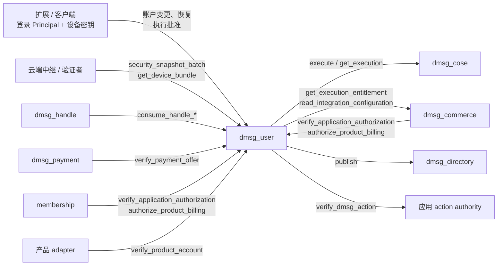

# dmsg_user

dMsg 的账户控制服务（user home）。它为每个账户保存以下状态，并通过 ICP certified data 对外证明：登录 Principal 绑定、设备公钥与能力、恢复等待期与待恢复申请、当前内容根承诺、敏感执行政策、设备签名的正式认证回执。它还持有一个初始化时随机生成的 `master_secret`，按登录身份向未撤销设备发放本机解锁秘密。这些状态只由本 canister 写入。账户以 12 字节 `AccountId`（Xid）标识，与名称、登录 Principal 都没有绑定关系。

以下数据不在本 canister：名称权属在 `dmsg_handle`；全设备丢失恢复时的内容根 vetKD 派生由 `dmsg_cose` 执行；频道、profile、联系人、消息和文件正文由云服务保存。

完整接口见 [dmsg_user.did](dmsg_user.did)，公开类型见 [dmsg_types::user](../dmsg_types/src/user.rs)，签名摘要与校验函数见 [dmsg_protocol](../dmsg_protocol/README_zh.md)，认证叶和字节规则见[公开协议](../../docs/protocol/README_zh.md)。

## 架构设计

### 组件关系



| 组件             | 与 user 的关系                                                                                                |
| ---------------- | ------------------------------------------------------------------------------------------------------------- |
| `dmsg_cose`      | 只接受账户所属 user home 提交的恢复派生 `ExecutionGrant`，派生 vetKey 并按请求去重；user 只记录它的结果       |
| `dmsg_commerce`  | 提供正式执行的月度权益租约、应用与产品配置；以 `user_homes` 登记本 canister                                   |
| `dmsg_directory` | 发布账户的 Agent Delegation principal 文档；只接受 `user_homes` 中的 home                                     |
| `dmsg_handle`    | 消费账户在 user 预先批准的名称意图                                                                            |
| `dmsg_payment`   | 按账户 ID 的分配器指纹，向收款账户所在的 home 校验设备签署的报价                                              |
| `membership`     | PANDA 订阅场景下核对账户的应用批准                                                                            |

### 接口与调用者

| 类别     | 方法                                                                                                                                                                                   | 调用者                                                                         |
| -------- | -------------------------------------------------------------------------------------------------------------------------------------------------------------------------------------- | ------------------------------------------------------------------------------ |
| 账户     | `create_account`、`accept_auth_binding`                                                                                                                                                | 待创建账户的登录 Principal；已获管理员批准、待接受绑定的新登录 Principal        |
| 账户     | `mutate_account`                                                                                                                                                                       | 账户的登录 Principal，附设备批准                                               |
| 恢复     | `request_recovery`、`complete_recovery`                                                                                                                                                | 恢复请求中的 `new_auth`，须已绑定本账户                                        |
| 执行     | `attest`、`attest_app_action`、`derive_root`、`reconcile_execution`、`inspect_app_action`、`refresh_execution_entitlement`                                                             | 账户的登录 Principal（认证与派生附设备批准）                                   |
| 外部批准 | `approve_authentication`、`approve_application`                                                                                                                                        | 账户的登录 Principal，附设备批准                                               |
| 服务回调 | `consume_handle_authorization`、`consume_handle_transfer_authorizations`、`verify_payment_offer`、`verify_application_authorization`、`authorize_product_billing`、`verify_product_account` | 初始化固定的 handle、payment、commerce 或 membership；`verify_product_account` 为已登记产品的 adapter |
| 发布     | `publish_principal`                                                                                                                                                                    | 任何人，幂等                                                                   |
| 维护     | `prune_executions`、`prune_external_approvals`                                                                                                                                         | 任何人，按游标分页，每页有界                                                   |
| 公开查询 | `security_snapshot_batch`、`get_device_bundle`、`get_principal`、`my_account`、`user_stats`、`user_config`                                                                             | 任何人                                                                         |
| 本人查询 | `get_account`、`get_operation`、`get_root_ref`、`get_execution`、`get_attestation`、`get_execution_receipt`、`get_execution_usage`、`authentication_certificate`、`get_recovery_request`、`unlock_secret` | 账户的登录 Principal；`unlock_secret` 只对未撤销设备返回                      |

管理入口是 `admin_set_account_limits(max_accounts, daily_new_accounts)` 与 `admin_set_admission_key(key)`，接受 controller 和初始化固定的 `governance`，各有同参数的 `validate_*` 供 SNS 通用提案预演。controller 还负责安装和升级，升级可以替换全部授权逻辑，也能读出 `master_secret`，因此 controller 等同于全部账户的最终权限。

`canister_inspect_message` 在执行前拒绝方法一定会拒绝的 ingress，避免由本 canister 支付：服务回调只接受对应的配置 canister（`verify_product_account` 只由产品 adapter 跨 canister 调用，拒绝全部 ingress），两个管理方法只接受 controller 和 governance，其余账户方法拒绝匿名 Principal；`prune_*` 与 `publish_principal` 对所有人开放。跨 canister 调用不经过 inspect，方法内的检查照常执行。

### 授权模型

敏感写入同时要求两层授权：

1. **登录 Principal**：caller 必须在账户的 `auth_bindings` 中（最多 8 个）。登录只能证明 caller 是谁，本身不授予设备权限。
2. **设备批准**：设备用 Ed25519 签名 `Approval`。被签名的摘要覆盖 user home、账户、操作域、命令摘要、设备、`security_epoch`、设备序号、`request_id` 和期限，期限最长 5 分钟。签名的设备必须未撤销，并具备该操作要求的能力。设备序号必须等于 `next_sequence`，成功后加 1。`security_epoch` 增加后，所有未提交的批准都会失效。

| 能力                              | 用途                                                                                   |
| --------------------------------- | -------------------------------------------------------------------------------------- |
| `RootManage`（角色须为管理员）    | 除 `DisputeRecovery` 外的全部账户变更、根预留与提交                                    |
| `VaultUnlock`                     | 根包只封装给持有它的活跃设备；云端据此放行账户密文读取（当前根、对象与文件块）        |
| `FormalApprove`                   | 文档与 AppAction 认证、第三方认证与应用批准                                            |
| `PaymentOffer`                    | 签署收款报价                                                                           |
| `ContentSign`                     | user 不检查此能力，由云端用于验证内容签名                                              |

账户变更统一经 `mutate_account(AccountMutation)` 提交。`expected_version` 必须等于当前 `account_version`。每次成功都会把批准设备的序号加 1、`account_version` 加 1，并把回执写入最近 16 条的操作窗口。用同一 `request_id`、同一参数重放，返回原回执；同 ID 换参数返回 `IdempotencyConflict`；回执移出窗口后，重放会因设备序号已前进而返回 `ResultExpired`。

| 命令                                                                            | 作用与约束                                                                                                 | `security_epoch` | 已有内容根时        |
| ------------------------------------------------------------------------------- | ---------------------------------------------------------------------------------------------------------- | :--------------: | ------------------- |
| `AddDevice`                                                                     | 新设备对 `dmsg/add-device/v1` 自签 PoP；活跃设备最多 5 台，含已撤销最多 16 台，满时淘汰最早撤销的一台      |        +1        | 新设备持有 `VaultUnlock` 时置 `RekeyRequired` |
| `RevokeDevice`                                                                  | 至少保留一台具备 `RootManage` 的管理员设备                                                                 |        +1        | 被撤销设备持有 `VaultUnlock` 时置 `RekeyRequired` |
| `SetDeviceCapabilities`                                                         | 只替换能力集，不改角色和密钥；同样须保留一台管理员                                                         |        +1        | `VaultUnlock` 增减时置 `RekeyRequired` |
| `BindAuth`                                                                      | 登记待接受的绑定，10 分钟内有效，每账户最多 4 条；新 Principal 用同一 nonce 调用 `accept_auth_binding` 才生效 |    接受时 +1     | 不变                |
| `RemoveAuth`                                                                    | 不能移除最后一个登录；被移除者的路由与它发起的待处理恢复同时删除                                           |        +1        | 不变                |
| `SetRecoveryDelay`                                                              | 恢复等待期 1–7 天；存在待处理的恢复申请时拒绝                                                              |        +1        | 不变                |
| `SetPolicy`                                                                     | 设置正式执行政策：允许的用途、每日次数、`frozen`                                                           | +1，并清除候选根槽 | 不变              |
| `ReserveRoot`、`CommitRoot`                                                     | 内容根 CAS，见下文                                                                                         |       不变       | `CommitRoot` 置 `Ready` |
| `AuthorizeHandle`                                                               | 保存精确的名称意图，批准期限不超过 60 秒，每账户最多 32 条                                                 |       不变       | 不变                |
| `DisputeRecovery`                                                               | 任意未撤销设备可提交，取消待处理的恢复申请                                                                 |       不变       | 不变                |
| `EnablePrincipal`、`RetireController`、`MarkControllerCompromised`、`RenameController` | 修改 Agent principal 记录                                                                           |       不变       | 不变                |
| `RegisterController`                                                            | 附 controller 私钥对 `dmsg/controller-pop/v1` 的 PoP                                                       |       不变       | 不变                |

`security_epoch` 增加时，尚未接受的绑定批准一并撤回。换根只在根包接收者（持有 `VaultUnlock` 的活跃设备）变化时才需要：登录身份不是接收者，其他能力也不影响根包。`SensitivePolicy.frozen` 冻结正式认证、外部批准和付款报价，不影响账户变更，管理员可以用 `SetPolicy` 解冻。

### 账户创建与登录绑定

`create_account(CreateAccount)` 由新 Principal 调用：

- caller 已有路由时直接返回原账户，所以重试是安全的。
- 配置了 `admission_key` 时，须附带该密钥签发的 `AdmissionTicket`：对 `dmsg/account-admission/v1`（home、caller、期限）的 Ed25519 签名，期限最长 10 分钟。票据由云端按来源限流签发（[cloud 合同](../../docs/protocol/cloud_zh.md)），只用于防滥用，不授予账户或设备权限。每个 Principal 在一个 home 只能建一个账户，所以票据不需要 nonce。未配置时任何非匿名 Principal 都可以创建。
- 受全局 `max_accounts` 和每 UTC 日 `daily_new_accounts` 限制；票据签发方失控也越不过这两个上限。
- 初始设备必须是同时具备 `RootManage` 与 `VaultUnlock` 的管理员，并对 `dmsg/create-account/v1`（home、caller、设备、`op_id`、期限）签名，期限最长 5 分钟。
- `AccountId` 由持久化的 `XidGenerator` 分配，格式为 `秒级时间戳[4] ‖ 分配器指纹[5] ‖ 计数[3]`。指纹由 `(environment, issuer_namespace, 本 canister)` 派生；同一秒内或时钟回退时继续递增计数，计数耗尽时明确失败。
- 账户、登录路由、日配额和分配器在同一消息内提交。

`AUTH` 表把每个 Principal 映射到至多一个账户。为已有账户增加登录分三步：

1. 新登录在本机生成 nonce，把绑定请求（home、账户、Principal、nonce）交给管理员设备。这一步不调用 canister。
2. 管理员设备批准 `BindAuth { principal, nonce }`，账户内登记一条待接受的绑定，10 分钟内有效，每账户最多 4 条；再次批准同一 Principal 会替换旧项。
3. 新登录调用 `accept_auth_binding(account_id, nonce)`。nonce 和待接受项一致时，它加入 `auth_bindings` 并写入登录路由，`account_version` 与 `security_epoch` 各 +1。已绑定时重试返回成功；已路由到其他账户的 Principal 返回 `IdempotencyConflict`。

登录自己的调用就是它同意绑定的证明，管理员不能把别人的 Principal 绑进账户。待接受项只存在账户内、只有管理员设备能写入，没有可被他人占满的全局表。

`RemoveAuth` 和恢复完成会删除被移除 Principal 的路由，这些 Principal 之后可以创建或绑定其他账户。

### 恢复

没有恢复码。绑定过的登录 Principal 加链上等待期是最终恢复权；登录身份和全部设备都丢失则不可恢复。

1. **发起**：`request_recovery(account_id, request, device_proof)` 只能由 `request.new_auth` 调用，且 caller 必须已在 `auth_bindings` 中。新设备附 `dmsg/recovery-device/v1` PoP，且必须是同时具备 `RootManage` 与 `VaultUnlock` 的管理员。请求期限必须晚于 `now + recovery_delay_ms`，最长 14 天。重复提交同一请求沿用已存的期限；要提交另一请求，须等前一请求过期或被取消。
2. **取消**：账户的任意未撤销设备提交 `DisputeRecovery { op_id }` 即删除申请。提出争议的设备在手，它可以直接走配对，不需要再确认流程。用 `RemoveAuth` 解除发起申请的登录同样删除申请，接管权随登录绑定一起失效。
3. **完成**：等待期结束后，`new_auth` 调用 `complete_recovery(account_id, request_id)`：全部设备替换为请求中的新设备，全部登录替换为 `new_auth` 并删除旧路由，`security_epoch` +1，已有根时置 `RekeyRequired`，并记录 `recovered_device = (device_id, 当前根代次)`。账户保留最近一次完成回执，原 caller 用同一请求重试返回成功，不会重复执行。
4. **取回内容根**：恢复设备取得 `unlock_secret` 后，用 `derive_root` 派生当前代根的 vetKey（见下文），解开根包的 IBE 恢复信封，然后换根。换根前可凭新的批准再次派生（计入每日执行次数）；换根后 `recovered_device` 清除，派生权消失。

`recovery_delay_ms` 默认 3 天，`SetRecoveryDelay` 可设 1–7 天。等待期是对登录身份被盗的唯一缓解：期间所有设备都没响应即内容泄露。

### 本机解锁秘密

`unlock_secret(account_id, device_id)` 是普通 query：caller 必须是账户的登录 Principal，设备必须存在且未撤销，返回 `digest("dmsg/unlock-secret/v1", (master_secret, account_id, device_id))`，即带域分隔的 SHA-256。`master_secret` 在 `init` / `post_upgrade` 的 timer 中由 `raw_rand` 生成一次（`user_stats.unlock_ready` 显示是否就绪，安装后几个执行轮即就绪），升级保留。客户端用它派生本机解锁钥封装本机数据密钥；撤销设备即停止发放。

能读到解锁秘密的不只是登录身份：子网节点运营者能读 canister 状态，controller 与 SNS 可以通过升级读出 `master_secret`，query 响应经 API 边界节点明文中转。它们还需要设备的本机密文副本才能解密。`master_secret` 没有轮换机制，派生域中的 `v1` 留作以后的版本；轮换需要新增秘密版本，并让每台设备在下次登录解锁时用新秘密重封本机数据密钥。

### 内容根

账户保存当前根承诺 `current_root`（代次、套件 `dmsg-root-v2`、`bundle_digest`、`recipients_digest`、`body_digest`）和 `vault_write_state`（`Uninitialized`、`Ready`、`RekeyRequired`）。换根顺序：

1. `ReserveRoot(expected_generation, op_id)` 预留 15 分钟的候选槽。代次来自单调计数器，过期的槽会留下代次间隙；未过期的槽会阻止新的预留。
2. 管理员设备在本地生成随机根，按持有 `VaultUnlock` 的活跃设备各封装一份 HPKE 信封，再用 COSE 的内容根公钥封装一份该代的 IBE 恢复信封，上传不可变 RootBundle。
3. `CommitRoot` 核对槽、代次、`security_epoch`、期限，要求批准设备本身是接收者，并重算 `recipients_digest = digest("dmsg/root-recipients/1", (接收者 ID 升序, generation))` 与 `bundle_digest = digest("dmsg/root-bundle-digest/2", (recipients_digest, body_digest))`，两者都相符才提交，置 `Ready`。已撤销或没有 `VaultUnlock` 的设备收不到新根，未批准的设备也无法被塞进根包。

其他接收者读取当前根时直接下载根包、解开自己的信封，不调用链上密钥；没有 `VaultUnlock` 的设备没有信封。user 不根据 `vault_write_state` 拒绝请求，由云端和客户端在写入前检查。RootBundle 格式与客户端流程见[账户与根合同](../../docs/protocol/account_root_zh.md)。

### 正式执行

| 执行类型        | 入口                              | 设备能力                              | 产出                                  |
| --------------- | --------------------------------- | ------------------------------------- | ------------------------------------- |
| 认证            | `attest`、`attest_app_action`     | `FormalApprove`                       | 设备签名的 COSE_Sign1 与认证回执      |
| 派生            | `derive_root`                     | 恢复完成所登记的设备                  | 加密的 vetKD 根密钥                   |

**认证**（`attest_statement`）：请求携带设备对 COSE Sig_structure 的 Ed25519 签名（kid 为设备公钥的 RFC 9679 指纹）和 `dmsg/attest/v1` 批准（覆盖 statement、origin 与该签名）。步骤：

1. 计算请求指纹。同一 `request_id` 已有记录时，参数一致则返回原产物，不一致则返回 `IdempotencyConflict`。
2. 只读预检：账户未冻结；`request_id` 等于 `execution_request_id(account, epoch, device, sequence)`；设备批准与能力；用途在政策内、origin 合法、issuer 属于本账户；验签 Sig_structure；保留窗口和每日次数有余量。
3. 没有有效的当月租约时先向 commerce 刷新权益；AppAction 还要核对应用配置、按登记的 schema 校验命令，并调用应用的 `verify_dmsg_action`。每次 await 返回后，都重新读取时间、账户和执行记录，重新预检。
4. 同步提交：当月额度、设备序号、保留索引、产物、回执认证叶在同一消息内写入。没有跨 canister 的签名调用；认证不占用执行序号，COSE 的执行窗口只按派生连续推进。

丢失回复用 `get_attestation(account_id, request_id)` 取回同一产物。`get_execution_receipt` 返回 schema 2 的认证回执叶，绑定 issuer、设备、批准上下文、待签字节摘要、设备公钥指纹和签名摘要；结果清理后返回可验证的不存在证明。

**派生**（`derive_root`）：只接受 `recovered_device` 登记的设备对当前根代次的请求，直到它提交新根，批准域 `dmsg/derive-root/v1` 覆盖代次、传输公钥与 `max_cycles`（1–100B）。授权在同一消息内提交，再调用 COSE `execute`：

| 结果                     | 含义                                                         | 客户端处理                                             |
| ------------------------ | ------------------------------------------------------------ | ------------------------------------------------------ |
| `Authorized`             | 已授权，COSE 尚未记录（调用未发出、COSE 业务拒绝或回调丢失） | 用原请求重试，或 `reconcile_execution`；不能换 ID 重签 |
| `Executing`、`Unknown`   | 在途，或管理 canister 调用结果未知                           | `reconcile_execution`                                  |
| `Completed`              | 输出已与请求和 key 描述比对                                  | 终态                                                   |
| `Failed`                 | COSE 记录的失败                                              | 终态                                                   |
| `ResultExpired`          | COSE 已清理该结果                                            | 终态                                                   |

`reconcile_execution` 先查询 COSE。COSE 没有记录时重新发送原授权；查询本身的传输失败直接返回错误，不改写记录。

每个账户最多保留 64 条执行（认证与派生共用）。未终结的执行一直占位；终态结果保留到批准期限后 1 天，之后在该账户下次授权时清理。账户停用后留下的结果由公开的 `prune_executions(after)` 回收：它按执行表的游标跨账户分页，一页最多 64 条记录，用掉 20B 指令后在账户边界提前结束。账户登录发起的跨 canister 调用（刷新权益、AppAction 核对、外部批准、派生与对账）每 UTC 小时最多 120 次，计数在调用发出前提交，失败的调用也计数。每日次数由 `SetPolicy` 的 `daily_executions`（默认 20，上限 64）限制，认证与派生共用；认证结果保留一天，上限因此与保留窗口相同；user 不另设 cycles 预算。派生的 cycles 由 COSE 按调用成本上界预留，返回终态后结算为 `cycles_charged`；COSE 没有执行的派生退回 user 的次数。

### 商业月账

每个账户每个 UTC 月份有一条月账，记录允许和已扣的单位数、算法权重、各项 revision，以及租约期限。租约期限取 commerce 资源租约截止与 60 分钟后两者较早者：现金和 Free 的资源租约最长 30 天，月账仍至少每小时重新核对一次，升级套餐后无需手动刷新。

- 从未购买的账户在 commerce 没有记录，commerce 按目录和本 canister 提供的账户创建时间计算 Free 额度，租约版本为 0。版本 0 不做同版本摘要比对；购买后的主体从版本 1 开始，单调检查照常成立。
- 认证在提交它的同一消息内按算法权重扣减当月单位，授权期限截到租约期限为止；没有预留，也没有事后结算。
- `refresh_execution_entitlement` 无论缓存是否有效都重新获取权益，保留当月已扣的单位。
- 根派生、恢复与本机解锁不消耗商业单位。
- `get_execution_usage` 只允许账户本人调用。月账不是认证数据：`refresh_execution_entitlement` 的 update 回复本身经子网认证，客户端以它为准。

只保留当月和上个月：新建当月月账时删除该账户更早的月账。月账键为 `AccountId ‖ YYYYMM`，同一账户的月账相邻。字节与验证规则见 [commerce 合同](../../docs/protocol/commerce_zh.md)。

更早的记录分两路保存：

- **home 汇总**：每次扣费同时累加本 home 当月的汇总，即扣过费的账户数、认证次数和加权单位，保存在配置中，保留最近 12 个有扣费的月份（`EXECUTION_STATS_MONTHS`）。`user_stats.execution_months` 公开返回，从新到旧，没有扣费的月份不出现。汇总不含逐账户数据，按月公开的执行报表可以直接对照链上数字。
- **逐账户历史**：由客户端归档。`dmsg_app` 每次刷新额度前，用 `get_execution_usage` 读取上月和上上月的月账，写成 `usage:{AccountId}:{YYYYMM}` 的 commerce 日志，随 vault 加密同步到云端，云端只见密文。值未变时不产生新版本。新月份第一次刷新才删除旧月账，所以只要该账户在删除前用过客户端，月账就不会丢；从未打开客户端的月份不会归档。归档值来自本人 query，不是认证数据，只供本人查看。

### 名称、付款与第三方批准

- **名称**：`AuthorizeHandle` 保存精确的 `HandleIntent`；handle 调用 `consume_handle_*` 只读核对意图，不再检查设备与账户状态。完整流程见 [dmsg_handle](../dmsg_handle/README.md)。
- **付款报价**：`verify_payment_offer` 只接受配置的 payment canister，核对设备的 `PaymentOffer` 能力、账户状态、`security_epoch`、期限和签名。重复使用同一报价由 payment 去重。
- **第三方认证**：`approve_authentication` 签发认证叶，最长 5 分钟；本人通过 `authentication_certificate` 取证书。
- **应用批准**：`approve_application` 记录精确批准。commerce 或 membership 用 `verify_application_authorization` 和 `authorize_product_billing` 复核，产品 adapter 用 `verify_product_account` 确认账户可用。
- **配额**：每个账户最多 32 条未过期的外部批准，每 UTC 小时最多成功批准 60 次。拒绝请求和重取同一批准不占额度。
- **前提**：应用由 commerce 治理登记；本 canister 必须在该 commerce 的 `user_homes` 中，应用登记本身不再列 home。精确字节见 [integration](../../docs/protocol/integration.md)。

### Agent Delegation principal

- **启用**：`EnablePrincipal` 创建账户的 principal 记录，`principal_id = principal_origin + "/" + AccountId`。
- **注册 controller**：`RegisterController` 附 controller 私钥对 `dmsg/controller-pop/v1`（home、账户、代次、授权范围、批准请求 ID）的 Ed25519 签名，home 验签后提交；私钥由客户端保存在 vault 中。
- **修改**：controller 的退役、标记泄露和改名都会推进记录版本，但不改变 `security_epoch`。
- **发布**：提交后立即向 directory 发布。发布失败不影响已提交的变更，任何人都可以用 `publish_principal` 重试，`published_version` 只增不减。
- **签名**：事件由客户端用 vault 中的 controller key 在本机签名并提交到 delegation 服务，不经过 user home；签发与管理凭证的权限上限由服务按认证文档检查。

协议见 [Agent Delegation](../../docs/protocol/agent_zh.md)。

### 认证数据

认证树存放在 stable memory（`dmsg_runtime::cert_map`，memory 9、10），只保存 key 与哈希；查询时从对应记录重新生成认证值并与已认证哈希核对。每次写入只更新一条路径并发布新根，叶路径和验证方式与此前相同。

| 叶路径                                          | 值                                 | 查询                                          |
| ----------------------------------------------- | ---------------------------------- | --------------------------------------------- |
| 12 字节 `AccountId`                             | `SecuritySnapshot`（schema 4）     | `security_snapshot_batch`，任何人，每次 1–64 个 |
| `execution/` ‖ 账户 ‖ `request_id`              | `ExecutionReceipt`（schema 2），仅认证 | `get_execution_receipt`，本人             |
| `authentication/v1/` ‖ 账户 ‖ 操作 ID           | `AuthenticationResult`             | `authentication_certificate`，本人            |

`SecuritySnapshot` 包含 issuer、home、`account_version`、`security_epoch`、`devices_root`（`digest("dmsg/devices/v1", devices)`）、恢复等待期、待恢复申请摘要、当前根代次与摘要、`vault_write_state` 和 principal 更新时间，不含登录 Principal。

验证者须核对信任根、canister ID、证书时间（新鲜度 60 秒）和 witness。认证值在查询时由记录重新生成，再与升级保留的叶哈希比对，编码一旦变化，所有已有叶的查询都会 trap；单元测试 `certified_value_encodings_are_pinned` 固定了 `SecuritySnapshot` 与 `ExecutionReceipt` 的编码摘要，改动编码前须先提供逐叶重认证。`get_account` 和 `get_device_bundle` 是普通 query，客户端要用认证快照中的 `account_version` 和 `devices_root` 核对它们返回的数据。

### 存储

稳定布局为 schema 14，`post_upgrade` 遇到其他 schema 直接失败，布局变化须编写显式迁移。开发阶段不迁移 schema 13 的全局待绑定表、64 条回执窗口与哈希键月账。`MemoryManager` 使用默认的 128 页（8 MiB）分配桶，32,768 个桶共可寻址 256 GiB。

| Memory | 内容                                                                    |
| -----: | ----------------------------------------------------------------------- |
|      0 | `CONFIG`：`UserInit`、Xid 分配器与完整命名空间摘要、每日创建计数、`master_secret`、最近 12 个月的执行汇总 |
|      1 | `ACCOUNTS`：`AccountId` → `AccountState`                                |
|      2 | `AUTH`：登录 Principal → `AccountId`                                    |
|      3 | `CALLS`：`AccountId` → 本 UTC 小时登录发起的跨 canister 调用数          |
|      4 | 已停用，不再使用                                                        |
|      5 | `EXECUTIONS`：`AccountId ‖ request_id` → 认证产物与回执，或派生授权与结果 |
|      6 | `MONTHS`：`AccountId ‖ YYYYMM` → 月账（不进入认证树）                   |
|      7 | `EXTERNAL`：`AccountId` → 第三方认证与应用批准                          |
|      8 | `PRINCIPALS`：`AccountId` → Agent principal 记录与 nonce                |
|      9 | 认证 map 的叶子：key → 认证值哈希                                       |
|     10 | 认证 map 的 crit-bit 内部节点                                           |

`AccountState` 的各个集合都有上限：设备 16、登录 8、待接受绑定 4、操作回执 16、名称意图 32、执行保留索引 64。执行载荷单独存表，普通账户操作不读取历史载荷。私有的 `stable_codec.rs` 用 CBOR 整数 map key 保存记录，不影响公开的 Candid、摘要和认证叶编码。

没有 `pre_upgrade`，heap 不保存业务状态。`post_upgrade` 校验分配器后只发布认证树的根，不扫描账户，并在日志中记录 `dmsg_user upgrade: instructions=… wasm_memory_bytes=…`。

### 容量与成本

| 限制                         | 值                                                      |
| ---------------------------- | ------------------------------------------------------- |
| 账户总数                     | `max_accounts`，1–21,000,000（`MAX_HOME_ACCOUNTS`）     |
| 每 UTC 日新账户              | `daily_new_accounts`，1–100,000，全局共享               |
| 注册准入                     | 配置 `admission_key` 后每个新账户须附票据，期限 ≤ 10 分钟 |
| 每账户待接受绑定             | 4 条，10 分钟                                           |
| 每账户登录 / 活跃设备 / 设备 | 8 / 5 / 16                                              |
| 设备批准期限                 | 5 分钟；名称意图 60 秒                                  |
| 每账户操作回执               | 最近 16 条                                              |
| 每账户执行保留               | 64 条；每日次数上限同为 64                              |
| 单次执行                     | 派生 `max_cycles` ≤ 100B；签名输入 ≤ 64 KiB              |
| 每账户外部批准               | 32 条未过期，每小时成功 60 次                           |
| 每账户跨 canister 调用       | 每 UTC 小时 120 次                                      |

每个账户的 stable 占用（主机用本 canister 的稳定表、编码与认证树写入合成账户测得，含账户表、登录路由和认证树）：

| 账户形态                                         | 账户记录 | 每账户合计 |
| ------------------------------------------------ | -------: | ---------: |
| 新账户：1 台设备、1 个登录                        |    383 B |     约 0.8 KB |
| 活跃账户：3 台设备、2 个登录、已有根、16 条回执   |   2.2 KB |     约 2.7 KB |
| 全部集合打满                                     |  13.5 KB |    约 15.4 KB |

活跃账户另有保留期内的认证产物（短文本约 1.2 KB/条，含回执认证叶）和最多两条月账（约 100 B/条）。

2026-10-08 用 PocketIC 16.0.0 与 release Wasm 加载主机构建的 stable 镜像实测（`user_capacity_profile`）。镜像中五分之一是活跃账户，各留一条过期认证和两条月账，其余是新账户。cycles 只统计 user canister，含 ingress 接收费：

| 账户数 | stable | `post_upgrade` 指令数 | `create_account` | `mutate_account` | `attest` | 64 个账户的 `security_snapshot_batch`（复制执行） | `prune_executions` 一页 |
| -----: | -----: | --------------------: | ---------------: | ---------------: | -------: | -----------------------------------------------: | ----------------------: |
|   1 万 | 56 MiB |             1,384,757 |            13.4M |            16.7M |    24.5M |                                             8.9M |                    147M |
| 100 万 | 1.77 GiB |           1,404,868 |            14.1M |            17.3M |    28.4M |                                             8.9M |                    170M |

- 账户数增加 100 倍，单次写入的 cycles 只增加 4%–16%：B 树和认证树的深度按对数增长。按同样比例外推，2,100 万账户时一次写入约 1,500 万–3,200 万 cycles。升级成本与账户数无关。
- 按上述镜像的平均 1.9 KB/账户推算，2,100 万账户约 40 GB；全部为活跃账户（各留一条短认证和两条月账，约 4.1 KB）约 86 GB；都在 `MemoryManager` 的 256 GiB 地址空间内。只有每个账户的全部集合都打满（约 15.4 KB）时才会超出（约 323 GB）。
- 日常消息不调用 user home。账户变更、认证等 update 若按 2,100 万账户、10% 日活、每人每天 1–2 次计，平均每秒约 25–50 次；单个 canister 顺序执行消息，高峰时的子网吞吐须按目标负载在主网核对。
- 2,100 万的上限按存储推算，100 万档实测验证了增长趋势，没有在 2,100 万规模上实测。

恢复派生的阈值费用由 COSE 支付：PocketIC 中一次 vetKD 派生的成本上界约 68.3B cycles，实际扣费 26.15B；客户端默认批准上限 `rootDerivationMaxCycles` 70B，预算在结果返回后结算到实际扣费。主网费用须部署时核对。

## 部署流程

### 依赖关系

`UserInit` 引用 COSE、handle、payment、commerce、membership 和 directory；COSE、handle、payment、commerce 与 directory 又要在各自的 `user_homes` 中登记本 canister。所以先创建全部 canister ID，再分别安装。

### 初始化参数

`max_accounts`、`daily_new_accounts` 可由 `admin_set_account_limits` 调整，`admission_key` 可由 `admin_set_admission_key` 轮换或清除，其余字段安装后不可修改；`post_upgrade` 不读取参数。

| 字段                  | 要求                                                                                                                                       |
| --------------------- | ------------------------------------------------------------------------------------------------------------------------------------------ |
| `environment`         | 生产为 `Production`，须与 COSE、directory、commerce、membership 相同。它参与账户 ID 指纹；只有 `Local` 接受 `http://localhost` origin       |
| `issuer_namespace`    | 以 `/` 或 `:` 结尾，不含 query 和 fragment，与 `CoseInit`、`DirectoryInit` 的同名字段相同。它是每个账户 issuer URI 的前缀，永久不变        |
| `home_cose`           | 本部署的 `dmsg_cose`，其 `CoseInit.user_homes` 包含本 canister。新账户都绑定它                                                             |
| `handle_canister`     | `dmsg_handle`，其 `HandleInit.user_homes` 包含本 canister                                                                                  |
| `payment_canister`    | `dmsg_payment`，其 `PaymentInit.user_homes` 包含本 canister                                                                                |
| `commerce_canister`   | `dmsg_commerce`，其 `CommerceInit.user_homes` 包含本 canister                                                                              |
| `membership_canister` | 共享的 `membership`，可以复用已核验的实例                                                                                                  |
| `directory_canister`  | `dmsg_directory`，其 `user_homes` 包含本 canister，`principal_origin` 相同                                                                 |
| `principal_origin`    | Agent principal ID 的 HTTPS origin，如 `https://id.dmsg.net`，永久不变                                                                     |
| `max_accounts`        | 1–21,000,000。升级成本与账户数无关，按运营预期设定，之后可用 `admin_set_account_limits` 调整                                              |
| `governance`          | 固定的 SNS governance，与 controller 一起可调用 `admin_set_account_limits`                                                                 |
| `daily_new_accounts`  | 1–100,000，每 UTC 日全局计数；旧用户集中迁移时可临时调高                                                                                   |
| `admission_key`       | 注册准入票据的 Ed25519 公钥；`null` 表示开放注册。私有云端持有对应私钥并按来源限流签发，开放注册前应配置                                   |

参数不合法时安装失败：canister 是匿名或管理 canister principal、命名空间或 origin 格式错误、配额越界。

### 步骤

以下命令在仓库根目录执行，以 `--network ic` 为例；本地开发去掉该参数，`environment` 改为 `Local`。

1. 在待部署的提交上完成验证。脚本会构建 release Wasm，并核对 Candid、协议向量和 PocketIC 回归；工作区应没有未提交的改动：

   ```sh
   POCKET_IC_BIN=/path/to/pocket-ic make test-dmsg
   ```

2. 创建 canister ID（`membership` 复用已有实例时跳过）：

   ```sh
   for c in dmsg_user dmsg_cose dmsg_handle dmsg_payment dmsg_commerce dmsg_directory; do
     dfx canister create "$c" --network ic
   done
   ```

3. 安装 `dmsg_user`：

   ```sh
   cid() { dfx canister id "$1" --network ic; }
   dfx deploy dmsg_user --network ic --argument "(record {
     environment = variant { Production };
     issuer_namespace = \"<ISSUER_NAMESPACE>\";
     home_cose = principal \"$(cid dmsg_cose)\";
     handle_canister = principal \"$(cid dmsg_handle)\";
     payment_canister = principal \"$(cid dmsg_payment)\";
     commerce_canister = principal \"$(cid dmsg_commerce)\";
     membership_canister = principal \"<MEMBERSHIP_ID>\";
     directory_canister = principal \"$(cid dmsg_directory)\";
     principal_origin = \"<PRINCIPAL_ORIGIN>\";
     max_accounts = <MAX_ACCOUNTS> : nat64;
     daily_new_accounts = <DAILY_NEW_ACCOUNTS> : nat32;
     governance = principal \"<SNS_GOVERNANCE_ID>\";
     admission_key = opt blob \"<ADMISSION_PUBLIC_KEY_32_BYTES>\";
   })"
   dfx canister info dmsg_user --network ic
   ```

   `dfx deploy` 按 dfx.json 以 `optimize: cycles` 和 gzip 构建。用 `dfx canister info` 记录实际模块哈希和 controllers，并保存本次安装参数。

4. 按各自 README 安装其余 canister，所有指向 user 的字段都填 `$(cid dmsg_user)`。COSE 安装后由 controller 或 governance 调用 `initialize_keys`，`key_state` 显示 `Ready` 且公钥指纹与生产 key 一致后才能执行。见 [dmsg_cose](../dmsg_cose/README.md)、[dmsg_handle](../dmsg_handle/README.md)。

5. 由 commerce 治理登记应用与产品。第三方认证、应用批准和 AppAction 依赖这些登记；不需要这些功能时可以稍后登记。

6. 设置 controllers 与 freezing threshold，建议不少于 90 天：

   ```sh
   dfx canister update-settings dmsg_user --network ic \
     --add-controller <备用 controller> \
     --freezing-threshold 7776000
   ```

7. 在 `dmsg_handle` 的 `registration_homes` 中加入本 canister（`admin_set_registration_homes`），再在 `src/dmsg_app/dmsg.config.json` 填写 `environment`、`principalOrigin` 和 `canisters.*`（可把本 canister 列入 `canisters.userHomes` 作为交叉核对），重新构建客户端，见 [dmsg_app](../dmsg_app/README.md)。

8. 部署后用一个测试账户走完整链路，并在主网核对费用：
   1. 创建账户，取得 `unlock_secret` 完成本机绑定。
   2. `ReserveRoot` → 上传根包 → `CommitRoot`。
   3. 第二台设备 `AddDevice`、换根后打开当前根。
   4. 一次文档认证。
   5. 一次登录恢复：申请、等待、完成、`derive_root`、换根。

   每一步都用客户端校验 `security_snapshot_batch` 的证书。记录 COSE 返回的 `cycles_cost_upper_bound`，确认它与客户端的 `rootDerivationMaxCycles` 相符。

### 运维与升级

- **cycles**：账户创建、设备批准和外部批准等 update 调用都由本 canister 付费；未配置 `admission_key` 时，任何非匿名 Principal 都可以免费调用 `create_account`。要监控余额和每日新账户数；阈值签名与 vetKD 的费用由 COSE 承担，需要另外监控。
- **清理**：过期数据在账户下次写入时惰性清理；停用账户留下的数据由公开的分页清理回收，应定期运行。从空游标开始，按返回的游标继续，返回 `null` 时结束：

  ```sh
  dfx canister call dmsg_user prune_executions '(blob "")' --network ic
  dfx canister call dmsg_user prune_external_approvals '(blob "")' --network ic
  ```

  `prune_executions` 一页最多 64 条执行记录，用掉 20B 指令后在账户边界提前结束；100 万账户时一页约 1.7 亿 cycles。它只删除保留期已过的终态结果，不改动未终结执行、设备序号和月账。

- **升级**：要求 schema 不变。先停止 canister，让在途的跨 canister 调用完成（全部调用都是 bounded-wait，会在超时后返回），创建快照，再升级、启动并查看日志：

  ```sh
  dfx canister stop dmsg_user --network ic
  dfx canister snapshot create dmsg_user --network ic
  dfx deploy dmsg_user --network ic --argument-type raw --argument 4449444c0000
  dfx canister start dmsg_user --network ic
  dfx canister logs dmsg_user --network ic
  ```

  Candid 服务声明了 `UserInit` 初始化参数，dfx 升级时不带参数会报错。`post_upgrade` 不读取参数，所以传空 Candid 参数 `()`，即 hex `4449444c0000`；重新提供 `UserInit` 不会修改配置。

  日志中的 `instructions=` 是 `post_upgrade` 的指令数。认证树不再重建，它不随账户和月账增长。

- **回滚**：升级后发现问题时，载入升级前的快照：

  ```sh
  dfx canister stop dmsg_user --network ic
  dfx canister snapshot list dmsg_user --network ic
  dfx canister snapshot load dmsg_user <SNAPSHOT_ID> --network ic
  dfx canister start dmsg_user --network ic
  ```

  快照包含 Wasm、stable memory、heap 与认证数据，载入后证书与记录一致。快照之后的写入全部丢失：新账户、设备与登录变更、认证回执和月账扣费；handle、COSE 与云端可能已经引用这些状态，所以只在升级后立即发现问题时使用。回滚后新分配的账户 ID 以当前秒开头，不会与回滚前发出的 ID 重复。快照占用与 canister 状态同等的存储，确认升级无误后用 `dfx canister snapshot delete` 删除。PocketIC 回归 `a_snapshot_restores_accounts_and_their_certified_state` 演练了这一流程。

- **回调丢失**：未停止就升级，或调用结果未知时，执行会停在 `Authorized`、`Executing` 或 `Unknown`。客户端用 `reconcile_execution` 恢复，不能换新 ID 重签。

## 当前限制

- **容量**：单 home 上限 2,100 万由存储推算，100 万档实测验证了增长趋势（见“容量与成本”）；更大规模与主网吞吐没有实测。
- **配置不可变**：除两个配额外，配置在安装后不可变。
- **注册准入**：`daily_new_accounts` 是全局额度，账户不可删除。配置 `admission_key` 后，新账户须持有云端限流签发的票据；未配置时，批量生成的非匿名 Principal 可以占满当日额度并长期占用 `max_accounts`。登录绑定的待接受项只在账户内，不再有全局额度。
- **多 home**：可以部署多个 user home，各服务按账户 ID 的分配器指纹把账户路由到所属 home。新 home 须在 COSE、handle、payment、commerce、directory 用 `admin_add_user_home` 登记（登记前用新 home 的 `user_config` 核对 environment、issuer_namespace 与各服务 canister），并加入 handle 的 `registration_homes` 才接收新账户。账户的 `home_user` 和 `home_cose` 不可迁移；同一登录 Principal 可以在不同 home 各建一个账户，跨 home 的唯一性和账户迁移都没有实现。
- **本机解锁秘密**：`master_secret` 由 canister 持有，节点运营者、controller / SNS 与 API 边界节点都可能读到（见“本机解锁秘密”），且没有轮换机制；它只对持有设备本机密文副本的人有用。
- **未验收**：生产部署、主网费用、真实外部应用与产品、扩展端到端流程都没有验收。

## 实现

| 文件                  | 内容                                                                                   |
| --------------------- | -------------------------------------------------------------------------------------- |
| `src/api.rs`          | Candid 入口、初始化与升级、账户创建与绑定、执行授权与 COSE 调度、恢复入口、服务回调 |
| `src/account.rs`      | 设备批准校验和全部账户变更命令                                                         |
| `src/execution.rs`    | 认证与派生的预检、同步提交、COSE 结果校验与回执叶                                      |
| `src/recovery.rs`     | 登录恢复的申请、取消与完成                                                             |
| `src/commerce.rs`     | 月账：权益刷新、预留与结算                                                             |
| `src/external.rs`     | 第三方认证与应用批准、AppAction 准入、产品账户核对                                     |
| `src/principal.rs`    | Agent principal 记录、controller PoP 与目录发布                                        |
| `src/state.rs`        | 账户与执行的内部记录                                                                   |
| `src/store.rs`        | 稳定表、配置、`master_secret` 与解锁秘密、认证树写入、执行清理                        |
| `src/xid.rs`          | 账户 ID 分配器的命名空间校验                                                           |
| `src/capacity.rs`     | 容量压测用的主机 stable 镜像（仅测试）                                                 |
| `src/stable_codec.rs` | 紧凑 CBOR 稳定表示                                                                     |

实现参考 ICP 官方的 [Stable structures](https://docs.internetcomputer.org/languages/rust/stable-structures/)、[跨 canister 调用安全](https://docs.internetcomputer.org/guides/security/inter-canister-calls/)与[性能测量](https://docs.internetcomputer.org/guides/canister-management/optimization/)指引。

## 验证

```sh
cargo test -p dmsg_user
POCKET_IC_BIN=/path/to/pocket-ic bash scripts/test-dmsg.sh
```

单元测试覆盖：根 CAS 原子性、代次不复用与 recipients/bundle 摘要校验、根包只封装给持有 `VaultUnlock` 的设备且只在接收者变化时换根、认证值编码摘要、设备能力与管理员约束、撤销与认证的先后顺序、登录恢复的申请/争议取消/完成与派生权、`unlock_secret` 权限、预算原子性、派生回调与并发变更、名称意图续期、Agent principal 单调性与 PoP、稳定编码 round-trip、注册准入票据、登录绑定的批准与接受、操作回执窗口、home 执行汇总的累加与 12 个月滚动。

PocketIC 回归覆盖：

- [control_plane.rs](../../tests/dmsg_integration/tests/control_plane.rs) `identity_roots_certification_attestation_recovery_and_upgrade`：根 CAS、认证与回执、登录恢复、派生与 IBE 往返、升级。
- [user.rs](../../tests/dmsg_integration/tests/control_plane/user.rs)：认证按月计费一次并重放产物、名称意图续期、政策变更、清理后按原月份结算、商业回调期间的并发变更、登录路由删除、对账传输失败、月账只保留当月与上月、home 月度汇总只累加成功的扣费。
- [user_review.rs](../../tests/dmsg_integration/tests/control_plane/user_review.rs)、[review_regressions.rs](../../tests/dmsg_integration/tests/control_plane/review_regressions.rs)：inspect 拒绝非服务方与匿名 ingress、外部调用前拒绝非配置服务、恢复完成重试、登录绑定须管理员批准后由新登录接受、注册准入票据与治理轮换、跨账户分页清理、每小时调用上限、快照回滚、独立清理、文件声明认证、保留窗口与升级、登录恢复可见/争议/完成、无效传输公钥、已清理请求 ID 不可复用。
- [external_integration.rs](../../tests/dmsg_integration/tests/control_plane/external_integration.rs)、[agent.rs](../../tests/dmsg_integration/tests/control_plane/agent.rs)：外部批准的重试、暂停与升级，AppAction 准入与认证，自持 controller 的 PoP 注册、发布与本机签名。

性能与容量 profile 默认忽略，需显式运行：

```sh
DMSG_WASM_DIR=/path/to/wasm cargo test --locked -p dmsg_integration --features pocketic-tests \
  --test control_plane user_cycles_profile -- --ignored --nocapture
DMSG_WASM_DIR=/path/to/wasm cargo test --locked -p dmsg_integration --features pocketic-tests \
  --test control_plane user_upgrade_profile -- --ignored --nocapture
DMSG_WASM_DIR=/path/to/wasm cargo test --locked -p dmsg_integration --features pocketic-tests \
  --test control_plane user_mixed_upgrade_profile -- --ignored --nocapture
```

规模压测分两步：先不带镜像运行 `user_capacity_profile`，它打印 PocketIC 分配的 canister ID（PocketIC 16.0.0 为 `xp3jw-ot777-77777-aaaaa-cai`）；再在主机上生成 1 万与 100 万账户的镜像（约 80 秒、1.8 GiB），然后带镜像目录重跑：

```sh
DMSG_USER_IMAGE_DIR=/path/to/images DMSG_USER_IMAGE_CANISTER=xp3jw-ot777-77777-aaaaa-cai \
  cargo test --release --locked -p dmsg_user --lib capacity_image -- --ignored --nocapture
DMSG_USER_IMAGE_DIR=/path/to/images DMSG_WASM_DIR=/path/to/wasm cargo test --locked -p dmsg_integration \
  --features pocketic-tests --test control_plane user_capacity_profile -- --ignored --nocapture
```

2026-10-08 按 2,100 万容量、注册准入、登录绑定、清理与月账调整更新本文档时，完整运行 `scripts/test-dmsg.sh` 通过：Rust 单元测试（`dmsg_user` 37 项）、Clippy `-D warnings`、Wasm 与 Candid 比对、协议向量（含新增的 `account_admission_v1`）、PocketIC 16.0.0 上的 `control_plane` 124 项与 `directory` 4 项、SDK 26 项；`dmsg_app` 的类型检查与 177 项单元测试也通过。默认忽略的 `user_capacity_profile` 单独运行，数据见“容量与成本”；真实扩展的端到端探针没有运行。部署命令沿用 [dmsg_handle](../dmsg_handle/README.md) 在 dfx 0.32.0 本地副本上实测过的格式，快照命令按 dfx 0.32.0 的命令行帮助编写，没有在本地副本上执行。

同日加入 home 执行汇总与客户端月账归档后，再次完整运行 `scripts/test-dmsg.sh` 通过：`dmsg_user` 单元测试 38 项、Clippy、Wasm 与 Candid 比对、协议向量、`control_plane` 124 项与 `directory` 4 项、SDK 26 项；`dmsg_app` 类型检查与 179 项单元测试通过。设置页的月账列表没有在真实扩展中查看。

开发阶段使用新实例，不兼容此前的实验接口和稳定布局。
