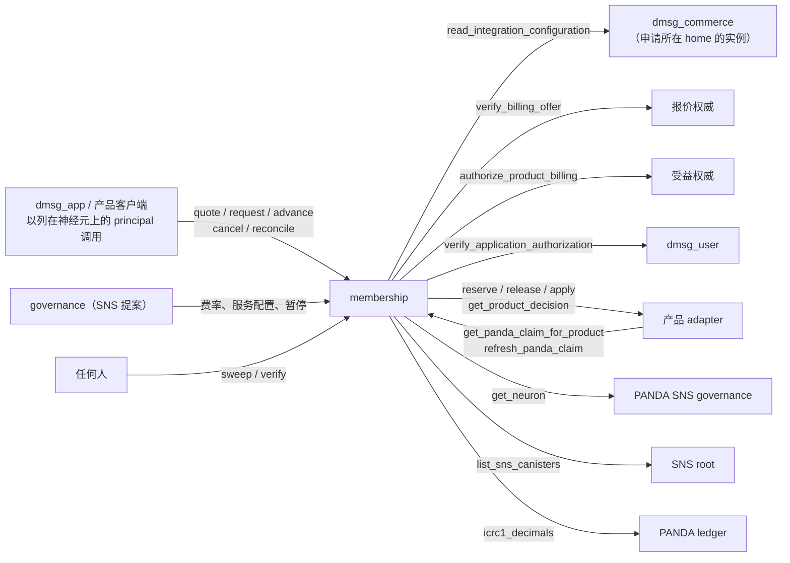
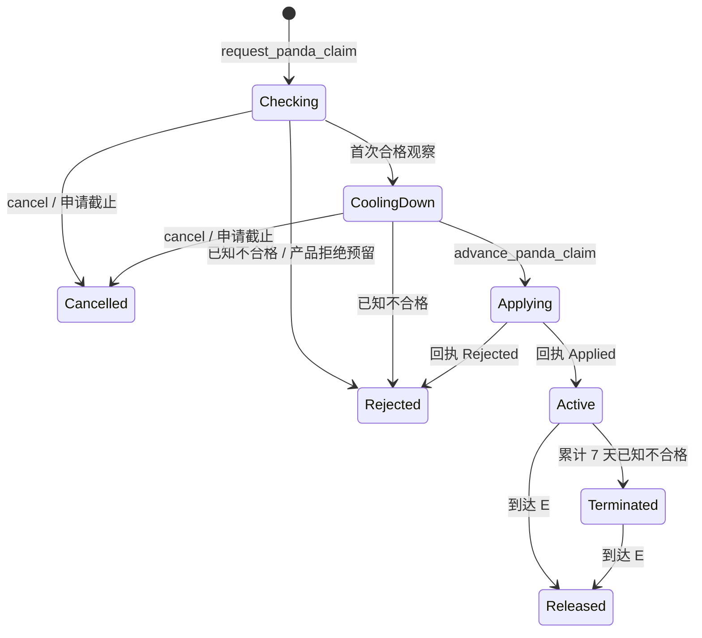

# membership

dMsg 部署中共享的 PANDA 会员服务。用户用自己的 PANDA SNS 神经元为某个产品的一期订阅申请全额抵扣。membership 负责三件事：核验神经元资格；保证同一神经元在所有产品中同一时间只支撑一份权益；把持久的产品决定交给产品 adapter 执行。它不收现金、不托管神经元，也不解释产品套餐。

完整接口见 [membership.did](membership.did)。公开合同见 [commerce v2](../../docs/protocol/commerce.md)；类型见 [integration_membership](../dmsg_types/src/integration_membership.rs) 与 [membership](../dmsg_types/src/membership.rs)；报价、条款与回执校验等纯规则见 [integration](../dmsg_protocol/src/integration.rs) 与 [commerce_v2](../dmsg_protocol/src/commerce_v2.rs)。

## 架构设计

### 组件关系



| 组件                 | 与 membership 的关系                                                                                                                       |
| -------------------- | ------------------------------------------------------------------------------------------------------------------------------------------ |
| `dmsg_commerce`      | 保存应用与产品注册。dMsg 账户产品的报价权威和 adapter 都是 commerce：它接受 PANDA 决定，并在续期资源租约时调用 `refresh_panda_claim`        |
| `dmsg_user`          | 申请所在的 user home，核验 dMsg 账户设备对申请条款的批准；也是 dMsg 账户的受益权威，确认个人账户的产品授权                                 |
| 外部产品（TokenList） | 自己实现报价权威、受益权威和 adapter，与 dMsg 使用同一套产品协议，参见 [account product 示例](../../examples/dmsg-account-product/README.md) |
| PANDA SNS            | governance 提供神经元事实，root 和 ledger 用来核验 SNS 配置；governance 同时是本 canister 的治理主体                                      |
| 客户端               | 以列在神经元上的 principal（申请中的 `actor`，例如 NNS dapp 中添加的热键）调用申请方法，同时由 dMsg 账户设备批准                          |

### 接口与调用者

| 类别     | 方法                                                                                              | 调用者                                                                         |
| -------- | ------------------------------------------------------------------------------------------------- | ------------------------------------------------------------------------------ |
| 治理     | `set_admission_pause`、`configure_panda_service`、`schedule_panda_rate`                          | controller 或 `governance`                                                     |
| 提案预演 | 以上每个方法的 `validate_*`，参数相同                                                             | 任何人（query）                                                                |
| 申请     | `quote_panda_subscription`                                                                        | 任何非匿名 caller，调用者成为条款中的 `actor`                                  |
|          | `request_panda_claim`、`advance_panda_claim`                                                      | 条款中的 `actor`                                                               |
| 恢复     | `cancel_panda_application`、`reconcile_panda_claim`、`refresh_panda_claim`                        | `actor` 或产品 adapter                                                         |
| 查询     | `get_panda_claim`、`panda_claim_certificate`                                                      | `actor` 或产品 adapter（query）                                                |
|          | `get_panda_claim_for_product`                                                                     | 产品 adapter（update，供跨 canister 调用取得共识结果）                         |
|          | `panda_operations`                                                                                | 非匿名 caller 只得到自己是 `actor` 或 adapter 的记录；`governance` 可分页全部 |
| 维护     | `verify_sns_configuration`、`sweep_panda_commitments`                                             | 任何人                                                                         |
| 统计     | `membership_stats`                                                                                | 任何人（query）                                                                |

### 申请生命周期



1. **报价**：`quote_panda_subscription(offer, user_home, approving_account, neuron_id)` 从该 home 的 commerce 读取应用与产品注册，请报价权威用 `verify_billing_offer` 确认账单，再按当前费率生成 `PandaQuote`。门槛 `required_stake_e8s = ceil(amount_usd_micros × 100 × r_num / r_den)`，只在最后取整一次；`application_deadline_ms = min(报价时间 + 24 小时, offer.expires_at_ms)`，且剩余时间必须超过 65 分钟冷却期。报价不预留任何东西。
2. **申请**：`actor` 提交 `PandaClaimRequest`，包含报价条款、dMsg 账户设备对条款摘要 `panda_application_hash(terms)` 的批准，以及产品授权请求。membership 重新读取注册，按原报价时间重算报价并核对费率仍是当前政策；然后同时向受益权威（`authorize_product_billing`）和 user home（`verify_application_authorization`）确认两份授权。最后一次等待结束后，在同一条消息内检查神经元占用、存储容量、`max_claims` 和每小时申请数，写入 `Checking`。随后向产品 adapter 调用 `reserve_product_billing`，预留区间到申请截止为止，并读取神经元。claim ID 由 `(membership, app_id, offer.operation_id)` 决定：同一条款重试返回原记录，不同条款返回 `IdempotencyConflict`。
3. **冷却**：第一次合格观察记下 `cooling_until_ms = 观察时间 + cooling_ms`（至少 65 分钟），进入 `CoolingDown`。已知不合格直接 `Rejected` 并释放预留；不可核验时保持原状态。
4. **激活**：冷却结束后、申请截止前，`actor` 用一份新的设备批准调用 `advance_panda_claim`。membership 要求一次开始于冷却结束之后的合格观察，更早的观察会重新读取；再次核验两份授权后写入固定的 `ProductDecision`（`decision_id = digest(claim_id)`，`apply_by_ms` 最多 5 分钟），进入 `Applying`，并调用 `apply_product_decision`。
5. **交付**：回执 `Applied` 使申请变为 `Active`，`committed_until_ms` 固定为 offer 的 E；回执 `Rejected` 证明没有交付权益。没有回执时保持 `Applying`：`reconcile_panda_claim`、`refresh_panda_claim` 或再次调用 `advance_panda_claim`，都先用 `get_product_decision` 取原回执，取不到才用同一决定重发 Apply。`Applying` 不会因超时被释放。
6. **持有**：`Active` 期间，产品通过 `refresh_panda_claim` 续租资格（见“资格与租约”）。累计 7 天已知不合格变为 `Terminated`：权益永久结束，但神经元仍占用到 E。到达 E 后，`sweep_panda_commitments`、`refresh_panda_claim` 或下一次占用检查会把申请改为 `Released`。

没有提前关闭、替换、升级、买断或解除占用的接口。`cancel_panda_application` 只在 `Checking`/`CoolingDown` 有效，并释放产品预留。取消写入后总是返回视图；释放没有完成（例如预留调用仍在进行）时，由 `reconcile_panda_claim` 重试，预留最晚在申请截止时过期。`set_admission_pause(true)` 停止新的报价、申请和激活；已准备的 Apply、恢复、资格刷新和到期照常进行。

### 资格与租约

`sns.rs::assess` 是纯函数，按 SNS `get_neuron` 回复的最小 Candid 投影（DFINITY IC `2967c1cc`）判定：

- 神经元 ID 一致；
- `actor` 列在神经元的 principal 中，权限不限。神经元所有者在 NNS dapp 把 dMsg 使用的钱包 principal 添加为热键（hotkey，`SubmitProposal` 与 `Vote`）即可。其他 principal（包括所有者）的权限也不限；
- 本金 `cached_neuron_stake_e8s − neuron_fees_e8s` 不低于门槛，不计 maturity；
- 最早解锁时间不早于 E：未解散的神经元取观察时间加解散延迟，解散中的取解散完成时间。

回复无法解码、缺少解散状态、数值溢出或 SNS 返回错误，结果都是 `Unverifiable`，与已知不合格的 `Ineligible` 分开处理。

一个神经元同一时间只支撑一份权益，由全局占用保证（见“占用与期限”），与神经元上列了几个 principal 无关。反过来，凡是列在神经元上的 principal，都能用自己的 dMsg 账户以该神经元申请，并在 Apply 后占用它到 E；所有者只应添加自己的 principal。移除 `actor` 会使申请变为 `Ineligible`，7 天后 `Terminated`，占用仍保留到 E。

- 资格租约 `valid_until_ms = min(观察时间 + 1 小时, E)`，观察时间取查询开始的时间，而不是回调时间。同一申请 1 分钟内复用上一次观察。
- `refresh_panda_claim` 只在租约剩余不超过 10 分钟（commerce 续期资源租约的同一窗口），或上一次结果不是合格时，才重新读取。因此续期后的资源租约一定晚于原租约。
- `Ineligible` 立即结束租约，并按相邻两次观察的间隔累计修复时间，合格观察会清零；累计达到 7 天变为 `Terminated`，不可恢复。
- `Unverifiable` 同样立即结束当前租约，但暂停修复时钟，不视为用户违约。
- 读取 SNS 之前先写入 `busy_until_ms` 并递增 `generation`。回调会核对 generation，因此取消、到期或并发读取之后到达的旧结果不会写回。

### SNS 配置核验

初始化时固定 SNS governance、root 与 PANDA ledger，三者初始化后不可修改，是 SNS 的信任锚。读取神经元之前，需要一次 1 小时内成功的配置核验：

1. root 的 `list_sns_canisters` 列出的 root、governance、ledger 与固定值一致；
2. ledger 的 `icrc1_decimals` 为 8。

同一时间只发出一次核验，重叠的调用者得到 `Pending`，只有实际发出的核验消耗额度；commerce 收到 `Pending` 或 `QuotaExceeded` 时保留原租约。核验失败后，新的报价、申请和激活返回 `Locked`，需要读取神经元的申请得到 `Unverifiable`；读取神经元期间核验过期或失败，回调不会签发租约。

governance 模块不固定。主网 PANDA SNS 开启了 `automatically_advance_target_version`（2026-10-08 查询结果），会自动升级到 NNS 批准、登记在 SNS-W 的版本。membership 只解码 `get_neuron` 回复中用到的字段：神经元 ID、principal 列表、本金、费用和解散状态。新版本保留这些字段就无需任何操作；解码失败时资格为 `Unverifiable`，需要更新 [sns.rs](src/sns.rs) 后升级 membership。

### 占用与期限

- 占用键是 `(sns_governance, neuron_id)`，在所有产品和所有 commerce 实例之间全局唯一。`Checking` 到 `Terminated`（含 `Applying`）都占用神经元。
- 一个神经元最多同时支撑当前一期和紧接着的下一期。只有当已有申请都已提交（`committed_until_ms > 0`）、受益主体相同、并且新 offer 的起点正好等于旧 offer 的 E 时，才接受新申请。
- 新申请检查占用时，会顺带释放该神经元已到期的引用。
- `max_claims` 统计所有占用神经元的申请，包括未决的 Apply。占用计数随申请保存在 stable memory，升级不扫描申请。

### 费率政策

`schedule_panda_rate` 发布不可变的 `PandaRatePolicy`，`r_num / r_den` 是每美元对应的 PANDA 数，并列出适用产品。

- `Local` 之外，发布时间取执行时的共识时间，生效时间至少要晚 30 天。版本号严格递增；最高版本单独保存，旧版本被剪除后也不能复用。
- 用同一版本和相同业务字段重试，返回原政策（保留原发布时间）；字段不同返回 `IdempotencyConflict`。
- 同一产品在同一生效时间只能有一个政策，每个产品取已生效的最新政策。所列产品都已有更晚生效政策的旧政策，在下次发布时被剪除；未剪除的政策最多 64 个。
- 申请冻结报价时的政策。首次申请时费率必须仍是当前政策，激活时不再比较。
- 第一份费率也要提前 30 天发布。生效之前，PANDA 报价返回 `NotFound`。

### 多 commerce 实例与 user home

`PandaServiceConfig.commerce_homes` 把每个 `dmsg_user` home 映射到列出它的 commerce，最多 64 项，只能在末尾追加，已有映射不能修改。报价和申请从申请所在 home 的 commerce 读取注册，产品回调发给 offer 中登记的 adapter；不在列表中的 home 返回 `Forbidden`。神经元占用不按 home 划分，仍是全局的。

### 限流

| 预算     | 计入的调用                                       | 上限                                                       |
| -------- | ------------------------------------------------ | ---------------------------------------------------------- |
| 授权     | `quote`、`request` 发出外部调用之前              | `authorizations_per_minute`，每个 caller 10 次/分钟        |
| 激活     | `advance` 发出外部调用之前                       | 与授权同样大小、单独计数，每个 caller 10 次/分钟           |
| 产品调用 | reserve、release、apply、`get_product_decision`  | `product_calls_per_minute`，每个 `actor` 10 次/分钟        |
| 资格读取 | 每次 `get_neuron`                                | `qualifications_per_minute`                                |
| SNS 核验 | 每次配置核验（2 个调用）                         | 与资格读取同一上限，单独计数                               |
| 新申请   | 每个 UTC 小时成功写入的申请                      | `hourly_applications`，不超过 10,000                       |
| 同时占用 | 占用神经元的申请                                 | `max_claims`，不超过 1,000,000，也不能低于当前占用数       |

- 三个每分钟额度都在 1–100,000 之间，服务配置之前各为 200；每个 caller 的 10 次份额是代码常量。
- 只有实际发出的调用才计入额度；重放、合并的核验和被 guard 拦下的并发调用不计。每分钟计数只在 heap，升级后重新开始。
- 激活只能由已接受申请的 `actor` 发起，与报价分开计数，所以大量报价不会把已接受的申请拖过截止时间。
- 同一申请同时只有一个产品调用，重复请求返回 `Pending`。
- 全局额度只影响可用性：大量不同的 principal 可以在一分钟内用完授权额度，但不会影响已接受的承诺。

### 历史压缩

- `Cancelled`、`Rejected`、`Released` 保留到“终态时间”和“申请截止”两者较晚值之后 30 天。到那时，未使用的产品预留已经过期，即使 release 的回复丢失。
- `sweep_panda_commitments` 每次最多释放 32 个到期占用、压缩 32 条到期记录，返回两者之和，维护任务重复调用到返回 0 即可。`request_panda_claim` 写入前也会执行一次同样的 sweep。
- 压缩删除完整记录、读者索引和认证叶，只保留 claim ID 与申请摘要（tombstone）。之后读取和原样重试返回 `ResultExpired`，同一 ID 的不同条款返回 `IdempotencyConflict`。tombstone 不删除：decision ID 由 claim ID 派生，ID 不能被复用。
- `Applying`、`Active`、`Terminated` 不会被压缩。

### 存储

稳定布局为开发 schema 3，`post_upgrade` 遇到其他 schema 直接失败，不迁移旧布局。`MemoryManager` 使用 8 MiB 分配桶，可寻址 256 GiB。

| Memory | 内容                                                                     |
| -----: | ------------------------------------------------------------------------ |
|      0 | 配置 `StableCell`：初始化参数、服务配置、SNS 核验状态、暂停、本小时申请数 |
|      1 | `CLAIMS`：claim ID → 完整申请                                            |
|      2 | 费率政策                                                                 |
|      3 | 神经元占用：占用键 → claim ID 列表                                       |
|      4 | 占用到期索引：`(释放时间, claim)`                                        |
|      5 | 已发布的最高费率版本                                                     |
|      6 | 保留到期索引：`(保留截止, claim)`                                        |
|      7 | tombstone：claim ID → 申请摘要                                           |
|      8 | 读者索引：`(actor 或 adapter, claim)`                                    |
|   9、10 | 认证 map 的叶子（key → 视图哈希）与内部节点                              |
|     11 | 占用中的申请数                                                           |

申请记录用 serde CBOR 保存。完整记录未变化时不写表；只有公开视图变化时才更新认证叶，并递增 `lease_revision`。heap 只保存每分钟调用计数、产品调用 guard 和 SNS 核验的在途标记。

`panda_claim_certificate(id)` 返回申请视图的 IC 认证：key 为 `digest("dmsg/panda/claim-certificate/v2", claim_id)`，叶子是视图的规范 CBOR。认证 map 只存 key 与哈希，证明时从记录重建视图；升级只重新发布根。

## 容量

### 用户规模

membership 只保存 PANDA 抵扣申请。Free 账户、现金订阅和名称注册都不经过它，所以 dMsg 账户数达到千万还是上亿都不影响 membership；它的规模只取决于同时用 PANDA 神经元抵扣的会员数。

| 约束                     | 数值                       | 说明                                                                                                     |
| ------------------------ | -------------------------- | -------------------------------------------------------------------------------------------------------- |
| PANDA SNS 神经元上限     | 200,000                    | 主网 `max_number_of_neurons`（2026-10-08 查询）；每个神经元同时只支撑一个受益主体                        |
| 完整记录 `MAX_FULL_CLAIMS` | 1,000,000                | 代码常量：占用中的申请，加 30 天保留期内的终态记录；`max_claims` 不能超过它                              |
| 累计操作 `MAX_OPERATIONS` | 10,000,000                | 代码常量：完整记录加 tombstone，终身计数，达到后不再接受新申请                                           |
| 在用会员的 SNS 读取      | 约 50 × `qualifications_per_minute` 人 | 每个在用会员约每 50–60 分钟读取一次 `get_neuron`；200 次/分钟约支撑 1 万人，commerce 的 `refreshes_per_minute` 也限制同一流量 |
| 新申请                   | 约 6,000 份/小时           | 默认配置下，一份申请的 quote 与 request 共用 200 次/分钟的授权额度，激活另有一份；可由治理调整          |

- 100 万条完整记录高于 PANDA SNS 20 万个神经元的上限：即使每个神经元都在支撑当前一期和下一期，再加上 30 天内的终态记录，单实例也能容纳。PANDA 会员本身不会达到千万或亿级。
- 实际上限是 SNS 读取：在用会员每小时都要读取一次神经元，默认配置下约支撑 1 万人。提高 `qualifications_per_minute` 之前，须实测 PANDA SNS governance 的 `get_neuron` 吞吐、跨子网往返时间，以及 IC 对单对 canister 在途请求数的限制。

2026-10-08 的 `membership_capacity_profile`：主机用 membership 自己的存储代码构建 stable memory 镜像（每条都是带决定与回执的 `Active` 申请，各有独立的 actor 和神经元，另有 64 条到期的已取消记录），压缩上传到 PocketIC 后升级并测量。cycles 只统计 membership，升级 cycles 包含安装 Wasm 模块：

| 申请数 | 稳定内存 | 升级指令 | 升级 cycles | 首次刷新（含 SNS 核验） | 刷新 | 一次 sweep（释放 32 + 压缩 32） |
| -----: | -------: | -------: | ----------: | ----------------------: | ---: | ------------------------------: |
| 100,000   |   520 MB | 1,276,131 | 11.87B | 32,734,954 | 21,952,053 | 240,425,831 |
| 1,000,000 | 4,723 MB | 1,306,219 | 11.87B | 33,213,577 | 23,372,870 | 298,837,520 |

- 升级只发布认证根，指令数与规模无关（约 130 万条）。
- 刷新是一次真实写入：读取神经元、更新申请和认证路径。从 10 万到 100 万只增加 6.5%。每名在用会员每小时刷新一次，每年约 0.2T cycles（不含 commerce 与 SNS 的成本），1 万名在用会员每年约 2,000T。
- 一次 sweep 处理 64 条，从 10 万到 100 万增加 24%，远低于单条消息的指令上限。
- 每条 `Active` 申请连同索引和认证节点约 4.7 KB；完整记录本身为 3,542 B（CBOR），`Cancelled` 为 2,454 B。tombstone 每条约 100 B，1,000 万条约 1 GB。这些都远低于 256 GiB 的寻址上限。
- 主机构建 100 万条镜像约 2–3 分钟；申请、报价等需要其他 canister 的调用没有在大规模镜像上测量，它们写入的表与刷新、sweep 相同。

### 单实例与多实例

- 同一部署（同一 PANDA SNS）只能有一个 membership。跨产品、跨 commerce 的唯一占用只在一张占用表里成立；两个实例各有一张表，同一神经元就能分别取得两份权益。`dmsg_user` 和每个 commerce 也都只固定一个 `membership_canister`，申请条款中的 `home_membership` 绑定具体实例。
- 横向扩展靠 commerce 与 user home：多个 commerce 实例通过 `commerce_homes` 共享同一个 membership，最多 64 个 home。
- 不支持按神经元分片；在 20 万个神经元的上限内也不需要。
- `Staging`、`Local` 可以各自部署实例。Staging 如果也指向主网 PANDA SNS，同一神经元可以在 Staging 和 Production 各支撑一份权益，因此 Staging 不能发放有实际价值的权益。

## 部署流程

### 初始化参数

| `MembershipInit` 字段 | 要求                                                                                                                       |
| --------------------- | -------------------------------------------------------------------------------------------------------------------------- |
| `environment`         | `Production`、`Staging` 或 `Local`；费率政策和 offer 的环境必须与它一致                                                    |
| `governance`          | PANDA SNS governance：既是读取神经元的 SNS，也是本 canister 的治理主体，与 controller 一起可调用管理方法                   |
| `sns_root`            | PANDA SNS root，它的 `list_sns_canisters` 必须列出 `governance` 与 `panda_ledger`                                          |
| `panda_ledger`        | PANDA ledger，必须是 8 位小数                                                                                              |

三个 principal 初始化后都不可修改，不能是匿名 principal 或管理 canister，参数不合法时安装失败。主网 PANDA SNS 的 ID 见 [sns_canister_ids.json](../../sns_canister_ids.json)。

### 依赖关系

`dmsg_user` 的 `UserInit.membership_canister`、每个 commerce 的 `CommerceInit.membership_canister` 都指向本实例；本实例的 `commerce_homes` 又列出每个 user home 及其 commerce。因此要先创建全部 canister ID，再分别安装。服务配置完成且 SNS 核验通过之前，membership 不接受报价和申请。

### 步骤

以下命令在仓库根目录执行，以 `--network ic` 为例。

1. 在待部署的提交上完成验证，工作区不能有未提交的改动：

   ```sh
   POCKET_IC_BIN=/path/to/pocket-ic make test-dmsg
   ```

2. 创建 canister ID（commerce 与 user 见 [dmsg_commerce](../dmsg_commerce/README.md#步骤)）：

   ```sh
   dfx canister create membership --network ic
   ```

3. 核对 PANDA SNS：root 列出的 governance 与 ledger 应与 [sns_canister_ids.json](../../sns_canister_ids.json) 一致，governance 的 controllers 应只有 SNS root。再用一个真实神经元确认 `get_neuron` 的回复能按 [sns.rs](src/sns.rs) 的投影解码：

   ```sh
   dfx canister call d7wvo-iiaaa-aaaaq-aacsq-cai list_sns_canisters '(record {})' --network ic --query
   dfx canister info dwv6s-6aaaa-aaaaq-aacta-cai --network ic
   ```

4. 把初始化参数保存为 `membership-init.did` 并安装：

   ```candid
   (record {
     environment = variant { Production };
     governance = principal "dwv6s-6aaaa-aaaaq-aacta-cai";
     sns_root = principal "d7wvo-iiaaa-aaaaq-aacsq-cai";
     panda_ledger = principal "druyg-tyaaa-aaaaq-aactq-cai";
   })
   ```

   ```sh
   dfx deploy membership --network ic --argument-file membership-init.did
   dfx canister info membership --network ic
   dfx canister call membership verify_sns_configuration --network ic
   ```

   `dfx deploy` 按 dfx.json 以 `optimize: cycles` 和 gzip 构建。`verify_sns_configuration` 返回 `(variant { Ok })` 后才接受申请。

5. 安装 commerce 和 `dmsg_user`，其 `membership_canister` 指向本实例。

6. 配置服务。下例为首发量级的取值，实际以治理批准的为准：

   ```sh
   dfx canister call membership configure_panda_service --network ic '(record {
     commerce_homes = vec { record { user_home = principal "<dmsg_user ID>"; commerce_canister = principal "<commerce ID>" } };
     max_claims = 10_000 : nat64;
     hourly_applications = 1_000 : nat64;
     cooling_ms = 3_900_000 : nat64;
     qualifications_per_minute = 200 : nat64;
     authorizations_per_minute = 200 : nat64;
     product_calls_per_minute = 200 : nat64;
   })'
   ```

   `cooling_ms` 至少 65 分钟（3,900,000 ms）且小于 24 小时。`qualifications_per_minute` 按在用会员数 ÷ 50 留出余量，并与 commerce 的 `refreshes_per_minute` 一起调整。每份申请约需 2 次授权（报价与申请）、1 次激活和 2–3 次产品调用。

7. 至少在 PANDA 开放前 30 天发布第一份费率。`published_at_ms` 会被替换为执行时间，`r_num / r_den` 是每美元的 PANDA 数：

   ```sh
   dfx canister call membership schedule_panda_rate --network ic '(record {
     version = 2 : nat16; policy_version = 1 : nat64; environment = variant { Production };
     product_ids = vec { "dmsg" }; r_num = <PANDA 数> : nat; r_den = 1 : nat;
     published_at_ms = 0 : nat64; effective_at_ms = <执行时间 30 天之后的 Unix 毫秒> : nat64 })'
   ```

8. dMsg 产品登记的 `allowed_settlement_methods` 要包含 `Panda`（见 commerce README）。在 `src/dmsg_app/dmsg.config.json` 填写 `canisters.membership` 后重新构建客户端。

9. 部署后检查：

   - `verify_sns_configuration` 返回 `Ok`；`validate_configure_panda_service` 以当前配置调用时显示 “no change”。
   - 用一个真实 PANDA 神经元完成一次完整流程：报价、申请、等待冷却、激活，最终为 `Active`；commerce 的 `get_entitlement_batch` 显示对应套餐，`panda_claim_certificate` 能通过客户端验证。另起一份申请在冷却期取消，确认产品预留已释放。
   - 设置冻结阈值和 cycles 告警，把 `dfx canister status` 中的 controllers 记入部署记录。

### 交给 SNS

主网验收完成后，按 [dmsg_handle](../dmsg_handle/README.md#交给-sns) 的流程把 SNS root 设为唯一 controller，并用 `AddGenericNervousSystemFunction` 提案登记通用函数，目标方法和验证方法都在本 canister 上。建议的主题：

| 目标方法                  | 验证方法                           | 主题                                           |
| ------------------------- | ---------------------------------- | ---------------------------------------------- |
| `configure_panda_service` | `validate_configure_panda_service` | `CriticalDappOperations`（关键主题）           |
| `schedule_panda_rate`     | `validate_schedule_panda_rate`     | `ApplicationBusinessLogic`                     |
| `set_admission_pause`     | `validate_set_admission_pause`     | `ApplicationBusinessLogic`（应急，需尽快通过） |

- SNS 执行时只判断调用是否得到回复，不解析返回的 `Result`。执行后再调用对应的 `validate_*`，应显示 “no change”。
- 费率提案的验证在提交时运行，发布时间却取执行时间。`effective_at_ms` 要比预计执行时间晚 30 天以上（PANDA SNS 的初始投票期为 4 天），否则提案会在执行时失败。
- 升级改用 `UpgradeSnsControlledCanister` 提案，`canister_upgrade_arg` 留空（`post_upgrade` 不读参数）；SNS 默认先停止 canister 再升级。

### 运维

membership 没有定时器，下列任务都需要外部调用：

| 任务       | 方法                       | 调用方            | 频率与要求                                                                                                   |
| ---------- | -------------------------- | ----------------- | ------------------------------------------------------------------------------------------------------------ |
| 释放与压缩 | `sweep_panda_commitments`  | 任何人            | 建议每 5 分钟调用，重复到返回 0。到期占用只在 sweep、刷新或新申请时释放，`max_claims` 的占用数也只在释放后回落 |
| 推进申请   | `reconcile_panda_claim`    | `actor` 或 adapter | 处理停在 `Applying`、未释放预留或预留暂时失败的申请                                                         |
| SNS 核验   | `verify_sns_configuration` | 任何人            | 部署后调用；平时由资格读取按需触发                                                                           |
| 监控       | `membership_stats`         | 任何人（query）   | 占用数、完整记录、tombstone、稳定内存页和 cycles；与服务配置和代码上限对照，接近 60% 时调整                  |

**PANDA SNS 升级**：SNS 自动升级不需要 membership 做任何操作。升级时 governance 可能短暂停止，期间到达的读取得到 `Unverifiable`，下一次刷新即恢复。NNS 发布新的 SNS governance 版本时，确认 `get_neuron` 回复仍包含 `sns.rs` 解码的字段；字段若有变化，资格会持续不可核验，须更新 `sns.rs` 并升级 membership。

### 治理变更

- **服务配置**：`configure_panda_service` 一次替换全部字段。`commerce_homes` 只能追加；`max_claims` 不能低于当前占用数；`cooling_ms` 的变化只影响新申请，已接受的申请沿用自己的冷却时间。
- **新增 user home**：在 commerce 上完成 `admin_add_user_home` 和产品登记更新后，在 `commerce_homes` 末尾追加 `{ user_home; commerce_canister }`，其他字段保持不变。
- **费率**：见“费率政策”。新政策只影响之后的报价，已接受的申请保留原政策。
- **暂停**：`set_admission_pause(true)` 停止新的报价、申请和激活，不影响已有承诺和恢复。

### 升级

升级要求 schema 不变。先停止 canister，等在途的 SNS 与产品调用完成（都是有界等待），创建快照，再升级、启动：

```sh
dfx canister stop membership --network ic
dfx canister snapshot create membership --network ic
dfx deploy membership --network ic --argument-type raw --argument 4449444c0000
dfx canister start membership --network ic
```

Candid 服务声明了 `MembershipInit` 初始化参数，dfx 升级时不带参数会报错；`post_upgrade` 不读取参数，传空 Candid 参数 `()`（hex `4449444c0000`）即可。升级会丢弃每分钟计数、产品调用 guard 和 SNS 核验的在途标记；停在 `Applying` 或预留未完成的申请，用 `reconcile_panda_claim` 恢复。

## 当前限制

- `governance`、`sns_root`、`panda_ledger` 初始化后不能修改。
- dMsg 客户端以 `derivationOrigins`（`dmsg.net`、`panda.fans`）的 II principal 作为 `actor`，用户须先在 NNS dapp 把它添加为神经元的热键，结账面板会提示这一步；主网钱包路径尚未验收。
- 列在神经元上的任何 principal 都能用该神经元申请，并占用它到 E。
- 没有提前退出；`Terminated` 的申请同样占用神经元到 E。
- 产品 adapter 必须对每个决定给出确定的回执（超过 `apply_by_ms` 时给 `Rejected`）。一直没有回执的 `Applying` 会永久占用神经元和 `max_claims`，没有治理干预入口。
- 完整记录上限 100 万、累计操作上限 1,000 万，tombstone 不回收。
- 没有定时器，释放与压缩依赖外部的维护调用。
- 大规模记录下的刷新成本、SNS 读取吞吐、真实神经元与主网端到端流程都未验收。

## 实现

| 文件            | 内容                                                                     |
| --------------- | ------------------------------------------------------------------------ |
| `src/api.rs`    | 初始化与升级、SNS 配置核验、暂停与服务配置                               |
| `src/rate.rs`   | 费率政策的发布、剪除与选择                                               |
| `src/claim.rs`  | 单个申请的同步状态转换：观察、冷却、Apply、回执、取消与到期              |
| `src/claims.rs` | 报价、申请、激活、交付、取消、对账、刷新与查询的跨 canister 编排         |
| `src/sns.rs`    | `get_neuron` 回复的最小 Candid 投影与资格判定                            |
| `src/store.rs`  | 配置、调用额度、申请表与索引、神经元占用、sweep 与压缩、认证、统计       |
| `src/capacity.rs` | 测试用：主机构建容量 profile 的 stable memory 镜像                     |

## 验证

```sh
cargo test --locked -p membership
POCKET_IC_BIN=/path/to/pocket-ic make test-dmsg
POCKET_IC_BIN=/path/to/pocket-ic DMSG_WASM_DIR=$PWD/target/wasm32-unknown-unknown/release \
  cargo test --locked -p dmsg_integration --features pocketic-tests --test control_plane membership -- --test-threads=1
```

使用实际 Wasm 的回归测试：

- [commerce.rs](../../tests/dmsg_integration/tests/control_plane/commerce.rs)：冷却与再次批准、不能提前退出、观察复用、跨产品独占、相邻两期、Apply 回执丢失后跨升级对账、`Terminated` 的权益、到期释放、取消后恢复容量、membership 合并请求或调用失败时 commerce 保留租约、10 分钟窗口内续期。
- PANDA 用例的 `neuron` 辅助函数构造 NNS dapp 形态的神经元：所有者持有 0–10 全部权限，`actor` 只是 `SubmitProposal` + `Vote` 热键。
- [membership_review.rs](../../tests/dmsg_integration/tests/control_plane/membership_review.rs)：预留暂时失败的重试与限流、预留期间的重入取消（返回视图，释放留给对账）、冷却刚结束前的观察须重新读取、并发 SNS 核验合并为一次及失败后重试、费率重试与已剪除版本跨升级保持、终态压缩跨升级。
- [governance.rs](../../tests/dmsg_integration/tests/control_plane/governance.rs)：全部管理方法与 `validate_*`，包括 `commerce_homes` 校验。

本地 SNS、测试账本与测试身份都不能证明主网钱包兼容。

**容量 profile** 分两步运行：先在主机构建镜像，再加载到 PocketIC 测量。`capacity_image` 依次写出 10 万和 100 万条申请的镜像（后者约 4.7 GB，需要约 6 GB 内存）：

```sh
DMSG_MEMBERSHIP_IMAGE_DIR=/tmp/membership-images \
  cargo test --locked --release -p membership capacity_image -- --ignored --nocapture
DMSG_MEMBERSHIP_IMAGE_DIR=/tmp/membership-images POCKET_IC_BIN=/path/to/pocket-ic \
  DMSG_WASM_DIR=$PWD/target/wasm32-unknown-unknown/release \
  cargo test --locked --release -p dmsg_integration --features pocketic-tests --test control_plane \
  commerce::membership_review::membership_capacity_profile -- --ignored --exact --nocapture
```

镜像中的 SNS 是 PocketIC 在新应用子网上创建的第一个 canister（`xp3jw-ot777-77777-aaaaa-cai`）；PocketIC 分配规则变化时，profile 会报出新的 ID，须同步修改 `capacity.rs`。

**原生历史样本**：`cargo test --locked -p membership history_profile -- --ignored --nocapture`。2026-10-02 debug 构建，对比 `9338338` 与当时的实现，样本为已取消的记录；时间是本机测量，不是 Wasm 指令或 cycles：

| 记录数 | 原表字节   | 现表字节   | 原重建  | 现重建  | 原无关读者扫描     | 索引后无关读者查询 |
| -----: | ---------: | ---------: | ------: | ------: | -----------------: | -----------------: |
|  1,000 |  2,686,976 |  3,276,800 |  464 ms |  454 ms | 23.5 ms / 512 行   |           0.030 ms |
| 10,000 | 26,345,472 | 30,736,384 | 5,726 ms | 5,581 ms | 24.5 ms / 512 行  |           0.036 ms |

索引在保留期内增加约 17–22% 的稳定存储。全部压缩后保留 10,000 个 tombstone，没有完整记录或认证叶。压缩让分配可以复用，但不会缩小已分配的稳定内存页。认证树已移入 stable memory，升级不再重建，表中的重建时间只作历史参考。

**SNS 核验合并样本**：被忽略的 PocketIC 测试 `membership_verification_profile` 对比 16 个并发配置核验请求，基线 Wasm 用 `DMSG_MEMBERSHIP_BASELINE_WASM` 指定。合并之前发出 16 次 SNS 核验，membership 花费 291,455,572 cycles；合并之后只发出 1 次，初次突发花费 123,716,956 cycles，15 个调用者得到 `Pending`，连同它们之后的重试共 229,304,284 cycles（约少 21%）。只统计 membership，不含 SNS 的执行成本：

```sh
cargo test --locked -p dmsg_integration --features pocketic-tests --test control_plane membership_verification_profile -- --ignored --nocapture
```

2026-10-08 在本次改动上完整运行 `scripts/test-dmsg.sh` 通过（PocketIC 16.0.0）：Rust 单元与文档测试、Clippy `-D warnings`、Wasm/Candid 比对、跨语言协议向量、PocketIC `control_plane` 117 项与 `directory` 4 项、SDK 26 项；`dmsg_app` 的类型检查与 171 项单元测试也通过。`membership_capacity_profile` 按上文在 10 万与 100 万条两种规模运行通过；`history_profile` 与 `membership_verification_profile` 本轮未运行。主网部署、真实神经元与私有云端端到端未运行。

## 设计对齐

本 README 与公开的 commerce 合同描述当前实现。私有目标设计按 [AGENTS.md](../../AGENTS.md) 定位，二者不一致时须单独修订设计基线；私有设计正文不复制到本仓库。
