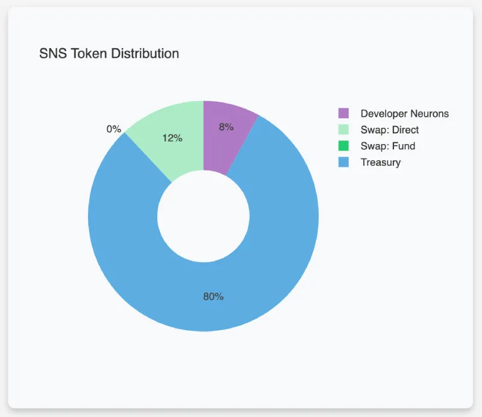
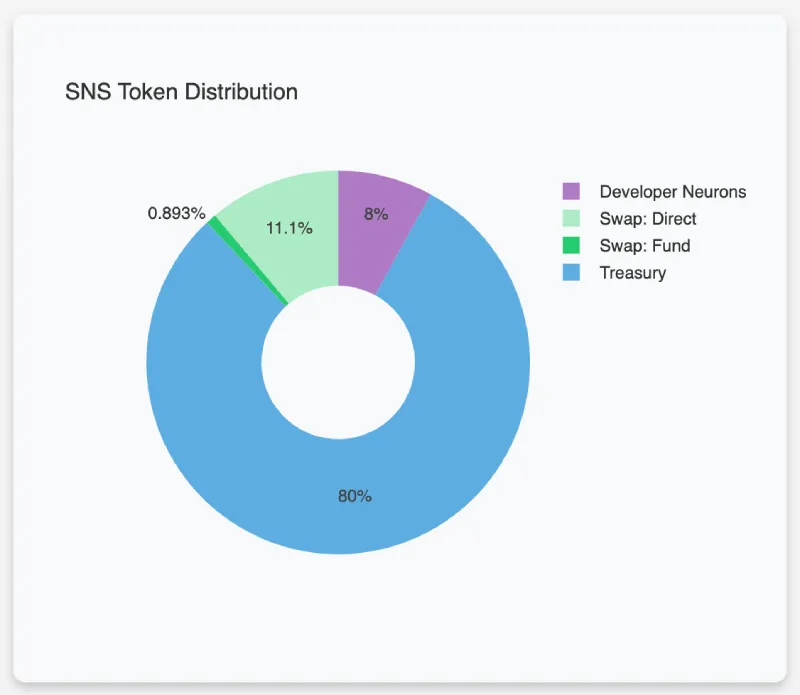
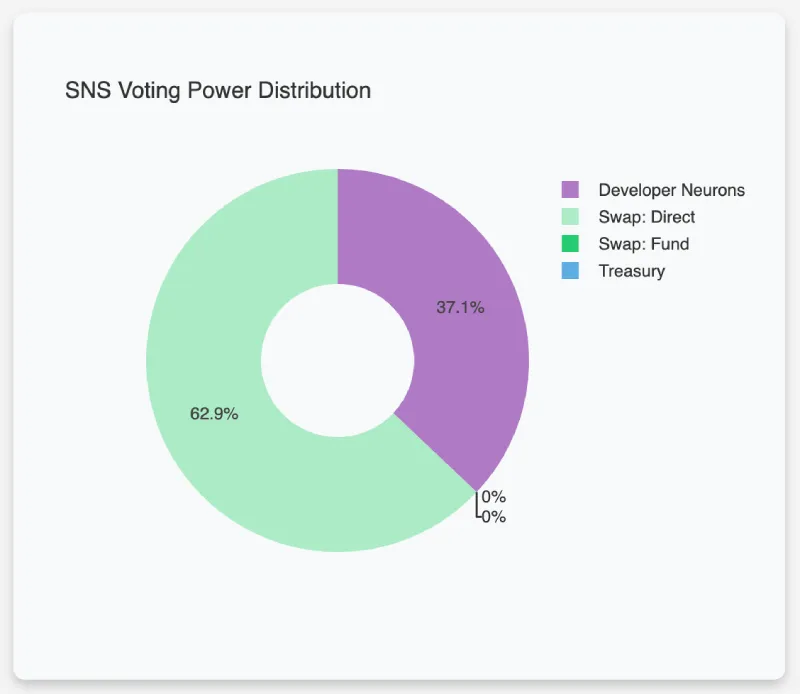
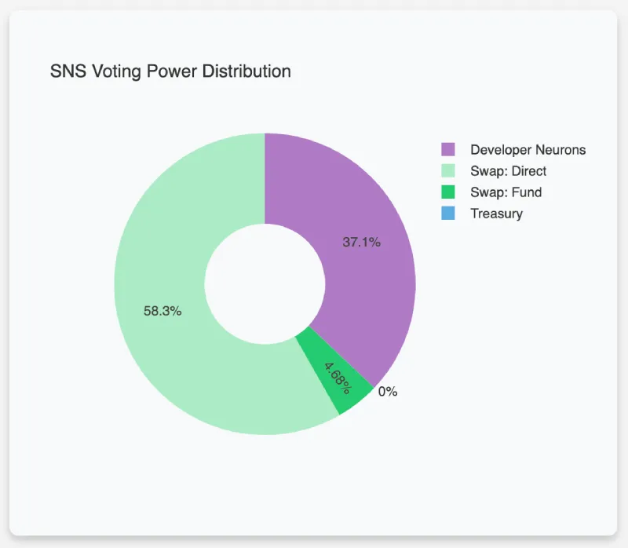

# ICPanda DAO Whitepaper

> A decentralized Panda meme brand built on the Internet Computer.

## Introduction

ICPanda DAO represents a Decentralized Autonomous Organization (DAO) committed to advancing the Panda meme brand within the decentralized ecosystem of the Internet Computer. As a DAO, it operates with a community-driven approach, leveraging the Internet Computer's blockchain technology to foster an environment of transparency, autonomy, and collaborative decision-making.

## Vision and Mission

We will have pandas in Web3, and we will have pandas in the metaverse. Let's make it happen: building a decentralized Panda meme brand on the Internet Computer now, and make it the pandas of the future.

## Internet Computer Overview

The [**Internet Computer**](https://internetcomputer.org/) (IC) integrates autonomous serverless cloud functionality into the public Internet. This advancement enables the creation of virtually any system or service on a decentralized network, utilizing 'canister software'—an evolved form of smart contracts.
Web3 services and enterprise systems can be directly built on the Internet Computer—a scalable public decentralized network. It is capable of hosting social networks, media streaming, and more, offering Web3 functionality. These services are tamper-proof and can interact with the outside world in a trustless manner.

## Main Offerings

### Lucky Pool System

Users can obtain PANDA tokens through airdrops for free, which allows them to participate in panda culture NFT creation and other Web3 activities without any barriers; users can also acquire PANDA tokens through lucky draws, ensuring a more equitable distribution of PANDA tokens.

### Panda Badges System

The panda badge is an image SFT (Semi-Fungible Token) officially produced by the ICPanda DAO. Users can purchase panda badges with PANDA tokens, allowing them to display their virtual panda identity on social networks, media streaming, and other Web3 platforms.

### Panda Culture NFT Creation And Trading Platform

Users can create and trade panda culture NFTs on this platform, which can be in various forms such as images, videos, 3D+AI virtual objects, etc. Users need to spend PANDA tokens to list their NFT works, which are priced in ICP tokens. Users can stake PANDA tokens to boost the exposure of other users' NFT works, and earn a share of the profits when those NFT works are sold.

### Decentralized and Open Panda Meme Brand Platform

This platform is built on the RWA (Real World Asset) concept, aiming to introduce panda culture and related brands from Web2 and offline entities into Web3, or bring original panda culture from Web3 to Web2 and offline entities. This includes but is not limited to the digital avatars of real pandas, panda culture merchandise, derivative movies, and games. The platform aims to globalize panda culture by fostering open cooperation and facilitating traffic exchange both online and offline.

## Tokenomics

| Token Name  | Token Symbol | Total Supply (Initial) |
| ----------- | ------------ | ---------------------- |
| **ICPanda** | **PANDA**    | 1,000,000,000          |

| Allocation       | Percentage | Tokens         | Memo                         |
| ---------------- | ---------- | -------------- | ---------------------------- |
| Development Team | **4%**     | 40,000,000     | Locked for 0～6 months       |
| Seed Funders     | **4%**     | 40,000,000     | Locked for 0～3 months       |
| SNS Swap         | **12%**    | 120,000,000    | Locked for 0～3 months       |
| DAO Treasury     | **80%**    | 800,000,000    |                              |
|                  | -- **50%** | -- 500,000,000 | Lucky pool                   |
|                  | -- **10%** | -- 100,000,000 | Community creative incentive |
|                  | -- **10%** | -- 100,000,000 | CEX incentive                |
|                  | -- **10%** | -- 100,000,000 | DAO development fund         |

**Token distribution before Neurons' Fund participation:**

**Token distribution after Neurons' Fund participation:**

### Token utility

PANDA is the only token issued by ICPanda DAO. By holding PANDA tokens, users can participate in:

1. Governance decisions of ICPanda DAO and receive rewards;
2. Purchasing panda badges;
3. Creation and trading of panda culture NFTs;
4. Activities on the panda meme brand platform.

### Initial token allocation

1. Development team: **4%**, locked for 0-6 months.
2. Seed investment: **4%**, locked for 0-3 months, raised 2,000 ICP tokens (completed: [8dceaae98ba94503888beb0a5fac5e33c9b1022019462106ae171782a1642443](https://dashboard.internetcomputer.org/account/8dceaae98ba94503888beb0a5fac5e33c9b1022019462106ae171782a1642443)), the raised ICP is paid to the development team as initial R&D and startup costs.
3. SNS Swap: **12%**, locked for 0-3 months, aiming to raise 12,000-60,000 ICP tokens, with the raised ICP belonging to the DAO treasury.
4. DAO Treasury: **80%**
   1. Lucky Pool: **50%**
      1. Airdrop, each account can receive 10 PANDA tokens for free;
      2. Lucky draw, each draw costs 1 ICP token and randomly awards 1,000-100,000 PANDA tokens, with no limit on the number of draws. The ICP income belongs to the DAO treasury.
   2. Community Creation Incentive: **10%**, after the launch of the NFT creation platform, users' outstanding creations will be rewarded with PANDA tokens.
   3. Incentives for Listing on Centralized Exchanges: **10%**, incentivizes the first 4 major CEXs to list PANDA tokens, with allocations of 4%, 3%, 2%, and 1% respectively.
   4. Development Fund: **10%**, used for project R&D salaries, IC cloud computing resource fees, and other operational costs.

### Voting power

**Voting power distribution before Neurons' Fund participation:**

**Voting power distribution after Neurons' Fund participation:**

Full information can be found in the [SNS initial parameters](../sns_init.yaml).

### Funding target

- Min participation: 10 ICP
- Max participation: 10,000 ICP
- Min to be raised: 12,000 ICP
- Max to be raised: 60,000 ICP
- Min participants:  42

The raised ICP tokens will be used for:

- Providing liquidity for DEX decentralized exchanges;
- Paying for the development team's salaries, IC cloud computing resource expenses, and other operational costs;
- Investing in the panda meme brand operation platform.

## Roadmap

1. [x] February 2024: Project launch; completion of seed investor fundraising.
2. [ ] Q1 2024: Transition to DAO via SNS; launch of the lucky pool feature; PANDA tokens listed on DEX, while also promoting token listing on CEX.
3. [ ] Q2 2024: Launch of the panda badges system.
4. [ ] Q3 2024: Launch of the panda culture NFT creation and trading platform.
5. [ ] Q4 2024: Launch of the decentralized and open panda meme brand platform.

## Contact us

- Web Dapp: [https://panda.fans](https://panda.fans)
- OpenChat: [ICPanda DAO Community](https://oc.app/community/dqcvf-haaaa-aaaar-a5uqq-cai)
- Twitter: [https://twitter.com/ICPandaDAO](https://twitter.com/ICPandaDAO)
- GitHub: [https://github.com/ldclabs/ic-panda](https://github.com/ldclabs/ic-panda)
