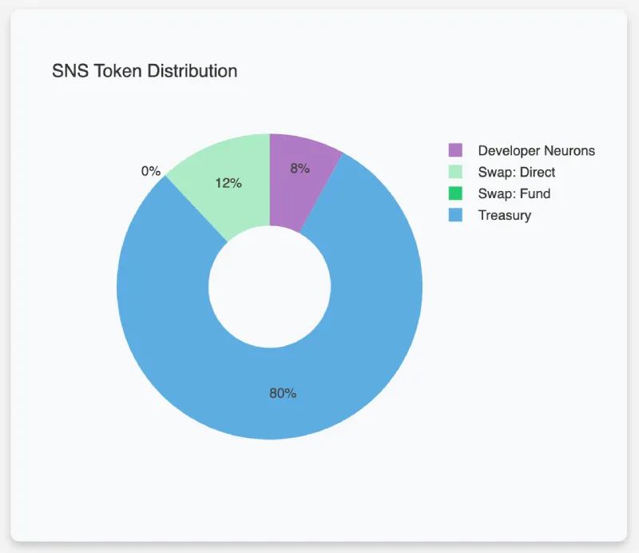
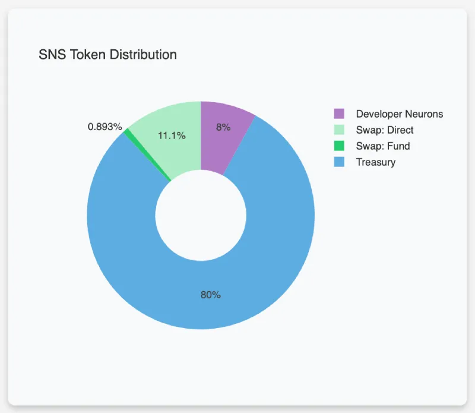
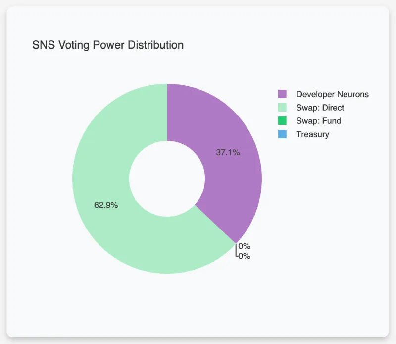
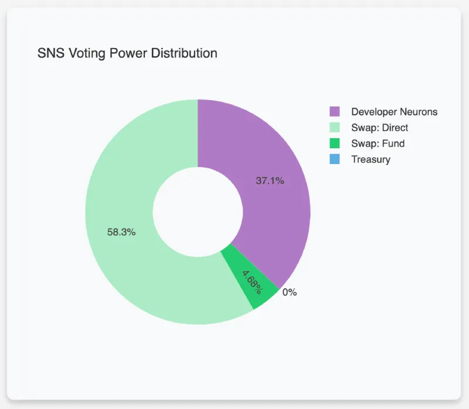

# ICPanda DAO 白皮书

> 运行在“互联网计算机” IC 上的一个去中心化的熊猫模因品牌。

## 介绍

ICPanda DAO 代表了一个去中心化自治组织，致力于在互联网计算机的去中心化生态系统中推进熊猫模因品牌。作为一个 DAO，它以社区驱动的方式运作，利用互联网计算机的区块链技术来营造一个透明、自治和协作决策的环境。

## 愿景和使命

在 Web3 中我们将会有熊猫，在元宇宙中我们也将会有熊猫。让我们一起努力：现在就在互联网计算机上建立一个去中心化的熊猫模因品牌，让她成为未来的熊猫。

## “互联网计算机” 简介

[**互联网计算机**](https://internetcomputer.org/)（IC）为公共互联网添加了自主无服务器云计算功能——使用“罐子（canister）软件”（智能合约的一种进化）在一个去中心化网络上完全构建几乎任何系统或服务成为可能。

Web3 服务和企业系统可以直接建立在 IC 上——一个可扩展的公共去中心化网络。托管支持 Web3 功能的社交网络、媒体流媒体等，这些服务是防篡改的，并且可以无需信任（trustlessly）地与外部世界互动。

## 主要产品

### 幸运池系统

用户可以免费获得空投 PANDA 代币，从而可以无门槛参与熊猫文化 NFT 创作以及其它 Web3 活动；用户可以通过幸运抽奖获得 PANDA 代币，这样能让 PANDA 代币被更公平地分配。

### 熊猫徽章系统

熊猫徽章是 ICPanda DAO 官方制作的一种形象 SFT (Semi-Fungible Token)，用户可以通过 PANDA 代币购买熊猫徽章，从而可以在社交网络、媒体流媒体等 Web3 中展示自己的虚拟熊猫形象。

### 熊猫文化 NFT 创作和交易平台

用户可以在这个平台上创作和交易熊猫文化 NFT，这些 NFT 作品可以是图片、视频、3D+AI 虚拟对象等多种形式。用户需要花费 PANDA 代币来上架自己的 NFT 作品，NFT 作品用 ICP 代币标价。用户可以质押 PANDA 代币给其他用户的 NFT 作品助力曝光，当 NFT 作品出售时将获得收益分成。

### 去中心化和开放的熊猫模因品牌运营平台

该平台基于 RWA（Real World Asset）理念构建，旨在将 Web2 和线下实体的熊猫文化及相关品牌引入 Web3，或者将 Web3 中的原创熊猫文化引入 Web2 和线下实体，包括但不限于真实熊猫的数字化身、熊猫文化周边商品、熊猫文化衍生电影、游戏作品等。该平台将通过线上线下开放合作、流量互通，从而推动熊猫文化的全球化流通。

## 代币经济学

| 代币名称    | 代币符号  | 总供应量（初始） |
| ----------- | --------- | ---------------- |
| **ICPanda** | **PANDA** | 1,000,000,000    |

| 代币分配 | 百分比     | 代币数量       | 备注             |
| -------- | ---------- | -------------- | ---------------- |
| 开发团队 | **4%**     | 40,000,000     | 锁定期 0～6 个月 |
| 种子投资 | **4%**     | 40,000,000     | 锁定期 0～3 个月 |
| SNS 交换 | **12%**    | 120,000,000    | 锁定期 0～3 个月 |
| DAO 金库 | **80%**    | 800,000,000    |                  |
|          | -- **50%** | -- 500,000,000 | 幸运池给所有人   |
|          | -- **10%** | -- 100,000,000 | 社区创作激励     |
|          | -- **10%** | -- 100,000,000 | CEX 上币激励     |
|          | -- **10%** | -- 100,000,000 | DEX 流动性池     |

**Neurons' Fund 参与前的代币分布：**

**Neurons' Fund 参与后的代币分布：**

### 代币用途

PANDA 是 ICPanda DAO 唯一发行的代币，用户通过持有 PANDA 代币可以参与：
1. ICPanda DAO 的治理决策并获得奖励；
2. 购买熊猫徽章；
3. 熊猫文化 NFT 创作和交易；
4. 熊猫模因品牌运营平台活动。

### 代币分配详情

1. 开发团队：**4%**，锁定期 0～6 个月。
2. 种子投资：**4%**，锁定期 0～3 个月，筹集 2,000 个 ICP 代币（已完成：[8dceaae98ba94503888beb0a5fac5e33c9b1022019462106ae171782a1642443](https://dashboard.internetcomputer.org/account/8dceaae98ba94503888beb0a5fac5e33c9b1022019462106ae171782a1642443)），筹集的 ICP 支付给开发团队作为项目初期研发和启动成本。
3. SNS 交换：**12%**，锁定期 0～3 个月，募集 12,000～60,000 个 ICP 代币，筹集的 ICP 归属 DAO 金库。
4. DAO 金库：**80%**
   1. 幸运池：**50%**
      1. 空投, 每个账号可免费领取 10 个 PANDA 代币;
      2. 幸运抽奖，每次花费 1 个 ICP 代币，可随机获得 1,000～100,000 个 PANDA 代币，抽奖次数不受限，收入的 ICP 归属 DAO 金库。
   2. 社区创作激励：**10%**，熊猫品牌文化 NFT 创作平台上线后，用户创作的优秀作品将获得 PANDA 代币奖励。
   3. 中心化交易所上币激励：**10%**，激励前 4 家主流 CEX（按先后配给 4%，3%，2%，1%）上线 PANDA 代币。
   4. 去中心化交易所流动性池：**10%**，用于在头部去中心化交易所添加交易对。

### 投票权

**Neurons' Fund 参与前的投票权分布：**

**Neurons' Fund 参与后的投票权分布：**

完整信息见 [SNS initial parameters](../sns_init.yaml).

### 融资目标

- 最小参与值: 10 ICP
- 最大参与值: 10,000 ICP
- 最小融资额度: 6,000 ICP
- 最大融资额度: 60,000 ICP
- 最小参与者数量: 42

募集的 ICP 代币将用于：

- 为 DEX 去中心化交易所提供流动性；
- 用于支付研发团队工资、IC 云计算资源费用和其它运营成本；
- 参与熊猫模因品牌运营平台的投资。

## 路线图

1. [x] 2024年2月：项目启动；完成种子投资者募集。
2. [ ] 2024年 Q1：通过 SNS 转换为 DAO；幸运池功能上线；PANDA 代币上架 DEX，同时推动代币上架 CEX。
3. [ ] 2024年 Q2：熊猫徽章系统上线。
4. [ ] 2024年 Q3：熊猫文化 NFT 创作和交易平台上线。
5. [ ] 2024年 Q4：去中心化和开放的熊猫模因品牌运营平台上线。

## 联系我们

- Web Dapp: [https://panda.fans](https://panda.fans)
- OpenChat: [ICPanda DAO Community](https://oc.app/community/dqcvf-haaaa-aaaar-a5uqq-cai)
- Twitter: [https://twitter.com/ICPandaDAO](https://twitter.com/ICPandaDAO)
- GitHub: [https://github.com/ldclabs/ic-panda](https://github.com/ldclabs/ic-panda)
